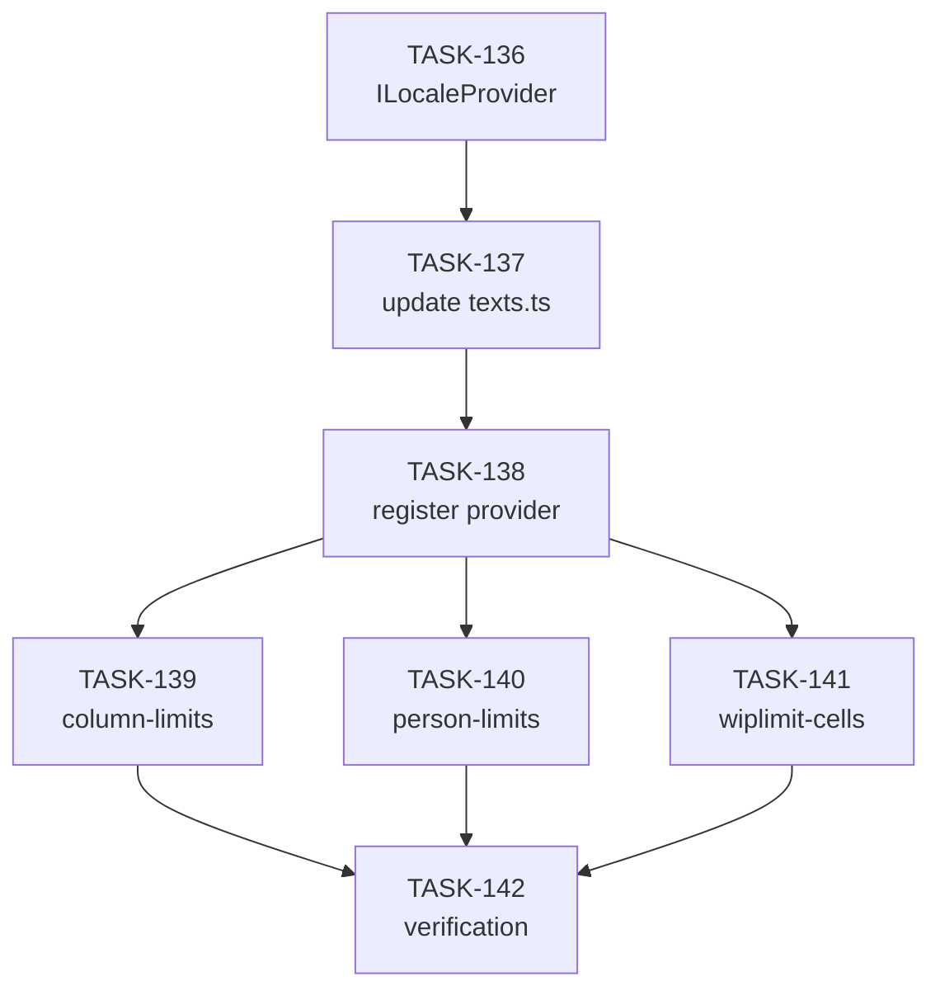

# EPIC-13: i18n через DI для column-limits, person-limits, wiplimit-on-cells

**Status**: DONE  
**Created**: 2026-03-04

---

## Цель

1. Сделать `getJiraLocale` инжектируемым через DI для возможности мока в тестах
2. Вынести все hardcoded тексты в трёх фичах в локализуемые объекты TEXTS
3. Обеспечить работу автотестов с en локалью

---

## Анализ текущего состояния

### Hardcoded тексты

#### column-limits
| Файл | Тексты |
|------|--------|
| `ColumnLimitsForm.tsx` | "Limit for group:", "Swimlanes", "All swimlanes", "Without Group", "Drag column over here to create group" |
| `SettingsModalContainer.tsx` | "Limits for groups" (modal title) |
| `ColorPickerButton.tsx` | "Select color {color}" |

#### person-limits
| Файл | Тексты |
|------|--------|
| `PersonalWipLimitContainer.tsx` | "Person JIRA name", "Max issues at work", "Select a person", "Limit must be at least 1", "Columns", "Swimlanes" (частично уже использует TEXTS) |
| `SettingsModalContainer.tsx` | "Personal WIP Limit" |
| `PersonalWipLimitTable.tsx` | Column headers, "Edit", "Delete", "All columns", "All swimlanes" |

#### wiplimit-on-cells
| Файл | Тексты |
|------|--------|
| `RangeForm.tsx` | "Add range", "name", "Add cell", "swimlane", "Column", "show indicator", "Select swimlane", "Select Column", "Enter range name" |
| `RangeTable.tsx` | "Range name", "WIP limit", "Disable", "Cells (swimlane/column)" |
| `SettingsModalContainer.tsx` | "Edit WipLimit on cells" |
| `SettingsModal.tsx` | "Save", "Cancel" |

---

## Архитектура

### LocaleProvider через DI

```typescript
// src/shared/locale/ILocaleProvider.ts
export interface ILocaleProvider {
  getJiraLocale(): string | null;
}

// src/shared/locale/localeProviderToken.ts
export const localeProviderToken = new Token<ILocaleProvider>('localeProvider');

// src/shared/locale/JiraLocaleProvider.ts
export class JiraLocaleProvider implements ILocaleProvider {
  getJiraLocale(): string | null {
    return document.querySelector('meta[name="ajs-user-locale"]')?.getAttribute('content') ?? null;
  }
}

// src/shared/locale/MockLocaleProvider.ts (для тестов)
export class MockLocaleProvider implements ILocaleProvider {
  constructor(private locale: string | null = 'en') {}
  getJiraLocale(): string | null {
    return this.locale;
  }
}
```

### Обновлённый texts.ts

```typescript
export const useGetTextsByLocale = <T extends string>(texts: Texts<T>) => {
  const container = useDi();
  const localeProvider = container.inject(localeProviderToken);
  const { settings } = useLocalSettingsStore();
  
  const locale = useMemo(() => {
    if (settings.locale !== 'auto') return settings.locale;
    return localeProvider.getJiraLocale() === 'ru' ? 'ru' : 'en';
  }, [settings.locale, localeProvider]);
  
  return useMemo(() => /* ... */, [texts, locale]);
};
```

---

## Задачи

### Phase 1: Infrastructure

| # | Task | Описание | Status |
|---|------|----------|--------|
| 1 | [TASK-136](./TASK-136-locale-provider-di.md) | Создать ILocaleProvider, токен, JiraLocaleProvider, MockLocaleProvider | DONE |
| 2 | [TASK-137](./TASK-137-update-texts-ts.md) | Обновить `src/shared/texts.ts` для использования DI | DONE |
| 3 | [TASK-138](./TASK-138-register-locale-provider.md) | Зарегистрировать LocaleProvider в globalContainer и тестовых хелперах | DONE |

### Phase 2: column-limits i18n

| # | Task | Описание | Status |
|---|------|----------|--------|
| 4 | [TASK-139](./TASK-139-column-limits-texts.md) | Вынести тексты column-limits в TEXTS объекты | DONE |

### Phase 3: person-limits i18n

| # | Task | Описание | Status |
|---|------|----------|--------|
| 5 | [TASK-140](./TASK-140-person-limits-texts.md) | Вынести тексты person-limits в TEXTS объекты | DONE |

### Phase 4: wiplimit-on-cells i18n

| # | Task | Описание | Status |
|---|------|----------|--------|
| 6 | [TASK-141](./TASK-141-wiplimit-cells-texts.md) | Вынести тексты wiplimit-on-cells в TEXTS объекты | DONE |

### Phase 5: Verification

| # | Task | Описание | Status |
|---|------|----------|--------|
| 7 | [TASK-142](./TASK-142-i18n-verification.md) | Верификация: все тесты проходят с en локалью, lint clean | DONE |

---

## Acceptance Criteria

- [ ] `getJiraLocale` работает через DI токен `localeProviderToken`
- [ ] В тестах можно подставить `MockLocaleProvider` с фиксированной локалью
- [ ] Все тексты в column-limits, person-limits, wiplimit-on-cells вынесены в TEXTS
- [ ] Каждый текст имеет `en` и `ru` версии
- [ ] Все Cypress component тесты проходят
- [ ] Все vitest unit тесты проходят
- [ ] ESLint без ошибок

---

## Dependencies



---

## Notes

- API компонентов (`useGetTextsByLocale`) остаётся неизменным
- Внутри используется DI для получения локали
- В тестах по умолчанию используется 'en' локаль через MockLocaleProvider
