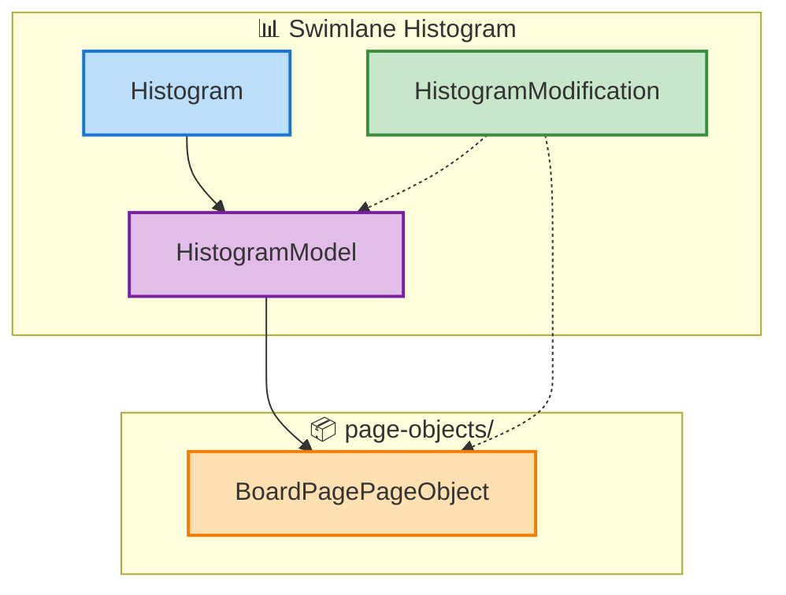
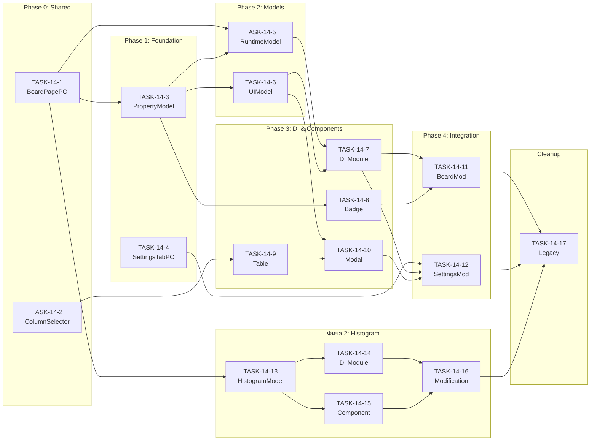

# EPIC-14: Swimlane Features — React + Valtio + Ant Design

**Status**: TODO

---

## Цель

Рефакторинг функционала swimlane на **две независимые фичи** с использованием React, Valtio class-based models и Ant Design.

**Фичи:**
1. **swimlane-wip-limits** — WIP-лимиты для swimlane (настройки + badge на борде)
2. **swimlane-histogram** — гистограмма распределения задач по колонкам

**Ключевые принципы:**
- **Valtio class-based models** — реактивный state management
- **Readonly через DI** — `Token<Readonly<Model>>` вместо readonly полей
- **React + Ant Design** — вместо raw HTML
- **Расширение существующих PageObjects** — `BoardPagePageObject`, `SettingsPage`
- **Рядом со старым** — новая реализация параллельно, legacy не удаляется до конца

---

## Архитектура

### Диаграмма: swimlane-wip-limits

```mermaid
flowchart TD
    subgraph WipLimitsFeature["🏊 Swimlane WIP Limits"]
        subgraph SettingsPage["📝 SettingsPage"]
            SettingsUIModel[SettingsUIModel]
            SettingsModal[SettingsModal]
            LimitsTable[SwimlaneLimitsTable]
            SettingRow[SwimlaneSettingRow]
            SettingsMod[SettingsPageModification]
        end
        
        subgraph BoardPage["📋 BoardPage"]
            BoardRuntimeModel[BoardRuntimeModel]
            LimitBadge[LimitBadge]
            BoardMod[BoardPageModification]
        end
        
        subgraph Property["💾 Property"]
            PropModel[PropertyModel]
        end
    end
    
    subgraph PageObjects["📦 page-objects/"]
        BoardPagePO[BoardPagePageObject]
        SettingsTabPO[SwimlaneLimitsSettingsTabPageObject]
    end
    
    subgraph SharedComponents["📦 shared/components/"]
        ColumnSelector[ColumnSelectorContainer]
    end
    
    SettingsUIModel --> PropModel
    BoardRuntimeModel --> PropModel
    BoardRuntimeModel --> BoardPagePO
    SettingsModal --> SettingsUIModel
    LimitsTable --> SettingRow
    SettingRow --> ColumnSelector
    LimitBadge --> BoardRuntimeModel
    SettingsMod -.-> SettingsUIModel
    SettingsMod -.-> SettingsTabPO
    BoardMod -.-> BoardRuntimeModel
    BoardMod -.-> BoardPagePO
    
    classDef model fill:#E1BEE7,stroke:#7B1FA2,stroke-width:2px
    classDef component fill:#BBDEFB,stroke:#1976D2,stroke-width:2px
    classDef modification fill:#C8E6C9,stroke:#388E3C,stroke-width:2px
    classDef pageobject fill:#FFE0B2,stroke:#F57C00,stroke-width:2px
    classDef shared fill:#FFF9C4,stroke:#F9A825,stroke-width:2px
    
    class SettingsUIModel,BoardRuntimeModel,PropModel model
    class SettingsModal,LimitsTable,SettingRow,LimitBadge component
    class SettingsMod,BoardMod modification
    class BoardPagePO,SettingsTabPO pageobject
    class ColumnSelector shared
```

### Диаграмма: swimlane-histogram

---

## Задачи

### Phase 0: Shared Infrastructure

| # | Задача | Описание | Зависит от | Статус |
|---|--------|----------|------------|--------|
| 1 | [TASK-14-1](./TASK-14-1-boardpage-swimlane-methods.md) | Расширение BoardPagePageObject swimlane-методами | — | DONE |
| 2 | [TASK-14-2](./TASK-14-2-column-selector-folder.md) | Рефакторинг ColumnSelector в папку | — | DONE |

### Фича 1: swimlane-wip-limits

#### Phase 1: Foundation

| # | Задача | Описание | Зависит от | Статус |
|---|--------|----------|------------|--------|
| 3 | [TASK-14-3](./TASK-14-3-wip-types-property-model.md) | Types + tokens + PropertyModel | 14-1 | DONE |
| 4 | [TASK-14-4](./TASK-14-4-settings-tab-pageobject.md) | SwimlaneLimitsSettingsTabPageObject | — | DONE |

#### Phase 2: Models

| # | Задача | Описание | Зависит от | Статус |
|---|--------|----------|------------|--------|
| 5 | [TASK-14-5](./TASK-14-5-board-runtime-model.md) | BoardRuntimeModel | 14-1, 14-3 | DONE |
| 6 | [TASK-14-6](./TASK-14-6-settings-ui-model.md) | SettingsUIModel | 14-3 | DONE |

#### Phase 3: DI & Components

| # | Задача | Описание | Зависит от | Статус |
|---|--------|----------|------------|--------|
| 7 | [TASK-14-7](./TASK-14-7-wip-di-module.md) | DI module + integration tests | 14-5, 14-6 | DONE |
| 8 | [TASK-14-8](./TASK-14-8-limit-badge.md) | LimitBadge component | 14-3 | DONE |
| 9 | [TASK-14-9](./TASK-14-9-settings-table.md) | SwimlaneSettingRow + SwimlaneLimitsTable | 14-2, 14-3 | DONE |
| 10 | [TASK-14-10](./TASK-14-10-settings-modal.md) | SettingsModal | 14-6, 14-9 | DONE |

#### Phase 4: Integration

| # | Задача | Описание | Зависит от | Статус |
|---|--------|----------|------------|--------|
| 11 | [TASK-14-11](./TASK-14-11-board-modification.md) | BoardPageModification | 14-5, 14-7, 14-8 | DONE |
| 12 | [TASK-14-12](./TASK-14-12-settings-modification.md) | SettingsPageModification | 14-4, 14-7, 14-10 | DONE |

### Фича 2: swimlane-histogram

| # | Задача | Описание | Зависит от | Статус |
|---|--------|----------|------------|--------|
| 13 | [TASK-14-13](./TASK-14-13-histogram-model.md) | Types + tokens + HistogramModel | 14-1 | DONE |
| 14 | [TASK-14-14](./TASK-14-14-histogram-di-module.md) | DI module | 14-13 | DONE |
| 15 | [TASK-14-15](./TASK-14-15-histogram-component.md) | Histogram component | 14-13 | DONE |
| 16 | [TASK-14-16](./TASK-14-16-histogram-modification.md) | HistogramModification | 14-14, 14-15 | DONE |

### Phase Final: Cleanup

| # | Задача | Описание | Зависит от | Статус |
|---|--------|----------|------------|--------|
| 17 | [TASK-14-17](./TASK-14-17-legacy-cleanup.md) | Удаление legacy, включение новых фич | 14-11, 14-12, 14-16 | TODO |

---

## Зависимости

**Параллельно можно выполнять:**
- TASK-14-1 и TASK-14-2 и TASK-14-4 (независимы)
- TASK-14-5 и TASK-14-6 (после 14-3)
- TASK-14-8 и TASK-14-9 (после 14-3)
- Фича 2 (13-16) параллельно с Фичей 1 (после 14-1)

---

## Референсы

- **Target Design**: [target-design-swimlane-v2.md](./target-design-swimlane-v2.md)
- `src/person-limits/` — пример миграции на React
- `src/column-limits/` — пример BDD тестов
- `src/page-objects/BoardPage.tsx` — существующий BoardPagePageObject

---

## Ожидаемый результат

| Метрика | Фича 1 (WIP Limits) | Фича 2 (Histogram) |
|---------|---------------------|-------------------|
| Valtio models | 3 (Property, Settings UI, Runtime) | 1 (Histogram) |
| React компонентов | 4 (Badge, Row, Table, Modal) | 1 (Histogram) |
| PageObject | Расширение BoardPagePO + SettingsTabPO | Расширение BoardPagePO |
| Entry points | 2 (Board + Settings) | 1 (Board) |
