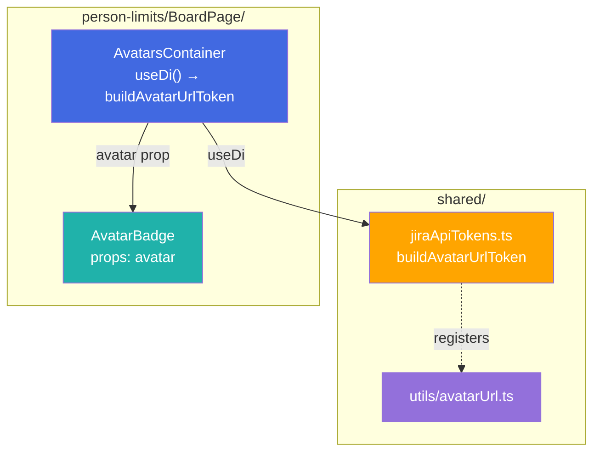
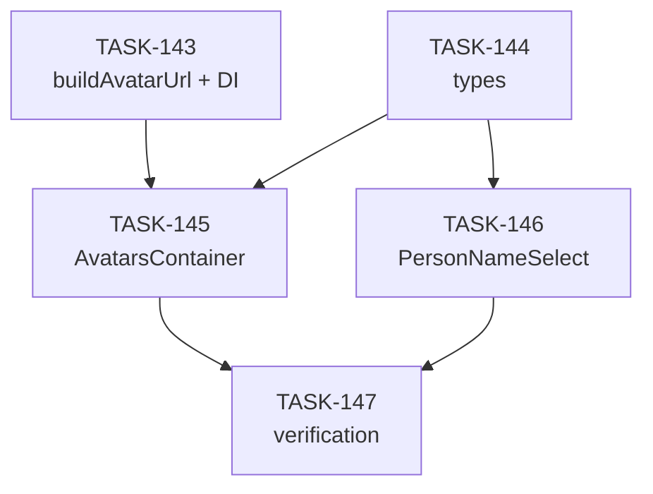

# EPIC-15: Динамические аватарки в Person Limits

**Status**: DONE  
**Created**: 2026-03-10

---

## Цель

Заменить статичные URL аватарок на динамическую генерацию через стабильный endpoint `/secure/useravatar?username={name}`. Это устранит проблему устаревших аватарок, когда пользователь меняет свою картинку в Jira.

**Проблема:**
- При создании PersonLimit сохраняется URL аватарки с `avatarId`
- Когда пользователь меняет аватарку, `avatarId` меняется
- Сохранённый URL продолжает показывать старую картинку

**Решение:**
- Функция `buildAvatarUrl` как DI токен в `jiraApiTokens.ts`
- Генерация URL в контейнере `AvatarsContainer`, не в презентационном компоненте
- Убрать сохранение `avatar` URL в Jira Board Property

---

## Target Design

См. [target-design-dynamic-avatars.md](./target-design-dynamic-avatars.md)

---

## Архитектура

---

## Задачи

### Phase 1: Утилита и DI токен

| # | Task | Описание | Status |
|---|------|----------|--------|
| 1 | [TASK-143](./TASK-143-build-avatar-url-utility.md) | Создать `buildAvatarUrl` утилиту и DI токен | DONE |

### Phase 2: Типы

| # | Task | Описание | Status |
|---|------|----------|--------|
| 2 | [TASK-144](./TASK-144-update-person-limits-types.md) | Обновить типы: `avatar?` в property, удалить из runtime и settings | DONE |

### Phase 3: Компоненты

| # | Task | Описание | Status |
|---|------|----------|--------|
| 3 | [TASK-145](./TASK-145-avatars-container-di.md) | AvatarsContainer: использовать DI для генерации avatar URL | DONE |
| 4 | [TASK-146](./TASK-146-person-name-select-no-avatar.md) | PersonNameSelect: не сохранять avatar в onChange | DONE |

### Phase 5: Верификация

| # | Task | Описание | Status |
|---|------|----------|--------|
| 5 | [TASK-147](./TASK-147-dynamic-avatars-verification.md) | Верификация: тесты, lint, backward compatibility | DONE |

---

## Dependencies

**Параллельно можно выполнять:**
- TASK-143 и TASK-144 (независимые)

**Последовательно:**
- TASK-145 зависит от 143 и 144
- TASK-146 зависит от 144
- TASK-147 зависит от всех

---

## Acceptance Criteria

- [x] `buildAvatarUrlToken` зарегистрирован в `jiraApiTokens.ts`
- [x] `AvatarsContainer` использует DI для получения функции
- [x] `AvatarBadge` остаётся презентационным (получает `avatar` prop)
- [x] Новые лимиты не сохраняют `avatar` в Jira Board Property
- [x] Старые данные с `avatar` продолжают работать (backward compatible)
- [x] Все тесты проходят
- [x] ESLint без ошибок
