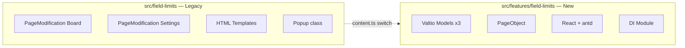

# EPIC-16: Field WIP Limits — Modernization

**Status**: DONE

**Target Design**: [target-design-field-limits.md](./target-design-field-limits.md)

---

## Описание

Миграция фичи Field WIP Limits с legacy PageModification + HTML templates на текущую архитектуру:
Valtio Models, DI, React + antd.

**Стратегия:** Новый код в `src/features/field-limits/` рядом со старым `src/field-limits/`.
Переключение атомарно через `content.ts`. После верификации — старый код удаляется.

**Legacy код:** `src/field-limits/` (0 тестов, HTML templates, прямая работа с DOM)

**Референс:** `src/swimlane-wip-limits/` (аналогичная фича, уже на новой архитектуре)

## Архитектура изменений



## Зависимости между задачами

```
TASK-148 (types+tokens) ──┐
TASK-149 (pure functions) ─┤
                           ├─> TASK-150 (module) ─> TASK-151 (PropertyModel)
                           │                              │
                           │                    ┌─────────┤
                           │                    │         │
                           │              TASK-152        TASK-158
                           │             (SettingsUI)    (PageObject)
                           │                    │         │
                           │         ┌──────────┤    TASK-159
                           │         │          │   (RuntimeModel)
                           │    TASK-153   TASK-154      │
                           │    (Button)   (Form)   TASK-160
                           │         │     TASK-155  (Badge)
                           │         │    (Table)     │
                           │         │          │    TASK-161
                           │         └────┬─────┘   (List)
                           │              │          │
                           │         TASK-156   TASK-162
                           │         (Modal)    (BoardMod)
                           │              │          │
                           │         TASK-157        │
                           │        (SettingsMod)    │
                           │              │          │
                           │              └────┬─────┘
                           │                   │
                           │             TASK-163 (switch content.ts)
                           │                   │
                           │             TASK-164 (delete legacy)
```

## Задачи

### Phase 1: Инфраструктура

| # | Задача | Описание | Статус |
|---|--------|----------|--------|
| 148 | [TASK-148](./TASK-148-field-limits-types-tokens.md) | Доменные типы и DI-токены | DONE |
| 149 | [TASK-149](./TASK-149-field-limits-pure-functions.md) | Чистые функции расчёта с unit-тестами | DONE |
| 150 | [TASK-150](./TASK-150-field-limits-module.md) | Регистрация DI-модуля фичи | DONE |

### Phase 2: Property Model

| # | Задача | Описание | Статус |
|---|--------|----------|--------|
| 151 | [TASK-151](./TASK-151-field-limits-property-model.md) | PropertyModel для board property с тестами | DONE |

### Phase 3: Settings Page

| # | Задача | Описание | Статус |
|---|--------|----------|--------|
| 152 | [TASK-152](./TASK-152-field-limits-settings-ui-model.md) | SettingsUIModel для модалки настроек с тестами | DONE |
| 153 | [TASK-153](./TASK-153-field-limits-settings-button.md) | SettingsButton — View кнопки настроек | DONE |
| 154 | [TASK-154](./TASK-154-field-limits-limit-form.md) | LimitForm — View формы лимита + stories | DONE |
| 155 | [TASK-155](./TASK-155-field-limits-limits-table.md) | LimitsTable — View таблицы лимитов + stories | DONE |
| 156 | [TASK-156](./TASK-156-field-limits-settings-modal.md) | SettingsModal — Container модалки настроек | DONE |
| 157 | [TASK-157](./TASK-157-field-limits-settings-modification.md) | SettingsPageModification — точка входа Settings | DONE |

### Phase 4: Board Page

| # | Задача | Описание | Статус |
|---|--------|----------|--------|
| 158 | [TASK-158](./TASK-158-field-limits-board-pageobject.md) | FieldLimitsBoardPageObject для DOM-запросов + тесты | DONE |
| 159 | [TASK-159](./TASK-159-field-limits-board-runtime-model.md) | BoardRuntimeModel для подсчёта лимитов + тесты | DONE |
| 160 | [TASK-160](./TASK-160-field-limits-badge.md) | FieldLimitBadge — View badge лимита + stories | DONE |
| 161 | [TASK-161](./TASK-161-field-limits-list.md) | FieldLimitsList — Container списка badges | DONE |
| 162 | [TASK-162](./TASK-162-field-limits-board-modification.md) | BoardPageModification — точка входа Board | DONE |

### Phase 5: Переключение + Cleanup

| # | Задача | Описание | Статус |
|---|--------|----------|--------|
| 163 | [TASK-163](./TASK-163-field-limits-switch-content.md) | Переключить content.ts на новую реализацию | DONE |
| 164 | [TASK-164](./TASK-164-field-limits-delete-legacy.md) | Удалить legacy код src/field-limits/ | DONE |

### Phase 6: CalcType Redesign + Migration

| # | Задача | Описание | Статус |
|---|--------|----------|--------|
| 168 | [TASK-168](./TASK-168-field-limits-calctype-migrator.md) | CalcType redesign + migrator + unit tests | DONE |
| 169 | [TASK-169](./TASK-169-field-limits-update-pure-functions.md) | Update pure functions under new CalcTypes | DONE |
| 170 | [TASK-170](./TASK-170-field-limits-limitform-calctype.md) | LimitForm — CalcType dropdown + adaptive input | DONE |
| 171 | [TASK-171](./TASK-171-field-limits-migration-integration.md) | Integration of migration into PropertyModel.load() | DONE |
| 172 | [TASK-172](./TASK-172-field-limits-update-feature-files.md) | Update feature files for new CalcType UI | DONE |

### Phase 7: BDD Acceptance Tests

| # | Задача | Описание | Статус |
|---|--------|----------|--------|
| 165 | [TASK-165](./TASK-165-field-limits-feature-files.md) | Feature Files (Gherkin) — сценарии SettingsPage | DONE |
| 166 | [TASK-166](./TASK-166-field-limits-cypress-infrastructure.md) | Cypress BDD Infrastructure — helpers + step definitions | DONE |
| 167 | [TASK-167](./TASK-167-field-limits-cypress-bdd-tests.md) | Cypress BDD Tests — .feature.cy.tsx runners (31 scenario) | DONE |
