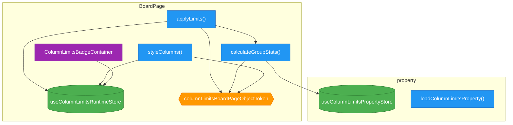

# EPIC-6: Column Limits Modernization

**Status**: DONE

---

## Описание

Рефакторинг модуля `column-limits` для соответствия архитектурным практикам, используемым в `person-limits`:

1. **BoardPage** — переписать монолитный класс на actions/stores/pageObject/DI архитектуру
2. **SettingsPage** — написать исчерпывающие BDD тесты по расширенному feature файлу

## Цели

- Единообразная архитектура между `person-limits` и `column-limits`
- 100% покрытие сценариев BDD тестами
- Тестируемость через DI (без моков модулей)
- Чистое разделение ответственности: PageObject для DOM, Actions для логики, Stores для состояния

## Референс

Архитектура `person-limits/BoardPage`:

```
src/person-limits/BoardPage/
├── index.ts                    # Entry point (PageModification)
├── actions/
│   ├── applyLimits.ts          # Main action
│   ├── calculateStats.ts       # Pure calculation
│   └── showOnlyChosen.ts       # Filter action
├── stores/
│   └── runtimeStore.ts         # Runtime state (stats, selectedPerson)
├── pageObject/
│   ├── IPersonLimitsBoardPageObject.ts
│   ├── PersonLimitsBoardPageObject.ts
│   └── personLimitsBoardPageObjectToken.ts
├── components/
│   ├── AvatarsContainer.tsx
│   └── AvatarBadge.tsx
├── utils/
│   └── computeLimitId.ts
├── board-page.feature
├── board-page.feature.cy.tsx
└── board-page.bdd.test.ts
```

---

## Задачи

| # | Task | Описание | Status |
|---|------|----------|--------|
| 1 | [TASK-50](./TASK-50-column-limits-boardpage-pageobject.md) | Создать PageObject и DI token для BoardPage | DONE |
| 2 | [TASK-51](./TASK-51-column-limits-boardpage-store.md) | Создать runtimeStore для BoardPage | DONE |
| 3 | [TASK-52](./TASK-52-column-limits-boardpage-actions.md) | Вынести логику в actions | DONE |
| 4 | [TASK-53](./TASK-53-column-limits-boardpage-refactor-index.md) | Рефакторинг index.ts | DONE |
| 5 | [TASK-54](./TASK-54-column-limits-boardpage-feature.md) | Создать board-page.feature файл | DONE |
| 6 | [TASK-55](./TASK-55-column-limits-boardpage-tests.md) | Написать BDD тесты для BoardPage | DONE |
| 7 | [TASK-56](./TASK-56-column-limits-settingspage-cypress.md) | Написать Cypress тесты для SettingsPage | DONE |
| 8 | [TASK-57](./TASK-57-column-limits-settingspage-bdd.md) | Написать BDD store тесты для SettingsPage | DONE |
| 9 | [TASK-58](./TASK-58-column-limits-verification.md) | Финальная верификация | DONE |
| 10 | [TASK-59](./TASK-59-fix-sc-display-2-test.md) | Исправить пропущенный тест SC-DISPLAY-2 | DONE |
| 11 | [TASK-60](./TASK-60-column-limits-property-di-refactor.md) | Рефакторинг property actions на DI токены | TODO |

---

## Диаграмма целевой архитектуры BoardPage



---

## Критерии завершения EPIC

- [x] BoardPage использует actions/stores/pageObject архитектуру
- [x] BoardPage получает данные из useColumnLimitsPropertyStore
- [x] Все DOM операции через PageObject + DI token
- [x] Написан board-page.feature с исчерпывающими сценариями
- [ ] Cypress тесты проходят для BoardPage (3/13 проходят, 10 падают - проблема с отображением бейджей)
- [x] Cypress тесты проходят для SettingsPage (27/27 сценариев)
- [x] BDD store тесты проходят (335 тестов: 117 для BoardPage, 218 для SettingsPage)
- [ ] `npm run cy:run` без ошибок (частично - SettingsPage проходит, BoardPage падает)
- [x] `npm test` без ошибок (391 unit тест проходит)
