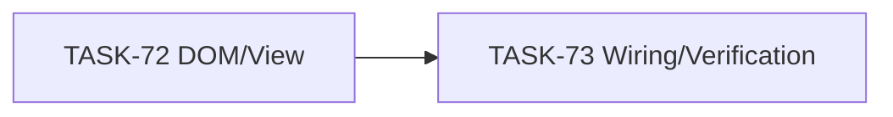

# EPIC-4: Clickable Epic Links

**Status**: VERIFICATION
**Created**: 2026-04-29

---

## Цель

Сделать переход к эпикам с карточек Jira быстрым: встроенный `Epic Link` badge и jira-helper issue link badge должны вести на `/browse/{EPIC_KEY}`.

## Target Design

Решение небольшое, отдельный `target-design.md` не создается. Целевой дизайн зафиксирован в `requirements.md` и задачах:

- DOM utility linkifies Jira-rendered `Epic Link` extra fields on board/backlog cards.
- React badge renders semantic anchor for jira-helper issue links.
- Content wiring applies DOM utility when cards are detected.

## Задачи

| # | Task | Описание | Status |
|---|------|----------|--------|
| 72 | [TASK-72](./TASK-72-clickable-epic-link-badges.md) | DOM utility + React anchor для кликабельных ссылок | VERIFICATION |
| 73 | [TASK-73](./TASK-73-di-wiring-and-verification.md) | Wiring на board/backlog и финальная проверка | VERIFICATION |

## Dependencies

## Acceptance Criteria

- [ ] Встроенный `Epic Link` на карточке становится ссылкой.
- [ ] jira-helper issue link badge рендерит ссылку на issue key.
- [ ] Клик не триггерит выбор/открытие карточки вместо ссылки.
- [ ] Тесты и ESLint проходят.

## Changelog

- **2026-04-29** — создан EPIC для issue #20.
- **2026-04-29** — TASK-72 и TASK-73 завершены, проверки прошли.
- **2026-04-29** — после live-теста добавлена поддержка Jira highlighted epic labels с `data-epickey`.
- **2026-04-29** — добавлены настройки кликабельности Epic Link и Issue Link, defaults включены.
