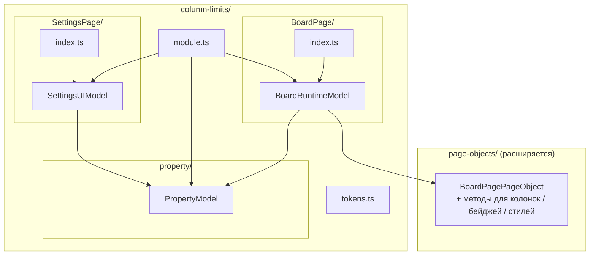
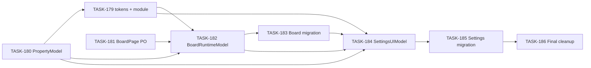

# EPIC-18: Рефакторинг column-limits (zustand → valtio + PageObject)

**Status**: TODO
**Created**: 2026-04-05

---

## Цель

Модуль `src/column-limits` сейчас опирается на три zustand-стора, `createAction` и отдельный `ColumnLimitsBoardPageObject`. Это расходится с актуальным гайдлайном: valtio Model-классы с DI, `module.ts` + `tokens.ts`, DOM через общий `BoardPagePageObject`.

**Решение**: миграция на `PropertyModel`, `BoardRuntimeModel`, `SettingsUIModel`; расширение `IBoardPagePageObject` / `BoardPagePageObject`; удаление legacy stores/actions/pageObject и property-слоя zustand. UX и формат Jira Board Property не меняются.

## Target Design

См. [target-design.md](./target-design.md) (тот же каталог, что и EPIC).

## Архитектура

Целевой обзор (из target-design):

## Задачи

### Phase 1: Infrastructure + PropertyModel

| # | Task | Описание | Status |
|---|------|----------|--------|
| 180 | [TASK-180](./TASK-180-property-model.md) | `PropertyModel` + unit-тесты; обновление `property/index.ts` | VERIFICATION |
| 179 | [TASK-179](./TASK-179-infrastructure.md) | `tokens.ts` (`propertyModelToken`) + `module.ts` (регистрация PropertyModel); `boardRuntimeModelToken` / `settingsUIModelToken` добавляются в TASK-182 / TASK-184 | VERIFICATION |

> **Порядок выполнения Phase 1**: сначала TASK-180, затем TASK-179 (см. зависимости в задачах). Файл `tokens.ts` к концу EPIC должен совпасть с [target-design.md](./target-design.md) (три токена).

### Phase 2: BoardPagePageObject

| # | Task | Описание | Status |
|---|------|----------|--------|
| 181 | [TASK-181](./TASK-181-board-page-object.md) | Расширение `IBoardPagePageObject` / `BoardPagePageObject` (9 методов + `ColumnIssueCountOptions`) | VERIFICATION |

### Phase 3: BoardRuntimeModel + миграция Board page

| # | Task | Описание | Status |
|---|------|----------|--------|
| 182 | [TASK-182](./TASK-182-board-runtime-model.md) | `BoardRuntimeModel` + тесты; обновление `module.ts` | VERIFICATION |
| 183 | [TASK-183](./TASK-183-board-page-migration.md) | `BoardPage/index.ts`, helpers; удаление stores/actions/pageObject | VERIFICATION |

### Phase 4: SettingsUIModel + миграция Settings page

| # | Task | Описание | Status |
|---|------|----------|--------|
| 184 | [TASK-184](./TASK-184-settings-ui-model.md) | `SettingsUIModel` + тесты; обновление `module.ts` | TODO |
| 185 | [TASK-185](./TASK-185-settings-page-migration.md) | Containers, `SettingsPage/index.ts`, helpers; удаление stores/actions | VERIFICATION |

### Phase 5: Final cleanup

| # | Task | Описание | Status |
|---|------|----------|--------|
| 186 | [TASK-186](./TASK-186-final-cleanup.md) | Удаление `property/store.ts`, `interface.ts`, `actions/`; экспорты; проверка импортов | VERIFICATION |

## Dependencies

**Параллельно можно выполнять:**

- TASK-181 (расширение BoardPagePageObject) — параллельно с Phase 1 (TASK-180 → TASK-179), пока не начата интеграция в TASK-182.

**Последовательно:**

1. TASK-180 → TASK-179 (инфраструктура DI + PropertyModel).
2. TASK-182 после TASK-179, TASK-180, TASK-181.
3. TASK-183 после TASK-182.
4. TASK-184 после TASK-183 (и при необходимости совместно с уже готовыми PropertyModel + module).
5. TASK-185 после TASK-184.
6. TASK-186 после TASK-185.

## Acceptance Criteria

- [ ] Все три zustand-стора заменены на valtio Model-классы; `createAction` и старые action-файлы удалены.
- [ ] `ColumnLimitsBoardPageObject` и токен pageObject удалены; нужные методы — в `BoardPagePageObject` / `BoardRuntimeModel`.
- [ ] `tokens.ts` и `registerColumnLimitsModule()` соответствуют target-design и референсам `swimlane-wip-limits` / `field-limits`.
- [ ] Unit-тесты (Vitest) для Model-классов проходят; Cypress BDD и Storybook — без регрессий (после адаптации helpers).
- [ ] Формат `WIP_LIMITS_SETTINGS` не изменён; поведение для пользователя — как до рефакторинга.
- [ ] `npm run build`, `npm test`, `npm run lint` (или эквивалентные скрипты проекта) завершаются успешно.
