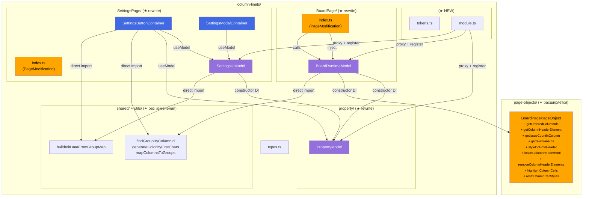
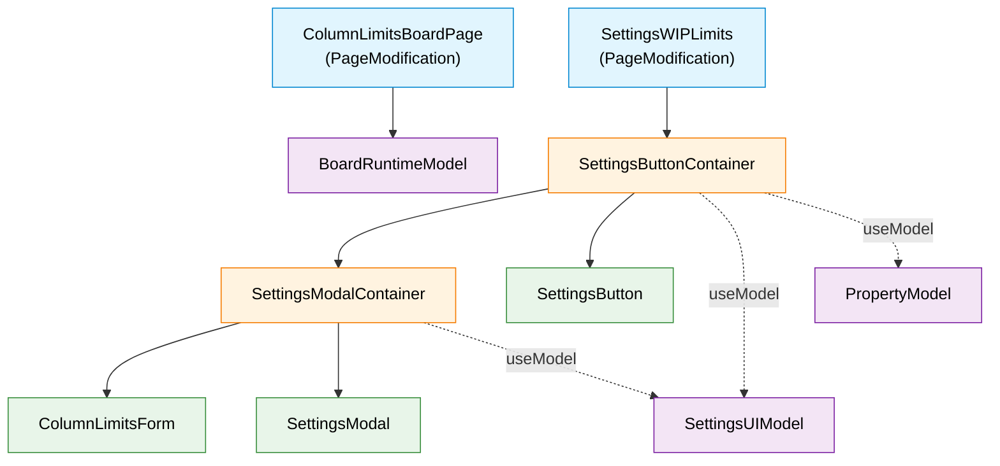
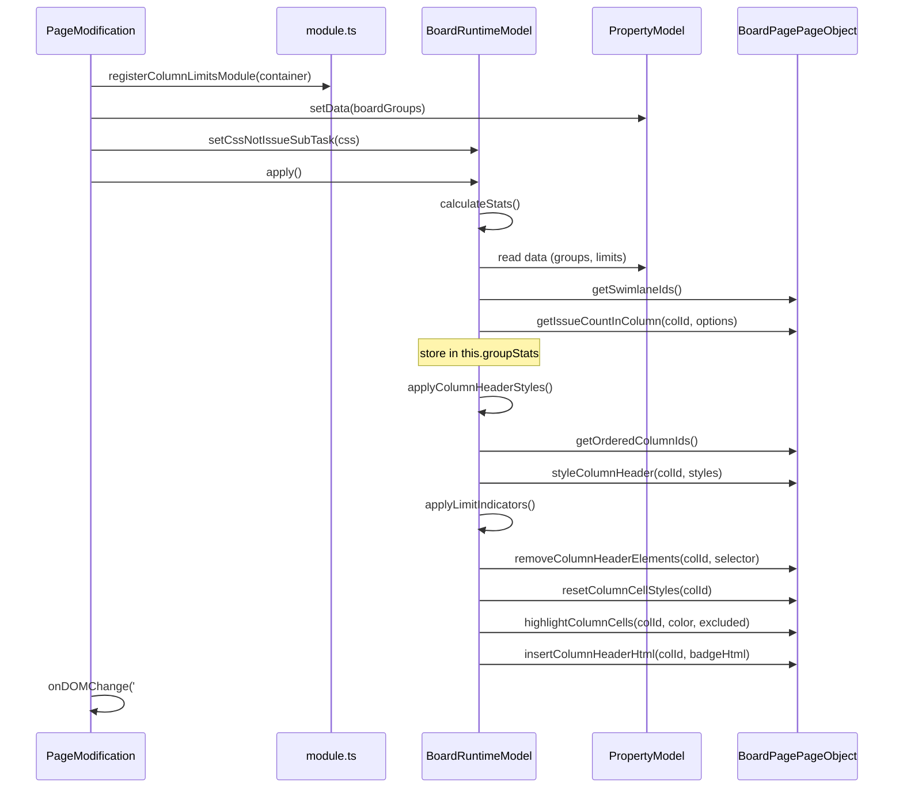
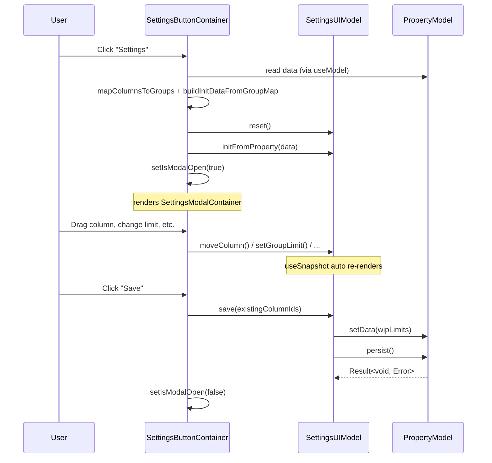

# Target Design: column-limits refactoring (zustand → valtio + PageObject cleanup)

Этот документ описывает целевую архитектуру для рефакторинга модуля `src/column-limits`: миграция трёх zustand-сторов на valtio Model-классы, ликвидация `ColumnLimitsBoardPageObject` с переносом DOM-методов в общий `BoardPagePageObject`, удаление action-файлов (`createAction`).

## Ключевые принципы

1. **Valtio Model-классы вместо zustand stores** — три Model-класса (`PropertyModel`, `BoardRuntimeModel`, `SettingsUIModel`) с constructor DI, прямыми мутациями и `reset()`. Zustand stores и `createAction` удаляются полностью.
2. **Монополия PageObject на DOM** — `BoardRuntimeModel` координирует бизнес-логику (что стилизовать, какие бейджи показать), но все DOM-операции выполняются через `BoardPagePageObject` (DI). Прямых обращений к `document` в Model нет.
3. **Единый BoardPagePageObject** — `ColumnLimitsBoardPageObject` удаляется. Его общие методы (`getOrderedColumnIds`, `getColumnHeaderElement`, `getIssueCountInColumn`, `getSwimlaneIds`) и DOM-команды (`styleColumnHeader`, `insertColumnHeaderHtml`, `removeColumnHeaderElements`, `highlightColumnCells`, `resetColumnCellStyles`) добавляются в общий `BoardPagePageObject`.
4. **Чистые функции — прямой import** — `findGroupByColumnId`, `generateColorByFirstChars`, `mapColumnsToGroups`, `buildInitDataFromGroupMap` остаются pure functions с прямым import. Только сущности с side effects / state идут через DI.
5. **Формат property не меняется** — `WipLimitsProperty`, `ColumnLimitGroup`, `UIGroup` и остальные типы из `types.ts` сохраняются без изменений. Обратная совместимость полная.

> Общие архитектурные принципы — см. `docs/architecture_guideline.md`

## Architecture Diagram



## Component Hierarchy



**Легенда**: голубой — PageModification (не React), оранжевый — Container, зелёный — View, фиолетовый — Model.

## Target File Structure

```
src/column-limits/
├── types.ts                                    # Доменные типы (без изменений)
├── tokens.ts                                   # ★ NEW: DI-токены для 3 Model-ов
├── module.ts                                   # ★ NEW: registerColumnLimitsModule()
│
├── property/
│   ├── PropertyModel.ts                        # ★ NEW: valtio Model (замена store.ts + actions)
│   ├── PropertyModel.test.ts                   # ★ NEW: unit tests
│   ├── index.ts                                # ✦ обновить экспорты
│   ├── store.ts                                # ❌ DELETE (заменён PropertyModel)
│   ├── interface.ts                            # ❌ DELETE (интерфейс в PropertyModel)
│   └── actions/
│       ├── loadProperty.ts                     # ❌ DELETE (→ PropertyModel.load)
│       └── saveProperty.ts                     # ❌ DELETE (→ PropertyModel.persist)
│
├── BoardPage/
│   ├── index.ts                                # ✦ обновить: использовать Model вместо stores/actions
│   ├── models/
│   │   ├── BoardRuntimeModel.ts                # ★ NEW: valtio Model
│   │   └── BoardRuntimeModel.test.ts           # ★ NEW: unit tests
│   ├── styles.module.css                       # без изменений
│   ├── features/
│   │   ├── helpers.tsx                         # ✦ адаптировать тестовый setup: registerColumnLimitsModule() вместо zustand reset + PO регистрации
│   │   └── *.feature.cy.tsx                    # ✦ адаптировать step definitions
│   ├── stores/                                 # ❌ DELETE entire folder
│   │   ├── runtimeStore.ts                     # ❌ DELETE (→ BoardRuntimeModel)
│   │   ├── runtimeStore.types.ts               # ❌ DELETE (типы → types.ts или Model)
│   │   ├── runtimeStore.test.ts                # ❌ DELETE (→ BoardRuntimeModel.test.ts)
│   │   └── index.ts                            # ❌ DELETE
│   ├── actions/                                # ❌ DELETE entire folder
│   │   ├── applyLimits.ts                      # ❌ DELETE (→ BoardRuntimeModel.apply)
│   │   ├── calculateGroupStats.ts              # ❌ DELETE (→ BoardRuntimeModel.calculateStats)
│   │   ├── calculateGroupStats.test.ts         # ❌ DELETE (→ BoardRuntimeModel.test.ts)
│   │   ├── styleColumnHeaders.ts               # ❌ DELETE (→ BoardRuntimeModel.applyColumnHeaderStyles)
│   │   ├── styleColumnsWithLimits.ts           # ❌ DELETE (→ BoardRuntimeModel.applyLimitIndicators)
│   │   └── index.ts                            # ❌ DELETE
│   └── pageObject/                             # ❌ DELETE entire folder
│       ├── ColumnLimitsBoardPageObject.ts       # ❌ DELETE (методы → BoardPagePageObject / BoardRuntimeModel)
│       ├── IColumnLimitsBoardPageObject.ts      # ❌ DELETE
│       ├── columnLimitsBoardPageObjectToken.ts  # ❌ DELETE
│       └── index.ts                            # ❌ DELETE
│
├── SettingsPage/
│   ├── index.ts                                # ✦ обновить: использовать module.ts
│   ├── models/
│   │   ├── SettingsUIModel.ts                  # ★ NEW: valtio Model
│   │   └── SettingsUIModel.test.ts             # ★ NEW: unit tests
│   ├── components/
│   │   ├── SettingsButton/
│   │   │   ├── SettingsButtonContainer.tsx      # ✦ обновить: useModel() вместо useStore()
│   │   │   └── SettingsButton.tsx              # без изменений
│   │   └── SettingsModal/
│   │       ├── SettingsModalContainer.tsx       # ✦ обновить: useModel() вместо useStore()
│   │       ├── SettingsModal.tsx                # без изменений
│   │       └── SettingsModal.stories.tsx        # без изменений
│   ├── ColumnLimitsForm/                       # без изменений
│   ├── texts.ts                                # без изменений
│   ├── styles.module.css                       # без изменений
│   ├── utils/
│   │   └── buildInitData.ts                    # без изменений (pure function)
│   ├── features/
│   │   ├── helpers.tsx                         # ✦ адаптировать тестовый setup: registerColumnLimitsModule() вместо zustand reset
│   │   └── *.feature.cy.tsx                    # ✦ адаптировать step definitions
│   ├── stores/                                 # ❌ DELETE entire folder
│   │   ├── settingsUIStore.ts                  # ❌ DELETE (→ SettingsUIModel)
│   │   ├── settingsUIStore.types.ts            # ❌ DELETE (типы → SettingsUIModel)
│   │   └── settingsUIStore.test.ts             # ❌ DELETE (→ SettingsUIModel.test.ts)
│   └── actions/                                # ❌ DELETE entire folder
│       ├── initFromProperty.ts                 # ❌ DELETE (→ SettingsUIModel.initFromProperty)
│       ├── initFromProperty.test.ts            # ❌ DELETE (→ SettingsUIModel.test.ts)
│       ├── saveToProperty.ts                   # ❌ DELETE (→ SettingsUIModel.save)
│       ├── saveToProperty.test.ts              # ❌ DELETE (→ SettingsUIModel.test.ts)
│       ├── moveColumn.ts                       # ❌ DELETE (→ SettingsUIModel.moveColumn)
│       ├── moveColumn.test.ts                  # ❌ DELETE (→ SettingsUIModel.test.ts)
│       └── index.ts                            # ❌ DELETE
│
└── shared/
    └── utils.ts                                # без изменений (pure functions)

src/page-objects/
└── BoardPage.tsx                               # ✦ расширить: новые методы в IBoardPagePageObject
```

## Component Specifications

### tokens.ts (★ NEW)

**Responsibility**: DI-токены для трёх Model-ов модуля column-limits.

```typescript
import { Token } from 'dioma';
import type { PropertyModel } from './property/PropertyModel';
import type { BoardRuntimeModel } from './BoardPage/models/BoardRuntimeModel';
import type { SettingsUIModel } from './SettingsPage/models/SettingsUIModel';

export const propertyModelToken = new Token<{
  model: Readonly<PropertyModel>;
  useModel: () => Readonly<PropertyModel>;
}>('column-limits/propertyModel');

export const boardRuntimeModelToken = new Token<{
  model: Readonly<BoardRuntimeModel>;
  useModel: () => Readonly<BoardRuntimeModel>;
}>('column-limits/boardRuntimeModel');

export const settingsUIModelToken = new Token<{
  model: Readonly<SettingsUIModel>;
  useModel: () => Readonly<SettingsUIModel>;
}>('column-limits/settingsUIModel');
```

### module.ts (★ NEW)

**Responsibility**: Регистрация всех Model-ов column-limits в DI-контейнере через `proxy()` + `container.register()`.

```typescript
import type { Container } from 'dioma';

export function registerColumnLimitsModule(container: Container): void;
```

Внутри:
- Инжектит `BoardPropertyServiceToken`, `boardPagePageObjectToken`, `loggerToken` из DI
- Создаёт `proxy(new PropertyModel(...))`, регистрирует с `propertyModelToken`
- Создаёт `proxy(new BoardRuntimeModel(...))`, регистрирует с `boardRuntimeModelToken`
- Создаёт `proxy(new SettingsUIModel(...))`, регистрирует с `settingsUIModelToken`

По образцу `swimlane-wip-limits/module.ts`.

### IBoardPagePageObject — расширение (✦)

**Responsibility**: Добавить методы для работы с column headers, подсчёта issues по колонкам, стилизации column cells. Все методы general-purpose, не специфичны для column-limits.

```typescript
/** Опции подсчёта issues в колонке (across swimlanes). */
export type ColumnIssueCountOptions = {
  /** Swimlane IDs to exclude from counting */
  ignoredSwimlanes?: string[];
  /** Only count issues of these types (empty/undefined = all) */
  includedIssueTypes?: string[];
  /** Additional CSS :not() filter, e.g. ':not(.ghx-issue-subtask)' */
  cssFilter?: string;
};

export interface IBoardPagePageObject {
  // ... existing methods ...

  /**
   * Ordered column IDs from the board header row.
   * Reads from `.ghx-first ul.ghx-columns > li.ghx-column` elements.
   */
  getOrderedColumnIds(): string[];

  /**
   * Column header element by column ID.
   * Looks in `.ghx-column-header-group` or `ul.ghx-columns`.
   */
  getColumnHeaderElement(columnId: string): HTMLElement | null;

  /**
   * All swimlane IDs from the board (convenience over getSwimlanes().map(s => s.id)).
   */
  getSwimlaneIds(): string[];

  /**
   * Count issues in a specific column across swimlanes.
   * Supports filtering by ignored swimlanes, issue types, and CSS selector.
   */
  getIssueCountInColumn(columnId: string, options?: ColumnIssueCountOptions): number;

  /**
   * Apply inline styles to a column header element.
   */
  styleColumnHeader(columnId: string, styles: Partial<CSSStyleDeclaration>): void;

  /**
   * Insert HTML at the end of a column header element (beforeend).
   */
  insertColumnHeaderHtml(columnId: string, html: string): void;

  /**
   * Remove elements matching selector from a column header element.
   */
  removeColumnHeaderElements(columnId: string, selector: string): void;

  /**
   * Set background color on column cells across swimlanes.
   * @param excludedSwimlaneIds — swimlanes to skip (e.g. not part of the group)
   */
  highlightColumnCells(columnId: string, color: string, excludedSwimlaneIds?: string[]): void;

  /**
   * Clear inline background color from column cells across all swimlanes.
   */
  resetColumnCellStyles(columnId: string): void;
}
```

### PropertyModel (★ NEW)

**Responsibility**: Загрузка и сохранение `WipLimitsProperty` из/в Jira Board Property `WIP_LIMITS_SETTINGS`.

```typescript
import type { Result } from 'ts-results';
import type { WipLimitsProperty } from '../types';
import type { BoardPropertyServiceI } from 'src/shared/boardPropertyService';
import type { Logger } from 'src/shared/Logger';

export class PropertyModel {
  // === State ===
  data: WipLimitsProperty = {};
  state: 'initial' | 'loading' | 'loaded' = 'initial';
  error: string | null = null;

  constructor(
    private boardPropertyService: BoardPropertyServiceI,
    private logger: Logger
  ) {}

  // === Commands ===

  /** Load property from Jira. Idempotent (skips if already loading). */
  async load(): Promise<Result<WipLimitsProperty, Error>>;

  /** Save current data to Jira Board Property. */
  async persist(): Promise<Result<void, Error>>;

  /** Set data directly (used when data loaded by PageModification). */
  setData(data: WipLimitsProperty): void;

  /** Reset to initial state. */
  reset(): void;
}
```

### BoardRuntimeModel (★ NEW)

**Responsibility**: Подсчёт issue stats по группам и применение визуальных стилей (бейджи, подсветка, рамки) на доске через `BoardPagePageObject`.

```typescript
import type { WipLimitsProperty } from '../../types';
import type { GroupStats } from './types';
import type { PropertyModel } from '../../property/PropertyModel';
import type { IBoardPagePageObject } from 'src/page-objects/BoardPage';
import type { Logger } from 'src/shared/Logger';

export class BoardRuntimeModel {
  // === State ===
  groupStats: GroupStats[] = [];
  cssNotIssueSubTask: string = '';

  constructor(
    private propertyModel: PropertyModel,
    private pageObject: IBoardPagePageObject,
    private logger: Logger
  ) {}

  // === Commands ===

  /**
   * Orchestrate full limit application:
   * 1. calculateStats() → groupStats
   * 2. applyColumnHeaderStyles() → group colors + borders
   * 3. applyLimitIndicators() → badges + over-limit highlights
   *
   * Call on init and on every DOM change (#ghx-pool mutation).
   */
  apply(): void;

  /**
   * Calculate statistics for all configured groups.
   * Reads property data, counts issues per column via pageObject.
   * @returns GroupStats array (also stored in this.groupStats)
   */
  calculateStats(): GroupStats[];

  /**
   * Apply group colors and borders to column headers.
   * Uses pageObject.styleColumnHeader() for DOM.
   */
  applyColumnHeaderStyles(): void;

  /**
   * Apply over-limit highlighting and insert N/M badges.
   * Uses pageObject.highlightColumnCells(), insertColumnHeaderHtml(),
   * removeColumnHeaderElements() for DOM.
   */
  applyLimitIndicators(): void;

  /** Set CSS selector for excluding subtasks. */
  setCssNotIssueSubTask(css: string): void;

  /** Reset to initial state. */
  reset(): void;
}
```

Тип `GroupStats` переносится из `runtimeStore.types.ts` в `types.ts` (или остаётся в `BoardPage/models/types.ts`):

```typescript
export type GroupStats = {
  groupId: string;
  groupName: string;
  columns: string[];
  currentCount: number;
  limit: number;
  isOverLimit: boolean;
  color: string;
  ignoredSwimlanes: string[];
};
```

### SettingsUIModel (★ NEW)

**Responsibility**: Состояние модалки настроек column-limits: группы, колонки, DnD, валидация, сохранение.

```typescript
import type { Column, UIGroup, IssueTypeState, WipLimitsProperty, ColumnLimitGroup } from '../../types';
import type { PropertyModel } from '../../property/PropertyModel';
import type { Logger } from 'src/shared/Logger';

export type InitFromPropertyData = {
  withoutGroupColumns: Column[];
  groups: UIGroup[];
  issueTypeSelectorStates?: Record<string, IssueTypeState>;
};

export class SettingsUIModel {
  // === State ===
  withoutGroupColumns: Column[] = [];
  groups: UIGroup[] = [];
  issueTypeSelectorStates: Record<string, IssueTypeState> = {};
  state: 'initial' | 'loaded' = 'initial';

  constructor(
    private propertyModel: PropertyModel,
    private logger: Logger
  ) {}

  // === Commands ===

  /** Initialize UI from property data + DOM-derived columns. */
  initFromProperty(data: InitFromPropertyData): void;

  /**
   * Build WipLimitsProperty from UI state, write to PropertyModel, persist.
   * @param existingColumnIds — column IDs present on the board (for filtering)
   */
  async save(existingColumnIds: string[]): Promise<void>;

  /** Move column between groups (or to/from "Without Group" zone). */
  moveColumn(column: Column, fromGroupId: string, toGroupId: string): void;

  /** Set limit for a group. */
  setGroupLimit(groupId: string, limit: number): void;

  /** Set color for a group. */
  setGroupColor(groupId: string, customHexColor: string): void;

  /** Set swimlane filter for a group. Empty array = clear (all swimlanes). */
  setGroupSwimlanes(groupId: string, swimlanes: Array<{ id: string; name: string }>): void;

  /** Set issue type filter state for a group. */
  setIssueTypeState(groupId: string, issueState: IssueTypeState): void;

  /** Reset to initial state. */
  reset(): void;
}
```

### ColumnLimitsBoardPage (✦ обновить entry point)

**Responsibility**: PageModification для Board page — загрузка данных, регистрация моделей, запуск `BoardRuntimeModel.apply()`, подписка на DOM-изменения.

```typescript
export default class ColumnLimitsBoardPage extends PageModification<[EditData?, BoardGroup?], Element> {
  // shouldApply(), getModificationId(), waitForLoading(), loadData() — без изменений

  apply(data: [EditData?, BoardGroup?]): void;
  // 1. registerColumnLimitsModule(this.container)  — один раз
  // 2. propertyModel.setData(boardGroups)
  // 3. boardRuntimeModel.setCssNotIssueSubTask(css)
  // 4. boardRuntimeModel.apply()
  // 5. this.onDOMChange('#ghx-pool', () => boardRuntimeModel.apply())
}
```

### SettingsButtonContainer (✦ минимальные изменения)

**Responsibility**: Контейнер кнопки настроек — получает модели из DI через `useModel()`, оркестрирует открытие/сохранение модалки.

```typescript
export type SettingsButtonContainerProps = {
  getColumns: () => NodeListOf<Element>;
  getColumnName: (el: HTMLElement) => string;
  swimlanes?: Array<{ id: string; name: string }>;
};
```

Изменения: `useColumnLimitsPropertyStore.getState().data` → `propertyModel.data` (через `useDi().inject(propertyModelToken)`), `initFromProperty()` action → `settingsUIModel.initFromProperty()`, `saveToProperty()` action → `settingsUIModel.save()`.

### SettingsModalContainer (✦ минимальные изменения)

**Responsibility**: Контейнер модалки настроек — подписка на `SettingsUIModel`, делегирование UI-событий в методы модели.

```typescript
export type SettingsModalContainerProps = {
  onClose: () => void;
  onSave: () => Promise<void>;
  swimlanes?: Array<{ id: string; name: string }>;
};
```

Изменения: `useColumnLimitsSettingsUIStore(state => ...)` → `const { useModel } = useDi().inject(settingsUIModelToken); const model = useModel();`. Вместо `actions.setGroupLimit(...)` → `model.setGroupLimit(...)`. Вместо `moveColumn(...)` action → `model.moveColumn(...)`.

## State Changes

### PropertyModel — полная спецификация

```typescript
export class PropertyModel {
  // === State (public, reactive через proxy) ===
  data: WipLimitsProperty = {};
  state: 'initial' | 'loading' | 'loaded' = 'initial';
  error: string | null = null;

  // === Constructor DI ===
  constructor(
    private boardPropertyService: BoardPropertyServiceI,
    private logger: Logger
  ) {}

  // === Commands ===
  async load(): Promise<Result<WipLimitsProperty, Error>>;
  async persist(): Promise<Result<void, Error>>;
  setData(data: WipLimitsProperty): void;
  reset(): void;
}
```

**Маппинг zustand → valtio:**

| Zustand (old) | Valtio (new) |
|---|---|
| `store.data` | `model.data` |
| `store.state` | `model.state` |
| `store.actions.setData(d)` | `model.setData(d)` |
| `store.actions.setState(s)` | внутри `model.load()` / `model.persist()` |
| `store.actions.reset()` | `model.reset()` |
| `loadColumnLimitsProperty()` action | `model.load()` |
| `saveColumnLimitsProperty()` action | `model.persist()` |

### BoardRuntimeModel — полная спецификация

```typescript
export class BoardRuntimeModel {
  // === State ===
  groupStats: GroupStats[] = [];
  cssNotIssueSubTask: string = '';

  // === Constructor DI ===
  constructor(
    private propertyModel: PropertyModel,
    private pageObject: IBoardPagePageObject,
    private logger: Logger
  ) {}

  // === Commands ===
  apply(): void;
  calculateStats(): GroupStats[];
  applyColumnHeaderStyles(): void;
  applyLimitIndicators(): void;
  setCssNotIssueSubTask(css: string): void;
  reset(): void;
}
```

**Маппинг zustand + actions → valtio:**

| Zustand / Action (old) | Valtio (new) |
|---|---|
| `runtimeStore.data.groupStats` | `model.groupStats` |
| `runtimeStore.data.cssNotIssueSubTask` | `model.cssNotIssueSubTask` |
| `runtimeStore.actions.setGroupStats(s)` | внутри `model.calculateStats()` |
| `runtimeStore.actions.setCssNotIssueSubTask(c)` | `model.setCssNotIssueSubTask(c)` |
| `runtimeStore.actions.reset()` | `model.reset()` |
| `applyLimits()` action | `model.apply()` |
| `calculateGroupStats()` action | `model.calculateStats()` |
| `styleColumnHeaders()` action | `model.applyColumnHeaderStyles()` |
| `styleColumnsWithLimits()` action | `model.applyLimitIndicators()` |

### SettingsUIModel — полная спецификация

```typescript
export class SettingsUIModel {
  // === State ===
  withoutGroupColumns: Column[] = [];
  groups: UIGroup[] = [];
  issueTypeSelectorStates: Record<string, IssueTypeState> = {};
  state: 'initial' | 'loaded' = 'initial';

  // === Constructor DI ===
  constructor(
    private propertyModel: PropertyModel,
    private logger: Logger
  ) {}

  // === Commands ===
  initFromProperty(data: InitFromPropertyData): void;
  async save(existingColumnIds: string[]): Promise<void>;
  moveColumn(column: Column, fromGroupId: string, toGroupId: string): void;
  setGroupLimit(groupId: string, limit: number): void;
  setGroupColor(groupId: string, customHexColor: string): void;
  setGroupSwimlanes(groupId: string, swimlanes: Array<{ id: string; name: string }>): void;
  setIssueTypeState(groupId: string, issueState: IssueTypeState): void;
  reset(): void;
}
```

**Маппинг zustand + actions → valtio:**

| Zustand / Action (old) | Valtio (new) |
|---|---|
| `settingsUIStore.data.withoutGroupColumns` | `model.withoutGroupColumns` |
| `settingsUIStore.data.groups` | `model.groups` |
| `settingsUIStore.data.issueTypeSelectorStates` | `model.issueTypeSelectorStates` |
| `settingsUIStore.state` | `model.state` |
| `settingsUIStore.actions.setData(d)` | внутри `model.initFromProperty()` |
| `settingsUIStore.actions.setGroupLimit(g, l)` | `model.setGroupLimit(g, l)` |
| `settingsUIStore.actions.setGroupColor(g, c)` | `model.setGroupColor(g, c)` |
| `settingsUIStore.actions.setGroupSwimlanes(g, s)` | `model.setGroupSwimlanes(g, s)` |
| `settingsUIStore.actions.setIssueTypeState(g, s)` | `model.setIssueTypeState(g, s)` |
| `settingsUIStore.actions.moveColumn(c, f, t)` | `model.moveColumn(c, f, t)` |
| `settingsUIStore.actions.reset()` | `model.reset()` |
| `initFromProperty(data)` action | `model.initFromProperty(data)` |
| `saveToProperty(ids)` action | `model.save(ids)` |
| `moveColumn(c, f, t)` action | `model.moveColumn(c, f, t)` |

## Data Flow Diagrams

### Board Page: применение лимитов



### Settings Page: открытие и сохранение



## Migration Plan

### Phase 1: Infrastructure + PropertyModel

**Scope**: Создать `tokens.ts`, `module.ts`, `PropertyModel`. Существующие stores/actions пока работают параллельно.

**Задачи**:
- Создать `src/column-limits/tokens.ts` с тремя DI-токенами
- Создать `src/column-limits/property/PropertyModel.ts` (valtio Model)
- Создать `src/column-limits/property/PropertyModel.test.ts`
- Создать `src/column-limits/module.ts` (пока регистрирует только PropertyModel)
- Обновить `src/column-limits/property/index.ts` экспорты

**Проверка**: unit tests PropertyModel проходят. Существующий код работает без изменений.

### Phase 2: Расширение BoardPagePageObject

**Scope**: Добавить 9 новых методов в `IBoardPagePageObject` / `BoardPagePageObject`.

**Задачи**:
- Добавить тип `ColumnIssueCountOptions` в `BoardPage.tsx`
- Добавить методы в интерфейс `IBoardPagePageObject`:
  `getOrderedColumnIds`, `getColumnHeaderElement`, `getSwimlaneIds`, `getIssueCountInColumn`, `styleColumnHeader`, `insertColumnHeaderHtml`, `removeColumnHeaderElements`, `highlightColumnCells`, `resetColumnCellStyles`
- Реализовать методы в объекте `BoardPagePageObject` (перенести логику из `ColumnLimitsBoardPageObject`)

**Проверка**: Все существующие тесты проходят. Новые методы доступны через `boardPagePageObjectToken`.

### Phase 3: BoardRuntimeModel + удаление Board stores/actions/pageObject

**Scope**: Создать `BoardRuntimeModel`, обновить `BoardPage/index.ts`, удалить old code.

**Задачи**:
- Создать `src/column-limits/BoardPage/models/BoardRuntimeModel.ts`
- Создать `src/column-limits/BoardPage/models/BoardRuntimeModel.test.ts`
- Перенести `GroupStats` тип в `types.ts` (или `BoardPage/models/types.ts`)
- Обновить `module.ts`: регистрация BoardRuntimeModel
- Обновить `BoardPage/index.ts`: использовать `boardRuntimeModelToken` вместо stores/actions/pageObject
- Адаптировать `BoardPage/features/helpers.tsx` для работы с Model
- Удалить: `BoardPage/stores/`, `BoardPage/actions/`, `BoardPage/pageObject/`

**Проверка**: Board page работает через Model. Unit tests BoardRuntimeModel проходят. Cypress BDD тесты проходят.

### Phase 4: SettingsUIModel + удаление Settings stores/actions

**Scope**: Создать `SettingsUIModel`, обновить Containers, удалить old code.

**Задачи**:
- Создать `src/column-limits/SettingsPage/models/SettingsUIModel.ts`
- Создать `src/column-limits/SettingsPage/models/SettingsUIModel.test.ts`
- Обновить `module.ts`: регистрация SettingsUIModel
- Обновить `SettingsButtonContainer.tsx`: `useDi().inject(propertyModelToken/settingsUIModelToken)` вместо zustand stores/actions
- Обновить `SettingsModalContainer.tsx`: `useDi().inject(settingsUIModelToken)` вместо zustand stores/actions
- Обновить `SettingsPage/index.ts`: вызов `registerColumnLimitsModule()`
- Адаптировать `SettingsPage/features/helpers.tsx` для работы с Model
- Удалить: `SettingsPage/stores/`, `SettingsPage/actions/`

**Проверка**: Settings page работает через Model. Unit tests SettingsUIModel проходят. Cypress BDD тесты проходят.

### Phase 5: Final cleanup

**Scope**: Удалить оставшиеся legacy-файлы, обновить экспорты.

**Задачи**:
- Удалить `src/column-limits/property/store.ts`, `interface.ts`, `actions/`
- Обновить все `index.ts` — убрать re-exports старых сущностей
- Проверить нет ли внешних импортов удалённых модулей
- Запустить полную сборку, lint, тесты

**Проверка**: `npm run build` — OK, `npm run test` — OK, `npm run lint` — OK.

## Benefits

1. **Единая архитектура** — column-limits приведён к тому же паттерну, что `swimlane-wip-limits` и `field-limits` (valtio Models, DI tokens, module.ts). Снижается cognitive load при переключении между фичами.
2. **Ликвидация ColumnLimitsBoardPageObject** — устранена дублирующая абстракция. Общие DOM-методы доступны любой фиче через единый `BoardPagePageObject`.
3. **Удаление createAction** — вся координация через методы Model. Нет промежуточного слоя action-файлов. Проще трассировка data flow.
4. **Тестируемость** — Model-классы тестируются изолированно через constructor DI (mock deps). Не нужны global zustand stores в тестах. Каждый `beforeEach` — `proxy(new Model(mocks))`.
5. **Реактивность** — `useSnapshot(model)` подписывает React-компоненты только на используемые поля. Нет selector boilerplate как в zustand.
6. **Расширяемость BoardPagePageObject** — 9 новых методов (`getOrderedColumnIds`, `getIssueCountInColumn`, `styleColumnHeader`, etc.) доступны другим фичам, работающим с колонками.
