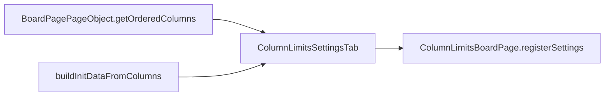
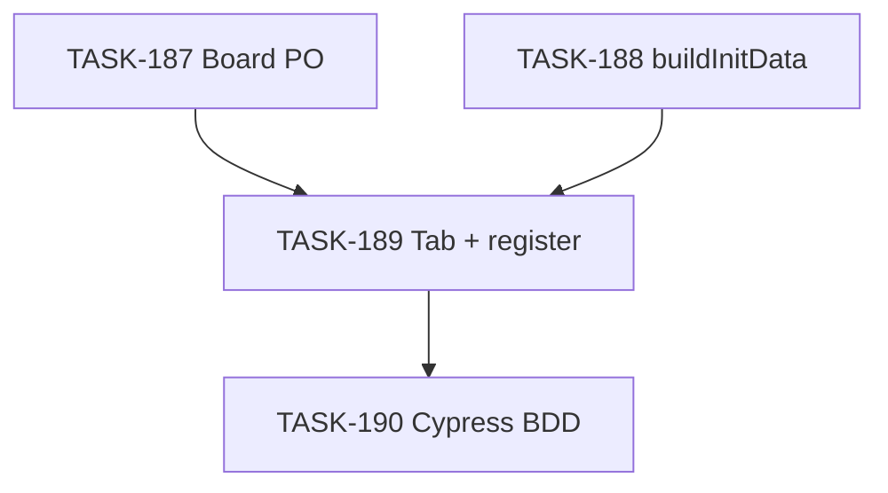

# EPIC-19: Column WIP Limits — таб на board page (Jira Helper)

**Status**: TODO
**Created**: 2026-04-06

---

## Цель

Перенести UI настроек CONWIP (column group WIP limits) из Board Settings в **новый таб** панели Jira Helper на agile board page, без изменения формата данных и runtime-поведения. Пользователь с `canEdit` настраивает те же группы и лимиты, что и в модалке, через `WIP_LIMITS_SETTINGS`; список колонок читается с DOM доски.

См. требования: [requirements.md](./requirements.md)

## Target Design

См. [target-design.md](./target-design.md)

## Архитектура

## Задачи

### Phase 1: Расширение IBoardPagePageObject (getOrderedColumns)

| # | Task | Описание | Status |
|---|------|----------|--------|
| 187 | [TASK-187](./TASK-187-board-page-get-ordered-columns.md) | Метод `getOrderedColumns()` в интерфейсе и реализации + тесты; мок в `BoardPage.mock.ts` | TODO |

### Phase 2: Утилита buildInitDataFromColumns + unit tests

| # | Task | Описание | Status |
|---|------|----------|--------|
| 188 | [TASK-188](./TASK-188-build-init-data-from-columns.md) | Чистая функция в `buildInitData.ts` + `buildInitData.test.ts` | TODO |

### Phase 3: Tab Container + регистрация в BoardPage

| # | Task | Описание | Status |
|---|------|----------|--------|
| 189 | [TASK-189](./TASK-189-column-limits-settings-tab-and-register.md) | `SettingsTab/`, `registerSettings` в `ColumnLimitsBoardPage`, `texts.tabTitle` | TODO |

### Phase 4: Тесты (BDD Cypress)

| # | Task | Описание | Status |
|---|------|----------|--------|
| 190 | [TASK-190](./TASK-190-column-wip-inline-cypress-bdd.md) | Cypress component/BDD по `column-wip-inline-*.feature` | TODO |

## Dependencies

**Параллельно можно выполнять:**

- [TASK-187](./TASK-187-board-page-get-ordered-columns.md) и [TASK-188](./TASK-188-build-init-data-from-columns.md)

**Последовательно:**

- После 187 и 188 → [TASK-189](./TASK-189-column-limits-settings-tab-and-register.md)
- После 189 → [TASK-190](./TASK-190-column-wip-inline-cypress-bdd.md)

## Acceptance Criteria

- [ ] На board page в панели Jira Helper есть таб для column WIP limits при `canEdit`; без прав таб не регистрируется (см. requirements FR-4).
- [ ] Функциональность формы эквивалентна модалке Board Settings; Save/Cancel и board property `WIP_LIMITS_SETTINGS` — как в requirements.
- [ ] Колонки для инициализации формы читаются с DOM доски через `getOrderedColumns()`.
- [ ] Все тесты проходят (`npm test`, Cypress по задаче 190).
- [ ] ESLint без ошибок.
