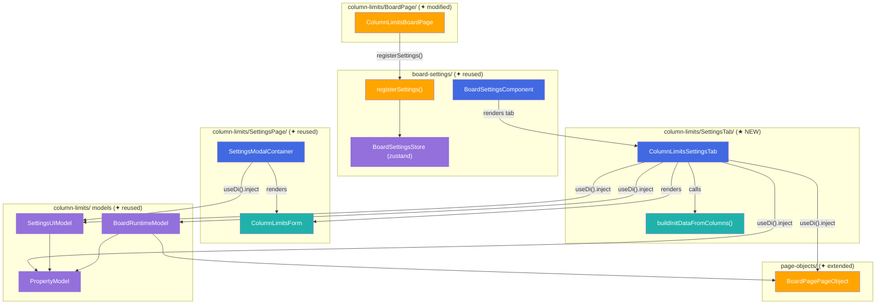
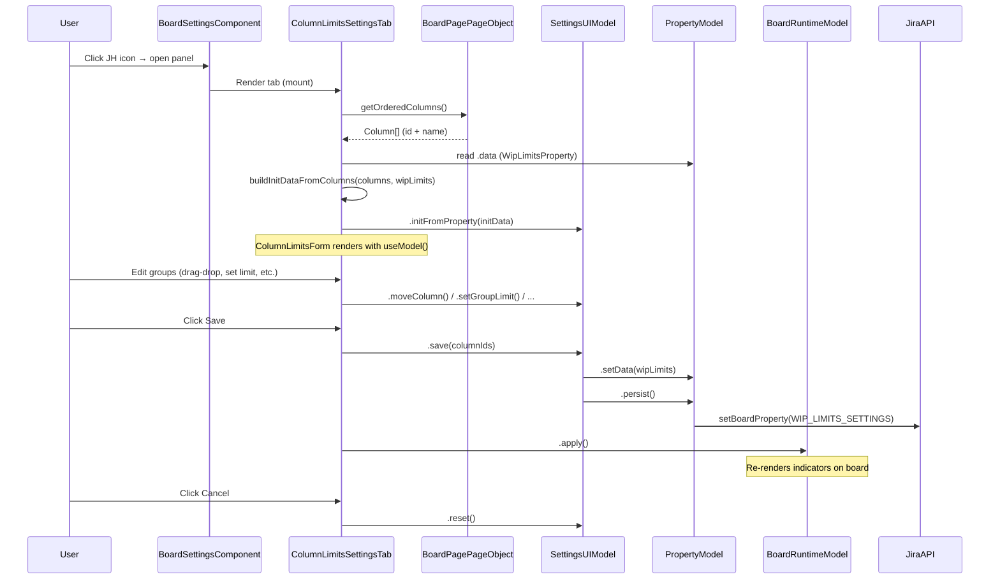
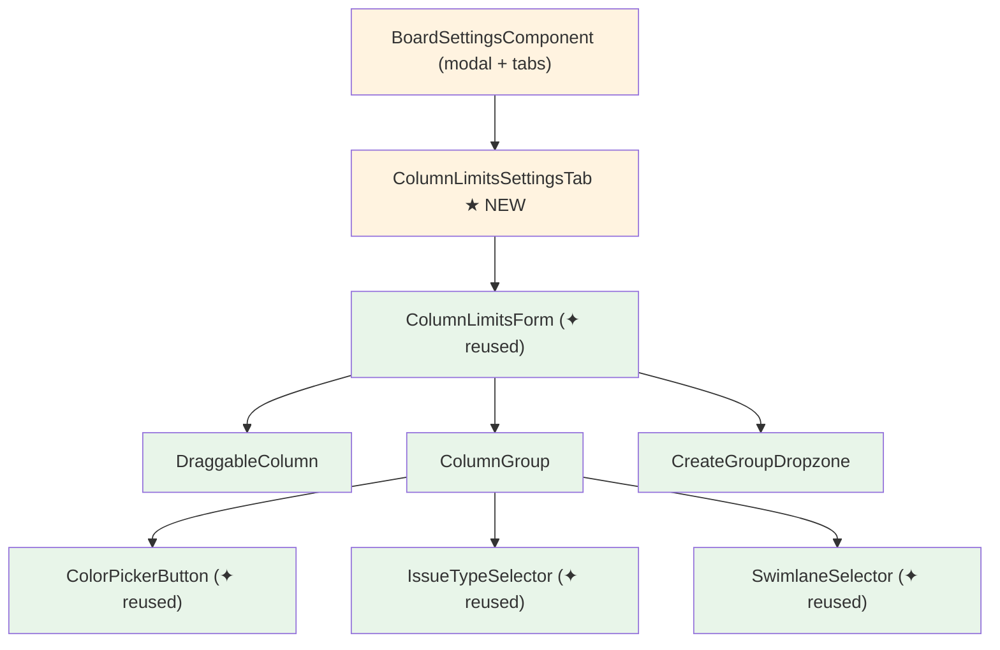

# Target Design: Column WIP Limits — Settings Tab on Board Page

Этот документ описывает целевую архитектуру для переноса UI настроек CONWIP из Board Settings в новый таб панели Jira Helper на board page. Код переиспользуется максимально — создаётся минимум новых файлов.

## Ключевые принципы

1. **Максимальное переиспользование** — `SettingsUIModel`, `PropertyModel`, `ColumnLimitsForm`, `ColorPickerButton` — все существующие сущности используются as-is. Новая логика — только для инициализации данных из board page DOM и для обёртки tab.
2. **Паттерн registerSettings** — таб регистрируется через `registerSettings()` в `ColumnLimitsBoardPage.apply()`, как делают `DiagnosticBoardPage`, `LocalSettingsBoardPage`, `SubTasksProgressBoardPage`.
3. **Колонки из BoardPagePageObject** — на settings page колонки читаются из DOM settings UI, на board page — из DOM доски через `IBoardPagePageObject`. Нужен новый метод `getOrderedColumns()`.
4. **Нет новых моделей** — `PropertyModel`, `SettingsUIModel`, `BoardRuntimeModel` уже зарегистрированы в `columnLimitsModule`. Tab-компонент получает их из DI.

> Общие архитектурные принципы — см. docs/architecture_guideline.md

## Architecture Diagram



## Data Flow



## Component Hierarchy



**Легенда**: оранжевый — Container (state + logic), зелёный — View (pure presentation).

## Target File Structure

```
src/column-limits/
├── types.ts                                    # ✦ reused, без изменений
├── tokens.ts                                   # ✦ reused, без изменений
├── module.ts                                   # ✦ reused, без изменений
│
├── property/
│   └── PropertyModel.ts                        # ✦ reused, без изменений
│
├── shared/
│   └── utils.ts                                # ✦ reused (findGroupByColumnId, mapColumnsToGroups, generateColorByFirstChars)
│
├── SettingsPage/
│   ├── index.ts                                # ✦ reused (Settings page PageModification)
│   ├── ColumnLimitsForm.tsx                    # ✦ reused, без изменений
│   ├── texts.ts                                # ✦ modified: добавлен tabTitle
│   ├── styles.module.css                       # ✦ reused, без изменений
│   ├── utils/
│   │   └── buildInitData.ts                    # ✦ modified: добавлена buildInitDataFromColumns()
│   ├── models/
│   │   └── SettingsUIModel.ts                  # ✦ reused, без изменений
│   └── components/
│       ├── SettingsButton/                     # ✦ reused, без изменений
│       ├── SettingsModal/                      # ✦ reused, без изменений
│       └── ColorPickerButton/                  # ✦ reused, без изменений
│
├── SettingsTab/                                # ★ NEW folder
│   ├── index.ts                                # ★ NEW: exports
│   └── ColumnLimitsSettingsTab.tsx              # ★ NEW: Container для tab в панели JH
│
├── BoardPage/
│   ├── index.ts                                # ✦ modified: добавлен registerSettings() + EditData расширен
│   ├── models/
│   │   ├── BoardRuntimeModel.ts                # ✦ reused, без изменений
│   │   └── types.ts                            # ✦ reused, без изменений
│   └── styles.module.css                       # ✦ reused, без изменений

src/page-objects/
│   └── BoardPage.tsx                           # ✦ modified: добавлен getOrderedColumns()
```

## Component Specifications

### 1. `ColumnLimitsSettingsTab` (Container, ★ NEW)

**Responsibility**: Board page tab container — инициализирует `SettingsUIModel` из данных board page, рендерит `ColumnLimitsForm` с Save/Cancel кнопками, после Save обновляет runtime-индикаторы на доске.

```typescript
// src/column-limits/SettingsTab/ColumnLimitsSettingsTab.tsx

export type ColumnLimitsSettingsTabProps = {
  swimlanes: Array<{ id: string; name: string }>;
};
```

DI-зависимости (через `useDi().inject()`):
- `settingsUIModelToken` — состояние формы
- `propertyModelToken` — данные property
- `boardRuntimeModelToken` — обновление доски после Save
- `boardPagePageObjectToken` — чтение колонок с доски

Логика:
- `useEffect` при mount → `boardPagePO.getOrderedColumns()` + `propertyModel.data` → `buildInitDataFromColumns()` → `settingsUIModel.initFromProperty()`
- Save → `settingsUIModel.save(columnIds)` → `boardRuntimeModel.apply()`
- Cancel → `settingsUIModel.reset()`
- Рендер: `ColumnLimitsForm` + `Button Save` + `Button Cancel`

### 2. `ColumnLimitsForm` (View, ✦ reused)

Без изменений. Уже принимает всё через props, не зависит от контекста страницы.

```typescript
// Существующий интерфейс — src/column-limits/SettingsPage/ColumnLimitsForm.tsx
export interface ColumnLimitsFormProps {
  withoutGroupColumns: Column[];
  groups: UIGroup[];
  issueTypeSelectorStates: Record<string, IssueTypeState>;
  swimlanes?: Array<{ id: string; name: string }>;
  onLimitChange: (groupId: string, limit: number) => void;
  onColorChange: (groupId: string, color: string) => void;
  onSwimlanesChange?: (groupId: string, selectedSwimlanes: Array<{ id: string; name: string }>) => void;
  onIssueTypesChange: (groupId: string, selectedTypes: string[], countAllTypes: boolean) => void;
  onColumnDragStart: (e: React.DragEvent, columnId: string, groupId: string) => void;
  onColumnDragEnd: (e: React.DragEvent) => void;
  onDrop: (e: React.DragEvent, targetGroupId: string) => void;
  onDragOver: (e: React.DragEvent) => void;
  onDragLeave: (e: React.DragEvent) => void;
  formId: string;
  allGroupsId: string;
  createGroupDropzoneId: string;
  formRefCallback?: (el: HTMLDivElement | null) => void;
}
```

### 3. `buildInitDataFromColumns()` (Pure Function, ★ NEW)

**Responsibility**: Builds `InitFromPropertyData` from an array of board page columns and existing WipLimitsProperty. Аналог `buildInitDataFromGroupMap()`, но работает с `Column[]` вместо `GroupMap` (без HTML-элементов).

```typescript
// src/column-limits/SettingsPage/utils/buildInitData.ts — дополнение к существующему файлу

import type { Column, WipLimitsProperty } from '../../types';
import type { InitFromPropertyData } from '../models/SettingsUIModel';

/**
 * Builds InitFromPropertyData from a plain Column[] array (no HTML elements needed).
 * Used by SettingsTab on the board page, where columns come from BoardPagePageObject.
 */
export function buildInitDataFromColumns(
  columns: Column[],
  wipLimits: WipLimitsProperty
): InitFromPropertyData;
```

### 4. `IBoardPagePageObject.getOrderedColumns()` (Extension, ✦ modified)

**Responsibility**: Returns ordered column data (id + name) from the board page header row.

```typescript
// src/page-objects/BoardPage.tsx — дополнение интерфейса

export interface IBoardPagePageObject {
  // ... existing methods ...

  /**
   * Ordered columns (id + display name) from the board header row.
   * Reads from column header elements: id from data-id, name from .ghx-column-title.
   */
  getOrderedColumns(): Array<{ id: string; name: string }>;
}
```

### 5. `ColumnLimitsBoardPage` (PageModification, ✦ modified)

**Responsibility**: Existing board page modification — дополняется вызовом `registerSettings()` для регистрации tab при наличии `canEdit`.

```typescript
// src/column-limits/BoardPage/index.ts — расширение EditData

interface EditData {
  canEdit?: boolean;
  rapidListConfig: {
    mappedColumns: Array<{
      id: string;
      isKanPlanColumn: boolean;
      max?: number;
    }>;
  };
  swimlanesConfig?: {
    swimlanes?: Array<{ id?: string; name: string }>;
  };
}
```

Добавляемая логика в `apply()`:
- Извлечь `canEdit` и `swimlanes` из `editData`
- Если `canEdit` — вызвать `registerSettings({ title, component })` с closure-компонентом, передающим `swimlanes` в `ColumnLimitsSettingsTab`

## State Changes

Новых моделей НЕТ. Все три уже зарегистрированы в `columnLimitsModule`:

| Model | Token | Изменения |
|-------|-------|-----------|
| `PropertyModel` | `propertyModelToken` | Без изменений |
| `SettingsUIModel` | `settingsUIModelToken` | Без изменений |
| `BoardRuntimeModel` | `boardRuntimeModelToken` | Без изменений |

Модуль `columnLimitsModule` (`module.ts`) и токены (`tokens.ts`) — без изменений.

## Migration Plan

### Phase 1: Расширение IBoardPagePageObject (TASK-A)

**Файлы**: `src/page-objects/BoardPage.tsx`, `src/page-objects/BoardPage.test.ts`

Добавить метод `getOrderedColumns()` в `IBoardPagePageObject` и реализацию в `BoardPagePageObject`.

Метод комбинирует `getOrderedColumnIds()` (уже есть) с чтением текста из `.ghx-column-title` для каждого column header element.

### Phase 2: Утилита buildInitDataFromColumns (TASK-B)

**Файлы**: `src/column-limits/SettingsPage/utils/buildInitData.ts`, `buildInitData.test.ts` (новый)

Добавить чистую функцию `buildInitDataFromColumns(columns, wipLimits)` рядом с существующей `buildInitDataFromGroupMap`.

Unit-тесты: маппинг колонок в группы, without-group колонки, issueTypeSelectorStates.

### Phase 3: Tab Container + регистрация (TASK-C)

**Новые файлы**:
- `src/column-limits/SettingsTab/ColumnLimitsSettingsTab.tsx`
- `src/column-limits/SettingsTab/index.ts`

**Модифицируемые файлы**:
- `src/column-limits/BoardPage/index.ts` — расширение `EditData`, добавление `registerSettings()` в `apply()`
- `src/column-limits/SettingsPage/texts.ts` — добавление `tabTitle`

### Phase 4: Тесты и stories (TASK-D)

- Unit-тесты на `ColumnLimitsSettingsTab` (`.test.tsx` или `.cy.tsx`)
- Storybook story для tab-варианта формы

---

## Полный код новых файлов

### `src/column-limits/SettingsTab/index.ts`

```typescript
export { ColumnLimitsSettingsTab } from './ColumnLimitsSettingsTab';
```

### `src/column-limits/SettingsTab/ColumnLimitsSettingsTab.tsx`

```typescript
import React, { useEffect, useRef, useCallback, useState } from 'react';
import { Button, Space } from 'antd';
import { useDi } from 'src/shared/diContext';
import { useGetTextsByLocale } from 'src/shared/texts';
import { settingsUIModelToken, propertyModelToken, boardRuntimeModelToken } from '../tokens';
import { boardPagePageObjectToken } from 'src/page-objects/BoardPage';
import { ColumnLimitsForm } from '../SettingsPage/ColumnLimitsForm';
import { buildInitDataFromColumns } from '../SettingsPage/utils/buildInitData';
import { WITHOUT_GROUP_ID } from '../types';
import type { Column } from '../types';
import type { SettingsUIModel } from '../SettingsPage/models/SettingsUIModel';
import type { BoardRuntimeModel } from '../BoardPage/models/BoardRuntimeModel';
import { COLUMN_LIMITS_TEXTS } from '../SettingsPage/texts';
import styles from '../SettingsPage/styles.module.css';

export type ColumnLimitsSettingsTabProps = {
  swimlanes: Array<{ id: string; name: string }>;
};

export const ColumnLimitsSettingsTab: React.FC<ColumnLimitsSettingsTabProps> = ({ swimlanes }) => {
  const texts = useGetTextsByLocale(COLUMN_LIMITS_TEXTS);
  const [isSaving, setIsSaving] = useState(false);
  const draggingRef = useRef<{ column: Column; groupId: string } | null>(null);

  const container = useDi();
  const { model: propertyModel } = container.inject(propertyModelToken);
  const { model, useModel } = container.inject(settingsUIModelToken);
  const { model: runtimeModel } = container.inject(boardRuntimeModelToken);
  const boardPagePO = container.inject(boardPagePageObjectToken);

  const settingsUi = model as SettingsUIModel;
  const snap = useModel();

  useEffect(() => {
    const columns = boardPagePO.getOrderedColumns();
    const wipLimits = propertyModel.data;
    const initData = buildInitDataFromColumns(columns, wipLimits);
    settingsUi.reset();
    settingsUi.initFromProperty(initData);
  }, []);

  const handleSave = async () => {
    setIsSaving(true);
    try {
      const columnIds = boardPagePO.getOrderedColumnIds();
      await settingsUi.save(columnIds);
      (runtimeModel as BoardRuntimeModel).apply();
    } finally {
      setIsSaving(false);
    }
  };

  const handleCancel = () => {
    settingsUi.reset();
    const columns = boardPagePO.getOrderedColumns();
    const wipLimits = propertyModel.data;
    const initData = buildInitDataFromColumns(columns, wipLimits);
    settingsUi.initFromProperty(initData);
  };

  const handleLimitChange = useCallback(
    (groupId: string, limit: number) => {
      settingsUi.setGroupLimit(groupId, limit);
    },
    [settingsUi]
  );

  const handleColorChange = useCallback(
    (groupId: string, color: string) => {
      settingsUi.setGroupColor(groupId, color);
    },
    [settingsUi]
  );

  const handleIssueTypesChange = useCallback(
    (groupId: string, selectedTypes: string[], countAllTypes: boolean) => {
      settingsUi.setIssueTypeState(groupId, {
        countAllTypes,
        projectKey: snap.issueTypeSelectorStates[groupId]?.projectKey ?? '',
        selectedTypes,
      });
    },
    [settingsUi, snap.issueTypeSelectorStates]
  );

  const handleSwimlanesChange = useCallback(
    (groupId: string, selectedSwimlanes: Array<{ id: string; name: string }>) => {
      settingsUi.setGroupSwimlanes(groupId, selectedSwimlanes);
    },
    [settingsUi]
  );

  const handleColumnDragStart = useCallback(
    (e: React.DragEvent, columnId: string, groupId: string) => {
      e.dataTransfer.effectAllowed = 'move';
      const column =
        groupId === WITHOUT_GROUP_ID
          ? snap.withoutGroupColumns.find(c => c.id === columnId)
          : snap.groups.find(g => g.id === groupId)?.columns.find(c => c.id === columnId);
      if (column) {
        draggingRef.current = { column, groupId };
      }
    },
    [snap.withoutGroupColumns, snap.groups]
  );

  const handleColumnDragEnd = useCallback(() => {
    draggingRef.current = null;
  }, []);

  const handleDrop = useCallback(
    (e: React.DragEvent, targetGroupId: string) => {
      e.preventDefault();
      e.stopPropagation();
      const dragged = draggingRef.current;
      if (!dragged) return;
      const { column, groupId: fromGroupId } = dragged;
      if (fromGroupId !== targetGroupId) {
        settingsUi.moveColumn(column, fromGroupId, targetGroupId);
      }
      draggingRef.current = null;
      const target = e.currentTarget as HTMLElement;
      target.classList.remove(styles.addGroupDropzoneActiveJH);
    },
    [settingsUi]
  );

  const handleDragOver = useCallback((e: React.DragEvent) => {
    e.preventDefault();
    e.stopPropagation();
    const target = e.currentTarget as HTMLElement;
    if (target.classList.contains('dropzone-jh')) {
      target.classList.add(styles.addGroupDropzoneActiveJH);
    }
  }, []);

  const handleDragLeave = useCallback((e: React.DragEvent) => {
    const target = e.currentTarget as HTMLElement;
    target.classList.remove(styles.addGroupDropzoneActiveJH);
  }, []);

  return (
    <div>
      <ColumnLimitsForm
        withoutGroupColumns={snap.withoutGroupColumns}
        groups={snap.groups}
        issueTypeSelectorStates={snap.issueTypeSelectorStates}
        swimlanes={swimlanes}
        onLimitChange={handleLimitChange}
        onColorChange={handleColorChange}
        onSwimlanesChange={handleSwimlanesChange}
        onIssueTypesChange={handleIssueTypesChange}
        onColumnDragStart={handleColumnDragStart}
        onColumnDragEnd={handleColumnDragEnd}
        onDrop={handleDrop}
        onDragOver={handleDragOver}
        onDragLeave={handleDragLeave}
        formId="jh-wip-limits-tab-form"
        allGroupsId="jh-tab-all-groups"
        createGroupDropzoneId="jh-tab-column-dropzone"
      />
      <Space style={{ marginTop: 16 }}>
        <Button type="primary" onClick={handleSave} loading={isSaving}>
          {texts.save}
        </Button>
        <Button onClick={handleCancel} disabled={isSaving}>
          {texts.cancel}
        </Button>
      </Space>
    </div>
  );
};
```

### `src/column-limits/SettingsPage/utils/buildInitData.ts` — добавление `buildInitDataFromColumns`

Новая функция добавляется в существующий файл рядом с `buildInitDataFromGroupMap`:

```typescript
import { findGroupByColumnId } from '../../shared/utils';

/**
 * Builds InitFromPropertyData from a plain Column[] array (no HTML elements needed).
 * Used by SettingsTab on the board page, where columns come from BoardPagePageObject.
 */
export function buildInitDataFromColumns(
  columns: Column[],
  wipLimits: WipLimitsProperty
): InitFromPropertyData {
  const withoutGroupColumns: Column[] = [];
  const groupColumnsMap: Record<string, Column[]> = {};

  columns.forEach(col => {
    const group = findGroupByColumnId(col.id, wipLimits);
    if (group.name) {
      if (!groupColumnsMap[group.name]) groupColumnsMap[group.name] = [];
      groupColumnsMap[group.name].push(col);
    } else {
      withoutGroupColumns.push(col);
    }
  });

  const groups: UIGroup[] = Object.entries(groupColumnsMap).map(([groupId, cols]) => {
    const wipLimit = wipLimits[groupId] ?? {};
    return {
      id: groupId,
      columns: cols,
      max: wipLimit.max,
      customHexColor: wipLimit.customHexColor,
      includedIssueTypes: wipLimit.includedIssueTypes,
      swimlanes: wipLimit.swimlanes,
    };
  });

  const issueTypeSelectorStates: Record<string, IssueTypeState> = {};
  groups.forEach(group => {
    const wipGroup = wipLimits[group.id];
    const includedIssueTypes = wipGroup?.includedIssueTypes ?? [];
    issueTypeSelectorStates[group.id] = {
      countAllTypes: !includedIssueTypes || includedIssueTypes.length === 0,
      projectKey: '',
      selectedTypes: includedIssueTypes,
    };
  });

  return { withoutGroupColumns, groups, issueTypeSelectorStates };
}
```

## Diff для модифицируемых файлов

### `src/page-objects/BoardPage.tsx`

Добавить метод `getOrderedColumns()` в интерфейс `IBoardPagePageObject` и реализацию:

```diff
  /** All swimlane IDs (`getSwimlanes().map(s => s.id)`). */
  getSwimlaneIds(): string[];

+ /**
+  * Ordered columns (id + display name) from the board header row.
+  * Combines getOrderedColumnIds() with column title text extraction.
+  */
+ getOrderedColumns(): Array<{ id: string; name: string }>;
+
  /**
   * Count issues in a column across swimlanes (excludes `.ghx-done` by default, like legacy column-limits).
   */
```

Реализация в объекте `BoardPagePageObject`:

```diff
  getSwimlaneIds(): string[] {
    return this.getSwimlanes().map(s => s.id);
  },

+ getOrderedColumns(): Array<{ id: string; name: string }> {
+   const ids = this.getOrderedColumnIds();
+   return ids.map(id => {
+     const headerEl = this.getColumnHeaderElement(id);
+     const titleEl = headerEl?.querySelector(this.selectors.columnTitle);
+     const name = titleEl?.textContent?.trim() ?? '';
+     return { id, name };
+   });
+ },
+
  getIssueCountInColumn(columnId: string, options?: ColumnIssueCountOptions): number {
```

### `src/column-limits/BoardPage/index.ts`

Расширить `EditData` и добавить `registerSettings()`:

```diff
+ import React from 'react';
+ import { registerSettings } from 'src/board-settings/actions/registerSettings';
+ import { ColumnLimitsSettingsTab } from '../SettingsTab';
+ import { useGetTextsByLocale } from 'src/shared/texts';
+ import { COLUMN_LIMITS_TEXTS } from '../SettingsPage/texts';

  interface EditData {
+   canEdit?: boolean;
    rapidListConfig: {
      mappedColumns: Array<{
        id: string;
        isKanPlanColumn: boolean;
        max?: number;
      }>;
    };
+   swimlanesConfig?: {
+     swimlanes?: Array<{ id?: string; name: string }>;
+   };
  }
```

В методе `apply()` после существующей логики:

```diff
    this.onDOMChange('#ghx-pool', () => {
      (boardRuntimeModel as BoardRuntimeModel).apply();
    });
+
+   const canEdit = (editData as EditData).canEdit;
+   if (canEdit) {
+     const rawSwimlanes = (editData as EditData).swimlanesConfig?.swimlanes ?? [];
+     const swimlanes = rawSwimlanes.map((swim, index) => ({
+       id: String(swim.id ?? swim.name ?? `swimlane-${index}`),
+       name: swim.name,
+     }));
+
+     const TabComponent = () => <ColumnLimitsSettingsTab swimlanes={swimlanes} />;
+
+     registerSettings({
+       title: 'Column WIP Limits',
+       component: TabComponent,
+     });
+   }
  }
```

### `src/column-limits/SettingsPage/texts.ts`

```diff
  settingsButton: {
    en: 'Column group WIP limits',
    ru: 'WIP-лимиты на группы колонок',
  },
+ tabTitle: {
+   en: 'Column WIP Limits',
+   ru: 'WIP-лимиты по колонкам',
+ },
  } as const satisfies Texts;
```

### `src/page-objects/BoardPage.mock.ts`

Добавить мок для нового метода:

```diff
+ getOrderedColumns: vi.fn(() => []),
```

## Benefits

1. **Минимум нового кода** — 2 новых файла (`ColumnLimitsSettingsTab.tsx`, `index.ts`), 1 новая функция (`buildInitDataFromColumns`), 3 модифицируемых файла.
2. **Полное переиспользование моделей** — `PropertyModel`, `SettingsUIModel`, `BoardRuntimeModel` — без изменений. DI-регистрация (`module.ts`, `tokens.ts`) — без изменений.
3. **Полное переиспользование UI** — `ColumnLimitsForm`, `ColorPickerButton`, `SwimlaneSelector`, `IssueTypeSelector` — все View-компоненты используются as-is.
4. **Совместимость** — tab и старая модалка работают параллельно, обе читают/пишут один и тот же board property.
5. **Следование паттерну registerSettings** — таб регистрируется точно так же, как другие фичи (Diagnostic, Local Settings, Sub-tasks Progress).
6. **Обновление доски после Save** — вызов `BoardRuntimeModel.apply()` обеспечивает мгновенное обновление индикаторов на доске без перезагрузки.
