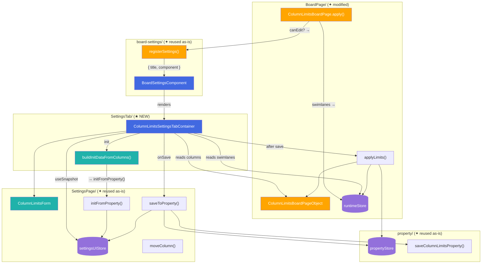
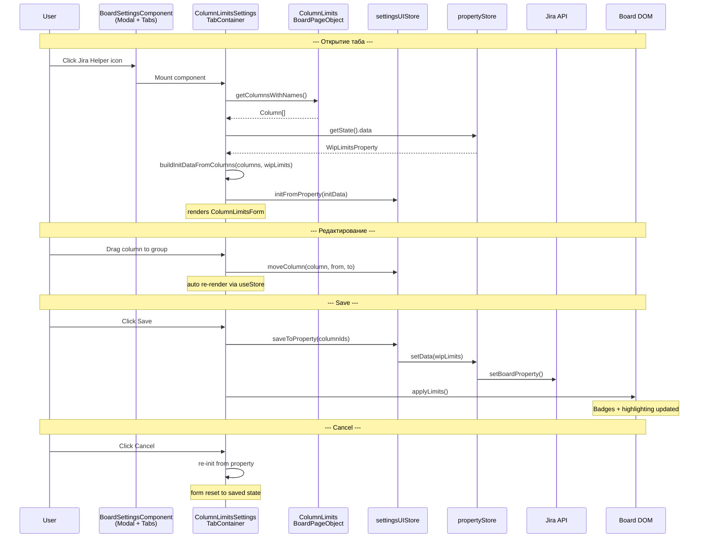
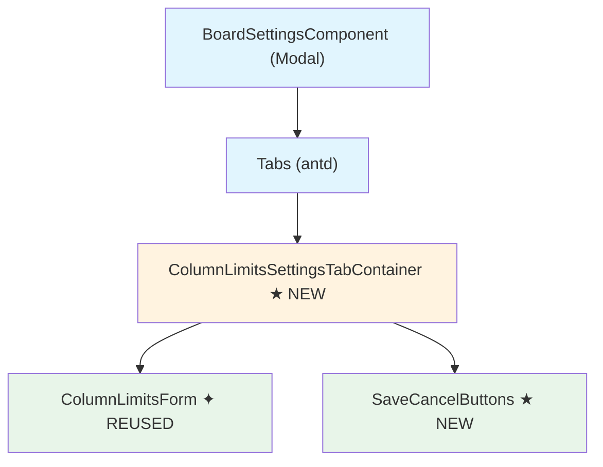

# Target Design: Column WIP Limits — Settings Tab on Board Page

Этот документ описывает целевую архитектуру для переноса UI настроек CONWIP (column-limits) из Board Settings в новый таб панели Jira Helper на board page.

**Тип**: перенос UI существующей фичи в новое место (альтернативная точка входа).

## Ключевые принципы

1. **Максимальное переиспользование** — `ColumnLimitsForm`, `settingsUIStore`, все actions (`initFromProperty`, `saveToProperty`, `moveColumn`), `propertyStore` — используются as-is, без изменений
2. **Минимальное расширение** — добавляется новый контейнер (`SettingsTabContainer`), чистая функция (`buildInitDataFromColumns`), метод на PageObject (`getColumnsWithNames`) и несколько полей в runtime store
3. **Колонки из DOM board page** — вместо DOM settings page; новый метод PageObject читает `Column[]` (id + name) из заголовков колонок доски
4. **После Save — refresh доски** — вызов `applyLimits()` обновляет badges и highlighting без перезагрузки

> Общие архитектурные принципы — см. `docs/architecture_guideline.md`

## Architecture Diagram



## Data Flow



## Component Hierarchy



Легенда:
- 🔵 Голубой (`#e1f5fe`) — PageModification / внешний каркас (не React)
- 🟠 Оранжевый (`#fff3e0`) — Container (useStore, логика)
- 🟢 Зелёный (`#e8f5e9`) — View (чистое отображение)

## Target File Structure

```
src/column-limits/
├── types.ts                                          # ✦ Reused as-is
├── shared/
│   └── utils.ts                                      # ✦ Reused as-is
│
├── property/
│   ├── store.ts                                      # ✦ Reused as-is
│   ├── interface.ts                                  # ✦ Reused as-is
│   ├── index.ts                                      # ✦ Reused as-is
│   └── actions/
│       ├── loadProperty.ts                           # ✦ Reused as-is
│       └── saveProperty.ts                           # ✦ Reused as-is
│
├── SettingsPage/
│   ├── ColumnLimitsForm.tsx                          # ✦ Reused as-is (View)
│   ├── styles.module.css                             # ✦ Reused as-is
│   ├── texts.ts                                      # ✦ Modified: add tabTitle
│   ├── stores/
│   │   ├── settingsUIStore.ts                        # ✦ Reused as-is
│   │   └── settingsUIStore.types.ts                  # ✦ Reused as-is
│   ├── actions/
│   │   ├── initFromProperty.ts                       # ✦ Reused as-is
│   │   ├── saveToProperty.ts                         # ✦ Reused as-is
│   │   ├── moveColumn.ts                             # ✦ Reused as-is
│   │   └── index.ts                                  # ✦ Reused as-is
│   ├── utils/
│   │   └── buildInitData.ts                          # ✦ Reused as-is (for SettingsPage)
│   └── components/                                   # ✦ Reused as-is
│       └── ...
│
├── SettingsTab/                                      # ★ NEW directory
│   ├── ColumnLimitsSettingsTabContainer.tsx           # ★ NEW: Container for board page tab
│   └── utils/
│       ├── buildInitDataFromColumns.ts               # ★ NEW: Pure function — Column[] + WipLimits → InitData
│       └── buildInitDataFromColumns.test.ts          # ★ NEW: Unit tests
│
└── BoardPage/
    ├── index.ts                                      # ✦ Modified: register settings tab, store swimlanes
    ├── pageObject/
    │   ├── IColumnLimitsBoardPageObject.ts            # ✦ Modified: add getColumnsWithNames()
    │   ├── ColumnLimitsBoardPageObject.ts             # ✦ Modified: implement getColumnsWithNames()
    │   ├── columnLimitsBoardPageObjectToken.ts        # ✦ Reused as-is
    │   └── index.ts                                  # ✦ Reused as-is
    ├── stores/
    │   ├── runtimeStore.types.ts                     # ✦ Modified: add boardSwimlanes
    │   └── runtimeStore.ts                           # ✦ Modified: add setBoardSwimlanes action
    └── actions/                                      # ✦ Reused as-is
        └── ...
```

## Component Specifications

### 1. `ColumnLimitsSettingsTabContainer` (★ NEW)

**Responsibility**: Container для вкладки настроек column WIP limits в панели Jira Helper на board page. Инициализирует settingsUIStore из текущего состояния доски, рендерит ColumnLimitsForm с кнопками Save/Cancel, вызывает applyLimits() после сохранения.

```typescript
/**
 * Registered via registerSettings({ title, component }).
 * Renders inside BoardSettingsComponent modal → Tabs.TabPane.
 * No props — all data from stores and DI.
 */
export const ColumnLimitsSettingsTabContainer: React.FC = () => { /* ... */ };
```

Внутренняя логика (НЕ интерфейс, а описание ответственности):
- На mount: читает колонки через `pageObject.getColumnsWithNames()`, wipLimits из `propertyStore`, swimlanes из `runtimeStore` → `buildInitDataFromColumns()` → `initFromProperty()`
- Подписывается на `settingsUIStore` (withoutGroupColumns, groups, issueTypeSelectorStates)
- Обрабатывает drag-and-drop через `draggingRef` + `moveColumn()`
- Вызывает `settingsUIStore.actions` для setGroupLimit, setGroupColor, setGroupSwimlanes, setIssueTypeState
- Save: `saveToProperty(columnIds)` → `applyLimits()`
- Cancel: re-init from property (reset + buildInitDataFromColumns + initFromProperty)

### 2. `buildInitDataFromColumns()` (★ NEW)

**Responsibility**: Чистая функция — строит `InitFromPropertyData` из массива `Column[]` и `WipLimitsProperty`, без обращения к DOM.

```typescript
import type { Column, WipLimitsProperty, UIGroup, IssueTypeState } from '../../types';
import type { InitFromPropertyData } from '../../SettingsPage/actions/initFromProperty';

/**
 * Builds init data for settingsUIStore from board columns and wipLimits property.
 *
 * Unlike buildInitDataFromGroupMap (which works with DOM elements from settings page),
 * this function takes already resolved Column[] from board page DOM.
 *
 * @param columns - All board columns with id and name (from BoardPageObject)
 * @param wipLimits - Current WipLimitsProperty from property store
 * @returns Data ready for initFromProperty()
 *
 * @example
 * ```ts
 * const columns = pageObject.getColumnsWithNames();
 * const wipLimits = useColumnLimitsPropertyStore.getState().data;
 * const initData = buildInitDataFromColumns(columns, wipLimits);
 * initFromProperty(initData);
 * ```
 */
export function buildInitDataFromColumns(
  columns: Column[],
  wipLimits: WipLimitsProperty
): InitFromPropertyData;
```

### 3. `IColumnLimitsBoardPageObject.getColumnsWithNames()` (★ NEW method)

**Responsibility**: Читает id и name колонок из заголовков board page DOM. Возвращает `Column[]`.

```typescript
export interface IColumnLimitsBoardPageObject {
  // ... existing methods ...

  /**
   * Get columns with their display names from the board page header.
   * Reads from column header DOM elements.
   *
   * @returns Array of Column objects with id and name
   */
  getColumnsWithNames(): Column[];
}
```

### 4. `RuntimeData` extensions (★ NEW fields)

**Responsibility**: Расширение runtime store для хранения swimlanes и canEdit, загруженных BoardPage modification.

```typescript
export type RuntimeData = {
  groupStats: GroupStats[];
  cssNotIssueSubTask: string;
  /** Board swimlanes from getBoardEditData(), stored for settings tab */
  boardSwimlanes: Array<{ id: string; name: string }>;
};

export type RuntimeActions = {
  setGroupStats: (stats: GroupStats[]) => void;
  setCssNotIssueSubTask: (css: string) => void;
  /** Store swimlanes extracted from board edit data */
  setBoardSwimlanes: (swimlanes: Array<{ id: string; name: string }>) => void;
  reset: () => void;
};
```

### 5. `COLUMN_LIMITS_TEXTS` extension (★ NEW entry)

```typescript
export const COLUMN_LIMITS_TEXTS = {
  // ... existing entries ...

  /** Tab title in Jira Helper panel on board page */
  tabTitle: {
    en: 'Column WIP Limits',
    ru: 'WIP-лимиты колонок',
  },
} as const satisfies Texts;
```

### 6. `ColumnLimitsBoardPage` changes (✦ MODIFIED)

**Responsibility**: Расширение `apply()` — условная регистрация settings tab и сохранение swimlanes в runtime store.

```typescript
interface EditData {
  canEdit?: boolean;
  rapidListConfig: {
    mappedColumns: Array<{
      id: string;
      isKanPlanColumn: boolean;
      max?: number;
    }>;
  };
  swimlanesConfig?: {
    swimlanes?: Array<{ id?: string; name: string }>;
  };
}
```

Изменения в `apply()`:
1. Извлечь `canEdit` из editData
2. Извлечь swimlanes из editData → `actions.setBoardSwimlanes()`
3. Если `canEdit` → `registerSettings({ title, component: ColumnLimitsSettingsTabContainer })`

### 7. `ColumnLimitsForm` (✦ REUSED as-is)

**Responsibility**: View-компонент формы настройки групп колонок. Drag-and-drop колонок, ввод лимитов, выбор swimlanes/issue types/цвета.

Props interface — без изменений:

```typescript
export interface ColumnLimitsFormProps {
  withoutGroupColumns: Column[];
  groups: UIGroup[];
  issueTypeSelectorStates: Record<string, IssueTypeState>;
  swimlanes?: Array<{ id: string; name: string }>;
  onLimitChange: (groupId: string, limit: number) => void;
  onColorChange: (groupId: string, color: string) => void;
  onSwimlanesChange?: (groupId: string, selectedSwimlanes: Array<{ id: string; name: string }>) => void;
  onIssueTypesChange: (groupId: string, selectedTypes: string[], countAllTypes: boolean) => void;
  onColumnDragStart: (e: React.DragEvent, columnId: string, groupId: string) => void;
  onColumnDragEnd: (e: React.DragEvent) => void;
  onDrop: (e: React.DragEvent, targetGroupId: string) => void;
  onDragOver: (e: React.DragEvent) => void;
  onDragLeave: (e: React.DragEvent) => void;
  formId: string;
  allGroupsId: string;
  createGroupDropzoneId: string;
  formRefCallback?: (el: HTMLDivElement | null) => void;
}
```

## State Changes

### settingsUIStore (✦ Reused as-is)

Zustand store. Без изменений.

```typescript
export interface SettingsUIStoreState {
  data: SettingsUIData;
  state: 'initial' | 'loaded';
  actions: { /* see settingsUIStore.types.ts */ };
}
```

### propertyStore (✦ Reused as-is)

Zustand store. Без изменений.

```typescript
export interface ColumnLimitsPropertyStoreState {
  data: WipLimitsProperty;
  state: 'initial' | 'loading' | 'loaded';
  actions: { setData, setState, reset };
}
```

### runtimeStore (✦ Modified)

Zustand store. Добавлено поле `boardSwimlanes` и action `setBoardSwimlanes`.

```typescript
// runtimeStore.types.ts — ПОСЛЕ изменений
export type RuntimeData = {
  groupStats: GroupStats[];
  cssNotIssueSubTask: string;
  boardSwimlanes: Array<{ id: string; name: string }>;   // ★ NEW
};

export type RuntimeActions = {
  setGroupStats: (stats: GroupStats[]) => void;
  setCssNotIssueSubTask: (css: string) => void;
  setBoardSwimlanes: (swimlanes: Array<{ id: string; name: string }>) => void;  // ★ NEW
  reset: () => void;
};

export const getInitialData = (): RuntimeData => ({
  groupStats: [],
  cssNotIssueSubTask: '',
  boardSwimlanes: [],  // ★ NEW
});
```

## Полный код новых файлов

### `src/column-limits/SettingsTab/utils/buildInitDataFromColumns.ts`

```typescript
import type { Column, WipLimitsProperty, UIGroup, IssueTypeState } from '../../types';
import type { InitFromPropertyData } from '../../SettingsPage/actions/initFromProperty';

/**
 * Builds init data for settingsUIStore from board columns and wipLimits property.
 *
 * Unlike buildInitDataFromGroupMap (SettingsPage), this works with resolved
 * Column[] from board page DOM — no HTMLElement dependency.
 *
 * @param columns - Board columns with id and name
 * @param wipLimits - WipLimitsProperty from property store
 */
export function buildInitDataFromColumns(
  columns: Column[],
  wipLimits: WipLimitsProperty
): InitFromPropertyData {
  const assignedColumnIds = new Set<string>();
  Object.values(wipLimits).forEach(group => {
    group.columns?.forEach(id => assignedColumnIds.add(id));
  });

  const withoutGroupColumns: Column[] = columns.filter(c => !assignedColumnIds.has(c.id));

  const groups: UIGroup[] = Object.entries(wipLimits).map(([groupId, groupData]) => ({
    id: groupId,
    columns: (groupData.columns ?? [])
      .map(id => columns.find(c => c.id === id))
      .filter((c): c is Column => c != null),
    max: groupData.max,
    customHexColor: groupData.customHexColor,
    includedIssueTypes: groupData.includedIssueTypes,
    swimlanes: groupData.swimlanes,
  }));

  const issueTypeSelectorStates: Record<string, IssueTypeState> = {};
  Object.entries(wipLimits).forEach(([groupId, group]) => {
    const includedIssueTypes = group.includedIssueTypes ?? [];
    issueTypeSelectorStates[groupId] = {
      countAllTypes: !includedIssueTypes || includedIssueTypes.length === 0,
      projectKey: '',
      selectedTypes: includedIssueTypes,
    };
  });

  return { withoutGroupColumns, groups, issueTypeSelectorStates };
}
```

### `src/column-limits/SettingsTab/ColumnLimitsSettingsTabContainer.tsx`

```typescript
import React, { useEffect, useState, useRef, useCallback } from 'react';
import { Button, Space, message } from 'antd';
import { useGetTextsByLocale } from 'src/shared/texts';
import { useDi } from 'src/shared/diContext';
import { ColumnLimitsForm } from '../SettingsPage/ColumnLimitsForm';
import { useColumnLimitsSettingsUIStore } from '../SettingsPage/stores/settingsUIStore';
import { initFromProperty, saveToProperty, moveColumn } from '../SettingsPage/actions';
import { useColumnLimitsPropertyStore } from '../property/store';
import { useColumnLimitsRuntimeStore } from '../BoardPage/stores';
import { columnLimitsBoardPageObjectToken } from '../BoardPage/pageObject';
import { applyLimits } from '../BoardPage/actions';
import { buildInitDataFromColumns } from './utils/buildInitDataFromColumns';
import { WITHOUT_GROUP_ID } from '../types';
import { COLUMN_LIMITS_TEXTS } from '../SettingsPage/texts';
import styles from '../SettingsPage/styles.module.css';
import type { Column } from '../types';

function useInitSettingsTab() {
  const di = useDi();

  return useCallback(() => {
    const pageObject = di.inject(columnLimitsBoardPageObjectToken);
    const columns = pageObject.getColumnsWithNames();
    const wipLimits = useColumnLimitsPropertyStore.getState().data;

    const initData = buildInitDataFromColumns(columns, wipLimits);
    useColumnLimitsSettingsUIStore.getState().actions.reset();
    initFromProperty(initData);

    return columns;
  }, [di]);
}

export const ColumnLimitsSettingsTabContainer: React.FC = () => {
  const texts = useGetTextsByLocale(COLUMN_LIMITS_TEXTS);
  const [isSaving, setIsSaving] = useState(false);
  const columnsRef = useRef<Column[]>([]);
  const draggingRef = useRef<{ column: Column; groupId: string } | null>(null);
  const initTab = useInitSettingsTab();

  const withoutGroupColumns = useColumnLimitsSettingsUIStore(s => s.data.withoutGroupColumns);
  const groups = useColumnLimitsSettingsUIStore(s => s.data.groups);
  const issueTypeSelectorStates = useColumnLimitsSettingsUIStore(s => s.data.issueTypeSelectorStates);
  const actions = useColumnLimitsSettingsUIStore(s => s.actions);
  const boardSwimlanes = useColumnLimitsRuntimeStore(s => s.data.boardSwimlanes);

  useEffect(() => {
    columnsRef.current = initTab();
  }, [initTab]);

  const handleSave = async () => {
    setIsSaving(true);
    try {
      const columnIds = columnsRef.current.map(c => c.id);
      await saveToProperty(columnIds);
      applyLimits();
      message.success(texts.save);
    } finally {
      setIsSaving(false);
    }
  };

  const handleCancel = () => {
    columnsRef.current = initTab();
  };

  const handleLimitChange = useCallback(
    (groupId: string, limit: number) => actions.setGroupLimit(groupId, limit),
    [actions]
  );

  const handleColorChange = useCallback(
    (groupId: string, color: string) => actions.setGroupColor(groupId, color),
    [actions]
  );

  const handleIssueTypesChange = useCallback(
    (groupId: string, selectedTypes: string[], countAllTypes: boolean) => {
      actions.setIssueTypeState(groupId, {
        countAllTypes,
        projectKey: issueTypeSelectorStates[groupId]?.projectKey ?? '',
        selectedTypes,
      });
    },
    [actions, issueTypeSelectorStates]
  );

  const handleSwimlanesChange = useCallback(
    (groupId: string, selectedSwimlanes: Array<{ id: string; name: string }>) => {
      actions.setGroupSwimlanes(groupId, selectedSwimlanes);
    },
    [actions]
  );

  const handleColumnDragStart = useCallback(
    (e: React.DragEvent, columnId: string, groupId: string) => {
      e.dataTransfer.effectAllowed = 'move';
      const column =
        groupId === WITHOUT_GROUP_ID
          ? withoutGroupColumns.find(c => c.id === columnId)
          : groups.find(g => g.id === groupId)?.columns.find(c => c.id === columnId);
      if (column) {
        draggingRef.current = { column, groupId };
      }
    },
    [withoutGroupColumns, groups]
  );

  const handleColumnDragEnd = useCallback(() => {
    draggingRef.current = null;
  }, []);

  const handleDrop = useCallback((e: React.DragEvent, targetGroupId: string) => {
    e.preventDefault();
    e.stopPropagation();
    const dragged = draggingRef.current;
    if (!dragged) return;
    const { column, groupId: fromGroupId } = dragged;
    if (fromGroupId !== targetGroupId) {
      moveColumn(column, fromGroupId, targetGroupId);
    }
    draggingRef.current = null;
    const target = e.currentTarget as HTMLElement;
    target.classList.remove(styles.addGroupDropzoneActiveJH);
  }, []);

  const handleDragOver = useCallback((e: React.DragEvent) => {
    e.preventDefault();
    e.stopPropagation();
    const target = e.currentTarget as HTMLElement;
    if (target.classList.contains('dropzone-jh')) {
      target.classList.add(styles.addGroupDropzoneActiveJH);
    }
  }, []);

  const handleDragLeave = useCallback((e: React.DragEvent) => {
    const target = e.currentTarget as HTMLElement;
    target.classList.remove(styles.addGroupDropzoneActiveJH);
  }, []);

  return (
    <div style={{ padding: '16px' }}>
      <ColumnLimitsForm
        withoutGroupColumns={withoutGroupColumns}
        groups={groups}
        issueTypeSelectorStates={issueTypeSelectorStates}
        swimlanes={boardSwimlanes}
        onLimitChange={handleLimitChange}
        onColorChange={handleColorChange}
        onSwimlanesChange={handleSwimlanesChange}
        onIssueTypesChange={handleIssueTypesChange}
        onColumnDragStart={handleColumnDragStart}
        onColumnDragEnd={handleColumnDragEnd}
        onDrop={handleDrop}
        onDragOver={handleDragOver}
        onDragLeave={handleDragLeave}
        formId="jh-wip-limits-tab-form"
        allGroupsId="jh-tab-all-groups"
        createGroupDropzoneId="jh-tab-column-dropzone"
      />
      <Space style={{ marginTop: 16 }}>
        <Button type="primary" onClick={handleSave} loading={isSaving}>
          {texts.save}
        </Button>
        <Button onClick={handleCancel} disabled={isSaving}>
          {texts.cancel}
        </Button>
      </Space>
    </div>
  );
};
```

## Модификации существующих файлов

### `src/column-limits/BoardPage/index.ts` — diff

```diff
 import { Token } from 'dioma';
 import { PageModification } from '../../shared/PageModification';
 import { BOARD_PROPERTIES } from '../../shared/constants';
 import { useColumnLimitsPropertyStore } from '../property';
 import { useColumnLimitsRuntimeStore } from './stores';
 import { applyLimits } from './actions';
 import { columnLimitsBoardPageObjectToken, registerColumnLimitsBoardPageObjectInDI } from './pageObject';
+import { registerSettings } from 'src/board-settings/actions/registerSettings';
+import { ColumnLimitsSettingsTabContainer } from '../SettingsTab/ColumnLimitsSettingsTabContainer';
+import { COLUMN_LIMITS_TEXTS } from '../SettingsPage/texts';
+import { useGetTextByLocale } from 'src/shared/texts';
 
 interface EditData {
+  canEdit?: boolean;
   rapidListConfig: {
     mappedColumns: Array<{
       id: string;
       isKanPlanColumn: boolean;
       max?: number;
     }>;
   };
+  swimlanesConfig?: {
+    swimlanes?: Array<{ id?: string; name: string }>;
+  };
 }

 // ... (class definition unchanged until apply())

   apply(data: [EditData?, BoardGroup?]): void {
     if (!data) return;
     const [editData = { rapidListConfig: { mappedColumns: [] } }, boardGroups = {}] = data;
-    if (Object.keys(boardGroups).length === 0) return;
 
     // Register PageObject in DI
     try {
       this.container.inject(columnLimitsBoardPageObjectToken);
     } catch {
       registerColumnLimitsBoardPageObjectInDI(this.container);
     }
 
+    // Extract and store swimlanes for settings tab
+    const rawSwimlanes = editData.swimlanesConfig?.swimlanes ?? [];
+    const boardSwimlanes = rawSwimlanes.map((swim, index) => ({
+      id: String(swim.id ?? swim.name ?? `swimlane-${index}`),
+      name: swim.name,
+    }));
+
     // Initialize property store with loaded data
     const propertyStore = useColumnLimitsPropertyStore.getState();
     propertyStore.actions.setData(boardGroups);
 
     // Initialize runtime store
     const { actions } = useColumnLimitsRuntimeStore.getState();
     const cssNotIssueSubTask = this.getCssSelectorNotIssueSubTask(editData);
     actions.setCssNotIssueSubTask(cssNotIssueSubTask);
+    actions.setBoardSwimlanes(boardSwimlanes);
 
+    // Register settings tab (only if user can edit board)
+    if (editData.canEdit) {
+      registerSettings({
+        title: COLUMN_LIMITS_TEXTS.tabTitle.en,
+        component: ColumnLimitsSettingsTabContainer,
+      });
+    }
+
+    if (Object.keys(boardGroups).length === 0) return;
+
     // Adjust header padding for Jira v8
     // ... (rest unchanged)
```

### `src/column-limits/BoardPage/pageObject/IColumnLimitsBoardPageObject.ts` — diff

```diff
+import type { Column } from '../../types';
+
 export interface IColumnLimitsBoardPageObject {
   // ... existing methods ...
 
+  /**
+   * Get columns with their display names from board page header.
+   * @returns Array of Column objects (id + name) in display order
+   */
+  getColumnsWithNames(): Column[];
 }
```

### `src/column-limits/BoardPage/pageObject/ColumnLimitsBoardPageObject.ts` — diff

```diff
+import type { Column } from '../../types';
+
 export class ColumnLimitsBoardPageObject implements IColumnLimitsBoardPageObject {
   // ... existing methods ...
 
+  getColumnsWithNames(): Column[] {
+    const columnIds = this.getOrderedColumnIds();
+    return columnIds
+      .map(id => {
+        const el =
+          document.querySelector<HTMLElement>(
+            `.ghx-column-header-group .ghx-column[data-id="${id}"]`
+          ) ??
+          document.querySelector<HTMLElement>(
+            `ul.ghx-columns .ghx-column[data-id="${id}"]`
+          );
+
+        const name = el?.querySelector('.ghx-column-title, h2')?.textContent?.trim() ?? '';
+        return { id, name };
+      })
+      .filter(c => c.id);
+  }
 }
```

### `src/column-limits/BoardPage/stores/runtimeStore.types.ts` — diff

```diff
 export type RuntimeData = {
   groupStats: GroupStats[];
   cssNotIssueSubTask: string;
+  boardSwimlanes: Array<{ id: string; name: string }>;
 };

 export type RuntimeActions = {
   setGroupStats: (stats: GroupStats[]) => void;
   setCssNotIssueSubTask: (css: string) => void;
+  setBoardSwimlanes: (swimlanes: Array<{ id: string; name: string }>) => void;
   reset: () => void;
 };

 export const getInitialData = (): RuntimeData => ({
   groupStats: [],
   cssNotIssueSubTask: '',
+  boardSwimlanes: [],
 });
```

### `src/column-limits/BoardPage/stores/runtimeStore.ts` — diff

```diff
 export const useColumnLimitsRuntimeStore = create<RuntimeStoreState>()(set => ({
   data: getInitialData(),
   actions: {
     setGroupStats: stats => set(produce(state => { state.data.groupStats = stats; })),
     setCssNotIssueSubTask: css => set(produce(state => { state.data.cssNotIssueSubTask = css; })),
+    setBoardSwimlanes: swimlanes => set(produce(state => { state.data.boardSwimlanes = swimlanes; })),
     reset: () => set({ data: getInitialData() }),
   },
 }));
```

### `src/column-limits/SettingsPage/texts.ts` — diff

```diff
 export const COLUMN_LIMITS_TEXTS = {
   // ... existing entries ...
+
+  tabTitle: {
+    en: 'Column WIP Limits',
+    ru: 'WIP-лимиты колонок',
+  },
 } as const satisfies Texts;
```

## Migration Plan

### Phase 1: Infrastructure (TASK-1)

**Цель**: подготовить stores и page object для settings tab.

1. Добавить `boardSwimlanes` в `runtimeStore.types.ts`
2. Добавить `setBoardSwimlanes` в `runtimeStore.ts`
3. Добавить `getColumnsWithNames()` в `IColumnLimitsBoardPageObject` и `ColumnLimitsBoardPageObject`
4. Написать unit-тесты на `getColumnsWithNames()` и новые runtime store fields
5. Добавить `tabTitle` в `COLUMN_LIMITS_TEXTS`

**Результат**: существующая функциональность не затронута, новые методы/поля доступны.

### Phase 2: Core logic (TASK-2)

**Цель**: реализовать чистую функцию и контейнер.

1. Создать `buildInitDataFromColumns.ts` с unit-тестами
2. Создать `ColumnLimitsSettingsTabContainer.tsx`

**Результат**: компонент готов, но ещё не зарегистрирован.

### Phase 3: Integration (TASK-3)

**Цель**: подключить settings tab к board page.

1. Модифицировать `ColumnLimitsBoardPage.apply()`:
   - Извлечь swimlanes → `setBoardSwimlanes()`
   - Проверить `canEdit` → `registerSettings()`
2. Перенести `if (Object.keys(boardGroups).length === 0) return;` ПОСЛЕ регистрации таба

**Результат**: таб доступен на board page. Полная функциональность: создание/редактирование/удаление групп, Save/Cancel, applyLimits после сохранения.

### Phase 4: Tests (TASK-4)

**Цель**: BDD-тесты и Storybook.

1. Cypress component test: открытие таба, создание группы, Save/Cancel
2. Storybook story для ColumnLimitsSettingsTabContainer (если нужно)

## Benefits

1. **Удобство пользователя** — настройка лимитов без ухода с доски
2. **Минимум нового кода** — переиспользуются ColumnLimitsForm, settingsUIStore, все actions, propertyStore
3. **Консистентность** — тот же паттерн, что у других фич с settings tab (sub-tasks-progress, diagnostic, local-settings)
4. **Обратная совместимость** — старая модалка в Board Settings продолжает работать параллельно
5. **Тестируемость** — `buildInitDataFromColumns` — чистая функция; контейнер использует DI
