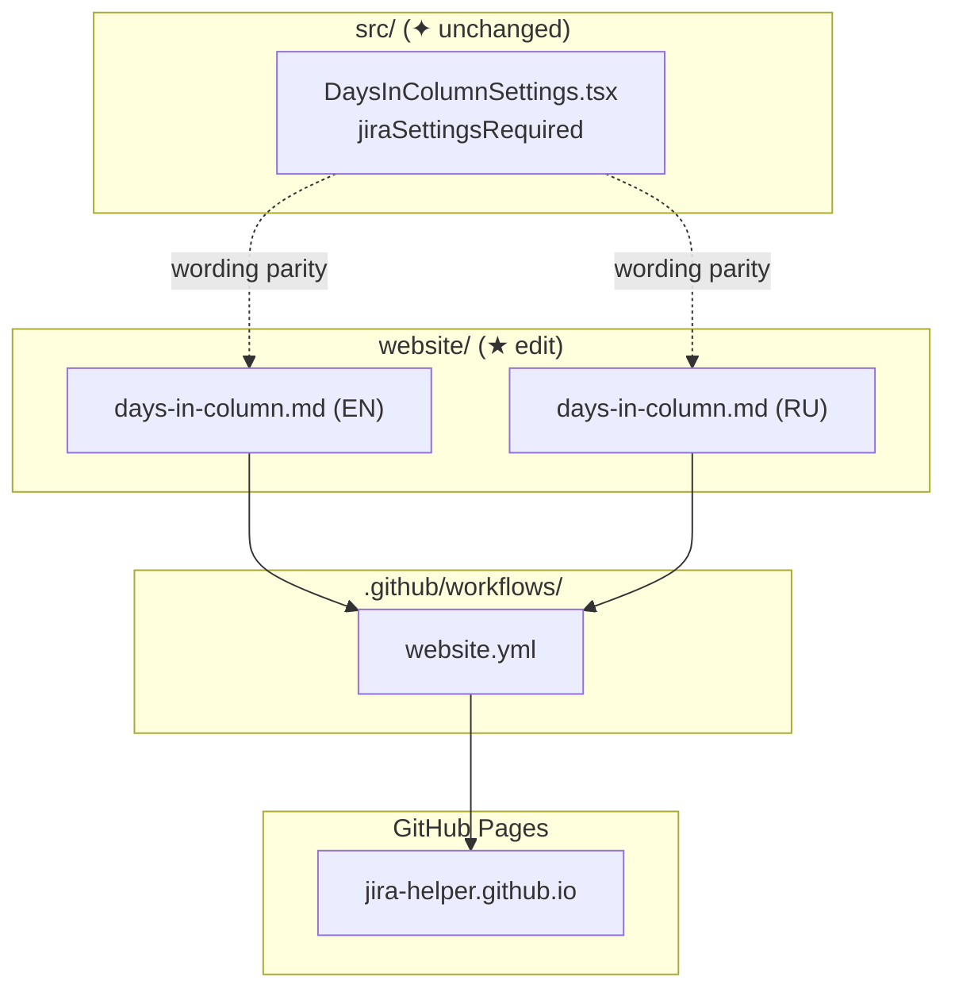
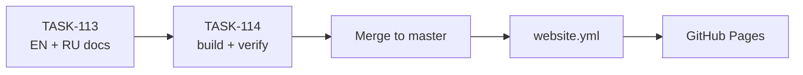

# EPIC-8: Days in Column — Jira prerequisite в документации

**Status**: TODO
**Created**: 2026-08-04

---

## Цель

Фича «Days in Column» работает только при включённой настройке Jira «Show days in column» / «Показывать дни в колонке». Alert в UI расширения уже предупреждает об этом — **UI не меняем**. Проблема: в user-facing документации prerequisite не выделен явно, пользователь может включить бейдж в jira-helper и не понять, почему он не работает.

**Решение:** дополнить EN и RU страницы `days-in-column.md` блоком Prerequisites / Требования, шагом в How to configure и пунктом в Troubleshooting; формулировки и путь UI — как в `DaysInColumnSettings.tsx` (`jiraSettingsRequired`).

## Target Design

- [target-design.md](./target-design.md)
- [requirements.md](./requirements.md)
- BDD acceptance checklist: [days-in-column-jira-prerequisite-docs.feature](./days-in-column-jira-prerequisite-docs.feature)

## Архитектура

## Задачи

### Phase 1: Documentation updates

| # | Task | Описание | Status |
|---|------|----------|--------|
| 113 | [TASK-113](./TASK-113-days-in-column-docs-en-ru.md) | EN + RU: Prerequisites, configure step, Troubleshooting | VERIFICATION |

### Phase 2: Verification & deploy

| # | Task | Описание | Status |
|---|------|----------|--------|
| 114 | [TASK-114](./TASK-114-verify-website-build-deploy.md) | `website` build + checklist по .feature + deploy notes | VERIFICATION |

## Dependencies

**Параллельно можно выполнять:**
- Нет — TASK-114 зависит от TASK-113

**Последовательно:**
- TASK-113 → TASK-114 → merge в `master` → CI deploy

## Acceptance Criteria

- [ ] В EN `days-in-column.md` есть блок `## Prerequisites` с «Show days in column» и путём Board configuration → Card layout
- [ ] В RU `days-in-column.md` есть блок `## Требования` с «Показывать дни в колонке» и путём Настройки доски → Макет карточки
- [ ] EN + RU: шаг в configure + Troubleshooting про настройку Jira при missing badge
- [ ] Формулировки совпадают с Alert (`jiraSettingsRequired`); `src/` не изменён
- [ ] `cd website && npm run build` проходит
- [ ] После merge в `master` — `website.yml` обновляет GitHub Pages
- [ ] Сценарии из [days-in-column-jira-prerequisite-docs.feature](./days-in-column-jira-prerequisite-docs.feature) выполнены (ручная проверка)
