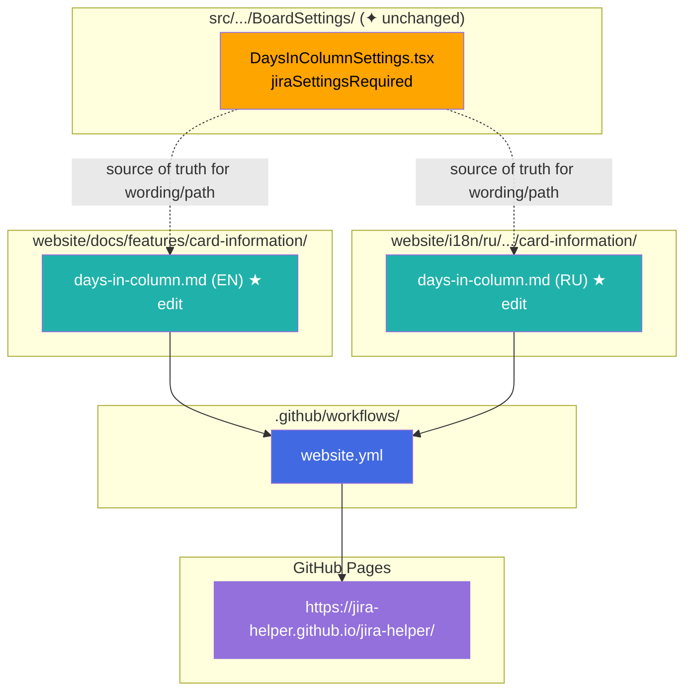
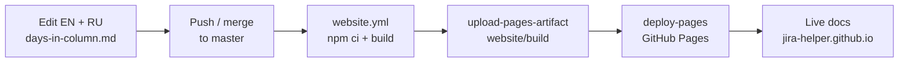

# Target Design: Days in Column — Jira prerequisite в документации

**Feature folder**: `.agents/tasks/days-in-column-jira-prerequisite/`  
**Requirements**: [requirements.md](./requirements.md) (agreed)  
**Has UI**: no — docs-only; UI Alert и runtime не меняются.

## Ключевые принципы

1. **Docs-only** — правятся только два markdown-файла user guide; `src/`, i18n расширения, Storybook — вне scope.
2. **Паритет с Alert** — формулировка и путь UI Jira совпадают с `jiraSettingsRequired` в `DaysInColumnSettings.tsx`.
3. **Три точки заметности** — Prerequisites / Требования + шаг в How to configure + Troubleshooting (FR-3).
4. **Деплой через существующий CI** — merge в `master` → `website.yml` → GitHub Pages; отдельный пайплайн не нужен.
5. **Минимальный diff** — без новых компонентов Docusaurus, без правок других фич.

> Общие архитектурные принципы UI — см. `docs/architecture_guideline.md` (для этой задачи не применяются: нет Models / Containers).

## Architecture Diagram

Документация как артефакты и деплой-пайплайн (subgraph = папка / workflow):



## Deploy flow



## Target File Structure

Меняются **только** эти файлы (в отдельной реализации / TASK, не в этом design-этапе):

```text
website/
├── docs/
│   └── features/
│       └── card-information/
│           └── days-in-column.md          # EN: + Prerequisites, configure step, Troubleshooting
└── i18n/
    └── ru/
        └── docusaurus-plugin-content-docs/
            └── current/
                └── features/
                    └── card-information/
                        └── days-in-column.md  # RU: + Требования, шаг в «Как настроить», Troubleshooting
```

**Не трогать:**

- `src/features/additional-card-elements/BoardSettings/DaysInColumnSettings.tsx` (Alert уже есть)
- i18n-строки расширения, board properties, runtime
- другие `website/docs/**` страницы

## Структура вставок

Одинаковая схема для EN и RU. Порядок секций после правок:

```text
# Title
| metadata table |
## Prerequisites / Требования     ← NEW (сразу после таблицы, до Purpose / Цель)
## Purpose / Цель
## How to configure / Как настроить
  ### Where to find settings
  ### How to configure
    … existing bullets …
    - Jira board prerequisite step   ← NEW bullet
## How to use / Как использовать
…
## Troubleshooting                  ← EN: дополнить; RU: добавить раздел целиком при отсутствии
```

| Место | EN heading / текст | RU heading / текст |
|-------|--------------------|--------------------|
| После metadata table | `## Prerequisites` | `## Требования` |
| В списке configure | bullet про включение настройки Jira | тот же смысл |
| Troubleshooting | дополнить пункт **Badge missing** | добавить `## Troubleshooting` + пункт про отсутствующий бейдж |

## Текст-черновик (согласован с Alert)

Источник формулировок — `TEXTS.jiraSettingsRequired` в `DaysInColumnSettings.tsx`:

- EN: *This feature works ONLY if "Show days in column" is enabled… board configuration → Card layout → Show days in column.*
- RU: *Эта функция работает ТОЛЬКО если… "Показывать дни в колонке"… настройки доски → Макет карточки → Показывать дни в колонке.*

### EN — `website/docs/features/card-information/days-in-column.md`

**После таблицы метаданных:**

```markdown
## Prerequisites

This feature works **only if** Jira’s built-in **«Show days in column»** is enabled for the board.

Path in Jira: **Board configuration → Card layout → Show days in column**.
```

**В секции How to configure (дополнительный bullet, после включения бейджа в jira-helper или рядом с ним):**

```markdown
- **Jira board setting**: ensure **«Show days in column»** is enabled under **Board configuration → Card layout**. Without this, the jira-helper badge cannot work correctly.
```

**Troubleshooting — заменить / расширить пункт Badge missing:**

```markdown
- **Badge missing:** Ensure the feature is on, columns are selected, and the days-in-column badge itself is enabled. Also confirm Jira **«Show days in column»** is enabled (**Board configuration → Card layout**).
```

### RU — `website/i18n/ru/.../days-in-column.md`

**После таблицы метаданных:**

```markdown
## Требования

Фича работает **только если** на доске Jira включена встроенная настройка **«Показывать дни в колонке»**.

Путь в Jira: **Настройки доски → Макет карточки → Показывать дни в колонке**.
```

**В секции «Как настроить» (дополнительный bullet):**

```markdown
- **Настройка доски Jira**: убедитесь, что включено **«Показывать дни в колонке»** по пути **Настройки доски → Макет карточки**. Без этого бейдж jira-helper не будет работать корректно.
```

**Troubleshooting (новый раздел в конце файла — в RU сейчас отсутствует):**

```markdown
## Troubleshooting

- **Бейдж не отображается:** проверьте, что фича включена, выбраны колонки и включён бейдж «Дней в колонке». Также убедитесь, что в Jira включено **«Показывать дни в колонке»** (**Настройки доски → Макет карточки**).
- **Цвета не меняются:** проверьте пороги (warning меньше danger, если заданы оба) и что время в колонке действительно их пересекает.
- **Счётчик Jira всё ещё виден:** обновите страницу — скрытие выполняется при инициализации фичи.
- **Устаревшие колонки в настройках:** в режиме порогов по колонкам удалите строки для колонок, которых больше нет на доске, кнопкой **«Remove»** / удалить.
```

> Coder может слегка подогнать стиль под соседние bullets; обязательны: **ONLY / только если**, точные лейблы настройки, путь UI как в Alert.

## Component / State Specifications

Не применимо (Has UI = no). Нет новых React-компонентов, Models, DI.

**Контракт согласованности (docs ↔ UI):**

| Поле | Значение |
|------|----------|
| EN setting label | `Show days in column` |
| RU setting label | `Показывать дни в колонке` |
| EN path | Board configuration → Card layout → Show days in column |
| RU path | Настройки доски → Макет карточки → Показывать дни в колонке |
| UI reference | `data-testid="days-in-column-jira-settings-required"`, `TEXTS.jiraSettingsRequired` |

## Migration Plan

| Phase | Что делаем | Результат |
|-------|------------|-----------|
| **1** | Отредактировать EN + RU `days-in-column.md` по черновику выше | Локально `cd website && npm run build` проходит |
| **2** | Merge в `master` (PR или прямой merge по процессу команды) | Триггер `website.yml` на `push` к `master` |
| **3** | Дождаться deploy-pages | Страницы EN/RU на `https://jira-helper.github.io/jira-helper/` содержат Prerequisites / Требования и Troubleshooting |

Между фазами нет breaking changes: сайт либо со старой докой, либо с новой; расширение не затрагивается.

## Verification (после реализации)

- [ ] EN: блок `## Prerequisites` сразу после metadata table
- [ ] RU: блок `## Требования` сразу после metadata table
- [ ] EN + RU: шаг в configure + Troubleshooting про настройку Jira
- [ ] UI расширения не изменён
- [ ] `website` build OK; после merge — live Pages обновлены

## Benefits

- Пользователь узнаёт о зависимости от настройки Jira **до** включения бейджа в jira-helper.
- Формулировки совпадают с уже показанным Alert — нет расхождения docs ↔ UI.
- Нулевой риск для runtime; деплой уже автоматизирован через `website.yml`.
