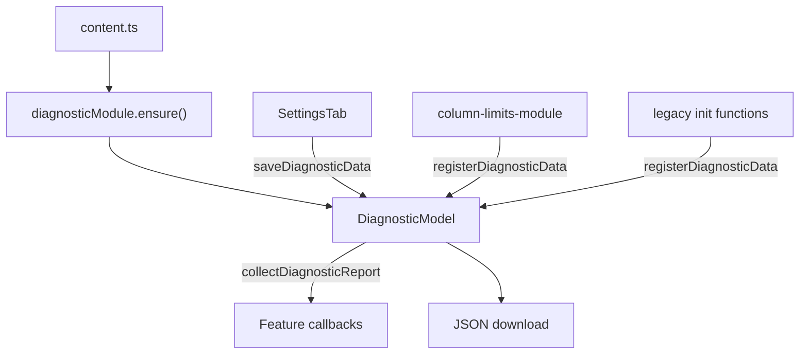
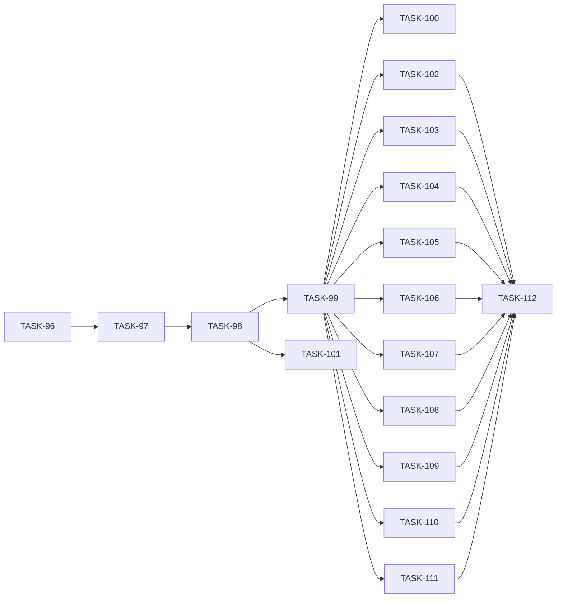

# EPIC-7: Diagnostic Data Collection

**Status**: TODO
**Created**: 2026-05-19

---

## Цель

Расширить существующий export диагностики: фичи регистрируют синхронные read-only callbacks через DI, `DiagnosticModel` собирает `featureDiagnostics` и мержит с legacy payload. Отказоустойчивость: ошибка одной фичи не ломает export остальных.

## Target Design

- [target-design.md](./target-design.md)
- [requirements.md](./requirements.md)
- [developer-guide.md](./developer-guide.md)

## Архитектура

## Задачи

### Phase 1: Diagnostic Module Foundation

| # | Task | Описание | Status |
|---|------|----------|--------|
| 96 | [TASK-96](./TASK-96-migrate-diagnostic-module-folder.md) | Миграция `diagnostic/` → `diagnostic-module/` | DONE |
| 97 | [TASK-97](./TASK-97-diagnostic-types-and-tokens.md) | types.ts + tokens.ts | DONE |
| 98 | [TASK-98](./TASK-98-diagnostic-model.md) | DiagnosticModel + unit tests | DONE |
| 99 | [TASK-99](./TASK-99-diagnostic-module-di-wiring.md) | module.ts + ensure в content.ts | DONE |

### Phase 2: Export Flow

| # | Task | Описание | Status |
|---|------|----------|--------|
| 100 | [TASK-100](./TASK-100-settings-tab-export-wiring.md) | SettingsTab → model.saveDiagnosticData() | DONE |
| 101 | [TASK-101](./TASK-101-export-payload-integration-test.md) | Integration test backward compat export | DONE |

### Phase 3: Module Features Registration

| # | Task | Описание | Status |
|---|------|----------|--------|
| 102 | [TASK-102](./TASK-102-column-limits-diagnostic.md) | column-limits-module callback + test | TODO |
| 103 | [TASK-103](./TASK-103-person-limits-diagnostic.md) | person-limits-module + getDiagnosticSnapshot | TODO |
| 104 | [TASK-104](./TASK-104-swimlane-wip-limits-diagnostic.md) | swimlane-wip-limits-module callback + test | TODO |
| 105 | [TASK-105](./TASK-105-field-limits-diagnostic.md) | field-limits-module callback + test | TODO |
| 106 | [TASK-106](./TASK-106-card-colors-diagnostic.md) | card-colors-module + getDiagnosticSnapshot | TODO |

### Phase 4: Legacy Features Registration

| # | Task | Описание | Status |
|---|------|----------|--------|
| 107 | [TASK-107](./TASK-107-sub-tasks-additional-card-diagnostic.md) | sub-tasks-progress + additional-card-elements | TODO |
| 108 | [TASK-108](./TASK-108-wiplimit-cells-sla-diagnostic.md) | wiplimit-on-cells + charts-add-sla-line | TODO |
| 109 | [TASK-109](./TASK-109-gantt-chart-diagnostic.md) | gantt-chart snapshots + registration | TODO |
| 110 | [TASK-110](./TASK-110-comment-templates-diagnostic.md) | jira-comment-templates-module | TODO |
| 111 | [TASK-111](./TASK-111-localstorage-features-diagnostic.md) | local-settings + blur-for-sensitive + bug-template | TODO |

### Phase 5: Documentation

| # | Task | Описание | Status |
|---|------|----------|--------|
| 112 | [TASK-112](./TASK-112-diagnostic-onboarding-docs.md) | JSDoc в types.ts + финализация developer-guide | TODO |

## Dependencies

**Параллельно можно выполнять (после TASK-99):**

- TASK-102 … TASK-111 (регистрация фич независима друг от друга)
- TASK-101 параллельно с TASK-100 (после TASK-98)

**Последовательно:**

- TASK-96 → TASK-97 → TASK-98 → TASK-99 → TASK-100
- TASK-112 — после всех feature registration tasks

## Acceptance Criteria

- [ ] `diagnosticModule.ensure()` первым среди feature-модулей в `content.ts`
- [ ] Export сохраняет legacy top-level поля + additive `featureDiagnostics`
- [ ] Все 14 фич из requirements §5 зарегистрированы с convention payload §5.3
- [ ] Unit-тест diagnostic callback для каждой фичи из §5
- [ ] Unit-тесты `DiagnosticModel`: fault tolerance, serialization, fallback export
- [ ] [developer-guide.md](./developer-guide.md) актуален
- [ ] `npm test` и ESLint без ошибок
