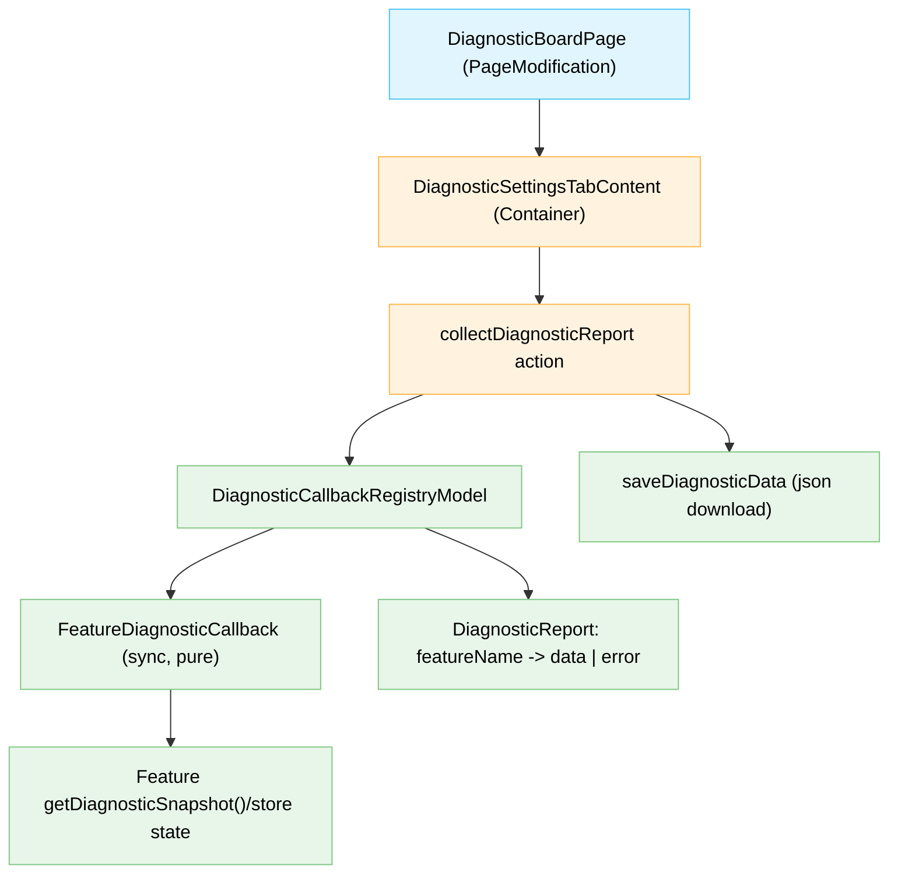

# Target Design: Diagnostic Data Collection через DI callbacks

Этот документ описывает целевую архитектуру механизма сбора диагностических данных для `src/features/diagnostic` и интеграции со всеми согласованными фичами-источниками данных.

## Ключевые принципы

1. **Synchronous + side-effect free callbacks** — каждый diagnostic callback строго синхронный (`() => Result<PlainObject, Error>`) и только читает уже загруженный state/snapshot без `await`, без I/O, без мутаций.
2. **Единый контракт отчета** — результат агрегируется в плоский map `featureName -> data | error` без отдельного `status` поля.
3. **Разделение ответственности** — реестр callbacks живет в диагностическом модуле; каждая фича владеет только своим snapshot-контрактом и регистрацией callback в `register()`.
4. **Безопасные read-only snapshots** — если у модели нет безопасного API чтения, добавляется `getDiagnosticSnapshot()` с JSON-serializable данными без DOM-ссылок.
5. **Отказоустойчивый сбор** — падение одного callback (throw/Err) не прерывает сбор остальных; ошибка включается в отчет конкретной фичи.

> Общие архитектурные правила: `docs/architecture_guideline.md`, state-паттерны: `docs/state-valtio.md`.

## Mermaid Architecture Diagram

```mermaid
flowchart TB
    subgraph diagnostic["src/features/diagnostic/"]
        DiagTab["SettingsTab.tsx (trigger)"]
        DiagAction["actions/collectDiagnosticReport.ts"]
        DiagRegistry["models/DiagnosticCallbackRegistryModel"]
        DiagTypes["types.ts"]
        DiagToken["tokens.ts (registry token)"]
    end

    subgraph col["src/features/column-limits-module/"]
        ColModule["module.ts register()"]
        ColProp["property/PropertyModel"]
        ColRuntime["BoardPage/models/BoardRuntimeModel"]
    end

    subgraph person["src/features/person-limits-module/"]
        PersonModule["module.ts register()"]
        PersonProp["property/PropertyModel"]
        PersonRuntime["BoardPage/models/BoardRuntimeModel"]
    end

    subgraph swimlane["src/features/swimlane-wip-limits-module/"]
        SwimModule["module.ts register()"]
        SwimProp["property/PropertyModel"]
        SwimRuntime["BoardPage/models/BoardRuntimeModel"]
    end

    subgraph field["src/features/field-limits-module/"]
        FieldModule["module.ts register()"]
        FieldProp["property/PropertyModel"]
        FieldRuntime["BoardPage/models/RuntimeModel"]
    end

    subgraph card["src/features/card-colors-module/"]
        CardModule["module.ts register()"]
        CardProp["property/PropertyModel"]
        CardRuntime["BoardPage/models/RuntimeModel"]
    end

    subgraph legacy["legacy feature modules/stores"]
        LegacyRegs["sub-tasks-progress / additional-card-elements / wiplimit-on-cells / charts/AddSlaLine / gantt-chart / jira-comment-templates-module / local-settings / blur-for-sensitive / bug-template"]
    end

    DiagTab --> DiagAction
    DiagAction --> DiagRegistry

    ColModule -->|registerDiagnosticData| DiagRegistry
    PersonModule -->|registerDiagnosticData| DiagRegistry
    SwimModule -->|registerDiagnosticData| DiagRegistry
    FieldModule -->|registerDiagnosticData| DiagRegistry
    CardModule -->|registerDiagnosticData| DiagRegistry
    LegacyRegs -->|registerDiagnosticData| DiagRegistry

    ColModule --> ColProp
    ColModule --> ColRuntime
    PersonModule --> PersonProp
    PersonModule --> PersonRuntime
    SwimModule --> SwimProp
    SwimModule --> SwimRuntime
    FieldModule --> FieldProp
    FieldModule --> FieldRuntime
    CardModule --> CardProp
    CardModule --> CardRuntime

    classDef containerStyle fill:#4169E1,color:#fff
    classDef viewStyle fill:#20B2AA,color:#fff
    classDef modelStyle fill:#9370DB,color:#fff
    classDef serviceStyle fill:#FFA500,color:#000

    class DiagTab containerStyle
    class DiagAction,DiagToken serviceStyle
    class DiagRegistry,ColProp,ColRuntime,PersonProp,PersonRuntime,SwimProp,SwimRuntime,FieldProp,FieldRuntime,CardProp,CardRuntime modelStyle
    class DiagTypes,LegacyRegs,ColModule,PersonModule,SwimModule,FieldModule,CardModule viewStyle
```



## Mermaid Component Hierarchy



## Target File Structure

```text
src/features/diagnostic/
├── types.ts                                # NEW: общие контракты callback-реестра и отчета
├── tokens.ts                               # NEW: DI token для registry API
├── models/
│   ├── DiagnosticCallbackRegistryModel.ts  # NEW: in-memory registry + collect()
│   └── DiagnosticCallbackRegistryModel.test.ts
├── actions/
│   ├── collectDiagnosticReport.ts          # NEW: orchestration реестра + merge с текущим payload
│   ├── collectDiagnosticReport.test.ts
│   └── saveDiagnosticData.ts               # UPDATE: использует collectDiagnosticReport()
├── module.ts                               # NEW: module registration (Valtio-style entry для registry model)
└── BoardPage.ts                            # UPDATE: ensure diagnostic module registration

src/features/column-limits-module/
├── module.ts                               # UPDATE: registerDiagnosticData('column-limits-module', callback)
└── BoardPage/models/BoardRuntimeModel.ts   # UPDATE: optional getDiagnosticSnapshot() если требуется

src/features/person-limits-module/
├── module.ts                               # UPDATE: register callback
└── BoardPage/models/BoardRuntimeModel.ts   # UPDATE: getDiagnosticSnapshot() обязателен

src/features/swimlane-wip-limits-module/
├── module.ts                               # UPDATE: register callback
└── BoardPage/models/BoardRuntimeModel.ts   # UPDATE: optional getDiagnosticSnapshot()

src/features/field-limits-module/
├── module.ts                               # UPDATE: register callback
└── BoardPage/models/RuntimeModel.ts        # UPDATE: optional getDiagnosticSnapshot()

src/features/card-colors-module/
├── module.ts                               # UPDATE: register callback
└── BoardPage/models/RuntimeModel.ts        # UPDATE: getDiagnosticSnapshot() (read-only)

src/features/[legacy-features]/
└── registration points                     # UPDATE: register callback + safe snapshot providers where needed

src/content.ts
└── diagnosticModule.ensure(container)      # UPDATE: centralized module ensure
```

## Component Specifications

### `src/features/diagnostic/types.ts`

```ts
import type { Result } from 'ts-results';

/**
 * JSON-serializable payload от фичи для диагностики.
 * Структура не ограничивается общим shape и определяется каждой фичей.
 */
export type JsonValue =
  | string
  | number
  | boolean
  | null
  | { [key: string]: JsonValue }
  | JsonValue[];

export type FeatureDiagnosticData = { [key: string]: JsonValue };

/**
 * Ошибка сбора данных конкретной фичи.
 */
export type FeatureDiagnosticError = {
  error: {
    message: string;
    name?: string;
    stack?: string;
  };
};

/**
 * Формат итогового отчета: featureName -> data | error.
 */
export type DiagnosticReport = Record<string, FeatureDiagnosticData | FeatureDiagnosticError>;

/**
 * Синхронный и side-effect free callback фичи.
 */
export type FeatureDiagnosticCallback = () => Result<FeatureDiagnosticData, Error>;

/**
 * API регистрации diagnostic callback в DI.
 */
export interface DiagnosticCallbackRegistry {
  registerDiagnosticData(featureName: string, callback: FeatureDiagnosticCallback): void;
  collectDiagnosticReport(): DiagnosticReport;
  reset(): void;
}
```

### `src/features/diagnostic/tokens.ts`

```ts
import type { Token } from 'dioma';
import type { DiagnosticCallbackRegistry } from './types';

/**
 * DI token реестра диагностических callback.
 */
export declare const diagnosticCallbackRegistryToken: Token<DiagnosticCallbackRegistry>;
```

### `src/features/diagnostic/models/DiagnosticCallbackRegistryModel.ts`

```ts
import type { DiagnosticCallbackRegistry, FeatureDiagnosticCallback, DiagnosticReport } from '../types';

/**
 * In-memory registry диагностических callback.
 */
export interface DiagnosticCallbackRegistryState {
  readonly callbacksCount: number;
  readonly registeredFeatures: readonly string[];
}

export interface DiagnosticCallbackRegistryModel extends DiagnosticCallbackRegistry {
  getState(): DiagnosticCallbackRegistryState;
  getInitialState(): DiagnosticCallbackRegistryState;
}

/**
 * Нормализация ошибок (throw/Err) в контракт report.error.
 */
export interface DiagnosticErrorMapper {
  map(error: unknown): { message: string; name?: string; stack?: string };
}
```

### `src/features/diagnostic/actions/collectDiagnosticReport.ts`

```ts
import type { DiagnosticReport } from '../types';

/**
 * Собирает расширенный diagnostic payload для save flow.
 */
export interface CollectedDiagnosticPayload {
  messages: unknown[];
  html: string;
  href: string;
  pluginVersion: string;
  jiraVersion: string;
  featureDiagnostics: DiagnosticReport;
}

export interface CollectDiagnosticReportAction {
  (): CollectedDiagnosticPayload;
}
```

### Контракт регистрации для фич (в `module.ts` или legacy init)

```ts
import type { FeatureDiagnosticCallback } from 'src/features/diagnostic/types';

export interface FeatureDiagnosticRegistration {
  readonly featureName: string;
  readonly callback: FeatureDiagnosticCallback;
}
```

## State Changes

### Новый state в diagnostic feature

- **`DiagnosticCallbackRegistryModel` (Valtio)**:
  - `callbacksByFeature: Map<string, FeatureDiagnosticCallback>` (внутренний runtime state реестра)
  - `registeredFeatures: string[]` (read-only derived snapshot для отладки)
  - `reset()` и `getInitialState()` обязательны для тестов

### Расширение state в источниках данных

- Для моделей/сторов без read-only доступа добавляется **только** `getDiagnosticSnapshot(): Record<string, unknown>`:
  - метод не меняет state;
  - не триггерит load/recompute/render;
  - не возвращает DOM объекты (`Element`, `Node`, `HTMLElement`).

## Logic Ownership

- **Diagnostic registry model**
  - владеет регистрацией callbacks;
  - владеет алгоритмом `collectDiagnosticReport()` и изоляцией ошибок;
  - владеет нормализацией `throw`/`Err` в `featureName -> { error }`.

- **Feature modules / legacy init points**
  - владеют только регистрацией своего callback;
  - callback читает только уже доступные property/runtime/localStorage snapshots;
  - callback не инициирует загрузку и не изменяет модель.

- **Feature models/stores**
  - владеют безопасным `getDiagnosticSnapshot()` где нет публичного read-only API;
  - владеют фильтрацией небезопасных полей (DOM references, несериализуемые значения).

- **Diagnostic action (`collectDiagnosticReport`)**
  - объединяет базовый диагностический payload и `featureDiagnostics`;
  - не содержит feature-specific бизнес-логики.

- **Settings UI (`DiagnosticSettingsTabContent`)**
  - только триггер действия экспорта;
  - не выполняет агрегацию и не знает про формат отдельных фич.

## Контракт callback registry и формат отчета

### Registry contract

- API: `registerDiagnosticData(featureName, callback)`
- Семантика:
  - повторная регистрация того же `featureName` перезаписывает callback (last-write-wins);
  - сбор выполняется последовательно по текущему registry snapshot;
  - callback вызывается синхронно в try/catch;
  - поддерживаются `Ok(data)` и `Err(error)`.

### Report contract (`featureName -> data | error`)

```ts
type DiagnosticReport = Record<
  string,
  | Record<string, JsonValue>
  | {
      error: { message: string; name?: string; stack?: string };
    }
>;
```

Инварианты:
- у feature-key всегда ровно один value: либо произвольный `data` payload (JSON-serializable), либо `error`;
- отдельного поля `status` нет;
- результат полностью JSON-serializable.

## Источники данных по затронутым фичам (рекомендованные поля payload)

| Feature | Рекомендованные данные | Snapshot strategy |
|---|---|---|
| `column-limits-module` | `PropertyModel.data` (`subgroupsJH`), `groupStats`, `cssNotIssueSubTask` | read from runtime state; add `getDiagnosticSnapshot()` if needed |
| `person-limits-module` | `PropertyModel.data` (`personLimitsSettings`), агрегаты runtime без DOM (`activePerson`, `swimlanesActive`, `cssSelectorOfIssues`, `limits[]`) | mandatory `getDiagnosticSnapshot()` |
| `swimlane-wip-limits-module` | `PropertyModel.settings` (`jiraHelperSwimlaneSettings`, legacy meta), `isInitialized`, `stats`, `settingsCount` | add snapshot getter if direct read is unsafe |
| `field-limits-module` | `PropertyModel.settings` (`fieldLimitsJH`), `isInitialized`, `cssSelectorOfIssues`, `stats`, `limitsCount` | add snapshot getter if missing |
| `card-colors-module` | `PropertyModel.settings` (`card-colors`), `isActive`, `error`, `intervalActive` | mandatory read-only runtime snapshot getter |
| `sub-tasks-progress` | board property store snapshot (`sub-task-progress`), `userGuideViewed`, `userGuideViewCount` | read zustand snapshot + localStorage keys only |
| `additional-card-elements` | board property store snapshot | read zustand snapshot only |
| `wiplimit-on-cells` | cached property snapshot (`wipLimitCells`) | add read-only provider if cache not exposed |
| `charts/AddSlaLine` | cached SLA config snapshot (`slaConfig3`) | add read-only cache/snapshot provider |
| `gantt-chart` | settings model snapshot, data/filters/viewport snapshots | add `getDiagnosticSnapshot()` to each runtime model |
| `jira-comment-templates-module` | `commentTemplates` summary (`version`, `templatesCount`, `enabled`) | storage model read-only snapshot |
| `local-settings` | `useLocalSettingsStore.getState().settings` | direct state read, no load |
| `blur-for-sensitive` | `blurSensitive` key | direct localStorage get |
| `bug-template` | `jira_helper_textarea_bug_template` key | direct localStorage get |

## Безопасный механизм snapshot-методов (`getDiagnosticSnapshot`)

Для моделей/сторов, где сейчас нет безопасного read-only API:

1. Добавить публичный метод `getDiagnosticSnapshot(): Record<string, unknown>`.
2. Метод возвращает только plain-данные (строки, числа, boolean, массивы, plain objects, `null`).
3. Метод запрещает возврат DOM/reference-типов и функций.
4. Метод не вызывает командные методы (`load/save/persist/recalculate/render/toggle/...`).
5. Метод не модифицирует состояние и не пишет в storage/API.
6. При необходимости использовать внутренний sanitizer:
   - исключение DOM полей;
   - преобразование `Error`/complex types в serializable summary.

## Migration Plan

### Phase 1 — Базовый диагностический модуль (TASK-1)

- Создать `types.ts`, `tokens.ts`, `DiagnosticCallbackRegistryModel`.
- Ввести API `registerDiagnosticData` и `collectDiagnosticReport`.
- Подключить модуль в `content.ts` через `diagnosticModule.ensure(container)`.

### Phase 2 — Интеграция export flow (TASK-2)

- Вынести сбор в `collectDiagnosticReport`.
- Обновить `saveDiagnosticData` для включения `featureDiagnostics`.
- Добавить тесты отказоустойчивости (`throw`, `Err`, mixed results).

### Phase 3 — Module features registration (TASK-3)

- Подключить callback registration в:
  - `column-limits-module`
  - `person-limits-module`
  - `swimlane-wip-limits-module`
  - `field-limits-module`
  - `card-colors-module`
- Реализовать/добавить обязательные `getDiagnosticSnapshot()` для runtime моделей.

### Phase 4 — Legacy features registration (TASK-4)

- Подключить callback registration в legacy-фичах:
  - `sub-tasks-progress`, `additional-card-elements`, `wiplimit-on-cells`, `charts/AddSlaLine`
  - `gantt-chart`, `jira-comment-templates-module`, `local-settings`, `blur-for-sensitive`, `bug-template`
- Добавить snapshot/cache providers где прямого read-only API нет.

### Phase 5 — Stabilization и контрактные тесты (TASK-5)

- Проверить, что payload каждой фичи JSON-serializable и соответствует ее согласованному snapshot-контракту.
- Добавить contract tests на JSON-serializable payload и отсутствие side effects.
- Зафиксировать документацию по onboarding новых фич в реестр.

## Benefits

- Диагностика становится расширяемой: новая фича добавляет один callback без правок централизованного сборщика.
- Ошибки локализованы по `featureName`, что ускоряет triage и root-cause analysis.
- Гибкий payload-контракт позволяет фичам отдавать полезные доменные данные без искусственных ограничений структуры.
- Side-effect free контракт делает сбор безопасным и предсказуемым в любом runtime состоянии.
- Snapshot API снижает риск утечек DOM/несериализуемых структур в экспортируемый отчет.
