# Target Design: Diagnostic Data Collection через DI callbacks

Этот документ описывает целевую архитектуру механизма сбора диагностических данных для `src/features/diagnostic-module` и интеграции со всеми согласованными фичами-источниками данных.

## Ключевые принципы

1. **Synchronous + side-effect free callbacks** — каждый diagnostic callback строго синхронный (`() => Result<PlainObject, Error>`) и только читает уже загруженный state/snapshot без `await`, без I/O, без мутаций.
2. **Единый контракт отчета** — результат агрегируется в плоский map `featureName -> data | error` без отдельного `status` поля.
3. **Разделение ответственности** — реестр callbacks живет в диагностическом модуле; каждая фича владеет только своим snapshot-контрактом и регистрацией callback в `register()`.
4. **Безопасные read-only snapshots** — если у модели нет безопасного API чтения, добавляется `getDiagnosticSnapshot()` с JSON-serializable данными без DOM-ссылок.
5. **Отказоустойчивый сбор** — падение одного callback (throw/Err) не прерывает сбор остальных; ошибка включается в отчет конкретной фичи.
6. **Module naming** — новый код живет в `src/features/diagnostic-module/` (суффикс `-module` обязателен по `docs/module-boundaries.md`); legacy `src/features/diagnostic/` мигрируется в эту папку.

> Общие архитектурные правила: `docs/architecture_guideline.md`, module boundaries: `docs/module-boundaries.md`, state-паттерны: `docs/state-valtio.md`.

## Mermaid Architecture Diagram

```mermaid
flowchart TB
    subgraph diagnostic["src/features/diagnostic-module/"]
        DiagModule["module.ts register()"]
        DiagTab["SettingsTab.tsx (trigger)"]
        DiagModel["DiagnosticModel"]
        DiagTypes["types.ts"]
        DiagToken["tokens.ts (registry token)"]
    end

    subgraph col["src/features/column-limits-module/"]
        ColModule["module.ts register()"]
        ColProp["property/PropertyModel"]
        ColRuntime["BoardPage/models/BoardRuntimeModel"]
    end

    subgraph person["src/features/person-limits-module/"]
        PersonModule["module.ts register()"]
        PersonProp["property/PropertyModel"]
        PersonRuntime["BoardPage/models/BoardRuntimeModel"]
    end

    subgraph swimlane["src/features/swimlane-wip-limits-module/"]
        SwimModule["module.ts register()"]
        SwimProp["property/PropertyModel"]
        SwimRuntime["BoardPage/models/BoardRuntimeModel"]
    end

    subgraph field["src/features/field-limits-module/"]
        FieldModule["module.ts register()"]
        FieldProp["property/PropertyModel"]
        FieldRuntime["BoardPage/models/RuntimeModel"]
    end

    subgraph card["src/features/card-colors-module/"]
        CardModule["module.ts register()"]
        CardProp["property/PropertyModel"]
        CardRuntime["BoardPage/models/RuntimeModel"]
    end

    subgraph legacy["legacy feature modules/stores"]
        LegacyRegs["sub-tasks-progress / additional-card-elements / wiplimit-on-cells / charts/AddSlaLine / gantt-chart / jira-comment-templates-module / local-settings / blur-for-sensitive / bug-template"]
    end

    DiagTab --> DiagModel

    ColModule -->|registerDiagnosticData| DiagModel
    PersonModule -->|registerDiagnosticData| DiagModel
    SwimModule -->|registerDiagnosticData| DiagModel
    FieldModule -->|registerDiagnosticData| DiagModel
    CardModule -->|registerDiagnosticData| DiagModel
    LegacyRegs -->|registerDiagnosticData| DiagModel

    ColModule --> ColProp
    ColModule --> ColRuntime
    PersonModule --> PersonProp
    PersonModule --> PersonRuntime
    SwimModule --> SwimProp
    SwimModule --> SwimRuntime
    FieldModule --> FieldProp
    FieldModule --> FieldRuntime
    CardModule --> CardProp
    CardModule --> CardRuntime

    classDef containerStyle fill:#4169E1,color:#fff
    classDef viewStyle fill:#20B2AA,color:#fff
    classDef modelStyle fill:#9370DB,color:#fff
    classDef serviceStyle fill:#FFA500,color:#000

    class DiagTab containerStyle
    class DiagToken serviceStyle
    class DiagModel,ColProp,ColRuntime,PersonProp,PersonRuntime,SwimProp,SwimRuntime,FieldProp,FieldRuntime,CardProp,CardRuntime modelStyle
    class DiagTypes,LegacyRegs,ColModule,PersonModule,SwimModule,FieldModule,CardModule viewStyle
```




## Mermaid Component Hierarchy

```mermaid
graph TD
    PageMod["DiagnosticBoardPage (PageModification)"]
    SettingsContainer["DiagnosticSettingsTabContent (Container)"]
    Model["DiagnosticModel"]
    Callback["FeatureDiagnosticCallback (sync, pure)"]
    Snapshot["Feature getDiagnosticSnapshot()/store state"]
    Report["DiagnosticReport: featureName -> data | error"]

    PageMod --> SettingsContainer
    SettingsContainer -->|saveDiagnosticData()| Model
    Model -->|collectDiagnosticReport()| Callback
    Callback --> Snapshot
    Model --> Report

    classDef pageMod fill:#e1f5fe,stroke:#4fc3f7,color:#000
    classDef container fill:#fff3e0,stroke:#ffb74d,color:#000
    classDef view fill:#e8f5e9,stroke:#81c784,color:#000

    class PageMod pageMod
    class SettingsContainer container
    class Model,Callback,Snapshot,Report view
```


## Target File Structure

```text
src/features/diagnostic-module/             # MIGRATE from legacy 
├── types.ts                                # NEW: общие контракты callback-реестра и отчета
├── tokens.ts                               # NEW: DI tokens (registry + PageModification)
├── module.ts                               # NEW: Module.ensure registration
├── module.test.ts                          # NEW: smoke test регистрации DI
├── models/
│   ├── DiagnosticModel.ts  # NEW: registry + collectDiagnosticReport() + saveDiagnosticData()
│   └── DiagnosticModel.test.ts
├── BoardPage.ts                            # MIGRATE from diagnostic/BoardPage.ts
├── SettingsTab.tsx                         # MIGRATE: onClick -> model.saveDiagnosticData()
└── JqlDebugDemo.tsx                        # MIGRATE from diagnostic/ (optional demo UI)

src/features/column-limits-module/
├── module.ts                               # UPDATE: registerDiagnosticData('column-limits-module', callback)
└── BoardPage/models/BoardRuntimeModel.ts   # UPDATE: optional getDiagnosticSnapshot() если требуется

src/features/person-limits-module/
├── module.ts                               # UPDATE: register callback
└── BoardPage/models/BoardRuntimeModel.ts   # UPDATE: getDiagnosticSnapshot() обязателен

src/features/swimlane-wip-limits-module/
├── module.ts                               # UPDATE: register callback
└── BoardPage/models/BoardRuntimeModel.ts   # UPDATE: optional getDiagnosticSnapshot()

src/features/field-limits-module/
├── module.ts                               # UPDATE: register callback
└── BoardPage/models/RuntimeModel.ts        # UPDATE: optional getDiagnosticSnapshot()

src/features/card-colors-module/
├── module.ts                               # UPDATE: register callback
└── BoardPage/models/RuntimeModel.ts        # UPDATE: getDiagnosticSnapshot() (read-only)

src/features/[legacy-features]/
└── existing DI/init function            # UPDATE: registerDiagnosticData in registerBlurSensitiveFeatureInDI etc.

src/content.ts
├── diagnosticModule.ensure(container)      # FIRST among feature modules (before callbacks register)
├── columnLimitsModule.ensure(container)    # UPDATE: registerDiagnosticData in register()
└── imports from diagnostic-module/         # UPDATE: replace ./features/diagnostic/*
```

## Component Specifications

### `src/features/diagnostic-module/types.ts`

```ts
import type { Result } from 'ts-results';

/**
 * JSON-serializable payload от фичи для диагностики.
 * TypeScript не ограничивает shape — см. recommended convention ниже.
 */
export type JsonValue =
  | string
  | number
  | boolean
  | null
  | { [key: string]: JsonValue }
  | JsonValue[];

export type FeatureDiagnosticData = { [key: string]: JsonValue };

/**
 * Ошибка сбора данных конкретной фичи.
 */
export type FeatureDiagnosticError = {
  error: {
    message: string;
    name?: string;
    stack?: string;
  };
};

/**
 * Формат итогового отчета: featureName -> data | error.
 */
export type DiagnosticReport = Record<string, FeatureDiagnosticData | FeatureDiagnosticError>;

/**
 * Синхронный и side-effect free callback фичи.
 */
export type FeatureDiagnosticCallback = () => Result<FeatureDiagnosticData, Error>;

/**
 * Полный payload экспорта диагностики (базовые данные + featureDiagnostics).
 */
export type CollectedDiagnosticPayload = {
  messages: unknown[];
  html: string;
  href: string;
  pluginVersion: string;
  jiraVersion: string;
  featureDiagnostics: DiagnosticReport;
};

/**
 * API diagnostic-модуля: registry + collect + export.
 */
export interface DiagnosticModelApi {
  registerDiagnosticData(featureName: string, callback: FeatureDiagnosticCallback): void;
  collectDiagnosticReport(): DiagnosticReport;
  saveDiagnosticData(): void;
  reset(): void;
}
```

### `src/features/diagnostic-module/tokens.ts`

```ts
import { Token } from 'dioma';
import { createModelToken } from 'src/infrastructure/di/Module';
import type { PageModification } from 'src/infrastructure/page-modification/PageModification';
import type { DiagnosticModel } from './models/DiagnosticModel';
import type { DiagnosticBoardPage } from './BoardPage';

/**
 * Valtio-backed registry for feature diagnostic callbacks.
 *
 * Lifecycle: application-scope singleton per container after first resolve.
 * Consumers: feature modules register callbacks in register(); SettingsTab вызывает saveDiagnosticData().
 */
export const diagnosticModelToken = createModelToken<DiagnosticModel>(
  'diagnostic-module/diagnosticModel'
);

/**
 * PageModification for diagnostic settings tab on board pages.
 * Token declare здесь; instance register в content.ts (как у других PageModification).
 */
export declare const diagnosticBoardPageToken: Token<DiagnosticBoardPage>;
```

### `src/features/diagnostic-module/module.ts`

```ts
import type { Container } from 'dioma';
import { Module, modelEntry } from 'src/infrastructure/di/Module';
import { loggerToken } from 'src/infrastructure/logging/Logger';
import { DiagnosticModel } from './models/DiagnosticModel';
import { diagnosticModelToken } from './tokens';

class DiagnosticModule extends Module {
  register(container: Container): void {
    // modelEntry → proxy() — Valtio reactive model (docs/state-valtio.md)
    this.lazy(container, diagnosticModelToken, c =>
      modelEntry(new DiagnosticModel(c.inject(loggerToken)))
    );
  }
}

export const diagnosticModule = new DiagnosticModule();
```

### `src/features/diagnostic-module/models/DiagnosticModel.ts`

```ts
import type { Logger } from 'src/infrastructure/logging/Logger';
import manifest from '../../../../manifest.json';
import type {
  DiagnosticModelApi,
  FeatureDiagnosticCallback,
  DiagnosticReport,
  FeatureDiagnosticData,
  FeatureDiagnosticError,
  CollectedDiagnosticPayload,
} from '../types';

/**
 * In-memory registry диагностических callback + export flow.
 */
export interface DiagnosticModelState {
  readonly callbacksCount: number;
  readonly registeredFeatures: readonly string[];
}

/**
 * Valtio-backed model (via modelEntry → proxy).
 * Public fields — reactive; Map callbacks — internal storage.
 */
export class DiagnosticModel implements DiagnosticModelApi {
  /** Reactive: список зарегистрированных featureName (для debug UI / useModel). */
  registeredFeatures: string[] = [];

  private callbacksByFeature = new Map<string, FeatureDiagnosticCallback>();

  constructor(private readonly logger: Logger) {}

  registerDiagnosticData(featureName: string, callback: FeatureDiagnosticCallback): void {
    this.callbacksByFeature.set(featureName, callback);
    this.registeredFeatures = [...this.callbacksByFeature.keys()];
  }

  /**
   * Синхронно вызывает все зарегистрированные callbacks.
   * Ошибки одной фичи не прерывают сбор остальных.
   */
  collectDiagnosticReport(): DiagnosticReport {
    const report: DiagnosticReport = {};

    for (const [featureName, callback] of this.callbacksByFeature) {
      try {
        const result = callback();
        if (!result.ok) {
          report[featureName] = this.toFeatureError(result.val);
          continue;
        }
        report[featureName] = this.ensureSerializable(result.val as FeatureDiagnosticData, featureName);
      } catch (error) {
        report[featureName] = this.toFeatureError(error);
      }
    }

    return report;
  }

  /** Per-feature JSON.stringify check (requirements §5.7 phase 1). */
  private ensureSerializable(data: FeatureDiagnosticData, featureName: string): FeatureDiagnosticData | FeatureDiagnosticError {
    try {
      JSON.stringify(data);
      return data;
    } catch (error) {
      return this.toFeatureError(new Error(`Non-serializable diagnostic data from ${featureName}: ${error}`));
    }
  }

  /**
   * Собирает полный payload и инициирует скачивание JSON-файла.
   * MIGRATE from legacy actions/saveDiagnosticData.ts.
   */
  saveDiagnosticData(): void {
    const payload = this.buildExportPayload();
    const filename = `diagnostic_data_${new Date().toISOString().replace(/:/g, '-')}.json`;
    try {
      this.downloadJson(payload, filename);
    } catch {
      // Safety net: legacy fields only (requirements §5.7 phase 2)
      const { messages, html, href, pluginVersion, jiraVersion } = payload;
      this.downloadJson({ messages, html, href, pluginVersion, jiraVersion }, filename);
    }
  }

  buildExportPayload(): CollectedDiagnosticPayload {
    return {
      messages: this.logger.getMessages(),
      html: window.document.body.innerHTML || 'unable to retrieve html',
      href: window.location.href,
      pluginVersion: manifest.version,
      jiraVersion: document.body.getAttribute('data-version') || 'unknown',
      featureDiagnostics: this.collectDiagnosticReport(),
    };
  }

  reset(): void {
    this.callbacksByFeature.clear();
    this.registeredFeatures = [];
  }

  getState(): DiagnosticModelState {
    return {
      callbacksCount: this.callbacksByFeature.size,
      registeredFeatures: this.registeredFeatures,
    };
  }

  getInitialState(): DiagnosticModelState {
    return { callbacksCount: 0, registeredFeatures: [] };
  }

  private toFeatureError(error: unknown): FeatureDiagnosticError {
    if (error instanceof Error) {
      return { error: { message: error.message, name: error.name, stack: error.stack } };
    }
    return { error: { message: String(error) } };
  }

  private downloadJson(payload: CollectedDiagnosticPayload, filename: string): void {
    const dataStr = JSON.stringify(payload, null, 2);
    const blob = new Blob([dataStr], { type: 'application/json' });
    const url = URL.createObjectURL(blob);
    const a = document.createElement('a');
    a.href = url;
    a.download = filename;
    document.body.appendChild(a);
    a.click();
    URL.revokeObjectURL(url);
    document.body.removeChild(a);
  }
}
```

### `src/features/diagnostic-module/SettingsTab.tsx` (фрагмент)

```tsx
const { model, useModel } = container.inject(diagnosticModelToken);
const snap = useModel(); // optional: показать snap.registeredFeatures в debug UI

<Button type="primary" onClick={() => model.saveDiagnosticData()}>
  save diagnostic data
</Button>
```

### Контракт регистрации для фич (в `module.ts` или legacy init)

```ts
import type { FeatureDiagnosticCallback } from 'src/features/diagnostic-module/types';

export interface FeatureDiagnosticRegistration {
  readonly featureName: string;
  readonly callback: FeatureDiagnosticCallback;
}
```

## State Changes

### Новый state в diagnostic-module

- **`DiagnosticModel` (Valtio via `modelEntry` → `proxy()`)**:
  - `registeredFeatures: string[]` — public reactive field; обновляется в `registerDiagnosticData()` / `reset()`
  - `callbacksByFeature: Map<...>` — private internal storage (не для `useSnapshot`)
  - `reset()` и `getInitialState()` обязательны для тестов
  - React: state через `useModel()`, команды через `model` (docs/state-valtio.md)

### Расширение state в источниках данных

- Для моделей/сторов без read-only доступа добавляется **только** `getDiagnosticSnapshot(): FeatureDiagnosticData`:
  - метод не меняет state;
  - не триггерит load/recompute/render;
  - не возвращает DOM объекты (`Element`, `Node`, `HTMLElement`).

## Logic Ownership

- **Diagnostic registry model**
  - владеет регистрацией callbacks;
  - владеет методом `collectDiagnosticReport()` и изоляцией ошибок;
  - владеет нормализацией `throw`/`Err` в `featureName -> { error }`;
  - владеет export flow: `buildExportPayload()` + `saveDiagnosticData()` (merge базового payload и download JSON).
- **Feature modules / legacy init points**
  - владеют только регистрацией своего callback;
  - **module features**: регистрация в `module.register()`;
  - **legacy features**: регистрация в существующей DI/init-функции фичи (requirements §5.6), не в централизованном блоке;
  - callback читает только уже доступные property/runtime/localStorage snapshots;
  - callback не инициирует загрузку и не изменяет модель.
- **Feature models/stores**
  - владеют безопасным `getDiagnosticSnapshot()` где нет публичного read-only API;
  - владеют фильтрацией небезопасных полей (DOM references, несериализуемые значения).
- **Settings UI (`DiagnosticSettingsTabContent`)**
  - inject модели через `diagnosticModelToken`;
  - только триггер `model.saveDiagnosticData()`;
  - v1 без debug UI для `registeredFeatures` (requirements §5.9);
  - не выполняет агрегацию и не знает про формат отдельных фич.

## Контракт callback registry и формат отчета

### Registry contract

- API: `registerDiagnosticData(featureName, callback)`
- Семантика:
  - повторная регистрация того же `featureName` перезаписывает callback (last-write-wins);
  - сбор выполняется последовательно по текущему registry snapshot;
- callback вызывается синхронно в try/catch;
- поддерживаются `Ok(data)` и `Err(error)`;
- после `Ok(data)` выполняется per-feature `JSON.stringify` check; несериализуемый payload → `{ error }` для этой фичи (requirements §5.7);
- финальный export: try/catch на `JSON.stringify` всего payload; fallback — только legacy-поля.

### Report contract (`featureName -> data | error`)

```ts
type DiagnosticReport = Record<
  string,
  | Record<string, JsonValue>
  | {
      error: { message: string; name?: string; stack?: string };
    }
>;
```

Инварианты:

- у feature-key всегда ровно один value: либо произвольный `data` payload (JSON-serializable), либо `error`;
- отдельного поля `status` нет;
- результат полностью JSON-serializable.

### Backward compatibility export payload

Top-level поля legacy-экспорта **не меняются**:

```ts
{
  messages: unknown[];
  html: string;
  href: string;
  pluginVersion: string;
  jiraVersion: string;
  featureDiagnostics: DiagnosticReport; // NEW additive field
}
```

Существующие потребители, которые читают только legacy-поля, продолжают работать без изменений.

### Recommended payload convention per feature (не enforced type)

Каждый callback возвращает `FeatureDiagnosticData` — гибкий `Record<string, JsonValue>`. **Convention для v1** (см. requirements §5.3):

```ts
type RecommendedFeatureDiagnosticData = {
  settings: {
    boardProperty: JsonValue | null;
    localStorage: JsonValue | null;
  };
  runtime: JsonValue | null;
};
```

- Convention проверяется в BDD/contract tests и code review, не на уровне TypeScript.
- Конкретные поля внутри `settings.*` и `runtime` — из pseudocode requirements §5 для каждой фичи.
- `runtime: null` — когда для фичи runtime-срез в v1 не собираем.

### Canonical `featureName` keys

Ключ в `featureDiagnostics` = идентификатор фичи в репозитории (requirements §5.4):

| Тип фичи | Правило | Пример |
|----------|---------|--------|
| Папка под `src/features/` | имя папки as-is | `column-limits-module`, `sub-tasks-progress` |
| Файл в подпапке | `{subdir}-{file-base}` kebab-case | `charts-add-sla-line` |

## Источники данных по затронутым фичам (рекомендованные поля payload)


| Feature                         | Рекомендованные данные                                                                                                                         | Snapshot strategy                                                |
| ------------------------------- | ---------------------------------------------------------------------------------------------------------------------------------------------- | ---------------------------------------------------------------- |
| `column-limits-module`          | `PropertyModel.data` (`subgroupsJH`), `groupStats`, `cssNotIssueSubTask`                                                                       | read from runtime state; add `getDiagnosticSnapshot()` if needed |
| `person-limits-module`          | `PropertyModel.data` (`personLimitsSettings`), агрегаты runtime без DOM (`activePerson`, `swimlanesActive`, `cssSelectorOfIssues`, `limits[]`) | mandatory `getDiagnosticSnapshot()`                              |
| `swimlane-wip-limits-module`    | `PropertyModel.settings` (`jiraHelperSwimlaneSettings`, legacy meta), `isInitialized`, `stats`, `settingsCount`                                | add snapshot getter if direct read is unsafe                     |
| `field-limits-module`           | `PropertyModel.settings` (`fieldLimitsJH`), `isInitialized`, `cssSelectorOfIssues`, `stats`, `limitsCount`                                     | add snapshot getter if missing                                   |
| `card-colors-module`            | `PropertyModel.settings` (`card-colors`), `isActive`, `error`, `intervalActive`                                                                | mandatory read-only runtime snapshot getter                      |
| `sub-tasks-progress`            | board property store snapshot (`sub-task-progress`), `userGuideViewed`, `userGuideViewCount`                                                   | read zustand snapshot + localStorage keys only                   |
| `additional-card-elements`      | board property store snapshot                                                                                                                  | read zustand snapshot only                                       |
| `wiplimit-on-cells`             | cached property snapshot (`wipLimitCells`)                                                                                                     | add read-only provider if cache not exposed                      |
| `charts/AddSlaLine`             | cached SLA config snapshot (`slaConfig3`)                                                                                                      | add read-only cache/snapshot provider; key: `charts-add-sla-line` |
| `gantt-chart`                   | settings model snapshot, data/filters/viewport snapshots                                                                                       | add `getDiagnosticSnapshot()` to each runtime model              |
| `jira-comment-templates-module` | `commentTemplates` summary (`version`, `templatesCount`, `enabled`)                                                                            | storage model read-only snapshot                                 |
| `local-settings`                | `useLocalSettingsStore.getState().settings`                                                                                                    | direct state read, no load                                       |
| `blur-for-sensitive`            | `blurSensitive` key                                                                                                                            | direct localStorage get                                          |
| `bug-template`                  | `jira_helper_textarea_bug_template` key                                                                                                        | direct localStorage get                                          |


## Безопасный механизм snapshot-методов (`getDiagnosticSnapshot`)

Для моделей/сторов, где сейчас нет безопасного read-only API:

1. Добавить публичный метод `getDiagnosticSnapshot(): FeatureDiagnosticData`.
2. Метод возвращает только plain-данные (строки, числа, boolean, массивы, plain objects, `null`).
3. Метод запрещает возврат DOM/reference-типов и функций.
4. Метод не вызывает командные методы (`load/save/persist/recalculate/render/toggle/...`).
5. Метод не модифицирует состояние и не пишет в storage/API.
6. При необходимости использовать внутренний sanitizer:
  - исключение DOM полей;
  - преобразование `Error`/complex types в serializable summary.

## Migration Plan

### Phase 0 — Миграция legacy `diagnostic/` → `diagnostic-module/` (TASK-0)

- Перенести существующие файлы из `src/features/diagnostic/` в `src/features/diagnostic-module/` (кроме `actions/saveDiagnosticData.ts` — логика переезжает в модель).
- Обновить импорты в `content.ts` и других потребителях.
- Удалить пустую legacy-папку `src/features/diagnostic/` после миграции.

### Phase 1 — Базовый диагностический модуль (TASK-1)

- Создать `types.ts`, `tokens.ts`, `module.ts`, `module.test.ts`, `DiagnosticModel` с методами `collectDiagnosticReport()` и `saveDiagnosticData()`.
- Подключить модуль в `content.ts` через `diagnosticModule.ensure(container)` **первым среди feature-модулей** (сразу после infrastructure DI, до `columnLimitsModule.ensure` и остальных).

### Phase 2 — Интеграция export flow (TASK-2)

- Реализовать `saveDiagnosticData()` и `buildExportPayload()` в модели (migrate from legacy action).
- Обновить `SettingsTab`: `onClick={() => model.saveDiagnosticData()}` вместо `createAction`.
- Добавить тесты: отказоустойчивость `collectDiagnosticReport()` + unit-тест `buildExportPayload()` без DOM download.

### Phase 3 — Module features registration (TASK-3)

- Подключить callback registration в:
  - `column-limits-module`
  - `person-limits-module`
  - `swimlane-wip-limits-module`
  - `field-limits-module`
  - `card-colors-module`
- Реализовать/добавить обязательные `getDiagnosticSnapshot()` для runtime моделей.

### Phase 4 — Legacy features registration (TASK-4)

- Подключить callback registration в legacy-фичах:
  - `sub-tasks-progress`, `additional-card-elements`, `wiplimit-on-cells`, `charts/AddSlaLine`
  - `gantt-chart`, `jira-comment-templates-module`, `local-settings`, `blur-for-sensitive`, `bug-template`
- Добавить snapshot/cache providers где прямого read-only API нет.

### Phase 5 — Stabilization и контрактные тесты (TASK-5)

- Unit-тесты `DiagnosticModel`: registry, fault tolerance, serialization, fallback export.
- **Unit-тест diagnostic callback для каждой фичи из §5** — корректный snapshot модуля, JSON-serializable, convention §5.3.
- Зафиксировать onboarding: [developer-guide.md](./developer-guide.md) + JSDoc в `types.ts`.

## Onboarding

См. [developer-guide.md](./developer-guide.md) — регистрация callback, convention payload, тесты, межмодульные импорты.

## Benefits

- Диагностика становится расширяемой: новая фича добавляет один callback без правок централизованного сборщика.
- Ошибки локализованы по `featureName`, что ускоряет triage и root-cause analysis.
- Гибкий payload-контракт позволяет фичам отдавать полезные доменные данные без искусственных ограничений структуры.
- Side-effect free контракт делает сбор безопасным и предсказуемым в любом runtime состоянии.
- Snapshot API снижает риск утечек DOM/несериализуемых структур в экспортируемый отчет.

## Changelog

- **2026-05-19** — переименован target path `src/features/diagnostic/` → `src/features/diagnostic-module/` (триггер: соглашение `docs/module-boundaries.md`). Добавлены Phase 0 migration и module skeleton (`module.ts`, `tokens.ts`, `module.test.ts`).
- **2026-05-19** — `collectDiagnosticReport` и `saveDiagnosticData` перенесены в `DiagnosticModel`; папка `actions/` удалена из target structure.
- **2026-05-19** — зафиксирована обратная совместимость экспорта: legacy top-level поля без изменений, `featureDiagnostics` — additive.
- **2026-05-19** — payload convention `{ settings: { boardProperty, localStorage }, runtime }` зафиксирован как рекомендация v1 (не enforced type).
- **2026-05-19** — canonical `featureName`: имя папки или `{subdir}-{file-base}` kebab-case (requirements §5.4).
- **2026-05-19** — `diagnosticModule.ensure()` первым среди feature-модулей в `content.ts` (до регистрации callbacks фичами).
- **2026-05-19** — legacy-фичи регистрируют callback в своей DI/init-функции, не централизованно (requirements §5.6).
- **2026-05-19** — двухфазная отказоустойчивость сериализации: per-feature stringify check + fallback export legacy-полей (requirements §5.7).
- **2026-05-19** — `DiagnosticModel` — Valtio model (`modelEntry` → `proxy()`), public `registeredFeatures` для reactive debug UI.
- **2026-05-19** — rename `DiagnosticCallbackRegistryModel` → `DiagnosticModel`, token `diagnosticModelToken`.
- **2026-05-19** — EPIC-7 + TASK-96…112: декомпозиция на 17 задач.
