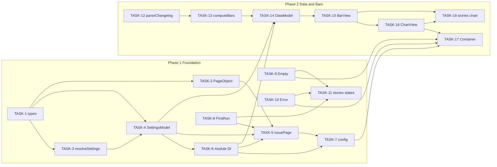
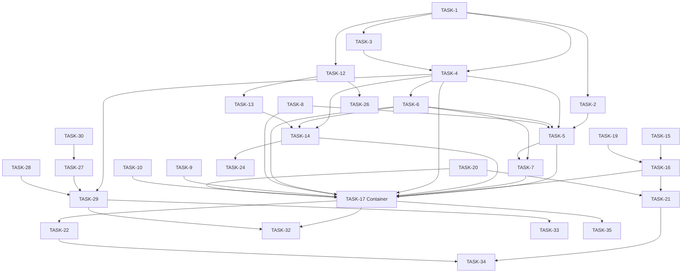

# EPIC-1: Gantt-диаграмма на Issue View

**Status**: IN_PROGRESS
**Created**: 2026-04-11

---

## Цель

Дать на classic Issue View наглядную Gantt-диаграмму по связанным задачам (сабтаски, epic children, issue links) с настраиваемым mapping дат, каскадными настройками в `localStorage`, zoom/pan и BDD-покрытием — без поддержки Cloud/next-gen (см. [requirements.md](./requirements.md)).

## Target Design

См. [target-design.md](./target-design.md) (структура `src/features/gantt-chart/`, модели, контейнеры, utils).

## Архитектура

## Задачи

### Phase 1: Foundation

| # | Task | Описание | Status |
|---|------|----------|--------|
| 1 | [TASK-1](./TASK-1-types-and-tokens.md) | `types.ts`, `tokens.ts` — доменные типы и DI-токены моделей | VERIFICATION |
| 2 | [TASK-2](./TASK-2-issue-view-page-object.md) | `IssueViewPageObject` + unit test | VERIFICATION |
| 3 | [TASK-3](./TASK-3-resolve-settings-util.md) | `resolveSettings` / `buildScopeKey` + tests | VERIFICATION |
| 4 | [TASK-4](./TASK-4-gantt-settings-model.md) | `GanttSettingsModel` + tests | VERIFICATION |
| 5 | [TASK-5](./TASK-5-gantt-chart-issue-page.md) | `GanttChartIssuePage` (PageModification) + test | VERIFICATION |
| 6 | [TASK-6](./TASK-6-gantt-chart-module-di-wiring.md) | `GanttChartModule`: Settings + PageObject; Data/Viewport — в TASK-14/20 | VERIFICATION |
| 7 | [TASK-7](./TASK-7-extension-config-content.md) | `content.ts`, при необходимости manifest/webpack/package (d3) | VERIFICATION |
| 8 | [TASK-8](./TASK-8-first-run-state-view.md) | `FirstRunState` view + test | VERIFICATION |
| 9 | [TASK-9](./TASK-9-empty-state-view.md) | `EmptyState` view + test | VERIFICATION |
| 10 | [TASK-10](./TASK-10-error-state-view.md) | `ErrorState` view + test | VERIFICATION |
| 11 | [TASK-11](./TASK-11-stories-chart-states.md) | Storybook: FirstRun, Empty, Error | VERIFICATION |

*Примечание:* TASK-8–10 вместо одной объединённой задачи — по правилам гранулярности (1–3 файла, TDD).

### Phase 2: Data & Bars

| # | Task | Описание | Status |
|---|------|----------|--------|
| 12 | [TASK-12](./TASK-12-parse-changelog-util.md) | `parseChangelog` (transitions) + tests | VERIFICATION |
| 13 | [TASK-13](./TASK-13-compute-bars-util.md) | `computeBars` + tests | VERIFICATION |
| 14 | [TASK-14](./TASK-14-gantt-data-model.md) | `GanttDataModel` + tests | VERIFICATION |
| 15 | [TASK-15](./TASK-15-gantt-bar-view.md) | `GanttBarView` + test | VERIFICATION |
| 16 | [TASK-16](./TASK-16-gantt-chart-view.md) | `GanttChartView` (SVG, time axis) + test | VERIFICATION |
| 17 | [TASK-17](./TASK-17-gantt-chart-container.md) | `GanttChartContainer` + test | VERIFICATION |
| 18 | [TASK-18](./TASK-18-stories-bar-and-chart.md) | Storybook: `GanttBarView`, `GanttChartView` | VERIFICATION |

### Phase 3: Interactions

| # | Task | Описание | Status |
|---|------|----------|--------|
| 19 | [TASK-19](./TASK-19-compute-time-scale-util.md) | `computeTimeScale` + tests | VERIFICATION |
| 20 | [TASK-20](./TASK-20-gantt-viewport-model.md) | `GanttViewportModel` + tests | VERIFICATION |
| 21 | [TASK-21](./TASK-21-gantt-chart-view-d3-zoom.md) | d3-zoom/pan/scrollbars в `GanttChartView` | VERIFICATION |
| 22 | [TASK-22](./TASK-22-gantt-toolbar.md) | `GanttToolbar` + test | VERIFICATION |
| 23 | [TASK-23](./TASK-23-gantt-tooltip.md) | `GanttTooltip` + test | VERIFICATION |
| 24 | [TASK-24](./TASK-24-missing-dates-section.md) | `MissingDatesSection` + test | VERIFICATION |
| 25 | [TASK-25](./TASK-25-stories-toolbar-tooltip-missing.md) | Storybook: Toolbar, Tooltip, MissingDates | VERIFICATION |

### Phase 4: Settings

| # | Task | Описание | Status |
|---|------|----------|--------|
| 26 | [TASK-26](./TASK-26-compute-status-sections-util.md) | `computeStatusSections` + tests | VERIFICATION |
| 27 | [TASK-27](./TASK-27-gantt-settings-modal.md) | `GanttSettingsModal` view + test | VERIFICATION |
| 28 | [TASK-28](./TASK-28-copy-from-dialog.md) | `CopyFromDialog` view + test | VERIFICATION |
| 29 | [TASK-29](./TASK-29-gantt-settings-container.md) | `GanttSettingsContainer` + test | VERIFICATION |
| 30 | [TASK-30](./TASK-30-link-type-inclusion-ui.md) | UI: subtasks / epic children / issue links + granular link types | VERIFICATION |
| 31 | [TASK-31](./TASK-31-stories-settings-modal-copy-from.md) | Storybook: SettingsModal, CopyFromDialog | VERIFICATION |

### Phase 5: Polish (BDD)

| # | Task | Описание | Status |
|---|------|----------|--------|
| 32 | [TASK-32](./TASK-32-cypress-bdd-display.md) | Cypress BDD — [gantt-chart-display.feature](./gantt-chart-display.feature) | VERIFICATION |
| 33 | [TASK-33](./TASK-33-cypress-bdd-settings.md) | Cypress BDD — [gantt-chart-settings.feature](./gantt-chart-settings.feature) | VERIFICATION |
| 34 | [TASK-34](./TASK-34-cypress-bdd-interactions.md) | Cypress BDD — [gantt-chart-interactions.feature](./gantt-chart-interactions.feature) | VERIFICATION |
| 35 | [TASK-35](./TASK-35-cypress-bdd-errors.md) | Cypress BDD — [gantt-chart-errors.feature](./gantt-chart-errors.feature) | VERIFICATION |

### Phase 6: Bugfixes (post-WIP)

| # | Task | Описание | Status |
|---|------|----------|--------|
| 36 | [TASK-36](./TASK-36-colorpicker-ui.md) | antd `ColorPicker` вместо `Select` для color rules | VERIFICATION |
| 37 | [TASK-37](./TASK-37-color-rules-applied.md) | Применение color rules к колбаскам | VERIFICATION |
| 38 | [TASK-38](./TASK-38-issue-inclusion-filter.md) | Фильтрация задач по типу связи (FR-5) | VERIFICATION |
| 39 | [TASK-39](./TASK-39-jql-support.md) | JQL mode в исключениях и color rules | VERIFICATION |
| 40 | [TASK-40](./TASK-40-settings-zindex.md) | `zIndex` settings modal поверх fullscreen | VERIFICATION |
| 41 | [TASK-41](./TASK-41-tooltips-wiring.md) | Подключение `GanttTooltip` к `GanttChartContainer` | VERIFICATION |

### Phase 7: Bugfixes (post-WIP, 2026-04)

> Хэндофф / план верификации: см. [STATUS-RESUME.md](./STATUS-RESUME.md).

| # | Task | Описание | Status |
|---|------|----------|--------|
| 42 | [TASK-42](./TASK-42-jql-field-resolver-shared.md) | Quick filter `Platform=Backend` не работал — резолв полей через `JiraField` metadata в общий `getFieldValueForJql` (FR-17 / FR-16 / FR-6) | DONE |
| 43 | [TASK-43](./TASK-43-settings-modal-layout-stability.md) | Settings modal — стабильный layout строк quick/exclusion filters при ошибке валидации JQL | DONE |
| 44 | [TASK-44](./TASK-44-quick-filters-jql-search.md) | Quick filters live search — JQL-режим + кнопка `Save as quick filter` (FR-17 расширение) | DONE |
| 45 | [TASK-45](./TASK-45-bdd-coverage-hotkeys-indicator-tags.md) | BDD-coverage для indicator tags no-history / missing-dates (P4); hotkeys (P1) — out-of-scope (lint, не BDD) | DONE |
| 46 | [TASK-46](./TASK-46-feature-md-docs.md) | `src/features/gantt-chart/feature.md` — user-facing описание фичи | DONE |

## Dependencies

**Параллельно (после TASK-1):** TASK-2 и TASK-3.

**Параллельно (после TASK-4 + TASK-6):** TASK-8, TASK-9, TASK-10.

**Параллельно (после TASK-16 + TASK-20):** TASK-22, TASK-23, TASK-24 — по готовности контейнера и данных.

**Последовательно:** TASK-5 → TASK-7; цепочка данных 12→13→14→15→16; затем **TASK-19 → TASK-20** (масштаб/вьюпорт), затем **TASK-17** (контейнер подключает ViewportModel); далее TASK-21 (d3-zoom) и остальное Phase 3; TASK-29 после TASK-27+28; BDD TASK-32…35 после соответствующего UI.

*Нумерация фаз сохранена для трассировки target-design; фактический порядок Phase 2/3: chart views → time scale + viewport model → container → zoom.*

## Acceptance Criteria

Критерии из [requirements.md](./requirements.md), раздел 9:

- [ ] На issue view (classic) под блоком деталей отображается Gantt по связанным задачам.
- [ ] При первом открытии (нет настроек) — экран «Настройте параметры» с кнопкой открытия настроек.
- [ ] Колбаски корректно считаются по mapping (date fields или status transitions).
- [ ] Модалка настроек: start/end mapping, фильтр исключений, label и hover-поля.
- [ ] Настройки в `localStorage` с каскадом global → project → project+issueType и восстановление.
- [ ] Scope selector: Global / Project / Project+IssueType.
- [ ] «Copy from…» копирует настройки между scope.
- [ ] Задачи без end — до «сегодня» с warning.
- [ ] Задачи без start и end — не на диаграмме, сворачиваемая секция с причинами.
- [ ] Toggle разбивки по статусам; цвета секций — `jiraColorScheme`.
- [ ] `IssueSelectorByAttributes` исключает задачи с диаграммы.
- [ ] Hover — тултип с настроенными полями.
- [ ] Zoom: wheel, +/-, dropdown hours/days/weeks/months.
- [ ] Pan: drag + scrollbars.
- [ ] Тулбар: zoom, интервал, настройки, toggle статусов.
- [ ] Производительность: не лагает на 50+ задачах.
- [ ] Пустое состояние без связанных задач.
- [ ] Ошибка загрузки — состояние ошибки с retry.
- [ ] Все тесты проходят; ESLint без ошибок.

---

## Результаты

_(заполняется при закрытии EPIC)_
