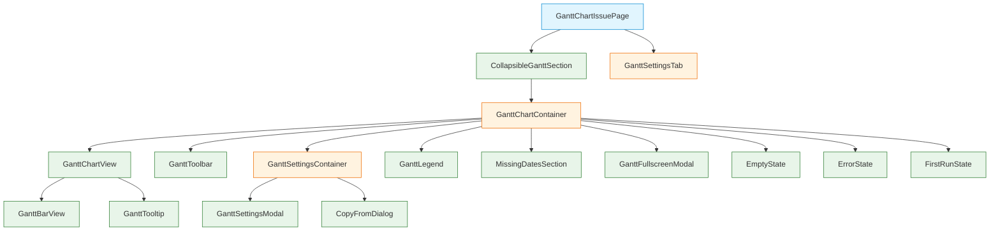
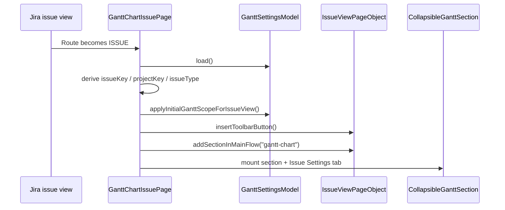
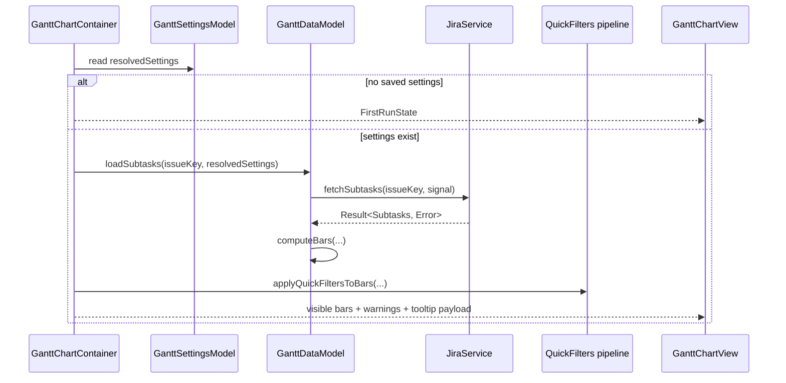

# Current Design: Gantt Chart

Этот документ фиксирует **текущее фактическое решение** для `src/features/gantt-chart/` на ветке `feat/gantt-chart-wip`.

В отличие от `target-design.md`, здесь описана уже **реализованная** архитектура: какие модули есть в коде, как течёт state, где лежит BDD-слой и какие части стоит смотреть на ревью в первую очередь.

## Ключевые принципы

1. **Issue View как точка входа** — фича живёт на маршруте issue view и внедряется как `PageModification`, который добавляет секцию в основной поток страницы и кнопку `Helper` в Jira toolbar.
2. **Разделение по жизненному циклу state** — персистентные настройки, runtime-данные диаграммы, viewport и session-only quick filters разнесены по отдельным моделям.
3. **Cascade settings, direct runtime** — persisted storage разрешается каскадом (`_global` -> `PROJECT` -> `PROJECT:IssueType`), а runtime-chart всегда строится из уже resolved-конфига.
4. **Чистые вычисления вне React** — `resolveSettings`, `computeBars`, `parseChangelog`, `computeStatusSections`, quick-filter matching и time-scale живут в `utils/` / `quickFilters/`, а контейнеры только координируют модели и UI.
5. **BDD ориентирован на UI-contracts** — runtime `.feature` сценарии работают через UI и `data-testid`, а model-only assertions оставлены только там, где interaction через UI нестабилен или не даёт полезного сигнала.

> Общие правила по Container / View / Model / PageObject — см. `docs/architecture_guideline.md`.

## Architecture Diagram

```mermaid
flowchart TB
    subgraph taskDocs [".agents/tasks/gantt-chart/"]
        Epic["EPIC-1 / TASK-1..49"]
        SpecFeatures["design spec .feature files"]
        Target["target-design.md"]
        Current["current-design.md"]
    end

    subgraph entry ["src/features/gantt-chart/"]
        Module["module.ts"]
        Tokens["tokens.ts"]
        Types["types.ts"]
        FeatureDoc["feature.md"]
    end

    subgraph issuePage ["IssuePage/"]
        PM["GanttChartIssuePage"]
        PO["IssueViewPageObject"]
        Section["CollapsibleGanttSection"]
        ChartContainer["GanttChartContainer"]
        SettingsContainer["GanttSettingsContainer"]
        SettingsTab["GanttSettingsTab"]
    end

    subgraph components ["IssuePage/components/"]
        Toolbar["GanttToolbar"]
        ChartView["GanttChartView"]
        BarView["GanttBarView"]
        Tooltip["GanttTooltip"]
        Legend["GanttLegend"]
        Missing["MissingDatesSection"]
        Fullscreen["GanttFullscreenModal"]
        Modal["GanttSettingsModal"]
        CopyFrom["CopyFromDialog"]
        Empty["EmptyState"]
        Error["ErrorState"]
        FirstRun["FirstRunState"]
    end

    subgraph models ["models/"]
        SettingsModel["GanttSettingsModel"]
        DataModel["GanttDataModel"]
        ViewportModel["GanttViewportModel"]
        QuickFiltersModel["GanttQuickFiltersModel"]
    end

    subgraph domain ["utils/ + quickFilters/"]
        Resolve["resolveSettings"]
        InitScope["applyInitialGanttScopeForIssueView"]
        Bars["computeBars"]
        Changelog["parseChangelog"]
        Sections["computeStatusSections"]
        Scale["computeTimeScale / guessInterval"]
        QF["applyQuickFiltersToBars / matchQuickFilter / builtIns"]
    end

    subgraph infra ["shared / infrastructure"]
        Jira["JiraServiceToken"]
        Fields["useGetFields"]
        IssueSettings["registerIssueSettings + IssueSettingsComponent"]
        Hotkeys["stopJiraHotkeys"]
        Jql["simpleJqlParser"]
    end

    subgraph bdd ["IssuePage/features/"]
        RuntimeFeatures["*.feature + *.feature.cy.tsx"]
        Helpers["helpers.tsx"]
        Steps["steps/*.steps.ts"]
    end

    Module --> Tokens
    PM --> PO
    PM --> IssueSettings
    PM --> Section
    Section --> ChartContainer
    SettingsTab --> SettingsContainer
    ChartContainer --> SettingsContainer

    ChartContainer --> SettingsModel
    ChartContainer --> DataModel
    ChartContainer --> ViewportModel
    ChartContainer --> QuickFiltersModel
    ChartContainer --> Fields

    SettingsContainer --> SettingsModel
    SettingsContainer --> DataModel

    SettingsModel --> Resolve
    SettingsModel --> InitScope
    DataModel --> Jira
    DataModel --> Bars
    Bars --> Changelog
    Bars --> Sections
    ChartContainer --> QF
    ChartView --> Scale
    Toolbar --> Jql
    Toolbar --> Hotkeys
    Modal --> Hotkeys

    RuntimeFeatures --> Steps
    Steps --> Helpers
    Helpers --> ChartContainer

    classDef container fill:#4169E1,stroke:#2F4F8F,color:#fff
    classDef view fill:#20B2AA,stroke:#2EB8A8,color:#000
    classDef model fill:#9370DB,stroke:#6A0DAD,color:#fff
    classDef po fill:#FFA500,stroke:#CC8400,color:#000

    class PM,ChartContainer,SettingsContainer,SettingsTab container
    class Toolbar,ChartView,BarView,Tooltip,Legend,Missing,Fullscreen,Modal,CopyFrom,Empty,Error,FirstRun,Section view
    class SettingsModel,DataModel,ViewportModel,QuickFiltersModel model
    class PO po
```




## Component Hierarchy




Легенда: голубой — PageModification, оранжевый — Container, зелёный — View.

## Current File Structure

```text
.agents/tasks/gantt-chart/
├── EPIC-1-gantt-chart.md                     # Эпик и пофазная история
├── TASK-1..49-*.md                           # Декомпозиция реализации и BDD hardening
├── STATUS-RESUME.md                          # Последний handoff / текущее состояние ветки
├── target-design.md                          # Исторический blueprint
├── current-design.md                         # Актуальная архитектура для review
├── request.md                                # Исходный запрос
├── requirements.md                           # Требования
└── gantt-chart-*.feature                     # Design-time spec scenarios

src/features/gantt-chart/
├── feature.md                                # Пользовательское описание фичи
├── index.ts                                  # Public exports
├── module.ts                                 # DI wiring через Module.lazy()
├── module.test.ts                            # Smoke на регистрацию токенов
├── tokens.ts                                 # Model/PageObject tokens
├── types.ts                                  # Доменные типы, scope storage, bars, quick filters
│
├── models/
│   ├── GanttSettingsModel.ts                 # Persistence + cascade + draft lifecycle
│   ├── GanttDataModel.ts                     # Load subtasks + compute bars + cache fields
│   ├── GanttViewportModel.ts                 # Zoom / interval / transform state
│   └── GanttQuickFiltersModel.ts             # Session-only active chips + search mode
│
├── page-objects/
│   └── IssueViewPageObject.ts                # DOM monopoly for issue page insertion points
│
├── utils/
│   ├── resolveSettings.ts                    # Most-specific-wins cascade
│   ├── applyInitialGanttScopeForIssueView.ts # First-open scope selection
│   ├── computeBars.ts                        # Issues -> drawable bars + missing-date rows
│   ├── parseChangelog.ts                     # Jira changelog -> status transitions
│   ├── computeStatusSections.ts              # Transitions -> segmented bar timeline
│   ├── computeTimeScale.ts                   # Domain -> ticks / scale
│   └── guessInterval.ts                      # Auto-fit interval on first load
│
├── quickFilters/
│   ├── builtIns.ts                           # Built-in chips (e.g. unresolved, hide completed)
│   ├── matchQuickFilter.ts                   # One filter matcher
│   └── applyQuickFiltersToBars.ts            # Active chips + search -> visible bars
│
├── hooks/
│   ├── useContainerWidth.ts                  # ResizeObserver width binding
│   ├── useGanttZoom.ts                       # d3-zoom wiring
│   ├── useGanttViewportTransform.ts          # Transform sync
│   └── useGanttViewportInterval.ts           # Interval sync
│
└── IssuePage/
    ├── GanttChartIssuePage.ts                # Route-level entry point
    ├── GanttChartIssuePage.test.ts           # PageModification / DOM contract tests
    ├── components/
    │   ├── CollapsibleGanttSection.tsx       # Section shell
    │   ├── GanttChartContainer.tsx           # Main orchestration container
    │   ├── GanttSettingsContainer.tsx        # Settings orchestration container
    │   ├── GanttSettingsTab.tsx              # Tab adapter for Issue Settings modal
    │   ├── GanttChartView.tsx                # SVG chart, axis, zoom/pan, rows
    │   ├── GanttBarView.tsx                  # Single bar / segmented bar rendering
    │   ├── GanttToolbar.tsx                  # Controls, quick filters, warning tags
    │   ├── GanttTooltip.tsx                  # Hover payload rendering
    │   ├── GanttLegend.tsx                   # Status color legend
    │   ├── MissingDatesSection.tsx           # Issues excluded from chart
    │   ├── GanttFullscreenModal.tsx          # Fullscreen wrapper preserving chart state
    │   ├── GanttSettingsModal.tsx            # Settings form
    │   ├── CopyFromDialog.tsx                # Copy-from-scope modal
    │   ├── EmptyState.tsx                    # Configured but no tasks/bars
    │   ├── ErrorState.tsx                    # Load failure state
    │   ├── FirstRunState.tsx                 # No saved settings yet
    │   └── *.test.tsx / *.stories.tsx        # Unit + Storybook coverage
    │
    └── features/
        ├── gantt-chart-display.feature       # Runtime BDD: display behavior
        ├── gantt-chart-errors.feature        # Runtime BDD: error handling
        ├── gantt-chart-interactions.feature  # Runtime BDD: hover / zoom / interval / fullscreen
        ├── gantt-chart-quick-filters.feature # Runtime BDD: text/JQL search + chips
        ├── gantt-chart-settings.feature      # Runtime BDD: settings UI, scope, copy-from
        ├── *.feature.cy.tsx                  # Cypress entry points per feature file
        ├── helpers.tsx                       # Shared test harness / DI / storage helpers
        └── steps/*.steps.ts                  # Step definitions split by domain
```

## Component Specifications

### `GanttChartIssuePage`

Responsibility: route-level bootstrapper, который гарантирует DI-модуль, вычисляет issue context, регистрирует вкладку `Gantt Chart` в issue settings и монтирует коллапсируемую секцию диаграммы в DOM.

```ts
export type GanttChartIssuePageInitData = {
  issueKey: string;
};

export class GanttChartIssuePage extends PageModification<
  GanttChartIssuePageInitData | undefined,
  Element
> {}
```

### `IssueViewPageObject`

Responsibility: единственная точка работы с DOM Jira issue view для вставки секции Gantt и toolbar-host под кнопку `Helper`.

```ts
export interface IIssueViewPageObject {
  readonly selectors: {
    readonly detailsBlock: string;
    readonly ganttContainer: string;
    readonly issueType: string;
    readonly attachmentModule: string;
    readonly toolbar2Secondary: string;
    readonly toolbarButton: string;
  };
  insertGanttContainer(): HTMLElement | null;
  removeGanttContainer(): void;
  getIssueType(): string | null;
  addSectionInMainFlow(id: string): HTMLElement | null;
  removeSectionInMainFlow(id: string): void;
  insertToolbarButton(): HTMLElement | null;
  removeToolbarButton(): void;
}
```

### `GanttChartContainer`

Responsibility: координирует четыре модели (`settings`, `data`, `viewport`, `quickFilters`), выбирает UI state (first-run / loading / error / chart), применяет quick filters и передаёт готовый view-model в presentational компоненты.

```ts
export interface GanttChartContainerProps {
  issueKey: string;
  container: Container;
}
```

### `GanttSettingsContainer`

Responsibility: связывает `GanttSettingsModel` с `GanttSettingsModal` и `CopyFromDialog`, синхронизирует scope picker с effective tier и инициирует `dataModel.recompute()` после сохранения.

```ts
export interface GanttSettingsContainerProps {
  container: Container;
  visible: boolean;
  onClose: () => void;
}
```

### `GanttToolbar`

Responsibility: отрисовывает control plane диаграммы: zoom, interval, fullscreen, settings, warning tags, quick-filter chips, text/JQL search и сохранение JQL как custom chip.

```ts
export interface GanttToolbarProps {
  zoomLevel: number;
  interval: TimeInterval;
  statusBreakdownEnabled: boolean;
  statusBreakdownAvailability?: {
    total: number;
    tasksWithoutHistory: Array<{ key: string; summary: string }>;
  };
  missingDateIssues?: MissingDateIssue[];
  quickFilters?: ReadonlyArray<QuickFilter>;
  activeQuickFilterIds?: string[];
  quickFilterSearchQuery?: string;
  quickFilterSearchMode?: QuickFilterSearchMode;
  hiddenCount?: number;
  onZoomIn: () => void;
  onZoomOut: () => void;
  onZoomReset: () => void;
  onIntervalChange: (interval: TimeInterval) => void;
  onToggleStatusBreakdown: () => void;
  onOpenSettings: () => void;
  onOpenFullscreen?: () => void;
  onQuickFilterToggle?: (id: string) => void;
  onQuickFilterSearchChange?: (value: string) => void;
  onQuickFilterSearchModeChange?: (mode: QuickFilterSearchMode) => void;
  onQuickFilterClearAll?: () => void;
  onSaveJqlAsQuickFilter?: (value: { name: string; jql: string }) => void;
}
```

### `GanttChartView`

Responsibility: рисует SVG-диаграмму, time axis, weekend shading, today marker, rows и прокидывает hover/click наверх; zoom/pan wiring подключается через `viewportModel`.

```ts
export interface GanttChartViewProps {
  bars: GanttBar[];
  showStatusSections: boolean;
  viewportModel?: GanttViewportModel;
  onBarHover?: (bar: GanttBar | null, event?: React.MouseEvent) => void;
  onBarClick?: (bar: GanttBar) => void;
  minHeightPx?: number;
  fillVerticalSpace?: boolean;
}
```

### `GanttSettingsModal`

Responsibility: рендерит форму настроек scope-specific Gantt configuration: date mappings, tooltip fields, color rules, quick filters, exclusion filters, inclusion flags и issue-link restrictions.

```ts
export interface GanttSettingsModalProps {
  visible: boolean;
  draft: GanttScopeSettings | null;
  currentScope: SettingsScope;
  onDraftChange: (patch: Partial<GanttScopeSettings>) => void;
  onSave: () => void;
  onCancel: () => void;
  onScopeLevelChange: (level: SettingsScope["level"]) => void;
  onCopyFrom: () => void;
}
```

## State Changes

### `GanttSettingsModel`

Responsibility: persistence и editing lifecycle для storage tiers, draft state, status breakdown preference и resolved settings.

```ts
export class GanttSettingsModel {
  storage: GanttSettingsStorage;
  currentScope: SettingsScope;
  draftSettings: GanttScopeSettings | null;
  statusBreakdownEnabled: boolean;
  preferredScopeLevel: SettingsScope["level"] | null;
  contextProjectKey: string;
  contextIssueType: string;

  get resolvedSettings(): GanttScopeSettings | null;
  get isConfigured(): boolean;
  get effectiveScopeLevel(): SettingsScope["level"] | null;
  get effectiveScopeLevelForCurrentScope(): SettingsScope["level"] | null;

  load(): void;
  save(): void;
  setScope(scope: SettingsScope): void;
  setScopeLevel(level: SettingsScope["level"]): void;
  openDraft(): void;
  syncScopeToEffectiveAndOpenDraft(): void;
  saveDraft(): void;
  appendQuickFilterToCurrentScope(qf: QuickFilter): void;
  copyFromScope(sourceKey: ScopeKey): void;
  toggleStatusBreakdown(): void;
  reset(): void;
}
```

### `GanttDataModel`

Responsibility: загрузка related issues через Jira service, кеширование сырого payload, recompute bars при изменении settings/field metadata и хранение derived missing-date rows.

```ts
export class GanttDataModel {
  loadingState: LoadingState;
  bars: GanttBar[];
  missingDateIssues: MissingDateIssue[];
  error: string | null;

  loadSubtasks(issueKey: string, settings: GanttScopeSettings): Promise<void>;
  getIssuesByKey(): ReadonlyMap<string, GanttIssueInput>;
  recompute(settings: GanttScopeSettings): void;
  replaceCachedIssuesForTests(issues: JiraIssueMapped[]): void;
  setFields(fields: ReadonlyArray<JiraField>, settings: GanttScopeSettings | null): void;
  reset(): void;
}
```

### `GanttViewportModel`

Responsibility: session-only viewport state диаграммы: zoom level, interval и transform; reused inline/fullscreen.

```ts
export class GanttViewportModel {
  zoomLevel: number;
  interval: TimeInterval;
  transformX: number;

  zoomIn(): void;
  zoomOut(): void;
  resetZoom(): void;
  setZoomLevel(level: number): void;
  setInterval(interval: TimeInterval): void;
  setTransformX(x: number): void;
  reset(): void;
}
```

### `GanttQuickFiltersModel`

Responsibility: session-only active chip ids и live search mode/query; preset definitions сами живут в resolved settings и built-ins.

```ts
export type QuickFilterSearchMode = "text" | "jql";

export class GanttQuickFiltersModel {
  activeIds: string[];
  searchQuery: string;
  searchMode: QuickFilterSearchMode;

  isActive(id: string): boolean;
  toggle(id: string): void;
  setSearch(query: string): void;
  setSearchMode(mode: QuickFilterSearchMode): void;
  pruneMissingIds(knownIds: ReadonlyArray<string>): void;
  clear(): void;
}
```

## Runtime Flows

### Issue page bootstrap




### Chart rendering




## Review Hotspots

1. `**GanttChartContainer.tsx**` — здесь больше всего orchestration-логики: initial load, fields sync, auto-interval, quick-filter pipeline, warning tags, fullscreen state. Это главный кандидат на review за “слишком толстый container”.
2. `**GanttSettingsModal.tsx**` — самый тяжёлый UI-файл фичи: несколько секций формы, много локальных helper-типов и i18n. Хорошо смотреть на читаемость, cohesion и возможное разбиение.
3. `**GanttDataModel.ts` + `computeBars.ts**` — критичный domain pipeline: filtering related issues, missing-date classification, changelog segmentation, color rules, issue-link filtering.
4. `**GanttToolbar.tsx` + `GanttQuickFiltersModel.ts` + `quickFilters/**` — отдельный мини-домен с text/JQL режимами, сохранением custom chips и warning-tag UX.
5. `**IssueViewPageObject.ts` + `GanttChartIssuePage.ts**` — review на корректность DOM integration и page-modification contracts с Jira.

## BDD Review Map

### Runtime BDD feature files

- `src/features/gantt-chart/IssuePage/features/gantt-chart-display.feature`
- `src/features/gantt-chart/IssuePage/features/gantt-chart-errors.feature`
- `src/features/gantt-chart/IssuePage/features/gantt-chart-interactions.feature`
- `src/features/gantt-chart/IssuePage/features/gantt-chart-quick-filters.feature`
- `src/features/gantt-chart/IssuePage/features/gantt-chart-settings.feature`

### Cypress entrypoints

- `src/features/gantt-chart/IssuePage/features/gantt-chart-display.feature.cy.tsx`
- `src/features/gantt-chart/IssuePage/features/gantt-chart-errors.feature.cy.tsx`
- `src/features/gantt-chart/IssuePage/features/gantt-chart-interactions.feature.cy.tsx`
- `src/features/gantt-chart/IssuePage/features/gantt-chart-quick-filters.feature.cy.tsx`
- `src/features/gantt-chart/IssuePage/features/gantt-chart-settings.feature.cy.tsx`

### Step definitions

- `src/features/gantt-chart/IssuePage/features/steps/common.steps.ts`
- `src/features/gantt-chart/IssuePage/features/steps/errors.steps.ts`
- `src/features/gantt-chart/IssuePage/features/steps/interactions.steps.ts`
- `src/features/gantt-chart/IssuePage/features/steps/quickFilters.steps.ts`
- `src/features/gantt-chart/IssuePage/features/steps/settings.steps.ts`

### Shared BDD harness

- `src/features/gantt-chart/IssuePage/features/helpers.tsx`
- `src/features/gantt-chart/IssuePage/features/issueFromRow.compute.test.ts`

### Design-time spec files

- `.agents/tasks/gantt-chart/gantt-chart-display.feature`
- `.agents/tasks/gantt-chart/gantt-chart-errors.feature`
- `.agents/tasks/gantt-chart/gantt-chart-interactions.feature`
- `.agents/tasks/gantt-chart/gantt-chart-quick-filters.feature`
- `.agents/tasks/gantt-chart/gantt-chart-settings.feature`

## Benefits

- Есть чёткое разделение между persisted settings, runtime data, viewport и session-only quick filters.
- BDD покрытие привязано к пользовательским контрактам, а не только к моделям.
- DI boundaries понятны: Jira API идёт через `JiraService`, DOM — через `IssueViewPageObject`, pure domain rules — через `utils/` и `quickFilters/`.
- Для ревью можно отдельно смотреть три слоя: page integration, domain pipeline и BDD/UI contracts.

