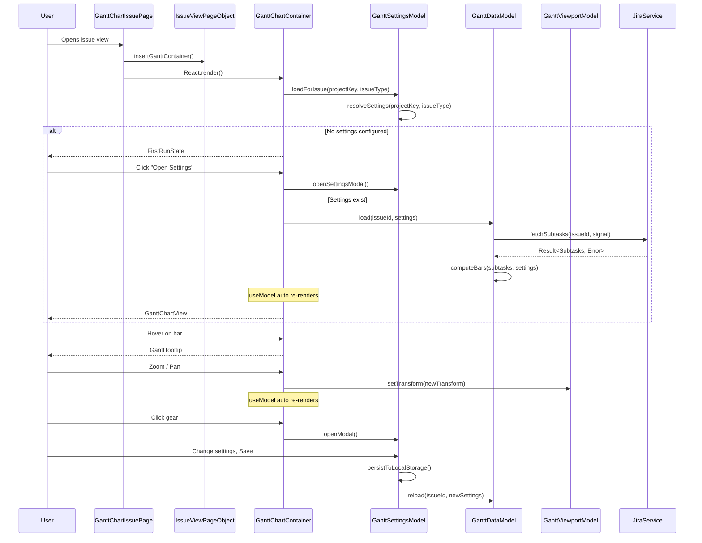
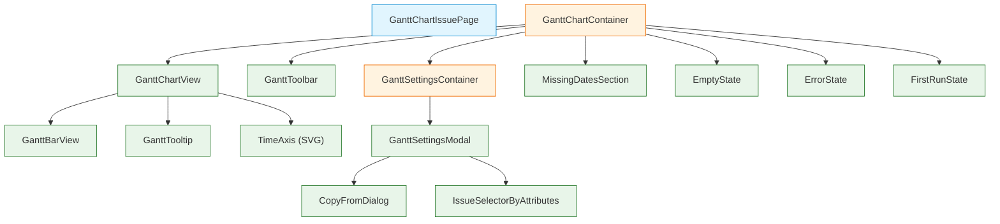

# Target Design: Gantt Chart

Этот документ описывает целевую архитектуру для `src/features/gantt-chart/` — Gantt-диаграммы по связанным задачам на Issue View.

## Ключевые принципы

1. **Каскадные настройки в localStorage** — три уровня специфичности (`_global` → `PROJECT` → `PROJECT:IssueType`), разрешение most-specific-wins. Разрешение — чистая функция, хранение — Model.
2. **Changelog как источник дат** — старт/конец бара определяются либо по date-полям задачи, либо по переходам статусов из changelog. Парсинг changelog — чистые функции в `utils/`.
3. **SVG + d3 для рендеринга** — `d3-scale` для оси времени, `d3-zoom` для zoom/pan. React владеет SVG-структурой, d3 — только вычислениями (scales, transforms).
4. **Три модели по жизненному циклу** — `GanttSettingsModel` (настройки из localStorage), `GanttDataModel` (загрузка и трансформация данных), `GanttViewportModel` (zoom/pan state). Все живут пока открыта issue view.
5. **PageObject для DOM issue view** — вставка контейнера для Gantt и кнопки настроек через `IssueViewPageObject`, не напрямую.

> Общие архитектурные принципы — см. docs/architecture_guideline.md

## Architecture Diagram

```mermaid
flowchart TB
    subgraph content ["content.ts"]
        PM["GanttChartIssuePage (PageModification)"]
        style PM fill:#FFA500,color:black
    end

    subgraph gantt/models ["models/"]
        SettingsModel["GanttSettingsModel"]
        style SettingsModel fill:#9370DB,color:white
        DataModel["GanttDataModel"]
        style DataModel fill:#9370DB,color:white
        ViewportModel["GanttViewportModel"]
        style ViewportModel fill:#9370DB,color:white
    end

    subgraph gantt/pageObjects ["page-objects/"]
        PageObject["IssueViewPageObject"]
        style PageObject fill:#FFA500,color:black
    end

    subgraph gantt/IssuePage ["IssuePage/"]
        Container["GanttChartContainer"]
        style Container fill:#4169E1,color:white

        subgraph gantt/IssuePage/components ["components/"]
            ChartView["GanttChartView"]
            style ChartView fill:#20B2AA,color:white
            BarView["GanttBarView"]
            style BarView fill:#20B2AA,color:white
            Toolbar["GanttToolbar"]
            style Toolbar fill:#20B2AA,color:white
            Tooltip["GanttTooltip"]
            style Tooltip fill:#20B2AA,color:white
            MissingDates["MissingDatesSection"]
            style MissingDates fill:#20B2AA,color:white
            EmptyState["EmptyState"]
            style EmptyState fill:#20B2AA,color:white
            ErrorState["ErrorState"]
            style ErrorState fill:#20B2AA,color:white
            FirstRun["FirstRunState"]
            style FirstRun fill:#20B2AA,color:white
        end
    end

    subgraph gantt/SettingsModal ["SettingsModal/"]
        SettingsContainer["GanttSettingsContainer"]
        style SettingsContainer fill:#4169E1,color:white
        SettingsView["GanttSettingsModal"]
        style SettingsView fill:#20B2AA,color:white
        CopyFromView["CopyFromDialog"]
        style CopyFromView fill:#20B2AA,color:white
    end

    subgraph gantt/utils ["utils/"]
        BarCalc["computeBars"]
        ChangelogParser["parseChangelog"]
        SettingsResolver["resolveSettings"]
        StatusSections["computeStatusSections"]
    end

    subgraph shared ["shared/ (reused)"]
        JiraService["JiraService"]
        style JiraService fill:#3CB371,color:white
        IssueSelector["IssueSelectorByAttributes"]
        style IssueSelector fill:#20B2AA,color:white
        ColorSchemas["jiraColorScheme"]
    end

    PM -->|"React.render"| Container
    PM -->|inject| PageObject
    Container -->|useModel| SettingsModel
    Container -->|useModel| DataModel
    Container -->|useModel| ViewportModel
    Container --> ChartView
    Container --> Toolbar
    Container --> MissingDates
    Container --> EmptyState
    Container --> ErrorState
    Container --> FirstRun
    ChartView --> BarView
    ChartView --> Tooltip
    Container -->|"opens"| SettingsContainer
    SettingsContainer -->|useModel| SettingsModel
    SettingsContainer --> SettingsView
    SettingsView --> IssueSelector
    SettingsView -->|"opens"| CopyFromView
    DataModel -->|constructor DI| JiraService
    DataModel -->|import| BarCalc
    DataModel -->|import| ChangelogParser
    DataModel -->|import| StatusSections
    SettingsModel -->|import| SettingsResolver
    BarView -->|import| ColorSchemas
```



## Data Flow



## Component Hierarchy



**Легенда**: голубой — PageModification, оранжевый — Container, зеленый — View

## Target File Structure

```
src/features/gantt-chart/
├── index.ts                              # Public exports
├── types.ts                              # Domain types with JSDoc
├── tokens.ts                             # DI Tokens (createModelToken)
├── module.ts                             # GanttChartModule extends Module
├── module.test.ts                        # Module registration tests
│
├── models/
│   ├── GanttSettingsModel.ts             # Model: cascading settings from localStorage
│   ├── GanttSettingsModel.test.ts        # Tests: load, save, resolve, scope CRUD
│   ├── GanttDataModel.ts                 # Model: load subtasks, compute bars
│   ├── GanttDataModel.test.ts            # Tests: load, transform, edge cases
│   ├── GanttViewportModel.ts             # Model: zoom level, pan transform
│   └── GanttViewportModel.test.ts        # Tests: zoom, pan, interval switch
│
├── page-objects/
│   ├── IssueViewPageObject.ts            # PageObject: insert Gantt container into DOM
│   └── IssueViewPageObject.test.ts       # Tests: DOM insertion
│
├── IssuePage/
│   ├── GanttChartIssuePage.ts            # PageModification: entry point on Routes.ISSUE
│   ├── GanttChartContainer.tsx           # Container: connects models to views
│   ├── GanttChartContainer.cy.tsx        # Cypress component tests
│   └── components/
│       ├── GanttChartView.tsx            # View: main SVG chart (axes, bars, scrollbars)
│       ├── GanttChartView.stories.tsx    # Storybook: all chart states
│       ├── GanttChartView.module.css     # Styles for chart layout
│       ├── GanttBarView.tsx              # View: single bar (solid or status-segmented)
│       ├── GanttBarView.stories.tsx      # Storybook: bar variants
│       ├── GanttBarView.module.css       # Styles for bar
│       ├── GanttToolbar.tsx              # View: zoom controls, interval dropdown, toggles
│       ├── GanttToolbar.stories.tsx      # Storybook: toolbar states
│       ├── GanttTooltip.tsx              # View: hover tooltip on bar
│       ├── GanttTooltip.stories.tsx      # Storybook: tooltip variants
│       ├── GanttTooltip.module.css       # Styles for tooltip
│       ├── MissingDatesSection.tsx       # View: collapsible section for issues without dates
│       ├── MissingDatesSection.stories.tsx
│       ├── EmptyState.tsx                # View: no subtasks message
│       ├── ErrorState.tsx                # View: error message + retry button
│       └── FirstRunState.tsx             # View: first-run CTA + open settings button
│
├── SettingsModal/
│   ├── GanttSettingsContainer.tsx        # Container: settings modal logic
│   ├── GanttSettingsContainer.cy.tsx     # Cypress component tests
│   └── components/
│       ├── GanttSettingsModal.tsx         # View: settings form
│       ├── GanttSettingsModal.stories.tsx
│       ├── GanttSettingsModal.module.css
│       ├── CopyFromDialog.tsx            # View: "Copy from..." scope picker
│       └── CopyFromDialog.stories.tsx
│
└── utils/
    ├── computeBars.ts                    # Pure: subtasks + settings → GanttBar[]
    ├── computeBars.test.ts
    ├── parseChangelog.ts                 # Pure: changelog → status transitions with timestamps
    ├── parseChangelog.test.ts
    ├── computeStatusSections.ts          # Pure: transitions → colored bar sections
    ├── computeStatusSections.test.ts
    ├── resolveSettings.ts               # Pure: cascading settings resolution
    ├── resolveSettings.test.ts
    ├── computeTimeScale.ts              # Pure: date range + viewport → d3 scale config
    └── computeTimeScale.test.ts
```

## Component Specifications

### types.ts — Domain Types

```typescript
/**
 * Source for start/end date of a Gantt bar.
 *
 * - 'dateField': read date directly from issue field (e.g. Created, Due Date)
 * - 'statusTransition': use first transition to the specified status from changelog
 */
export type DateMappingSource = 'dateField' | 'statusTransition';

/**
 * Mapping configuration for bar start or end.
 *
 * @example Date field mapping
 * { source: 'dateField', fieldId: 'created' }
 *
 * @example Status transition mapping
 * { source: 'statusTransition', statusName: 'Done' }
 */
export type DateMapping = {
  source: DateMappingSource;
  /** Jira field ID — used when source = 'dateField' */
  fieldId?: string;
  /** Status name — used when source = 'statusTransition' */
  statusName?: string;
};

/**
 * Issue exclusion filter configuration.
 * Reuses IssueSelectorByAttributes modes.
 */
export type ExclusionFilter = {
  mode: 'field' | 'jql';
  fieldId?: string;
  value?: string;
  jql?: string;
};

/**
 * Settings for a single scope (global, project, or project+issueType).
 */
export type GanttScopeSettings = {
  startMapping: DateMapping;
  endMapping: DateMapping;
  /** Jira field ID for bar label. Default: 'key' (issue key). */
  labelFieldId: string;
  /** Jira field IDs to show in hover tooltip. */
  tooltipFieldIds: string[];
  /** Filter to exclude issues from the chart. null = no filter. */
  exclusionFilter: ExclusionFilter | null;
};

/**
 * All gantt settings stored in localStorage under key 'jh-gantt-settings'.
 *
 * Keys:
 * - '_global' — default settings for all projects
 * - 'PROJECT-KEY' — project-level override
 * - 'PROJECT-KEY:IssueType' — project + issue type override
 *
 * Resolution order (most specific wins):
 * 'PROJECT-KEY:IssueType' > 'PROJECT-KEY' > '_global'
 */
export type GanttSettingsStorage = Record<string, GanttScopeSettings>;

/** Scope levels for settings */
export type SettingsScope = {
  level: 'global' | 'project' | 'projectIssueType';
  projectKey?: string;
  issueType?: string;
};

/**
 * Scope key as stored in GanttSettingsStorage.
 * @example '_global', 'PROJECT-A', 'PROJECT-A:Story'
 */
export type ScopeKey = string;

/** Time interval for the chart axis */
export type TimeInterval = 'hours' | 'days' | 'weeks' | 'months';

/**
 * Status category mapped to progress display.
 * Uses jiraColorScheme from sub-tasks-progress.
 */
export type BarStatusCategory = 'blocked' | 'todo' | 'inProgress' | 'done';

/**
 * A status section within a bar (when status breakdown is enabled).
 * Represents a time range the issue spent in a particular status.
 */
export type BarStatusSection = {
  statusName: string;
  category: BarStatusCategory;
  startDate: Date;
  endDate: Date;
};

/**
 * A status transition event parsed from changelog.
 */
export type StatusTransition = {
  timestamp: Date;
  fromStatus: string;
  toStatus: string;
  fromCategory: string;
  toCategory: string;
};

/**
 * Reason why an issue is not displayed on the chart.
 */
export type MissingDateReason = 'noStartDate' | 'noEndDate' | 'noStartAndEndDate' | 'excluded';

/**
 * An issue that cannot be shown on the chart.
 */
export type MissingDateIssue = {
  issueKey: string;
  summary: string;
  reason: MissingDateReason;
};

/**
 * A computed Gantt bar ready for rendering.
 * Produced by computeBars() from subtasks + settings.
 */
export type GanttBar = {
  issueKey: string;
  issueId: string;
  label: string;
  startDate: Date;
  endDate: Date;
  /** true when endDate was substituted with "today" due to missing end */
  isOpenEnded: boolean;
  statusSections: BarStatusSection[];
  tooltipFields: Record<string, string>;
  statusCategory: BarStatusCategory;
};

/**
 * Result of computeBars(): bars to render + issues that couldn't be shown.
 */
export type ComputeBarsResult = {
  bars: GanttBar[];
  missingDateIssues: MissingDateIssue[];
};

/** Loading state for async operations */
export type LoadingState = 'initial' | 'loading' | 'loaded' | 'error';
```

### GanttSettingsModel

**Responsibility**: Load, resolve, edit, and persist cascading Gantt settings from localStorage.

```typescript
import type { GanttScopeSettings, GanttSettingsStorage, ScopeKey, SettingsScope } from '../types';
import type { Logger } from 'src/shared/Logger';
import type { JiraField } from 'src/shared/jira/types';

/**
 * @module GanttSettingsModel
 *
 * Manages cascading Gantt chart settings persisted in localStorage.
 * Three scope levels: global → project → project+issueType.
 *
 * ## Usage
 * ```ts
 * const { useModel } = useDi().inject(ganttSettingsModelToken);
 * const settings = useModel();
 * settings.loadForIssue('PROJECT-A', 'Story');
 * ```
 */
export class GanttSettingsModel {
  // === State ===
  
  /** All stored settings by scope key */
  allSettings: GanttSettingsStorage = {};
  /** Resolved settings for current issue context */
  resolvedSettings: GanttScopeSettings | null = null;
  /** Currently active scope key */
  activeScopeKey: ScopeKey | null = null;
  /** Current issue context */
  currentProjectKey: string | null = null;
  currentIssueType: string | null = null;
  /** Available Jira fields for settings dropdowns */
  availableFields: JiraField[] = [];
  /** Whether settings modal is open */
  isModalOpen: boolean = false;
  /** Draft settings being edited in modal */
  draftSettings: GanttScopeSettings | null = null;
  /** Scope being edited in modal */
  draftScopeKey: ScopeKey | null = null;
  /** Whether status breakdown toggle is enabled */
  statusBreakdownEnabled: boolean = false;

  constructor(
    private logger: Logger
  ) {}

  // === Commands ===

  /** Load settings from localStorage and resolve for given issue context */
  loadForIssue(projectKey: string, issueType: string): void;
  /** Open settings modal with current resolved settings as draft */
  openModal(): void;
  /** Close settings modal, discard draft */
  closeModal(): void;
  /** Update draft scope key and re-resolve draft settings */
  setDraftScope(scopeKey: ScopeKey): void;
  /** Copy settings from another scope into current draft */
  copyFromScope(sourceScopeKey: ScopeKey): void;
  /** Update draft settings field */
  updateDraft(patch: Partial<GanttScopeSettings>): void;
  /** Save draft to localStorage and update resolved settings */
  saveDraft(): void;
  /** Toggle status breakdown on/off */
  toggleStatusBreakdown(): void;
  /** Set available fields (loaded from JiraService) */
  setAvailableFields(fields: JiraField[]): void;
  /** Reset to initial state */
  reset(): void;

  // === Queries ===

  /** Whether settings exist (global scope is configured) */
  get isConfigured(): boolean;
  /** All existing scope keys */
  get existingScopeKeys(): ScopeKey[];
}
```

### GanttDataModel

**Responsibility**: Load subtasks via JiraService, compute bars using settings, track loading state.

```typescript
import type { Result } from 'ts-results';
import type { GanttBar, ComputeBarsResult, LoadingState, GanttScopeSettings, MissingDateIssue } from '../types';
import type { IJiraService } from 'src/shared/jira/jiraService';
import type { Logger } from 'src/shared/Logger';
import type { JiraIssueMapped } from 'src/shared/jira/types';

/**
 * @module GanttDataModel
 *
 * Loads subtasks from Jira and transforms them into renderable bars.
 * Depends on resolved settings for date mapping and filters.
 *
 * ## Usage
 * ```ts
 * const { useModel } = useDi().inject(ganttDataModelToken);
 * const data = useModel();
 * await data.load('PROJ-123', resolvedSettings);
 * ```
 */
export class GanttDataModel {
  // === State ===

  state: LoadingState = 'initial';
  error: string | null = null;
  bars: GanttBar[] = [];
  missingDateIssues: MissingDateIssue[] = [];
  /** Raw subtasks from Jira (kept for re-computation on settings change) */
  rawSubtasks: JiraIssueMapped[] = [];

  private abortController: AbortController | null = null;

  constructor(
    private jiraService: IJiraService,
    private logger: Logger
  ) {}

  // === Commands ===

  /** Load subtasks and compute bars */
  async load(issueId: string, settings: GanttScopeSettings): Promise<Result<void, Error>>;
  /** Re-compute bars from cached subtasks with new settings (no API call) */
  recompute(settings: GanttScopeSettings): void;
  /** Abort pending request and reset */
  abort(): void;
  /** Reset to initial state */
  reset(): void;

  // === Queries ===

  get isEmpty(): boolean;
  get isLoading(): boolean;
  get hasError(): boolean;
  /** Date range across all bars (for time axis) */
  get dateRange(): { min: Date; max: Date } | null;
}
```

### GanttViewportModel

**Responsibility**: Track zoom level, pan transform, and time interval for the chart viewport.

```typescript
import type { TimeInterval } from '../types';

/**
 * @module GanttViewportModel
 *
 * Manages viewport state: zoom, pan, and time interval.
 *
 * ## Usage
 * ```ts
 * const { useModel } = useDi().inject(ganttViewportModelToken);
 * const viewport = useModel();
 * viewport.zoomIn();
 * ```
 */
export class GanttViewportModel {
  // === State ===

  /** Current zoom scale (1.0 = default) */
  zoomScale: number = 1.0;
  /** Pan offset in pixels [x, y] */
  panOffset: [number, number] = [0, 0];
  /** Selected time interval for axis labels */
  timeInterval: TimeInterval = 'days';
  /** d3-zoom transform (serializable) */
  transform: { k: number; x: number; y: number } = { k: 1, x: 0, y: 0 };

  // === Commands ===

  zoomIn(): void;
  zoomOut(): void;
  setTimeInterval(interval: TimeInterval): void;
  setTransform(transform: { k: number; x: number; y: number }): void;
  resetViewport(): void;
  reset(): void;
}
```

### IssueViewPageObject

**Responsibility**: Insert/remove Gantt chart container and settings button into issue view DOM.

```typescript
import type { Token } from 'dioma';

/**
 * @module IssueViewPageObject
 *
 * Monopoly on DOM operations for issue view page.
 * Inserts Gantt container after #details-module.
 */
export class IssueViewPageObject {
  readonly selectors: {
    detailsBlock: string;
    ganttContainer: string;
  };

  /** Insert a container div for Gantt chart after details block. Returns the container element. */
  insertGanttContainer(): HTMLElement | null;
  /** Remove Gantt chart container from DOM */
  removeGanttContainer(): void;
}

export declare const issueViewPageObjectToken: Token<IssueViewPageObject>;
```

### GanttChartIssuePage (PageModification)

**Responsibility**: Entry point on `Routes.ISSUE`. Waits for DOM, inserts container, renders React app.

```typescript
import { PageModification } from 'src/shared/PageModification';
import type { JiraIssueMapped } from 'src/shared/jira/types';

/**
 * @module GanttChartIssuePage
 *
 * PageModification для issue view page.
 * Lifecycle: waitForLoading → loadData → apply.
 *
 * Registered in content.ts under Routes.ISSUE.
 */
export class GanttChartIssuePage extends PageModification<JiraIssueMapped, Element> {
  getModificationId(): string;  // 'gantt-chart'
  waitForLoading(): Promise<Element>;  // waits for #details-module
  loadData(): Promise<JiraIssueMapped | undefined>;  // fetches current issue
  apply(data: JiraIssueMapped, element: Element): void;  // inserts container, renders React
  clear(): void;  // unmounts React, removes container
}
```

### GanttChartContainer

**Responsibility**: Connect all three models to view components. Orchestrate loading and state branching.

```typescript
/**
 * Container component that connects GanttSettingsModel, GanttDataModel,
 * and GanttViewportModel to view components.
 *
 * Renders the appropriate state: FirstRun | Loading | Error | Empty | Chart.
 */
export type GanttChartContainerProps = {
  issueId: string;
  projectKey: string;
  issueType: string;
};
```

### GanttSettingsContainer

**Responsibility**: Connect GanttSettingsModel to settings modal views. Handle scope selection, draft editing, save/cancel.

```typescript
/**
 * Container for the settings modal.
 * Reads/writes GanttSettingsModel draft state.
 */
export type GanttSettingsContainerProps = {
  onClose: () => void;
};
```

### GanttChartView

**Responsibility**: Render SVG chart with time axis, bars, and scrollbars. Apply d3-zoom behavior.

```typescript
export type GanttChartViewProps = {
  bars: GanttBar[];
  dateRange: { min: Date; max: Date };
  transform: { k: number; x: number; y: number };
  statusBreakdownEnabled: boolean;
  onTransformChange: (transform: { k: number; x: number; y: number }) => void;
  onBarHover: (bar: GanttBar | null, event: React.MouseEvent) => void;
};
```

### GanttBarView

**Responsibility**: Render a single bar (solid or segmented by status).

```typescript
export type GanttBarViewProps = {
  bar: GanttBar;
  x: number;
  width: number;
  y: number;
  height: number;
  statusBreakdownEnabled: boolean;
  onMouseEnter: (event: React.MouseEvent) => void;
  onMouseLeave: () => void;
};
```

### GanttToolbar

**Responsibility**: Render zoom controls, interval dropdown, status breakdown toggle, settings gear button.

```typescript
export type GanttToolbarProps = {
  timeInterval: TimeInterval;
  statusBreakdownEnabled: boolean;
  onZoomIn: () => void;
  onZoomOut: () => void;
  onIntervalChange: (interval: TimeInterval) => void;
  onStatusBreakdownToggle: () => void;
  onOpenSettings: () => void;
};
```

### GanttTooltip

**Responsibility**: Render a positioned tooltip with issue details on bar hover.

```typescript
export type GanttTooltipProps = {
  issueKey: string;
  fields: Record<string, string>;
  position: { x: number; y: number };
};
```

### MissingDatesSection

**Responsibility**: Render collapsible section listing issues that couldn't be shown on the chart.

```typescript
export type MissingDatesSectionProps = {
  issues: MissingDateIssue[];
};
```

### EmptyState

**Responsibility**: Render "No related issues" message.

```typescript
export type EmptyStateProps = {
  message: string;
};
```

### ErrorState

**Responsibility**: Render error message with retry button.

```typescript
export type ErrorStateProps = {
  error: string;
  onRetry: () => void;
};
```

### FirstRunState

**Responsibility**: Render first-run CTA prompting user to configure settings.

```typescript
export type FirstRunStateProps = {
  onOpenSettings: () => void;
};
```

### GanttSettingsModal

**Responsibility**: Render settings form (start/end mapping, label, tooltip fields, exclusion filter, scope selector).

```typescript
export type GanttSettingsModalProps = {
  draft: GanttScopeSettings;
  scopeKey: ScopeKey;
  existingScopeKeys: ScopeKey[];
  availableFields: JiraField[];
  onDraftChange: (patch: Partial<GanttScopeSettings>) => void;
  onScopeChange: (scopeKey: ScopeKey) => void;
  onCopyFrom: () => void;
  onSave: () => void;
  onCancel: () => void;
};
```

### CopyFromDialog

**Responsibility**: Render scope picker for "Copy from..." action.

```typescript
export type CopyFromDialogProps = {
  scopeKeys: ScopeKey[];
  currentScopeKey: ScopeKey;
  onSelect: (sourceScopeKey: ScopeKey) => void;
  onCancel: () => void;
};
```

## State Changes

All models use **Valtio** (proxy + useSnapshot). Registered via `Module.lazy()` + `modelEntry()`.

### tokens.ts

```typescript
import { createModelToken } from 'src/shared/di/Module';
import type { GanttSettingsModel } from './models/GanttSettingsModel';
import type { GanttDataModel } from './models/GanttDataModel';
import type { GanttViewportModel } from './models/GanttViewportModel';

export const ganttSettingsModelToken = createModelToken<GanttSettingsModel>('gantt-chart/settingsModel');
export const ganttDataModelToken = createModelToken<GanttDataModel>('gantt-chart/dataModel');
export const ganttViewportModelToken = createModelToken<GanttViewportModel>('gantt-chart/viewportModel');
```

### module.ts

```typescript
import type { Container } from 'dioma';
import { Module, modelEntry } from 'src/shared/di/Module';
import { ganttSettingsModelToken, ganttDataModelToken, ganttViewportModelToken } from './tokens';
import { GanttSettingsModel } from './models/GanttSettingsModel';
import { GanttDataModel } from './models/GanttDataModel';
import { GanttViewportModel } from './models/GanttViewportModel';
import { JiraServiceToken } from 'src/shared/jira/jiraService';
import { loggerToken } from 'src/shared/Logger';

class GanttChartModule extends Module {
  register(container: Container): void {
    this.lazy(container, ganttSettingsModelToken, c =>
      modelEntry(new GanttSettingsModel(
        c.inject(loggerToken),
      )),
    );
    this.lazy(container, ganttDataModelToken, c =>
      modelEntry(new GanttDataModel(
        c.inject(JiraServiceToken),
        c.inject(loggerToken),
      )),
    );
    this.lazy(container, ganttViewportModelToken, () =>
      modelEntry(new GanttViewportModel()),
    );
  }
}

export const ganttChartModule = new GanttChartModule();
```

### content.ts changes

```typescript
// Add to imports
import { ganttChartModule } from './features/gantt-chart/module';
import { ganttChartIssuePageToken } from './features/gantt-chart/tokens';

// Add module registration in initDiContainer()
ganttChartModule.ensure(container);

// Add to Routes.ISSUE array
[Routes.ISSUE]: [
  container.inject(markFlaggedIssuesToken),
  container.inject(toggleForRightSidebarToken),
  container.inject(ganttChartIssuePageToken),  // ← NEW
],
```

## Pure Functions (utils/)

### resolveSettings

```typescript
/**
 * Resolve cascading settings for a given project + issue type context.
 * Priority: PROJECT-KEY:IssueType > PROJECT-KEY > _global.
 *
 * @returns Resolved settings or null if no settings configured.
 */
export function resolveSettings(
  storage: GanttSettingsStorage,
  projectKey: string,
  issueType: string,
): GanttScopeSettings | null;

/**
 * Build scope key from project and issue type.
 * @example buildScopeKey('PROJECT-A', 'Story') → 'PROJECT-A:Story'
 * @example buildScopeKey('PROJECT-A') → 'PROJECT-A'
 * @example buildScopeKey() → '_global'
 */
export function buildScopeKey(projectKey?: string, issueType?: string): ScopeKey;
```

### parseChangelog

```typescript
/**
 * Extract status transitions from Jira issue changelog.
 * Filters changelog items where field === 'status'.
 *
 * @returns Sorted array of transitions (oldest first).
 */
export function parseStatusTransitions(changelog: JiraIssue['changelog']): StatusTransition[];

/**
 * Find the timestamp of the first transition to a given status.
 * Used for start/end date mapping by status transition.
 *
 * @returns Date or null if no such transition found.
 */
export function findFirstTransitionTo(
  transitions: StatusTransition[],
  statusName: string,
): Date | null;
```

### computeBars

```typescript
/**
 * Transform subtasks + settings into renderable bars and missing-date issues.
 *
 * For each subtask:
 * 1. Resolve start/end dates via settings mapping
 * 2. Apply exclusion filter
 * 3. Handle edge cases (no start, no end, no both)
 * 4. Compute label from labelFieldId
 * 5. Compute tooltip fields
 */
export function computeBars(
  subtasks: JiraIssueMapped[],
  settings: GanttScopeSettings,
): ComputeBarsResult;
```

### computeStatusSections

```typescript
/**
 * Split a bar's time range into colored sections by status from changelog.
 * Each section gets a BarStatusCategory based on statusCategory mapping.
 *
 * @returns Array of sections covering the full bar duration.
 */
export function computeStatusSections(
  transitions: StatusTransition[],
  barStartDate: Date,
  barEndDate: Date,
): BarStatusSection[];
```

### computeTimeScale

```typescript
/**
 * Compute d3 time scale parameters for a given date range and viewport.
 * Returns scale domain/range and tick configuration.
 */
export function computeTimeScaleConfig(
  dateRange: { min: Date; max: Date },
  viewportWidth: number,
  interval: TimeInterval,
  zoomScale: number,
): {
  domain: [Date, Date];
  range: [number, number];
  tickInterval: TimeInterval;
  tickFormat: string;
};
```

## Migration Plan

Полностью новая фича — миграция не требуется. Фазы реализации:

### Phase 1: Foundation (TASK-1..3)
- types.ts, tokens.ts, module.ts
- GanttSettingsModel + resolveSettings util
- IssueViewPageObject
- GanttChartIssuePage (PageModification)
- Регистрация в content.ts
- FirstRunState + EmptyState + ErrorState

**Результат**: на issue view появляется контейнер с FirstRunState.

### Phase 2: Data & Bars (TASK-4..6)
- GanttDataModel + utils (parseChangelog, computeBars)
- GanttBarView (solid bars)
- GanttChartView (SVG, time axis)
- GanttChartContainer (state branching)

**Результат**: диаграмма рендерится с однотонными барами.

### Phase 3: Interactions (TASK-7..9)
- GanttViewportModel
- d3-zoom integration (zoom + pan)
- GanttToolbar (zoom controls, interval dropdown)
- GanttTooltip (hover)
- MissingDatesSection

**Результат**: полная интерактивность — zoom, pan, hover, missing dates section.

### Phase 4: Settings (TASK-10..12)
- GanttSettingsContainer + GanttSettingsModal
- CopyFromDialog
- Cascading scope CRUD (create, read, update, delete scopes)
- Status breakdown toggle + computeStatusSections

**Результат**: полная настраиваемость, toggle статусов, каскадные scopes.

### Phase 5: Polish (TASK-13..14)
- Storybook stories для всех View-компонентов
- Cypress component tests для контейнеров
- Edge-case тесты (50+ задач, пустой changelog, невалидные даты)

**Результат**: полное покрытие тестами и Storybook.

## Benefits

1. **Три модели по жизненному циклу** — GanttSettingsModel (persistent), GanttDataModel (API-bound), GanttViewportModel (ephemeral) — независимы и тестируемы.
2. **Чистые функции для вычислений** — `computeBars`, `parseChangelog`, `resolveSettings` — легко тестировать без моков, легко перекомпоновать.
3. **PageObject для DOM** — единственная точка входа в DOM issue view, легко обновлять при изменениях Jira UI.
4. **SVG + d3 только для math** — React владеет DOM-деревом SVG, d3 только вычисляет scales и transforms. Нет конфликта React vs d3 по владению DOM.
5. **Каскадные настройки** — пользователь настраивает один раз глобально, переопределяет точечно для проекта/типа. Вся логика — в чистой функции `resolveSettings`.
6. **Переиспользование** — JiraService, IssueSelectorByAttributes, jiraColorScheme — без дублирования.
