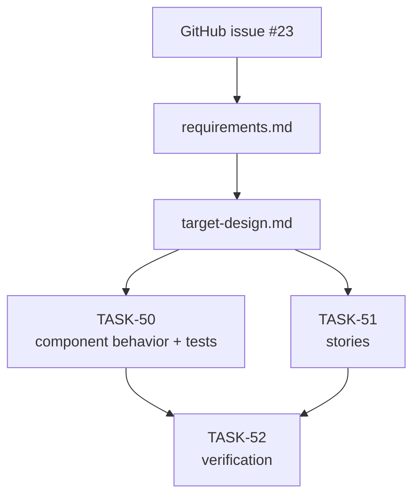
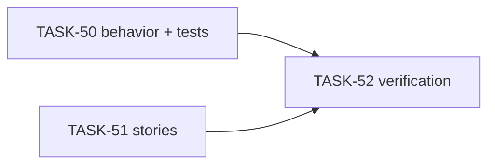

# EPIC-2: All swimlanes behavior

**Status**: VERIFICATION
**Created**: 2026-04-27

---

## Цель

Убрать неоднозначное состояние в блоке **Swimlanes**, когда одновременно видны checked **All swimlanes** и список individual swimlanes. После изменения пользователь всегда видит один режим: либо all mode, либо manual selection.

## Target Design

См. [target-design.md](./target-design.md).

## Архитектура

## Задачи

### Phase 1: Component Behavior

| # | Task | Описание | Status |
|---|------|----------|--------|
| 50 | [TASK-50](./TASK-50-align-swimlane-selector-behavior.md) | Выровнять поведение `SwimlaneSelector` и покрыть переходы Cypress component tests | VERIFICATION |

### Phase 2: Visual Documentation

| # | Task | Описание | Status |
|---|------|----------|--------|
| 51 | [TASK-51-update-swimlane-selector-stories.md](./TASK-51-update-swimlane-selector-stories.md) | Обновить Storybook stories для режимов all/manual | VERIFICATION |

### Phase 3: Verification

| # | Task | Описание | Status |
|---|------|----------|--------|
| 52 | [TASK-52-verify-swimlane-selector-consumers.md](./TASK-52-verify-swimlane-selector-consumers.md) | Проверить shared-компонент и его usage в group/personal limits | VERIFICATION |

## Dependencies

**Параллельно можно выполнять:**
- `TASK-51` после прочтения target design, так как stories не должны менять behavior.

**Последовательно:**
- `TASK-50` должен завершиться до `TASK-52`.
- `TASK-52` выполняется последним.

## Acceptance Criteria

- [x] При all mode виден только checked **All swimlanes**, список individual swimlanes скрыт.
- [x] При ручном выборе **All swimlanes** unchecked, список individual swimlanes показан.
- [x] Переход all → manual → all симметричен и не создает двусмысленного UI.
- [x] Existing convention `[] = all swimlanes` сохранена.
- [x] Cypress component tests проходят.
- [x] ESLint без ошибок для измененных файлов.
