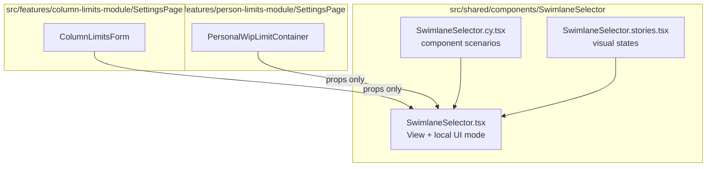
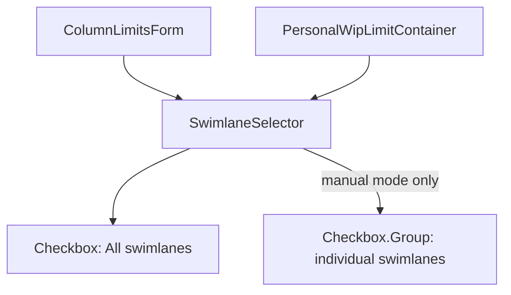

# Target Design: Issue #23 - All swimlanes behavior

Этот документ описывает целевое поведение shared-компонента `src/shared/components/SwimlaneSelector`.

## Ключевые принципы

1. **Один видимый режим за раз** — UI показывает либо "all", либо ручной список, но не дублирует выбор двумя механизмами.
2. **Сохранить contract данных** — `[]` по-прежнему означает "all swimlanes".
3. **Логика внутри shared-компонента** — формы-потребители только передают `value`, `swimlanes`, `onChange`; они не знают о UI-state переключения.
4. **Тестируемость через component tests** — все переходы между режимами покрываются в `SwimlaneSelector.cy.tsx`.

> Общие архитектурные принципы — см. `docs/architecture_guideline.md`.

## Architecture Diagram



## Component Hierarchy



## Target File Structure

```text
src/shared/components/SwimlaneSelector/
├── SwimlaneSelector.tsx          # Existing shared component; owns mode display rules
├── SwimlaneSelector.cy.tsx       # Cypress component tests for all/manual transitions
├── SwimlaneSelector.stories.tsx  # Storybook states for all/manual/empty/single
└── index.ts                      # Existing exports; unchanged
```

## Component Specifications

### `SwimlaneSelector`

Responsibility: render one unambiguous swimlane selection mode and emit persisted-compatible selected ids.

```typescript
export type Swimlane = {
  id: string;
  name: string;
};

export interface SwimlaneSelectorProps {
  /** Available swimlanes to choose from. */
  swimlanes: Swimlane[];

  /** Currently selected swimlane IDs. Empty array means all swimlanes. */
  value: string[];

  /** Emits empty array for all swimlanes, otherwise selected swimlane IDs. */
  onChange: (selectedIds: string[]) => void;

  /** Label text. Pass null to hide. */
  label?: string | null;

  /** All-mode checkbox text. */
  allLabel?: string;
}
```

### UI Mode Contract

```typescript
type SwimlaneSelectorMode = 'all' | 'manual';
```

- `all`: `value.length === 0`; **All swimlanes** checked; list hidden.
- `manual`: user explicitly unchecked **All swimlanes** or `value` contains a partial selection; **All swimlanes** unchecked; list visible.

## State Changes

No persisted state changes.

The component may keep local UI-only state to represent that the user opened manual mode before selecting individual items. This state must not be stored in board properties and must not be moved into consuming feature models.

## Logic Ownership

- `SwimlaneSelector`: owns UI mode calculation, list visibility, and normalization from full manual selection to `[]`.
- `ColumnLimitsForm`: passes group swimlane ids and receives normalized ids; no new selection-mode logic.
- `PersonalWipLimitContainer`: passes current form swimlane ids and receives normalized ids; no new selection-mode logic.
- Tests: verify visible UI and emitted `onChange`, not implementation details.

## Migration Plan

1. **TASK-50**: Align `SwimlaneSelector` behavior and Cypress component tests with requirements.
2. **TASK-51**: Update Storybook stories to make all/manual states explicit.
3. **TASK-52**: Run focused verification for shared component and consuming forms.

## Benefits

- Removes ambiguous UI state reported in issue #23.
- Keeps existing persisted data compatible.
- Fixes both group limits and personal limits through one shared component.
