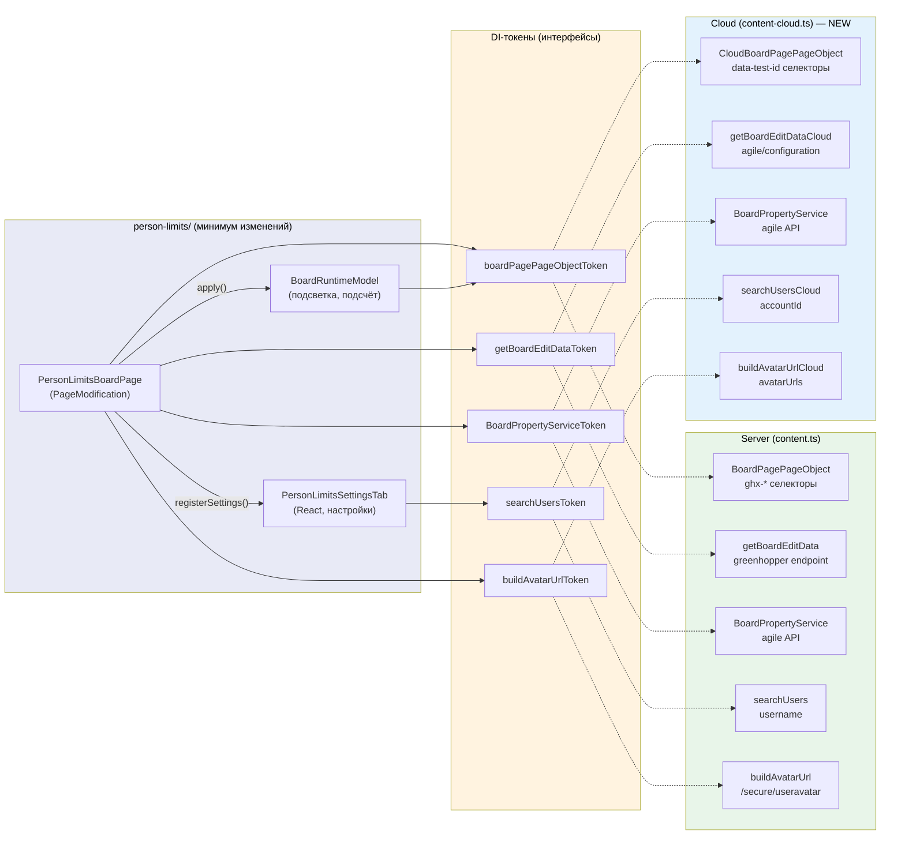

# План: поддержка Jira Cloud для person-limits

## Цель

Сделать так, чтобы фича **person-limits** (персональные WIP-лимиты) работала в Jira Cloud.

Сейчас расширение jira-helper работает только с Jira Server. Нужно, чтобы на Cloud-доске (`*.atlassian.net`) отображались WIP-лимиты, можно было их настраивать и видеть превышения.

При этом:
- Весь существующий Server-код должен продолжать работать.
- Внутри модуля `person-limits/` изменения минимальны — ядро логики не трогаем.

---

## Ограничения

### 1. Один тип доски в Cloud

В Jira Cloud есть два типа проектов: **Company-managed (Classic)** и **Team-managed (Next-gen)**. У них разный UI и разная DOM-структура. Адаптируем под тот тип, который доступен на нашей тестовой доске (бесплатный тариф — скорее всего Team-managed). Второй тип — за рамками этой итерации.

### 2. Настройки только на доске

В Server person-limits имеет настройки в двух местах:
- На самой доске — через иконку jira-helper → модалка с вкладками
- На отдельной странице настроек доски (`?config=columns`) — кнопка рядом с конфигурацией колонок

Для Cloud **отдельная страница настроек не нужна**. Показываем настройки только на доске — через иконку jira-helper и модалку. `SettingsPage` PageModification для Cloud не реализуем.

### 3. Все обращения к Jira API — через DI-токены

Jira Cloud использует другое API: `accountId` вместо `username`, другие URL аватаров, другие эндпоинты для метаданных доски.

Все обращения к Jira API уже завёрнуты в DI-токены (`getBoardEditDataToken`, `searchUsersToken`, `buildAvatarUrlToken` и т.д.). Для Cloud мы **регистрируем другие реализации** этих же токенов. Модуль person-limits не знает, какая реализация подставлена — он работает через интерфейс.

| Что | Server-реализация | Cloud-реализация |
|-----|-------------------|------------------|
| Идентификатор пользователя | `username` (`name`) | `accountId` |
| URL аватара | `/secure/useravatar?username=jsmith` | URL из поля `avatarUrls` в ответе API |
| Метаданные доски (колонки, свимлейны, права) | `greenhopper/1.0/rapidviewconfig/editmodel.json` | Скорее всего недоступен; альтернатива — `agile/1.0/board/{id}/configuration` |
| Board properties | `agile/1.0/board/{id}/properties` | Тот же endpoint |
| Поиск пользователей | `api/2/user/search` → `name` | `api/2/user/search` → `accountId` |

### 4. DOM Cloud полностью отличается от Server

Server использует CSS-классы с префиксом `ghx-` (`.ghx-issue`, `.ghx-column`, `#ghx-pool`).

Cloud использует `data-test-id` атрибуты (`platform-board-kit.ui.card-container`, `platform-board-kit.ui.column.column-container`). Конкретные селекторы нужно исследовать на реальной Cloud-доске при реализации.

---

## Целевая архитектура

### Диаграмма



### Почему эта архитектура хорошая

**1. Ядро не трогаем (Open/Closed принцип)**

Модели (`PropertyModel`, `BoardRuntimeModel`, `SettingsUIModel`), React-компоненты (`PersonLimitsSettingsTab`, `AvatarsContainer`), утилиты — всё остаётся без изменений. Они работают через DI-токены и не знают, Server это или Cloud. Мы добавляем новый код, не меняя существующий.

**2. Один PageModification для обоих окружений**

`PersonLimitsBoardPage` сейчас содержит 5 мест с hardcoded Server-селекторами (`.ghx-column`, `#ghx-pool`, `#subnav-title`...). Все эти селекторы уже есть в `IBoardPagePageObject.selectors`. Заменяем hardcoded строки на `po.selectors.*` — и класс работает для любого окружения. Никакого дублирования логики.

**3. Чёткая граница «что менять для нового окружения»**

Чтобы добавить поддержку нового окружения, нужно:
- Создать PageObject (реализация `IBoardPagePageObject`)
- Создать API-адаптеры (те же DI-токены, другая реализация)
- Создать entry point (`content-*.ts`)

Всё. Модули, модели, UI — переиспользуются.

**4. Нет риска сломать Server**

Server и Cloud entry points не пересекаются — разные match patterns в manifest + `exclude_matches`. Server-код не затрагивается.

---

## Этапы

### Этап 1: Инфраструктура

**Цель**: подготовить базу — отдельный entry point для Cloud, токен окружения. Ничего не ломаем.

**Что делать:**

1. Создать `src/shared/di/jiraEnvironmentToken.ts`:
   ```typescript
   export type JiraEnvironment = {
     type: 'server' | 'cloud';
   };
   export const jiraEnvironmentToken = new Token<JiraEnvironment>('jiraEnvironment');
   ```
   Токен — объект, чтобы можно было расширять интерфейс (добавить `cloudType`, `apiVersion` и т.д.).

2. Создать `src/content-cloud.ts` — минимальный Cloud entry point:
   - Копируем структуру `content.ts`
   - Регистрируем `jiraEnvironmentToken = { type: 'cloud' }`
   - Пока регистрируем те же Server-реализации API и PageObject (чтобы что-то работало)
   - Пустой или минимальный `modificationsMap`

3. Обновить `content.ts`:
   - Добавить `container.register({ token: jiraEnvironmentToken, value: { type: 'server' } })`

4. Обновить `manifest.json`:
   - Добавить второй `content_scripts` для `*://*.atlassian.net/*` → `content-cloud.ts`
   - Добавить `exclude_matches: ["*://*.atlassian.net/*"]` в Server content script

**Как проверить:**
- [ ] `npm test` — все тесты зелёные
- [ ] `npm run build:dev` — собирается без ошибок
- [ ] Загрузить расширение → Jira Server → всё работает как раньше
- [ ] Открыть `*.atlassian.net` → в console нет ошибок от расширения

---

### Этап 2: Параметризация PageModification

**Цель**: убрать hardcoded Server-селекторы из `PersonLimitsBoardPage` и `BoardSettingsBoardPage`. После этого этапа классы готовы работать с любым PageObject.

**Что делать:**

1. Расширить интерфейс `IBoardPagePageObject` в `src/page-objects/BoardPage.tsx`:
   - Добавить `selectors.boardHeaderTarget: string` (Server: `'#subnav-title'`)
   - Добавить метод `getIssueCssSelector(editData: any): string`

2. Обновить `BoardPagePageObject` (Server-реализация):
   - `boardHeaderTarget: '#subnav-title'`
   - `getIssueCssSelector()` — перенести логику из `PageModification.getCssSelectorOfIssues()`

3. `PersonLimitsBoardPage` (`src/person-limits/BoardPage/index.ts`):
   - `waitForLoading()`: `'.ghx-column, .ghx-swimlane'` → `po.selectors.column, po.selectors.swimlaneRow`
   - `appendStyles()`: `.ghx-issue.no-visibility` и т.д. → `.no-visibility { display: none !important }`
   - `renderAvatarsContainer()`: `'#subnav-title'` → `po.selectors.boardHeaderTarget`
   - `onDOMChange()`: `'#ghx-pool'` → `po.selectors.pool`
   - `getCssSelectorOfIssues()` → `po.getIssueCssSelector(editData)`

4. `BoardSettingsBoardPage` (`src/board-settings/BoardPage.tsx`):
   - Заменить прямой импорт `BoardPagePageObject` → `this.container.inject(boardPagePageObjectToken)`

**Чеклист проверки:**
- [ ] В `PersonLimitsBoardPage` нет ни одного CSS-селектора (`.ghx-*`, `#ghx-*`, `#subnav-*`) — всё из PageObject
- [ ] В `BoardSettingsBoardPage` нет прямого импорта `BoardPagePageObject` — всё через DI
- [ ] `appendStyles()` не содержит Jira-специфичных классов — только `.no-visibility`
- [ ] `npm test` — все тесты зелёные
- [ ] Загрузить расширение → Jira Server → person-limits работают как раньше

---

### Этап 3: Cloud PageObject

**Цель**: создать `CloudBoardPagePageObject` — реализацию `IBoardPagePageObject` для Cloud DOM.

**Что делать:**

1. Открыть реальную Cloud-доску (Company-managed) в DevTools
2. Исследовать DOM-структуру: найти аналоги всех selectors, **нужных для person-limits**:
   - `pool` — контейнер доски
   - `column` — колонка
   - `swimlaneRow` — свимлейн
   - `issue` — карточка задачи
   - `avatarImg` — аватар на карточке
   - `sidebar` — боковая панель (для вставки иконки настроек)
   - `boardHeaderTarget` — место для контейнера аватаров
   - и остальные из `IBoardPagePageObject.selectors`
3. Создать `src/page-objects/BoardPageCloud.ts`:
   - Реализовать **все методы, необходимые для person-limits**:
     - Селекторы: `pool`, `column`, `swimlaneRow`, `issue`, `avatarImg`, `sidebar`, `boardHeaderTarget`
     - Методы: `getColumnElements()`, `getIssueElementsInColumn()`, `getAssigneeFromIssue()`, `getIssueCssSelector()`, `getBoardId()`
   - Методы, которые person-limits не использует — оставить как `throw new Error('Not implemented: methodName')`
   - Заполнить `selectors` Cloud-значениями
4. Написать unit tests `src/page-objects/BoardPageCloud.test.ts`:
   - Создать mock HTML Cloud-доски
   - Проверить что каждый реализованный метод работает
5. Зарегистрировать в `content-cloud.ts` вместо Server PageObject

**Как проверить:**
- [ ] Unit tests для Cloud PageObject проходят
- [ ] Все методы, используемые `BoardRuntimeModel`, реализованы (не бросают `Not implemented`)
- [ ] `npm test` — все тесты зелёные

---

### Этап 4: Cloud API адаптеры

**Цель**: создать Cloud-реализации API-функций.

**Что делать:**

1. **Исследование** — на реальной Cloud-доске проверить:
   - Работает ли `greenhopper/1.0/rapidviewconfig/editmodel.json`? (открыть URL в браузере, залогинившись)
   - Формат ответа `api/2/user/search` — что приходит вместо `name`?
   - Как устроены URL аватаров в Cloud?

2. Создать `src/shared/jiraApi.cloud.ts`:
   - `getBoardEditDataCloud` — если greenhopper недоступен, использовать `agile/1.0/board/{id}/configuration` и замапить ответ в тот же `EditData` формат
   - `buildAvatarUrlCloud` — формирование URL аватара для Cloud
   - `searchUsersCloud` — обёртка над `api/2/user/search` с маппингом `accountId` → `name`
   - Board properties — проверить, если Server-реализация работает в Cloud — оставить как есть

3. Создать `src/shared/di/jiraApiTokens.cloud.ts`:
   - `registerJiraApiCloudInDI(container)` — регистрирует Cloud-реализации под теми же токенами

4. В `content-cloud.ts` использовать `registerJiraApiCloudInDI` вместо `registerJiraApiInDI`

5. Написать unit tests для каждого Cloud-адаптера

**Как проверить:**
- [ ] Unit tests для Cloud API адаптеров проходят
- [ ] На реальной Cloud-доске: DevTools → Network → запросы уходят, ответы приходят
- [ ] `npm test` — все тесты зелёные

---

### Этап 5: Интеграция (инкрементально)

**Цель**: собрать всё вместе — person-limits работает на Cloud-доске. Делаем пошагово, каждый шаг можно показать.

#### 5.1. Кнопка настроек → пустая модалка

`BoardSettingsBoardPage` — PageModification, который вставляет иконку jira-helper на доску. При клике открывается модалка с вкладками. Это нужно подключить первым.

- В `content-cloud.ts` добавить `BoardSettingsBoardPage` в `modificationsMap[Routes.BOARD]`
- Cloud PageObject должен иметь правильный `selectors.sidebar` (куда вставить иконку)
- **Проверить**: на Cloud-доске появляется иконка jira-helper, по клику открывается пустая модалка

#### 5.2. Таб Person Limits с данными

- В `content-cloud.ts` добавить `PersonLimitsBoardPage` в `modificationsMap[Routes.BOARD]`
- Убедиться что `getBoardEditDataCloud` возвращает `canEdit: true` + колонки + свимлейны
- Убедиться что `getBoardProperty` загружает сохранённые лимиты
- **Поиск пользователей**: если `searchUsersCloud` не заводится из-за формата `accountId` — временно использовать упрощённую реализацию (ввод имени вручную)
- **Проверить**: в модалке появляется вкладка "Person Limits", видна таблица лимитов (пустая или с данными), форма добавления работает

#### 5.3. Сохранение

- Убедиться что `updateBoardProperty` работает в Cloud
- Добавить лимит → сохранить → обновить страницу → лимит на месте
- **Проверить**: данные сохраняются в board property и загружаются обратно

#### 5.4. Подсветка превышений

- `BoardRuntimeModel.apply()` использует Cloud PageObject для подсчёта issues per person
- Карточки с превышением подсвечиваются (`setIssueBackgroundColor`)
- **Проверить**: карточки людей с превышенным лимитом визуально выделяются

#### 5.5. Бейджи с лимитами

В Server версии `AvatarsContainer` — это наш React-компонент, который вставляется в заголовок доски (`#subnav-title`). Он показывает аватар + счётчик `текущее/лимит` для каждого человека с настроенным лимитом. По клику на аватар — фильтрация доски (показать только задачи этого человека).

**Проблема для Cloud**: в Cloud на карточках уже есть свои аватары. Наш `AvatarsContainer` — это не аватары на карточках, а **панель-сводка в заголовке доски**. Нужно найти, куда её поместить.

**Варианты:**

1. **Вставить в заголовок доски** — найти аналог `#subnav-title` в Cloud DOM. Это самый простой вариант и он ближе всего к Server-поведению. Cloud PageObject уже имеет `selectors.boardHeaderTarget` для этого.

2. **Плавающая панель** — если в Cloud нет подходящего заголовка, можно сделать fixed/sticky панель (например, в углу доски). Это потребует минимальных изменений в `AvatarsContainer` (добавить стили позиционирования).

3. **Интеграция с нативными аватарами Cloud** — добавлять бейджи к существующим аватарам на карточках. Это сложнее (нужно находить аватары в Cloud DOM и добавлять к ним наши счётчики), но выглядит более нативно.

**Рекомендация**: начать с варианта 1 (заголовок доски). Если подходящего DOM-элемента нет — вариант 2 (плавающая панель). Вариант 3 — отдельная итерация.

- **Проверить**: на Cloud-доске видны аватары с счётчиками WIP, клик фильтрует доску

---

### Этап 6: Регрессия

**Цель**: убедиться, что Server не сломан.

- [ ] `npm test` — все unit tests зелёные
- [ ] `npm run build:dev` — сборка без ошибок
- [ ] Загрузить расширение → Jira Server:
  - [ ] Person-limits: аватары, подсветка, настройки через модалку
  - [ ] Person-limits: настройки через страницу `?config=columns`
  - [ ] Board settings иконка работает
  - [ ] Другие фичи не сломаны
- [ ] `npm run lint:eslint -- --fix` — нет ошибок линтера

---

## Итого: что создаём, что меняем

### Новые файлы (★)

| Файл | Назначение |
|------|-----------|
| `src/shared/di/jiraEnvironmentToken.ts` | DI-токен `{ type: 'server' \| 'cloud' }` |
| `src/content-cloud.ts` | Cloud entry point |
| `src/page-objects/BoardPageCloud.ts` | Cloud PageObject (`IBoardPagePageObject`) |
| `src/page-objects/BoardPageCloud.test.ts` | Тесты Cloud PageObject |
| `src/shared/jiraApi.cloud.ts` | Cloud API функции |
| `src/shared/di/jiraApiTokens.cloud.ts` | Регистрация Cloud API в DI |

### Минимальные изменения (✎)

| Файл | Что меняется |
|------|-------------|
| `src/content.ts` | +регистрация `jiraEnvironmentToken` |
| `src/page-objects/BoardPage.tsx` | +`selectors.boardHeaderTarget`, +`getIssueCssSelector()` |
| `src/person-limits/BoardPage/index.ts` | 5 мест: hardcoded selectors → `po.selectors.*` |
| `src/board-settings/BoardPage.tsx` | `sidebar` selector через DI вместо прямого импорта |
| `manifest.json` | +Cloud content script, +`exclude_matches` на Server |

### Не меняется (✦)

Модуль `person-limits/` (кроме 5 строк в `BoardPage/index.ts`), все модели (`PropertyModel`, `BoardRuntimeModel`, `SettingsUIModel`), все React-компоненты (`PersonLimitsSettingsTab`, `AvatarsContainer`, `AvatarBadge`), все утилиты, Zustand store `boardSettings`, `BoardSettingsComponent`, `registerSettings`.
