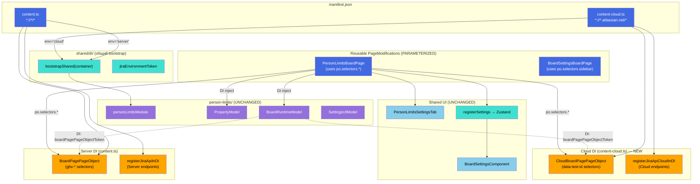
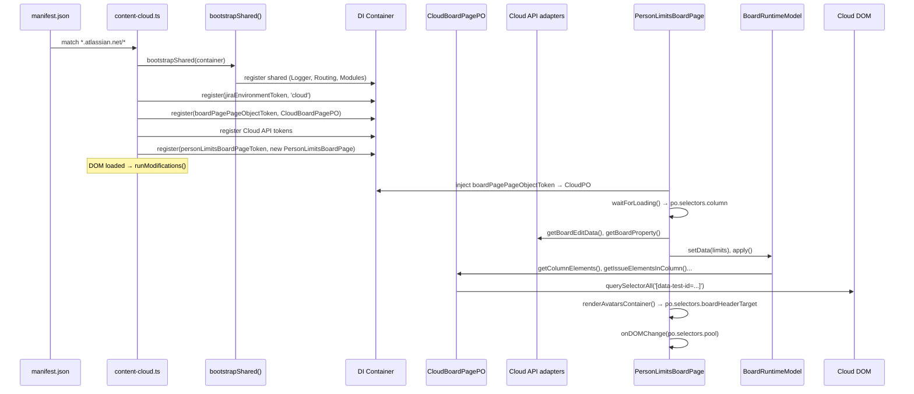

# Target Design: Jira Cloud Support — person-limits

Этот документ описывает целевую архитектуру для поддержки person-limits в Jira Cloud (Company-managed).

## Ключевые принципы

1. **Open/Closed через DI** — модуль `personLimitsModule` не изменяется. Cloud-специфика подставляется на уровне точки входа через DI-токены (PageObject, API-адаптеры).

2. **Reusable PageModification** — `PersonLimitsBoardPage` и `BoardSettingsBoardPage` параметризуются через `IBoardPagePageObject.selectors` вместо hardcoded DOM-селекторов. Один класс работает для Server и Cloud.

3. **API — ключевой constraint** — всё, что обращается к Jira API, требует проверки и возможной замены для Cloud. Cloud использует `accountId` вместо `username`, другие URL аватаров, возможно другие эндпоинты.

4. **Shared Core** — общая DI-регистрация вынесена в `bootstrapShared()`. Обе точки входа вызывают её, добавляя свои PageObject и API-адаптеры.

5. **Свимлейны через данные** — View узнаёт об отсутствии свимлейнов через пустой массив от PageObject, а не через проверку окружения.

> Общие архитектурные принципы — см. docs/architecture_guideline.md

## Architecture Diagram



## Data Flow: Cloud



## Target File Structure

```
src/
├── content.ts                                     # ✎ MINOR: вызов bootstrapShared(), register env='server'
├── content-cloud.ts                               # ★ NEW: Cloud entry point
│
├── shared/
│   ├── di/
│   │   ├── Module.ts                              # ✦ UNCHANGED
│   │   ├── jiraApiTokens.ts                       # ✦ UNCHANGED
│   │   ├── jiraApiTokens.cloud.ts                 # ★ NEW: registerJiraApiCloudInDI — Cloud API реализации
│   │   ├── routingTokens.ts                       # ✦ UNCHANGED
│   │   ├── jiraEnvironmentToken.ts                # ★ NEW: Token<'server' | 'cloud'>
│   │   └── bootstrapShared.ts                     # ★ NEW: общая DI-регистрация
│   ├── jiraApi.ts                                 # ✦ UNCHANGED (Server API functions)
│   ├── jiraApi.cloud.ts                           # ★ NEW: Cloud API functions (getBoardEditData, searchUsers, buildAvatarUrl)
│   ├── boardPropertyService.ts                    # ✦ UNCHANGED
│   ├── PageModification.ts                        # ✎ MINOR: getCssSelectorOfIssues() → делегация в PageObject
│   └── utils.ts                                   # ✦ UNCHANGED
│
├── page-objects/
│   ├── BoardPage.tsx                              # ✎ MINOR: +selectors.boardHeaderTarget, +getIssueCssSelector()
│   ├── BoardPageCloud.ts                          # ★ NEW: Cloud IBoardPagePageObject
│   └── BoardPageCloud.test.ts                     # ★ NEW: unit tests
│
├── person-limits/
│   ├── module.ts                                  # ✦ UNCHANGED
│   ├── tokens.ts                                  # ✦ UNCHANGED
│   ├── property/
│   │   └── PropertyModel.ts                       # ✦ UNCHANGED
│   ├── BoardPage/
│   │   ├── index.ts                               # ✎ MINOR: selectors через po вместо hardcoded
│   │   ├── components/                            # ✦ UNCHANGED
│   │   └── models/
│   │       └── BoardRuntimeModel.ts               # ✦ UNCHANGED
│   ├── SettingsPage/                              # ✦ UNCHANGED (не модифицируем для Cloud)
│   └── SettingsTab/
│       └── PersonLimitsSettingsTab.tsx             # ✦ UNCHANGED
│
├── board-settings/
│   ├── BoardPage.tsx                              # ✎ MINOR: sidebar selector через DI pageObject
│   ├── BoardSettingsComponent.tsx                  # ✦ UNCHANGED
│   ├── stores/boardSettings/                      # ✦ UNCHANGED
│   └── actions/registerSettings.ts                # ✦ UNCHANGED
│
└── manifest.json                                  # ✎ MODIFIED: +Cloud content script
```

## Component Specifications

### 1. `jiraEnvironmentToken`

**Responsibility**: DI-токен типа окружения.

```typescript
import { Token } from 'dioma';

export type JiraEnvironment = 'server' | 'cloud';
export const jiraEnvironmentToken = new Token<JiraEnvironment>('jiraEnvironment');
```

### 2. `bootstrapShared(container)`

**Responsibility**: Общая DI-регистрация для обоих entry points. Регистрирует всё, что НЕ зависит от окружения.

```typescript
import type { Container } from 'dioma';

export function bootstrapShared(container: Container): void;
```

Внутри:
- `registerLogger(container)`
- `registerRoutingServiceInDI(container)`
- `registerRoutingInDI(container)`
- `registerExtensionApiServiceInDI(container)`
- `registerIssueTypeServiceInDI(container)`
- `localeProviderToken` registration
- `personLimitsModule.ensure(container)`

**НЕ регистрирует** (ответственность entry point):
- `boardPagePageObjectToken` — разные реализации
- `jiraEnvironmentToken` — разные значения
- API-токены (`getBoardPropertyToken`, `updateBoardPropertyToken`, `getBoardEditDataToken`, `searchUsersToken`, `buildAvatarUrlToken`) — возможно разные реализации
- `BoardPropertyServiceToken` — зависит от API-токенов
- PageModification instances

### 3. `content-cloud.ts`

**Responsibility**: Cloud entry point. Регистрирует Cloud-специфичные DI-зависимости.

```typescript
/**
 * Cloud entry point.
 * manifest.json: matches *://*.atlassian.net/*
 *
 * 1. bootstrapShared() — shared DI
 * 2. jiraEnvironmentToken = 'cloud'
 * 3. Cloud PageObject (boardPagePageObjectToken)
 * 4. Cloud API tokens (registerJiraApiCloudInDI)
 * 5. BoardPropertyService (с Cloud API)
 * 6. PersonLimitsBoardPage + BoardSettingsBoardPage (reuse)
 * 7. runModifications() — BOARD route only
 *
 * Does NOT use isJira check — match pattern handles scope.
 */
```

### 4. Расширение `IBoardPagePageObject`

**Responsibility**: Два новых члена для параметризации PageModification.

```typescript
export interface IBoardPagePageObject {
  selectors: {
    // ... existing selectors ...
    /** Target element for mounting avatars container (Server: '#subnav-title') */
    boardHeaderTarget: string;
  };

  /**
   * Full CSS selector for issue cards, accounting for subtask exclusion.
   *
   * Server: '.ghx-issue' or '.ghx-issue:not(.ghx-issue-subtask)'
   * Cloud: Cloud-specific issue selector
   *
   * @param editData — board edit data with statisticsField config
   */
  getIssueCssSelector(editData: any): string;
}
```

### 5. `CloudBoardPagePageObject`

**Responsibility**: `IBoardPagePageObject` для Cloud DOM (Company-managed).

```typescript
/**
 * Cloud implementation of IBoardPagePageObject.
 *
 * Cloud DOM uses data-test-id attributes:
 * - [data-test-id="platform-board-kit.ui.board"]
 * - [data-test-id="platform-board-kit.ui.swimlane.swimlane-wrapper"]
 * - [data-test-id="platform-board-kit.ui.card-container"]
 * - [data-test-id="platform-board-kit.ui.column.column-container"]
 *
 * Exact selectors finalized during implementation.
 */
export const CloudBoardPagePageObject: IBoardPagePageObject;
```

### 6. `PersonLimitsBoardPage` — параметризация (changes)

**Responsibility**: Существующий класс, минимальные изменения для поддержки обоих окружений.

Изменения:

```typescript
// BEFORE (hardcoded):
waitForLoading() {
  return this.waitForElement('.ghx-column, .ghx-swimlane');
}

// AFTER (через PageObject):
waitForLoading() {
  const po = this.container.inject(boardPagePageObjectToken);
  return this.waitForElement(`${po.selectors.column}, ${po.selectors.swimlaneRow}`);
}
```

```typescript
// BEFORE:
appendStyles() {
  return `<style>
    .ghx-issue.no-visibility { display: none!important; }
    .ghx-swimlane.no-visibility { display: none!important; }
    .ghx-parent-group.no-visibility { display: none!important; }
  </style>`;
}

// AFTER (класс no-visibility наш, не зависит от DOM Jira):
appendStyles() {
  return `<style>.no-visibility { display: none !important; }</style>`;
}
```

```typescript
// BEFORE:
document.querySelector('#subnav-title')?.appendChild(container);

// AFTER:
const po = this.container.inject(boardPagePageObjectToken);
document.querySelector(po.selectors.boardHeaderTarget)?.appendChild(container);
```

```typescript
// BEFORE:
this.onDOMChange('#ghx-pool', () => { ... });

// AFTER:
const po = this.container.inject(boardPagePageObjectToken);
this.onDOMChange(po.selectors.pool, () => { ... });
```

```typescript
// BEFORE:
const cssSelector = this.getCssSelectorOfIssues(editData);

// AFTER:
const po = this.container.inject(boardPagePageObjectToken);
const cssSelector = po.getIssueCssSelector(editData);
```

### 7. `BoardSettingsBoardPage` — параметризация (changes)

**Responsibility**: Существующий класс, заменить прямое использование `BoardPagePageObject.selectors.sidebar`.

```typescript
// BEFORE:
import { BoardPagePageObject } from 'src/page-objects/BoardPage';
waitForLoading() {
  return this.waitForElement(BoardPagePageObject.selectors.sidebar);
}
const sidebar = document.querySelector(BoardPagePageObject.selectors.sidebar);

// AFTER:
waitForLoading() {
  const po = this.container.inject(boardPagePageObjectToken);
  return this.waitForElement(po.selectors.sidebar);
}
const po = this.container.inject(boardPagePageObjectToken);
const sidebar = document.querySelector(po.selectors.sidebar);
```

### 8. Cloud API адаптеры

**Responsibility**: Cloud-реализации API-функций, регистрируемых под теми же DI-токенами.

```typescript
// jiraApi.cloud.ts

/**
 * Cloud adapter for getBoardEditData.
 * Uses Agile REST API if greenhopper endpoint unavailable.
 *
 * GET /rest/agile/1.0/board/{boardId}/configuration → columns
 * Maps to same EditData shape.
 */
export const getBoardEditDataCloud: GetBoardEditData;

/**
 * Cloud avatar URL builder.
 * Cloud doesn't use /secure/useravatar?username=.
 * Uses accountId-based avatar or avatarUrls from user data.
 */
export const buildAvatarUrlCloud: BuildAvatarUrl;

/**
 * Cloud user search adapter.
 * Cloud uses accountId instead of name.
 * Ensures response mapped to same JiraUser shape.
 */
export const searchUsersCloud: SearchUsers;
```

```typescript
// jiraApiTokens.cloud.ts

export const registerJiraApiCloudInDI = (container: Container): void => {
  container.register({ token: getBoardEditDataToken, value: getBoardEditDataCloud });
  container.register({ token: buildAvatarUrlToken, value: buildAvatarUrlCloud });
  container.register({ token: searchUsersToken, value: searchUsersCloud });
  // board property tokens — проверить, если совместимы — использовать Server-реализацию
  container.register({ token: getBoardPropertyToken, value: getBoardProperty }); // или Cloud версию
  container.register({ token: updateBoardPropertyToken, value: updateBoardProperty });
  container.register({ token: deleteBoardPropertyToken, value: deleteBoardProperty });
};
```

### 9. `manifest.json` — changes

```json
{
  "content_scripts": [
    {
      "matches": ["*://*/*"],
      "js": ["src/content.ts"],
      "exclude_matches": ["*://*.atlassian.net/*"]
    },
    {
      "matches": ["*://*.atlassian.net/*"],
      "js": ["src/content-cloud.ts"]
    }
  ]
}
```

Примечание: `exclude_matches` на Server entry point предотвращает двойную загрузку на `atlassian.net`.

## State Changes

Модели **не изменяются**. Все Models работают через DI-интерфейсы.

| Model | Изменения |
|-------|-----------|
| `PropertyModel` | ✦ Без изменений — работает через `BoardPropertyServiceToken` |
| `BoardRuntimeModel` | ✦ Без изменений — работает через `boardPagePageObjectToken` |
| `SettingsUIModel` | ✦ Без изменений — работает через `PropertyModel` |

**Новых моделей не требуется.**

## Key Design Decisions

### D1: Почему reusable PageModification, а не отдельные Cloud-классы?

`PersonLimitsBoardPage` содержит ~5 мест с hardcoded селекторами. Все эти селекторы уже имеют аналоги в `IBoardPagePageObject.selectors`. Параметризация — 5 точечных изменений в одном файле, вместо создания нового Cloud-класса с дублированием ~100 строк бизнес-логики.

### D2: Почему `.no-visibility` без привязки к `.ghx-issue`?

`no-visibility` — наш собственный CSS-класс, добавляемый через `setIssueVisibility()` / `setSwimlaneVisibility()` / `setParentGroupVisibility()`. Правило `.no-visibility { display: none !important }` универсально и не зависит от DOM-структуры Jira.

### D3: Почему `getIssueCssSelector()` на PageObject, а не на PageModification?

`PageModification.getCssSelectorOfIssues()` использует `.ghx-issue:not(.ghx-issue-subtask)` — Server-специфичные CSS-классы. Перенос логики формирования CSS-селектора в PageObject инкапсулирует знание о DOM-структуре в одном месте. PageObject знает, как выглядят issues в DOM — он и формирует селектор.

### D4: API — стратегия адаптации

1. **Board properties** (`getBoardPropertyToken`, `updateBoardPropertyToken`): endpoint `agile/1.0/board/{id}/properties` одинаков. Попробовать Server-реализацию — если работает, оставить. Если нет — создать Cloud-адаптер.
2. **Board edit data** (`getBoardEditDataToken`): `greenhopper/.../editmodel.json` — скорее всего Server-only. Cloud-адаптер через `agile/1.0/board/{id}/configuration`.
3. **User search** (`searchUsersToken`): текущий код пробует `query` и `username`. Cloud вернёт `accountId` вместо `name` — нужен маппинг.
4. **Avatar URL** (`buildAvatarUrlToken`): `/secure/useravatar?username=...` — Server-only. Cloud — другой формат, из `avatarUrls` ответа API.

### D5: Как Cloud PageModification получает swimlanes

```
content-cloud.ts
  └── registers CloudBoardPagePageObject (implements IBoardPagePageObject)
        └── getSwimlanes() → парсит Cloud DOM → SwimlaneElement[]
              └── если свимлейнов нет в DOM → возвращает []

PersonLimitsBoardPage (shared, SAME class)
  └── inject(boardPagePageObjectToken) → CloudBoardPagePageObject
        └── apply() → boardEditData.swimlanesConfig
              └── swimlanes пусты → PersonLimitsSettingsTab({ swimlanes: [] })
                    └── SwimlaneSelector скрывается
```

## Migration Plan

### Phase 1: Infrastructure (TASK-1)

**Цель**: компилируемый Cloud entry point, не ломающий Server.

- Создать `src/shared/di/jiraEnvironmentToken.ts`
- Создать `src/shared/di/bootstrapShared.ts` (extract из `content.ts`)
- Рефакторинг `content.ts`: `bootstrapShared()` + `jiraEnvironmentToken = 'server'`
- `manifest.json`: добавить Cloud content script + `exclude_matches`
- Создать `src/content-cloud.ts` (минимальный: bootstrap + env + пустой modifications map)
- **Проверка**: Server работает как раньше. Все тесты зелёные.

### Phase 2: Параметризация PageModification (TASK-2)

**Цель**: `PersonLimitsBoardPage` и `BoardSettingsBoardPage` используют `po.selectors.*`.

- Расширить `IBoardPagePageObject`: `selectors.boardHeaderTarget`, `getIssueCssSelector()`
- Обновить `BoardPagePageObject` (Server): добавить новые члены
- `PersonLimitsBoardPage`: заменить hardcoded selectors → `po.selectors.*`, `po.getIssueCssSelector()`
- `appendStyles()`: упростить до `.no-visibility { display: none !important }`
- `BoardSettingsBoardPage`: заменить прямой импорт `BoardPagePageObject` → DI inject
- **Проверка**: Server работает как раньше. Все тесты зелёные. Изменения минимальны.

### Phase 3: Cloud PageObject (TASK-3)

**Цель**: `CloudBoardPagePageObject` реализует `IBoardPagePageObject`.

- Исследовать Cloud DOM (Company-managed доска)
- Создать `src/page-objects/BoardPageCloud.ts`
- Реализовать все методы `IBoardPagePageObject`
- Unit tests с mock Cloud DOM
- Зарегистрировать в `content-cloud.ts`
- **Проверка**: Unit tests проходят.

### Phase 4: Cloud API адаптеры (TASK-4)

**Цель**: Cloud-реализации API-функций.

- Проверить доступность `greenhopper/.../editmodel.json` в Cloud
- Создать `src/shared/jiraApi.cloud.ts` с Cloud-адаптерами
- Создать `src/shared/di/jiraApiTokens.cloud.ts` с `registerJiraApiCloudInDI()`
- Зарегистрировать в `content-cloud.ts`
- Unit tests
- **Проверка**: Cloud API возвращает данные в ожидаемом формате.

### Phase 5: Интеграция и E2E (TASK-5)

**Цель**: person-limits работает на Cloud-доске end-to-end.

- Подключить PersonLimitsBoardPage + BoardSettingsBoardPage в Cloud modifications map
- Тестирование на реальной Cloud-доске
- Edge cases: нет свимлейнов, нет прав, пустые лимиты
- **Проверка**: Аватары, подсветка, настройки — всё работает в Cloud.

### Phase 6: Regression (TASK-6)

**Цель**: Server не сломан.

- Прогнать все unit tests
- Прогнать Cypress tests для person-limits
- Проверить Server вручную
- **Проверка**: Все тесты зелёные, Server работает.

## Benefits

1. **Minimal changes inside person-limits** — модуль не изменяется (Models, types, tokens, utils, SettingsTab). Единственное изменение — ~5 строк в `PersonLimitsBoardPage` (селекторы через PageObject).

2. **No code duplication** — один `PersonLimitsBoardPage` для обоих окружений вместо двух классов с дублированной логикой.

3. **Clear API boundary** — все API-зависимые токены явно разделены: `registerJiraApiInDI` (Server) vs `registerJiraApiCloudInDI` (Cloud).

4. **Extensibility** — добавление column-limits в Cloud потребует только Cloud PageObject для Settings (если нужен) и подключение модуля в `content-cloud.ts`.

5. **Testability** — Cloud PageObject тестируется изолированно. Models тестируются с mock PageObject (уже делается). API-адаптеры тестируются с mock HTTP.
