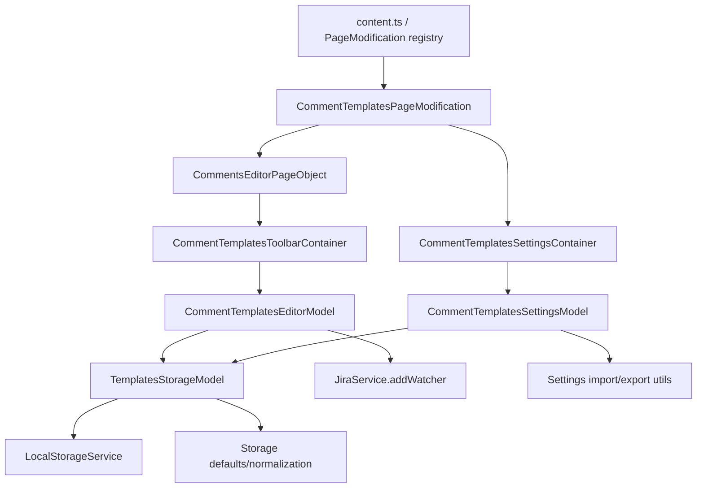
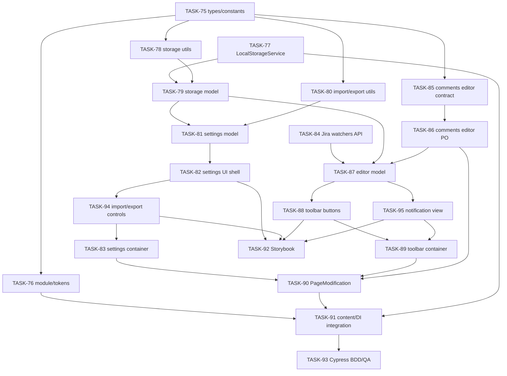

# EPIC-5: Jira Comment Templates

**Status**: VERIFICATION
**Created**: 2026-04-30

---

## Цель

Перенести быстрые шаблоны комментариев из отдельного Chrome extension в `jira-helper` как полноценную фичу с локальным хранением, настройками, вставкой текста в Jira comment editor и добавлением watchers. MVP покрывает issue view и board detail panel, использует архитектуру `jira-helper` с PageObject для DOM, Valtio Models для состояния, React Views/Containers для UI и существующий Jira service для REST API.

## Target Design

См. [target-design.md](./target-design.md) и BDD-сценарии [comment-templates.feature](./comment-templates.feature).

## Архитектура

## Задачи

### Phase 1: Contracts And Infrastructure

| # | Task | Описание | Status |
|---|------|----------|--------|
| 75 | [TASK-75](./TASK-75-domain-types-and-constants.md) | Domain-типы, константы и shared contracts фичи | VERIFICATION |
| 76 | [TASK-76](./TASK-76-module-tokens-skeleton.md) | DI tokens и module skeleton фичи | VERIFICATION |
| 77 | [TASK-77](./TASK-77-local-storage-service.md) | Infrastructure LocalStorageService и DI token | VERIFICATION |
| 84 | [TASK-84](./TASK-84-jira-watchers-api.md) | Расширение Jira API/service методом addWatcher | VERIFICATION |
| 85 | [TASK-85](./TASK-85-comments-editor-contract.md) | Shared contract для CommentsEditorPageObject | VERIFICATION |

### Phase 2: Storage And Settings Domain

| # | Task | Описание | Status |
|---|------|----------|--------|
| 78 | [TASK-78](./TASK-78-storage-utils.md) | Default templates и normalization utils | VERIFICATION |
| 79 | [TASK-79](./TASK-79-templates-storage-model.md) | TemplatesStorageModel поверх LocalStorageService | VERIFICATION |
| 80 | [TASK-80](./TASK-80-settings-import-export-utils.md) | Import/export utils для current и legacy JSON | VERIFICATION |
| 81 | [TASK-81](./TASK-81-settings-model.md) | Settings model с draft lifecycle и save/reset | VERIFICATION |

### Phase 3: Comment Editor Integration

| # | Task | Описание | Status |
|---|------|----------|--------|
| 86 | [TASK-86](./TASK-86-comments-editor-page-object.md) | Реализация CommentsEditorPageObject: attachTools, dedupe, insertText | VERIFICATION |
| 87 | [TASK-87](./TASK-87-editor-model.md) | Editor model: insert template, watchers aggregation, notifications data | VERIFICATION |

### Phase 4: React UI

| # | Task | Описание | Status |
|---|------|----------|--------|
| 82 | [TASK-82](./TASK-82-settings-ui-views.md) | Settings View shell для списка и редактирования шаблонов | VERIFICATION |
| 94 | [TASK-94](./TASK-94-settings-import-export-controls.md) | Settings import/export controls View | VERIFICATION |
| 83 | [TASK-83](./TASK-83-settings-container.md) | Settings container и styles для подключения модели к UI | VERIFICATION |
| 88 | [TASK-88](./TASK-88-toolbar-ui.md) | Toolbar и template button View | VERIFICATION |
| 95 | [TASK-95](./TASK-95-toolbar-notification-view.md) | Watcher notification View для toolbar | VERIFICATION |
| 89 | [TASK-89](./TASK-89-toolbar-container.md) | Toolbar container, per-editor state и styles | VERIFICATION |

### Phase 5: Page Lifecycle And Registration

| # | Task | Описание | Status |
|---|------|----------|--------|
| 90 | [TASK-90](./TASK-90-page-modification.md) | PageModification для BOARD/ISSUE lifecycle и settings registration | VERIFICATION |
| 91 | [TASK-91](./TASK-91-content-di-integration.md) | Content integration и финальная DI-регистрация фичи | VERIFICATION |

### Phase 6: Visual And Acceptance Coverage

| # | Task | Описание | Status |
|---|------|----------|--------|
| 92 | [TASK-92](./TASK-92-storybook-states.md) | Storybook states для toolbar/settings и cross-area composition | VERIFICATION |
| 93 | [TASK-93](./TASK-93-cypress-bdd-qa.md) | Cypress BDD/QA coverage по `comment-templates.feature` | VERIFICATION |

## Dependencies

**Параллельно можно выполнять:**

- [TASK-77](./TASK-77-local-storage-service.md), [TASK-84](./TASK-84-jira-watchers-api.md), [TASK-85](./TASK-85-comments-editor-contract.md) после [TASK-75](./TASK-75-domain-types-and-constants.md).
- [TASK-80](./TASK-80-settings-import-export-utils.md) параллельно со storage model, если domain-типы уже готовы.
- [TASK-82](./TASK-82-settings-ui-views.md), [TASK-88](./TASK-88-toolbar-ui.md) и [TASK-95](./TASK-95-toolbar-notification-view.md) после готовности соответствующих props/types.

**Последовательно:**

- Domain/types → storage utils → storage model → settings model → settings views/import controls → settings container.
- CommentsEditor contract → implementation → editor model → toolbar/notification views → toolbar container → PageModification.
- PageModification + module tokens + infrastructure registrations → content integration → Cypress BDD/QA.

## Out Of MVP Follow-up

[TASK-74](./TASK-74-research-transition-dialog-issue-key.md) остаётся standalone research-задачей по issue key внутри workflow/transition dialog. Она не является dependency MVP и не блокирует `TASK-75`-`TASK-95`; результат research нужен только для будущего расширения поддержки transition dialog comments.

## Acceptance Criteria

- [ ] На issue view рядом с inline form `#addcomment` появляется один toolbar шаблонов без дублей после DOM-мутаций.
- [ ] На board detail panel рядом с comment form `#addcomment` появляется toolbar шаблонов.
- [ ] Клик по шаблону вставляет текст через `CommentsEditorPageObject` в textarea/rich editor.
- [ ] Шаблон с watchers вызывает `JiraService.addWatcher(...)` по каждому watcher после успешной вставки и показывает top-right notification на 5 секунд.
- [ ] Если issue key недоступен, вставка работает, watcher calls пропускаются, пользователь видит warning.
- [ ] Пользователь может добавить, изменить, удалить, сбросить, импортировать и экспортировать шаблоны в settings UI.
- [ ] Валидный legacy JSON старого расширения импортируется в draft и сохраняется только после явного `Сохранить`.
- [ ] Невалидный импорт показывает ошибку и не портит сохранённые шаблоны.
- [ ] Фича зарегистрирована только для `Routes.BOARD` и `Routes.ISSUE`.
- [ ] Storybook покрывает основные состояния toolbar/settings.
- [ ] BDD/Cypress acceptance tests покрывают сценарии из [comment-templates.feature](./comment-templates.feature).
- [ ] Все тесты проходят: `npm test`.
- [ ] ESLint без ошибок: `npm run lint:eslint -- --fix`.
