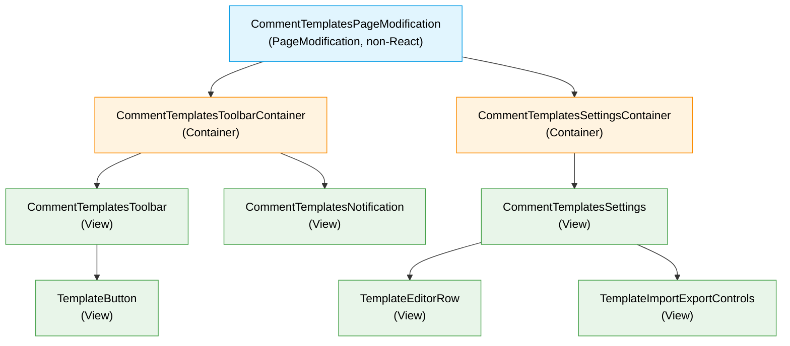

# Target Design: Jira Comment Templates

Этот документ описывает целевую архитектуру для новой фичи `src/features/jira-comment-templates-module/`.

## Ключевые принципы

1. **PageModification только на двух route** — фича запускается на Jira board и issue view routes; внутри этих экранов она покрывает надёжно распознанные comment fields: board detail panel и issue view inline comment. Workflow/transition dialog остаётся отдельной research-задачей.
2. **Comment editor integration как shared PageObject** — обнаружение форм, наблюдение за динамическим появлением comment blocks, выбор mount point, получение issue key через существующие page objects и вставка текста принадлежат новому `CommentsEditorPageObject`, а не feature-level DOM коду.
3. **Три под-домена внутри фичи** — `Storage` закрывает persisted templates и localStorage, `Settings` управляет настройками через Storage, `Editor` оборачивает Jira comment editor и читает текущие templates из Storage.
4. **Инфраструктурный LocalStorage token** — доступ к `localStorage` выносится в `src/infrastructure/storage/LocalStorageService`; feature Storage model получает его через DI и остаётся тестируемой без отдельного feature repository.
5. **Watchers через EditorModel и существующий JiraService** — отдельный watcher service не нужен; `EditorModel` после успешной вставки вызывает `IJiraService.addWatcher(...)`, агрегирует partial results и возвращает данные для watcher notification.
6. **React тонкий** — Containers подписываются на Valtio Models и прокидывают props во View; бизнес-правила импорта, нормализации, watcher aggregation и сохранения живут в Models / pure utils, а DOM lifecycle живёт в `CommentsEditorPageObject`.

> Общие архитектурные принципы: `docs/architecture_guideline.md`, `docs/module-boundaries.md`, `docs/state-valtio.md`, `docs/component-containers.md`.

## Architecture Diagram

```mermaid
flowchart TB
    subgraph featureModule ["src/features/jira-comment-templates-module/ (NEW)"]
        subgraph featureRoot ["root files"]
            Module["module.ts"]
            Tokens["tokens.ts"]
            Types["types.ts"]
            PageMod["CommentTemplatesPageModification"]
            style PageMod fill:#FFA500,color:#000
        end

        subgraph storageArea ["Storage/"]
            StorageModel["TemplatesStorageModel"]
            StorageUtils["default/normalize/validate/serialize"]
            style StorageModel fill:#9370DB,color:white
        end

        subgraph settingsArea ["Settings/"]
            subgraph settingsComponents ["Settings/components/"]
                SettingsContainer["CommentTemplatesSettingsContainer"]
                SettingsView["CommentTemplatesSettings"]
                TemplateRow["TemplateEditorRow"]
                ImportExportControls["TemplateImportExportControls"]
                style SettingsContainer fill:#4169E1,color:white
                style SettingsView fill:#20B2AA,color:white
                style TemplateRow fill:#20B2AA,color:white
                style ImportExportControls fill:#20B2AA,color:white
            end

            subgraph settingsModels ["Settings/models/"]
                SettingsModel["CommentTemplatesSettingsModel"]
                style SettingsModel fill:#9370DB,color:white
            end
        end

        subgraph editorArea ["Editor/"]
            subgraph editorComponents ["Editor/components/"]
                ToolbarContainer["CommentTemplatesToolbarContainer"]
                ToolbarView["CommentTemplatesToolbar"]
                TemplateButton["TemplateButton"]
                NotificationView["CommentTemplatesNotification"]
                style ToolbarContainer fill:#4169E1,color:white
                style ToolbarView fill:#20B2AA,color:white
                style TemplateButton fill:#20B2AA,color:white
                style NotificationView fill:#20B2AA,color:white
            end

            subgraph editorModels ["Editor/models/"]
                EditorModel["CommentTemplatesEditorModel"]
                style EditorModel fill:#9370DB,color:white
            end
        end
    end

    subgraph infraPO ["src/infrastructure/page-objects/CommentsEditor/ (NEW shared)"]
        CommentsPO["CommentsEditorPageObject"]
        style CommentsPO fill:#FFA500,color:#000
    end

    subgraph existingPageObjects ["Existing page objects"]
        IssueDetailsPO["IssueDetailsPageObject / IssueViewPageObject"]
        BoardPO["BoardPagePageObject"]
        style IssueDetailsPO fill:#FFA500,color:#000
        style BoardPO fill:#FFA500,color:#000
    end

    subgraph infraJira ["src/infrastructure/jira/ (EXISTING)"]
        JiraService["JiraService / IJiraService"]
        JiraApi["jiraApi.addWatcher"]
        style JiraService fill:#FFA500,color:#000
        style JiraApi fill:#FFA500,color:#000
    end

    subgraph infraStorage ["src/infrastructure/storage/ (NEW shared)"]
        LocalStorageService["LocalStorageService"]
        style LocalStorageService fill:#FFA500,color:#000
    end

    subgraph external ["External"]
        JiraDOM["Jira DOM comment forms"]
        JiraAPI["Jira REST API"]
        BrowserStorage["localStorage"]
    end

    Module --> Tokens
    Module --> StorageModel
    Module --> SettingsModel
    Module --> EditorModel

    PageMod -->|register board/issue settings tabs| SettingsContainer
    PageMod -->|inject editor model| EditorModel
    PageMod -->|inject comments editor PO| CommentsPO
    PageMod -->|attachTools(key, ToolbarContainer)| CommentsPO
    CommentsPO -->|mounts with editor id| ToolbarContainer

    ToolbarContainer -->|useModel read + editor commands| EditorModel
    ToolbarContainer --> ToolbarView
    ToolbarContainer --> NotificationView
    SettingsContainer -->|useModel read + commands| SettingsModel
    SettingsContainer --> SettingsView
    SettingsView --> TemplateRow
    SettingsView --> ImportExportControls

    EditorModel --> StorageModel
    EditorModel --> JiraService
    SettingsModel --> StorageModel
    SettingsModel --> StorageUtils
    StorageModel --> StorageUtils
    StorageModel --> LocalStorageService
    JiraService --> JiraApi
    CommentsPO --> IssueDetailsPO
    CommentsPO --> BoardPO

    CommentsPO --> JiraDOM
    JiraApi --> JiraAPI
    LocalStorageService --> BrowserStorage
```


## Component Hierarchy




## Target File Structure

```text
src/features/jira-comment-templates-module/
├── index.ts                                      # Public exports for PageModification and module
├── module.ts                                     # Module: lazy DI registration for Storage / Settings / Editor models
├── module.test.ts                                # Unit tests for DI registration and token resolution
├── tokens.ts                                     # Typed DI tokens with JSDoc lifecycle/consumers
├── types.ts                                      # Domain types with JSDoc
├── constants.ts                                  # Storage key, selectors marker attrs, UI constants
│
├── CommentTemplatesPageModification.ts           # PageModification: BOARD/ISSUE lifecycle, delegates comment tool attachment to CommentsEditorPageObject
├── CommentTemplatesPageModification.test.ts      # Verifies attachTools is called only for supported routes/lifecycle
│
├── Editor/
│   ├── components/
│   │   ├── CommentTemplatesToolbarContainer.tsx  # Container: connects editor id + EditorModel to toolbar View
│   │   ├── CommentTemplatesToolbar.tsx           # View: toolbar layout and template/manage buttons
│   │   ├── TemplateButton.tsx                    # View: one template button with color and accessible label
│   │   ├── CommentTemplatesNotification.tsx      # View: transient success/warning/error message
│   │   ├── jira-comment-templates-editor.module.css
│   │   └── CommentTemplatesToolbar.cy.tsx        # Component tests for toolbar interactions
│   ├── models/
│   │   ├── CommentTemplatesEditorModel.ts        # Valtio: reads StorageModel, inserts templates, adds watchers through IJiraService
│   │   └── CommentTemplatesEditorModel.test.ts   # insert/watchers/result state transitions
│
├── Settings/
│   ├── components/
│   │   ├── CommentTemplatesSettingsContainer.tsx # Container: connects SettingsModel to settings View
│   │   ├── CommentTemplatesSettings.tsx          # View: settings tab content and list controls
│   │   ├── TemplateEditorRow.tsx                 # View: editable row for label/color/text/watchers
│   │   ├── TemplateImportExportControls.tsx      # View: import file input and export button
│   │   ├── jira-comment-templates-settings.module.css
│   │   ├── CommentTemplatesSettings.cy.tsx       # Component tests for manage/import/save flows
│   │   └── CommentTemplatesSettings.stories.tsx  # Storybook states for settings/default/import errors
│   ├── models/
│   │   ├── CommentTemplatesSettingsModel.ts      # Valtio: draft lifecycle, import/export, save through StorageModel
│   │   └── CommentTemplatesSettingsModel.test.ts # draft import/save/cancel/reset behavior
│   └── utils/
│       ├── validateImportedTemplates.ts          # Pure validator for current and legacy JSON array format
│       └── serializeTemplates.ts                 # Pure export payload builder
│
├── Storage/
│   ├── models/
│   │   ├── TemplatesStorageModel.ts              # Valtio: persisted templates, default fallback, localStorage service I/O
│   │   └── TemplatesStorageModel.test.ts         # load/save/default/reset/error behavior
│   └── utils/
│       ├── defaultTemplates.ts                   # Two generic templates for first run/reset
│       ├── normalizeTemplates.ts                 # Pure normalization: trim, id fallback, watcher parsing
│       └── normalizeTemplates.test.ts
│
└── CommentTemplates.stories.tsx                  # Cross-area Storybook composition: toolbar + settings tab

src/infrastructure/page-objects/CommentsEditor/
├── CommentsEditorPageObject.ts                   # Shared PageObject: observes comment blocks, attaches tools, inserts text
├── ICommentsEditorPageObject.ts                  # Shared PageObject contract
└── index.ts                                      # Token/registration exports if needed

src/infrastructure/jira/
├── jiraApi.ts                                    # Add low-level addWatcher(issueKey, username, options) helper
└── jiraService.ts                                # Extend IJiraService/JiraService with addWatcher(...)

src/infrastructure/storage/
├── LocalStorageService.ts                        # Generic localStorage wrapper returning Result
├── tokens.ts                                     # localStorageServiceToken
└── LocalStorageService.test.ts                   # get/set/remove parse and browser error behavior
```

`src/content.ts` integration target:

- `jiraCommentTemplatesModule.ensure(container)` in `initDiContainer()`.
- Register `jiraCommentTemplatesPageModificationToken` as a value token.
- Register shared `CommentsEditorPageObject` in DI from infrastructure (or direct shared page-object registration if the project keeps common PageObjects outside modules).
- Register `localStorageServiceToken` in infrastructure DI.
- Add PageModification only to `Routes.BOARD` and `Routes.ISSUE`.
- `CommentTemplatesPageModification.apply()` registers settings tabs through `registerSettings` for board settings and `registerIssueSettings` for issue view, then calls `CommentsEditorPageObject.attachTools('jira-comment-templates', CommentTemplatesToolbarContainer)`.

## Component Specifications

### `CommentTemplatesToolbarContainer`

Path: `Editor/components/CommentTemplatesToolbarContainer.tsx`

Responsibility: renders tools for one editor instance supplied by `CommentsEditorPageObject`; it does not know DOM selectors, editor kind or comment-form discovery details.

```typescript
export type CommentTemplatesToolbarContainerProps = {
  commentEditorId: CommentEditorId;
};
```

### `CommentTemplatesToolbar`

Path: `Editor/components/CommentTemplatesToolbar.tsx`

Responsibility: renders template buttons and the manage button for one Jira comment form.

```typescript
export type CommentTemplatesToolbarProps = {
  templates: CommentTemplate[];
  isDisabled: boolean;
  manageButtonLabel: string;
  onTemplateSelect: (templateId: CommentTemplateId) => void;
  onOpenSettings: () => void;
};
```

### `TemplateButton`

Path: `Editor/components/TemplateButton.tsx`

Responsibility: renders one accessible button with template label and color.

```typescript
export type TemplateButtonProps = {
  template: CommentTemplateSummary;
  isDisabled: boolean;
  onSelect: (templateId: CommentTemplateId) => void;
};
```

### `CommentTemplatesNotification`

Path: `Editor/components/CommentTemplatesNotification.tsx`

Responsibility: displays watcher-add result feedback as a transient toast in the top-right corner.

```typescript
export type CommentTemplatesNotificationProps = {
  notification: CommentTemplatesNotificationState | null;
  autoHideMs: 5000;
  onDismiss: (notificationId: string) => void;
};
```

### `CommentTemplatesSettingsContainer`

Path: `Settings/components/CommentTemplatesSettingsContainer.tsx`

Responsibility: connects board/issue settings tab UI to `CommentTemplatesSettingsModel`; Container owns only simple event forwarding.

```typescript
export type CommentTemplatesSettingsContainerProps = {};
```

### `CommentTemplatesSettings`

Path: `Settings/components/CommentTemplatesSettings.tsx`

Responsibility: presents template draft editing, import/export controls, reset and save actions inside board/issue settings.

```typescript
export type CommentTemplatesSettingsProps = {
  draftTemplates: EditableCommentTemplate[];
  validationErrors: TemplateValidationError[];
  importError: string | null;
  isSaving: boolean;
  onAddTemplate: () => void;
  onUpdateTemplate: (templateId: CommentTemplateId, patch: EditableCommentTemplatePatch) => void;
  onDeleteTemplate: (templateId: CommentTemplateId) => void;
  onImportFileSelected: (file: File) => void;
  onExport: () => void;
  onResetToDefaults: () => void;
  onSave: () => void;
  onDiscard: () => void;
};
```

### `TemplateEditorRow`

Path: `Settings/components/TemplateEditorRow.tsx`

Responsibility: presents editable fields for one draft template.

```typescript
export type TemplateEditorRowProps = {
  template: EditableCommentTemplate;
  availableColors: TemplateColor[];
  errors: TemplateValidationError[];
  onChange: (templateId: CommentTemplateId, patch: EditableCommentTemplatePatch) => void;
  onDelete: (templateId: CommentTemplateId) => void;
};
```

### `TemplateImportExportControls`

Path: `Settings/components/TemplateImportExportControls.tsx`

Responsibility: presents file import and JSON export controls without parsing or persistence logic.

```typescript
export type TemplateImportExportControlsProps = {
  isImporting: boolean;
  importError: string | null;
  onImportFileSelected: (file: File) => void;
  onExport: () => void;
};
```

## TypeScript Contracts

Most domain types live in `src/features/jira-comment-templates-module/types.ts`. The editor integration types (`CommentEditorId`, `CommentEditorToolProps`, `CommentEditorToolComponent`) live in `src/infrastructure/page-objects/CommentsEditor/ICommentsEditorPageObject.ts` and are imported by the feature as type-only contracts.

```typescript
/**
 * Stable identifier for a stored comment template.
 * Generated by the feature when imported data has missing/duplicate ids.
 */
export type CommentTemplateId = string;

/**
 * Stored template used by toolbar insertion and JSON export/import.
 * Compatible with legacy extension JSON: { id, label, color, text, watchers? }[].
 */
export type CommentTemplate = {
  id: CommentTemplateId;
  label: string;
  color: string;
  text: string;
  watchers?: string[];
};

/**
 * Editable template draft used only inside Settings UI.
 */
export type EditableCommentTemplate = CommentTemplate & {
  isNew?: boolean;
};

export type EditableCommentTemplatePatch = Partial<Pick<CommentTemplate, 'label' | 'color' | 'text' | 'watchers'>>;

/**
 * View-ready subset for template buttons.
 */
export type CommentTemplateSummary = Pick<CommentTemplate, 'id' | 'label' | 'color'>;

export type TemplateColor = {
  id: string;
  label: string;
  background: string;
  border: string;
  text: string;
};

export type CommentTemplatesStoragePayloadV1 = {
  version: 1;
  templates: CommentTemplate[];
};

export type LegacyCommentTemplatesPayload = Array<{
  id: unknown;
  label: unknown;
  color: unknown;
  text: unknown;
  watchers?: unknown;
}>;

export type CommentEditorKind = 'jira-wiki-textarea' | 'jira-rich-editor';

/**
 * Opaque identifier for a live comment editor known by `CommentsEditorPageObject`.
 * It is not a DOM selector, Jira issue key or persisted id.
 */
export type CommentEditorId = string;

export type CommentEditorInsertResult = {
  issueKey: string | null;
};

export type TemplateValidationError = {
  templateId?: CommentTemplateId;
  field?: 'label' | 'color' | 'text' | 'watchers' | 'file';
  message: string;
};

export type CommentTemplatesNotificationLevel = 'success' | 'warning' | 'error';

export type CommentTemplatesNotificationState = {
  id: string;
  level: CommentTemplatesNotificationLevel;
  message: string;
  details?: string[];
};

export type InsertTemplateRequest = {
  commentEditorId: CommentEditorId;
  templateId: CommentTemplateId;
};

export type InsertTemplateResult = {
  templateId: CommentTemplateId;
  inserted: boolean;
  watchersResult?: AddWatchersResult;
};

export type AddWatcherItemResult = {
  username: string;
  status: 'added' | 'failed';
  errorMessage?: string;
};

export type AddWatchersResult = {
  issueKey: string | null;
  status: 'success' | 'partial' | 'failed' | 'skipped';
  reason?: 'empty-watchers' | 'missing-issue-key';
  items: AddWatcherItemResult[];
};
```

## State Changes / Models (Valtio)

### `TemplatesStorageModel`

Path: `Storage/models/TemplatesStorageModel.ts`

Responsibility: owns persisted templates, default fallback, localStorage load/save/reset, and export-ready data.

```typescript
export type TemplatesStorageState = {
  templates: CommentTemplate[];
  loadState: 'initial' | 'loading' | 'loaded' | 'error';
  error: string | null;
};

export interface ITemplatesStorageModel {
  templates: CommentTemplate[];
  loadState: TemplatesStorageState['loadState'];
  error: string | null;
  readonly templateSummaries: CommentTemplateSummary[];
  readonly hasTemplates: boolean;
  load(): Promise<Result<void, Error>>;
  saveTemplates(templates: CommentTemplate[]): Promise<Result<void, Error>>;
  resetToDefaults(): Promise<Result<void, Error>>;
  getTemplate(templateId: CommentTemplateId): CommentTemplate | null;
  reset(): void;
}
```

Key rules:

- Empty storage means use `defaultTemplates`.
- Invalid stored JSON or invalid stored row shape logs/exposes an error and falls back to defaults in memory without overwriting storage until explicit save/reset.
- `saveTemplates()` writes normalized payload `{ version: 1, templates }` to `jira_helper_comment_templates`.
- Normalization preserves non-empty explicit template ids when possible; generated ids for missing/duplicate rows must not collide with explicit ids anywhere in the same input array.
- It depends on infrastructure `LocalStorageService` through `localStorageServiceToken`; no feature-local repository is needed.

### `CommentTemplatesEditorModel`

Path: `Editor/models/CommentTemplatesEditorModel.ts`

Responsibility: owns template insertion orchestration and watcher side effects for a live editor registered in `CommentsEditorPageObject`.

```typescript
export type EditorModelState = {
  pendingTemplateIds: Record<CommentTemplateId, boolean>;
};

export interface ICommentTemplatesEditorModel {
  pendingTemplateIds: Record<CommentTemplateId, boolean>;
  insertTemplate(request: InsertTemplateRequest): Promise<Result<InsertTemplateResult, Error>>;
  reset(): void;
}
```

Key rules:

- `insertTemplate()` receives an opaque `commentEditorId`; it resolves and mutates the actual editor only through injected `CommentsEditorPageObject`.
- The model calls `commentsEditorPageObject.insertText(commentEditorId, template.text)`; it does not know DOM selectors, editor kind or React mount details.
- If editor insertion fails, returns `Result` with the insertion error.
- `CommentTemplatesEditorModel` reads current templates from `TemplatesStorageModel`.
- Watchers are attempted inside `CommentTemplatesEditorModel` only after successful text insertion and only when `template.watchers` is non-empty and the PageObject insertion result contains an `issueKey`.
- It calls `IJiraService.addWatcher(...)` directly for each login and aggregates success / partial / failed status itself.
- Toolbar updates after settings save come from `TemplatesStorageModel` reactivity; editor DOM targets are owned by `CommentsEditorPageObject`, not recreated by the feature model.
- Per-toolbar notification visibility is UI-only state in `CommentTemplatesToolbarContainer`; the model returns enough result data to render it.

### `CommentTemplatesSettingsModel`

Path: `Settings/models/CommentTemplatesSettingsModel.ts`

Responsibility: owns settings tab draft lifecycle, validation, import draft, export payload and save/discard/reset commands.

```typescript
export type CommentTemplatesSettingsState = {
  draftTemplates: EditableCommentTemplate[];
  validationErrors: TemplateValidationError[];
  importError: string | null;
  isSaving: boolean;
  isDirty: boolean;
};

export interface ICommentTemplatesSettingsModel {
  draftTemplates: EditableCommentTemplate[];
  validationErrors: TemplateValidationError[];
  importError: string | null;
  isSaving: boolean;
  isDirty: boolean;
  initDraft(): void;
  addTemplate(): void;
  updateTemplate(templateId: CommentTemplateId, patch: EditableCommentTemplatePatch): void;
  deleteTemplate(templateId: CommentTemplateId): void;
  importFromJsonText(jsonText: string): Result<void, Error>;
  buildExportJson(): Result<string, Error>;
  resetDraftToDefaults(): void;
  saveDraft(): Promise<Result<void, Error>>;
  discardDraft(): void;
  reset(): void;
}
```

Key rules:

- `initDraft()` clones current persisted templates into draft when settings tab is mounted/opened.
- `importFromJsonText()` accepts legacy array payload and current `{ version, templates }` payload; it only replaces `draftTemplates`.
- `saveDraft()` validates and persists through `TemplatesStorageModel.saveTemplates()`.
- Empty drafts are invalid on save/export; users can use reset-to-defaults instead of persisting an empty list. This preserves the product rule that users always have default templates when no custom templates are available.
- After successful save, Settings draft is synchronized from persisted storage state so normalized fields and exported JSON match saved data. If the draft changes while an async save is in flight, the save result must not clear `isDirty` for those newer edits.
- `discardDraft()` drops unsaved import/edit changes.

## Services And Repositories

### Infrastructure `LocalStorageService`

Responsibility: generic localStorage I/O behind a DI token and Result-returning contract.

```typescript
export interface ILocalStorageService {
  getItem(key: string): Result<string | null, Error>;
  setItem(key: string, value: string): Result<void, Error>;
  removeItem(key: string): Result<void, Error>;
}

export const localStorageServiceToken: Token<ILocalStorageService>;
```

Implementation target:

- `LocalStorageService` lives in `src/infrastructure/storage/`.
- It wraps `localStorage.getItem/setItem/removeItem` and converts browser exceptions into `Err(Error)`.
- It does not know comment templates, default values or payload shape.
- `TemplatesStorageModel` owns key `jira_helper_comment_templates`, JSON parse/stringify, default fallback and normalization.

### Existing `IJiraService` Extension

```typescript
export interface IJiraService {
  // existing methods...
  addWatcher(issueKey: string, username: string, signal?: AbortSignal): Promise<Result<void, Error>>;
}
```

Target REST contract:

- Endpoint: `POST /rest/api/2/issue/{issueKey}/watchers`.
- Body for Jira Server: JSON string username, e.g. `"iv.petrov"`.
- Implement low-level request in `src/infrastructure/jira/jiraApi.ts`, then expose it through existing `JiraService`.
- Headers/retry/error mapping should follow existing Jira request conventions in `jiraApi.ts` / `jiraService.ts`.
- `204` / 2xx means success; non-2xx maps to `Err(Error)` with status and username context.

Watcher aggregation rules live in `CommentTemplatesEditorModel`:

- Empty watcher list returns `{ status: 'skipped', items: [] }`.
- Missing issue key returns `{ issueKey: null, status: 'skipped', reason: 'missing-issue-key', items: [] }`; no Jira watcher requests are sent, while text insertion still succeeds.
- The model trims empty values but does not validate whether a login exists before sending.
- Each login is sent independently through `IJiraService.addWatcher(...)`, so one failure does not block other watchers.
- Aggregate status is `success` when all added, `partial` when mixed, `failed` when all non-empty attempts failed.

## PageObject Contract

`CommentsEditorPageObject` is a shared infrastructure PageObject for Jira comment editors. It owns all selectors, observers, React root mounting, issue-key context extraction and DOM commands for comment forms. The feature PageModification does not scan DOM itself; it calls `attachTools(key, Component)` and lets the PageObject keep the component attached as comment blocks appear/disappear.

```typescript
export type CommentFormDomTarget = {
  id: CommentEditorId;
  issueKey: string | null;
  kind: 'issue-view-addcomment' | 'board-detail-addcomment' | 'transition-dialog-comment' | 'unknown-comment-form';
  editorKind: CommentEditorKind | null;
};

// PageObject-internal only; never passed to feature components.
export type CommentTemplatesMountPoint = {
  commentEditorId: CommentEditorId;
  element: HTMLElement;
};

export type InsertTextIntoCommentEditorResult = {
  issueKey: string | null;
};

export type AttachCommentToolsHandle = {
  detach: () => void;
};

export type CommentEditorToolProps = {
  commentEditorId: CommentEditorId;
};

export type CommentEditorToolComponent = React.ComponentType<CommentEditorToolProps>;

export interface ICommentsEditorPageObject {
  selectors: {
    addCommentRoot: '#addcomment';
    jiraWikiField: '.jira-wikifield';
    wikiEditContainer: '#comment-wiki-edit';
    commentTextarea: 'textarea#comment';
    richEditor: 'rich-editor';
  };
  attachTools(key: string, Component: CommentEditorToolComponent): AttachCommentToolsHandle;
  insertText(commentEditorId: CommentEditorId, text: string): Result<InsertTextIntoCommentEditorResult, Error>;
}
```

Selector and behavior requirements:

- `attachTools(key, Component)` performs the initial scan and starts a `MutationObserver` scoped to the current page. It mounts `Component` into every supported comment block and unmounts React roots when blocks disappear.
- `key` is a stable feature attachment key, e.g. `jira-comment-templates`, used for marker attributes and dedupe. It is not the Jira issue key and is not exposed to the feature component.
- For every mounted component, PageObject passes only `commentEditorId: CommentEditorId`. The component forwards this opaque id to `CommentTemplatesEditorModel`; it does not insert text itself.
- DOM roots/elements remain PageObject-private implementation details. `CommentFormDomTarget` is registry metadata, not a feature component prop.
- `insertText(commentEditorId, text)` resolves the id against PageObject's private live target registry, inserts text into the matching editor, and returns the target's best-known `issueKey` for watcher requests. If the target disappeared, it returns `Err(Error)`.
- Issue key extraction is PageObject responsibility because it owns comment block context, but it should delegate page-specific key lookup to existing page objects instead of duplicating route/DOM knowledge.
- Issue view and board detail panel are both rooted at `#addcomment`; PageObject distinguishes them by surrounding DOM / route context but treats both as comment form targets.
- Issue view key source: `IssueViewPageObject.getIssueKey()` reads the current issue key from the issue page URL/DOM.
- Board side panel key source: `BoardPagePageObject.getSelectedIssueKey?()` reads the currently opened issue key from board route/DOM when available.
- Modal/transition dialog support is not included in MVP until a separate DOM research task is completed.
- Editor lookup priority for MVP: `.jira-wikifield` / `#comment-wiki-edit` / `textarea#comment` / `rich-editor`.
- The PageObject must add a feature marker attribute derived from `key`, such as `data-jira-helper-tool="jira-comment-templates"` and `data-jira-helper-comment-editor-id`, to avoid duplicate toolbars.
- React root references, selectors and editor-kind detection are private implementation details of the PageObject. `CommentEditorId` is exposed only as an opaque handle for commands.

## DI Tokens

`tokens.ts` should contain JSDoc for lifecycle and consumers, following `docs/module-boundaries.md`.

```typescript
export const templatesStorageModelToken: ModelToken<TemplatesStorageModel>;
export const commentTemplatesEditorModelToken: ModelToken<CommentTemplatesEditorModel>;
export const commentTemplatesSettingsModelToken: ModelToken<CommentTemplatesSettingsModel>;
export const jiraCommentTemplatesPageModificationToken: Token<PageModification<any, any>>;
```

Module registration rules:

- Models use `modelEntry(new Model(...deps))`.
- `TemplatesStorageModel` injects `localStorageServiceToken`.
- `CommentTemplatesEditorModel` injects `TemplatesStorageModel`, shared `CommentsEditorPageObject` and existing `JiraServiceToken`.
- `CommentTemplatesSettingsModel` injects `TemplatesStorageModel`.
- Shared `CommentsEditorPageObject` is registered from `src/infrastructure/page-objects/CommentsEditor`, not inside the feature module. It injects/uses `IssueDetailsPageObject` / current `IssueViewPageObject` and `BoardPagePageObject` for issue-key resolution.
- Existing `JiraServiceToken` is injected by `CommentTemplatesEditorModel`; no feature-local Jira client token is introduced.
- `CommentTemplatesPageModification` token is typed to the existing `PageModification<any, any>` contract until the concrete class exists; TASK-90 registers the concrete `CommentTemplatesPageModification` in `content.ts` as a value token because it participates in the existing PageModification lifecycle.

## Logic Ownership


| Rule / Behavior                                                   | Owner                                                                       | Notes                                                                                         |
| ----------------------------------------------------------------- | --------------------------------------------------------------------------- | --------------------------------------------------------------------------------------------- |
| Raw localStorage I/O                                              | `src/infrastructure/storage/LocalStorageService`                            | Generic DI service, Result-returning, no template knowledge                                   |
| Persisted template payload I/O                                    | `Storage/models/TemplatesStorageModel`                                      | Owns key, JSON parse/stringify, load/save/reset, fallback to defaults                         |
| Default templates and normalization                               | `Storage/utils/*`                                                           | Two generic templates, no CNT branding                                                        |
| Parse current/legacy JSON imports                                 | `Settings/utils/validateImportedTemplates.ts`                               | Pure function, covered by unit tests                                                          |
| Settings draft lifecycle                                          | `Settings/models/CommentTemplatesSettingsModel`                             | Import modifies draft only; save persists through Storage model                               |
| Active form discovery and dedupe metadata                         | `CommentsEditorPageObject`                                                  | PageObject observes DOM, owns opaque editor ids, marker attrs and React roots                 |
| DOM selectors, mount points, editor insertion                     | `CommentsEditorPageObject`                                                  | Shared infrastructure PageObject; no React/Model direct DOM queries                           |
| Issue key lookup for issue view                                   | `IssueDetailsPageObject` / current `IssueViewPageObject`                    | `CommentsEditorPageObject` delegates page-specific key extraction                             |
| Issue key lookup for board side panel                             | `BoardPagePageObject`                                                       | Must expose current opened issue key for watcher calls                                        |
| Template click orchestration                                      | `Editor/models/CommentTemplatesEditorModel`                                 | Insert text, then watchers, then watcher notification                                         |
| Watcher REST calls                                                | Existing `JiraService` / `jiraApi.ts`                                       | Extend current Jira client/service instead of adding feature-local client                     |
| Watcher aggregation                                               | `Editor/models/CommentTemplatesEditorModel`                                 | Converts per-login Results into aggregate status                                              |
| Toolbar/settings rendering                                        | View components                                                             | No state access, no business rules                                                            |
| DI subscription and event forwarding                              | Containers                                                                  | `useModel()` for read, commands on `entry.model`; no domain derivations                       |
| Page route lifecycle, settings registration and editor attachment | `CommentTemplatesPageModification` + `CommentsEditorPageObject.attachTools` | PageModification registers board/issue settings tabs and gives Editor component to PageObject |


Container-specific constraints:

- `CommentTemplatesToolbarContainer` receives `commentEditorId: CommentEditorId` from PageObject, reads templates/pending state, calls `editorModel.insertTemplate({ commentEditorId, templateId })`, and keeps only UI-local watcher notification visibility.
- `CommentTemplatesSettingsContainer` may initialize draft and forward field patches, import file text and save/discard commands.
- Containers must not parse imported JSON, split watcher strings by business rules, inspect Jira DOM, or call Jira API.

## Migration Plan

1. **TASK-1: Contracts and module skeleton**
  - Add `jira-comment-templates-module/` with `types.ts`, `tokens.ts`, `module.ts`, constants and test skeletons.
  - Register module in `content.ts`, but keep PageModification disabled or no-op until shared comments editor PageObject is ready.
2. **TASK-2: Infrastructure LocalStorage + Storage domain**
  - Add `src/infrastructure/storage/LocalStorageService` and `localStorageServiceToken`.
  - Implement `Storage/` templates model and utils: default templates, normalization, localStorage payload load/save/reset.
  - Cover empty storage, invalid stored JSON, localStorage errors and default fallback.
3. **TASK-3: Shared CommentsEditorPageObject**
  - Add `src/infrastructure/page-objects/CommentsEditor/` with `attachTools(key, Component)`, comment form discovery, React root lifecycle, mount markers and editor insertion.
  - Resolve issue key by delegating to issue details page object for issue view and `BoardPagePageObject` for board side panel.
  - Do not add dedicated PageObject tests for this task; verify through model/component tests and live Jira QA.
4. **TASK-4: Toolbar UI and insertion**
  - Implement `Editor/` model and toolbar Container/View; pass `CommentTemplatesToolbarContainer` to `CommentsEditorPageObject.attachTools(...)`.
  - Insert template text through `CommentsEditorPageObject.insertText(commentEditorId, text)`.
  - Add watchers inside `CommentTemplatesEditorModel` through existing `IJiraService.addWatcher(...)`.
  - Cover textarea and Jira rich editor behavior at the feature boundary where practical.
5. **TASK-5: Settings tab**
  - Implement `Settings/` model and settings tab UI: add/edit/delete/reset/import/export/save/discard.
  - Register the settings tab from `CommentTemplatesPageModification` for both board settings (`registerSettings`) and issue settings (`registerIssueSettings`).
  - Ensure save updates mounted toolbars without page reload through shared `TemplatesStorageModel` state.
6. **TASK-6: Jira watchers API**
  - Extend existing `jiraApi.ts` / `IJiraService` / `JiraService` with `addWatcher(...)`.
  - Verify `CommentTemplatesEditorModel` aggregate result mapping: success / partial / warning / error notification.
7. **TASK-7: QA and route hardening**
  - Add component tests, Storybook states and smoke test plan against live Jira pages.
  - Verify PageModification is registered only under `Routes.BOARD` and `Routes.ISSUE`, and that `attachTools(key, Component)` covers issue view and board side panel comment forms.
8. **TASK-74: Research transition/modal comment issue key**
  - Ask the user to research and confirm how to reliably identify issue key inside workflow/transition dialog comment forms.
  - After research, decide whether modal watchers are supported, skipped with warning, or require an additional page object contract.

## Benefits

- Feature is isolated as a new `*-module` and can be tested without touching legacy `bug-template`.
- Storage is intentionally simple for MVP but hidden behind an infrastructure localStorage token and feature Storage model, so future migration to extension storage/message bridge does not rewrite Settings or Editor.
- DOM volatility is contained in one shared `CommentsEditorPageObject`, making future comment-editor tools reusable.
- Watchers reuse the current Jira client/service and remain visible, typed side effects with partial failure reporting instead of hidden fire-and-forget fetches.
- Import from the old extension is supported without automatic migration or popup scope creep.

## Open Questions / Risks

- **Issue key resolution**: issue view key comes from `IssueDetailsPageObject` / current `IssueViewPageObject`; board side panel key comes from `BoardPagePageObject`. If no key is available, insertion still works and watchers return `skipped`/warning.
- **Transition/modal comments**: issue-key lookup for workflow/transition dialogs is intentionally deferred. Create/keep a research task and ask the user to confirm the reliable DOM/source before implementing watcher support there.
- **Shared PageObject scope**: `CommentsEditorPageObject` is infrastructure code outside the feature module; keep its API generic enough for future comment-editor tools, but do not over-generalize beyond attach/mount/insert needs.
- **Rich editor insertion semantics**: Jira `rich-editor` may require input/change events after DOM mutation; verify through live Jira QA because dedicated PageObject tests are out of scope.
- **Notification UX**: show only watcher-add result feedback, in the top-right corner, auto-hide after 5 seconds.

## Changelog

- **2026-04-29** — created target design for `jira-comment-templates-module` based on agreed requirements, live Jira DOM observations and jira-helper module architecture.
- **2026-04-29** — updated design per review: PageModification runs only on BOARD/ISSUE routes, comment DOM lifecycle moved to shared `CommentsEditorPageObject.attachTools`, watchers reuse existing `JiraService`, and architecture diagram separates feature-module code from infrastructure code.
- **2026-04-29** — updated design per review: `ToolbarContainer` no longer receives/knows DOM targets; `CommentsEditorPageObject.attachTools(key, Component)` owns target lifecycle and passes only opaque `CommentEditorId` into the mounted component. `CommentTemplatesEditorModel` uses the shared PageObject to resolve that id when inserting text.
- **2026-04-29** — updated feature module structure: code is grouped by product area into `Editor/` and `Settings/`, each with its own components and models.
- **2026-04-29** — updated design per review: feature now has three sub-domains (`Storage`, `Settings`, `Editor`); watcher aggregation moved into `EditorModel`; localStorage access moved to infrastructure token; PageModification registers settings tabs and attaches Editor tools.
- **2026-04-30** — уточнён watcher result contract после `BLOCKED_BY_DESIGN` в review `TASK-75`: `skipped` явно поддерживает отсутствие `issueKey` через `issueKey: null` и `reason: 'missing-issue-key'`. Затронуто: TASK-75, TASK-87.
- **2026-04-30** — добавлен сценарий и правило нормализации после `MISSED_SCENARIO` в review `TASK-78`: generated ids не должны занимать explicit ids из того же input. Затронуто: TASK-78, TASK-80.
- **2026-04-30** — добавлен BDD-сценарий current v1 import после `MISSED_SCENARIO` в QA `TASK-80`; реализация уже покрывала `{ version: 1, templates }`, обновлено acceptance coverage. Затронуто: TASK-80.
- **2026-04-30** — уточнён corrupted storage fallback после `MISSED_SCENARIO` в review `TASK-79`: v1 payload с невалидной строкой в `templates` должен возвращать error/defaults без throw и без overwrite. Затронуто: TASK-79.
- **2026-04-30** — уточнён PageModification token contract после `REQUIREMENTS_GAP` в review `TASK-76`: до появления concrete class токен типизируется существующим `PageModification<any, any>`, не `unknown`. Затронуто: TASK-76, TASK-90.
- **2026-04-30** — уточнён settings draft lifecycle после `MISSED_SCENARIO` в review `TASK-81`: empty draft save rejected, successful save resyncs normalized draft, in-flight save cannot hide later unsaved edits. Затронуто: TASK-81.
- **2026-04-30** — синхронизирован contract `CommentsEditorPageObject` для `TASK-85`: feature-level tool props получают только opaque `commentEditorId`; DOM roots/elements остаются PageObject-private implementation details.
- **2026-04-30** — уточнено issue-key delegation для `TASK-86`: `CommentsEditorPageObject` получает ключ через existing page objects (`IssueViewPageObject.getIssueKey`, optional `BoardPagePageObject.getSelectedIssueKey`) и возвращает `null`, если key недоступен.
