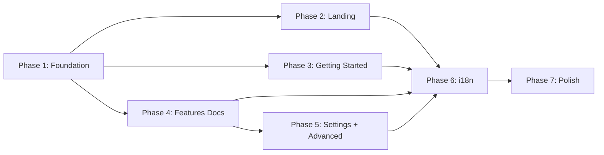

# EPIC-6: Landing page and documentation site

**Status**: TODO
**Created**: 2026-05-09

---

## Цель

Создать статический сайт на Docusaurus (GitHub Pages), совмещающий маркетинговый лендинг и полноценную документацию для jira-helper. Сайт на двух языках (RU/EN), документирует все фичи расширения с пошаговыми инструкциями и скриншотами.

## Requirements

[requirements.md](./requirements.md)

## Target Design

Структура сайта описана в [requirements.md](./requirements.md#10-структура-директорий-сайта-target).

Архитектурные решения:
- **SSG**: Docusaurus 3.x (React, MDX, встроенная i18n)
- **Хостинг**: GitHub Pages
- **i18n**: RU/EN с переключателем, Docusaurus встроенная система
- **Тема**: Classic, swizzling для лендинга (Hero, FeaturesGrid)
- **CI/CD**: GitHub Actions → деплой на gh-pages

## Задачи

### Phase 1: Foundation

| # | Task | Описание | Status |
|---|------|----------|--------|
| 96 | [Init Docusaurus] | Инициализация проекта, docusaurus.config.ts, sidebars.ts, i18n конфиг | TODO |
| 97 | [CI/CD] | GitHub Actions workflow: сборка + деплой на GitHub Pages | TODO |

### Phase 2: Landing Page

| # | Task | Описание | Status |
|---|------|----------|--------|
| 98 | [Hero + CTA] | Hero-секция с заголовком, подзаголовком, кнопками, фоновым скриншотом | TODO |
| 99 | [Features Grid] | Сетка из 6-8 карточек фич с гифками/скриншотами, ссылками в docs | TODO |
| 100 | [Stats Block] | Статистика (установки, звёзды, фичи) | TODO |

### Phase 3: Getting Started

| # | Task | Описание | Status |
|---|------|----------|--------|
| 101 | [Installation] | Страница установки для Chrome и Firefox | TODO |
| 102 | [Quick Start] | Быстрый старт: первые шаги с расширением | TODO |

### Phase 4: Features Documentation

| # | Task | Описание | Status |
|---|------|----------|--------|
| 103 | [WIP Limits] | Column, Swimlane, Personal, Field, Cell — 5 страниц | TODO |
| 104 | [Board Visualization] | Card Colors + Swimlane Histogram | TODO |
| 105 | [Card Information] | Days in Column, Days to Deadline, Issue Links, Condition Checks | TODO |
| 106 | [Sub-Tasks Progress] | Progress bar на карточках | TODO |
| 107 | [Gantt Chart] | Gantt-диаграмма (самая большая страница) | TODO |
| 108 | [Control Chart] | SLA Line + Scale Ruler | TODO |
| 109 | [Flag Issue] | Подсветка флагов на панели задачи | TODO |
| 110 | [Issue Templates] | Comment templates | TODO |
| 111 | [Data Blurring + Local Settings] | Размытие данных + настройка языка | TODO |

### Phase 5: Settings + Advanced

| # | Task | Описание | Status |
|---|------|----------|--------|
| 112 | [Settings Overview] | Как работает система настроек (board properties vs localStorage) | TODO |
| 113 | [FAQ] | Частые вопросы | TODO |

### Phase 6: i18n

| # | Task | Описание | Status |
|---|------|----------|--------|
| 114 | [Landing RU] | Перевод Hero, Features Grid, Stats, CTA на русский | TODO |
| 115 | [Docs RU] | Перевод всей документации на русский | TODO |

### Phase 7: Polish

| # | Task | Описание | Status |
|---|------|----------|--------|
| 116 | [SEO] | Open Graph, мета-теги, sitemap, robots.txt | TODO |
| 117 | [Assets] | Подготовка скриншотов/гифок, оптимизация WebP | TODO |

## Dependencies

## Acceptance Criteria

- [ ] Сайт опубликован на GitHub Pages
- [ ] Лендинг: Hero + Features Grid (6-8 карточек с гифками) + Stats + CTA
- [ ] Документация: Getting Started + все 20 фич с Overview и User Jobs
- [ ] RU/EN локализация с переключателем
- [ ] Поиск по документации
- [ ] Адаптивная вёрстка
- [ ] SEO: мета-теги, Open Graph, sitemap
- [ ] CI/CD: сборка и деплой из main
- [ ] 404 страница
- [ ] Все ссылки на Chrome Web Store / Firefox / GitHub работают

---

## Результаты

_(заполняется при закрытии EPIC)_
