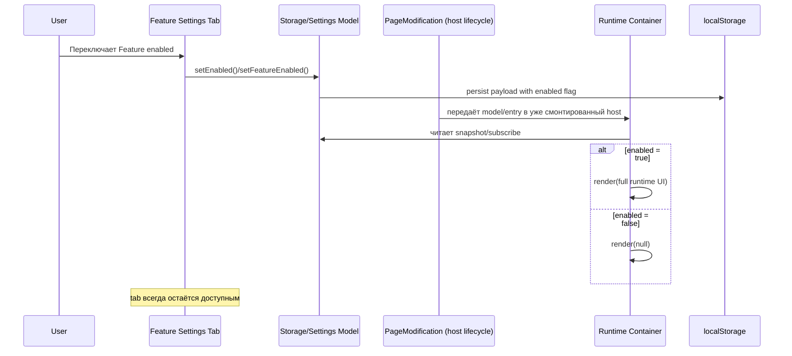
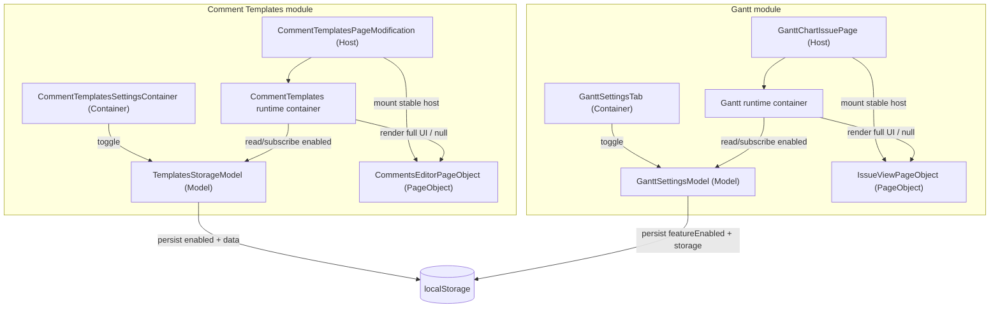

# Target Design: Локальные toggle для Comment Templates и Gantt

## 1. Цель и контекст

Цель фичи — добавить локальное (в рамках текущего браузера) включение/выключение двух фич: `Comment Templates` и `Gantt`, без потери пользовательских данных и без изменения доступности вкладок настроек.

Ретроспективно выбранный и реализованный подход:
- toggle хранится в storage каждой фичи (не централизованно),
- runtime-часть фичи монтируется/демонтируется сразу после переключения,
- settings-tab остаётся доступным всегда и служит точкой обратного включения.

Это соответствует требованиям из `request.md` и `requirements.md`: быстрый runtime-эффект, сохранность данных, минималистичный UI-контракт ON/OFF.

## 2. Ограничения и принципы

### Ограничения
- Не менять маршрутизацию и правила доступности tab:
  - Comment Templates: board + issue settings.
  - Gantt: issue settings.
- Не удалять данные при OFF.
- Поддержать legacy payload без флага `enabled` / `featureEnabled` (default `true`).
- Локальность решения: только `localStorage`, без серверной синхронизации.

### Архитектурные принципы
- Разделение ответственности по слоям: storage/model/runtime integration/view.
- React-контейнеры только связывают UI и model-команды.
- Совместимость payload обеспечивается на read-path через нормализацию.
- `PageModification` создаёт и держит host-точки в DOM, но не решает бизнес-ветвление ON/OFF.
- Решение "что рендерить" находится в контейнере: полный контент при ON, `null` (или disabled-view в settings) при OFF.

## 3. Варианты решения и выбор

### Вариант A: Централизованный toggle в `local-settings`
Плюсы:
- единая точка управления всеми фичами.

Минусы:
- нарушает требование про размещение toggle внутри feature-tab;
- выше риск связности между независимыми фичами;
- требует дополнительной навигации пользователем.

### Вариант B: Toggle внутри каждой фичи + флаг в storage фичи (выбран)
Плюсы:
- полностью соответствует UX-требованиям;
- локальная эволюция контрактов без общего migration orchestrator;
- независимый rollout для каждой фичи.

Минусы:
- дублирование паттерна в 2 фичах (разные модели, но единый принцип container-driven render/null).

### Обоснование выбора
Выбран Вариант B, потому что он минимально инвазивен, полностью покрывает FR-1..FR-10 и сохраняет существующие boundaries фич.

## 4. Диаграммы

### 4.1 Sequence: изменение toggle и container-driven render



### 4.2 Component/Data-flow по слоям



## 5. Модули/слои и ответственность

| Слой | Comment Templates | Gantt | Ответственность |
|---|---|---|---|
| View/Container | `CommentTemplatesSettingsContainer` | `GanttSettingsTab` | Рендер ON/OFF UI, вызов model-команд |
| State/Model | `TemplatesStorageModel` | `GanttSettingsModel` | Хранение `enabled`-флага, persist/load, default-совместимость |
| Runtime integration | `CommentTemplatesPageModification` + runtime container | `GanttChartIssuePage` + runtime container | `PageModification` держит host; контейнер решает render/full/null |
| PageObject | `CommentsEditorPageObject` | `IssueViewPageObject` | Монополия на DOM-операции |
| Storage boundary | `jira_helper_comment_templates` | `jh-gantt-settings` | Локальное долговременное состояние |

## 6. Контракт хранения данных (payload эволюция/совместимость)

### 6.1 Comment Templates

Ключ: `jira_helper_comment_templates`.

Текущий payload:

```ts
type CommentTemplatesStoragePayloadV1 = {
  version: 1;
  templates: CommentTemplate[];
  enabled?: boolean; // backward-compatible, default true
};
```

Эволюция:
- Было: `{ version: 1, templates }`.
- Стало: `{ version: 1, templates, enabled }`.
- При отсутствии `enabled` интерпретация: `true`.

Гарантии:
- `setEnabled()` не изменяет `templates`.
- `saveTemplates()` не меняет текущий `enabled`.

### 6.2 Gantt

Ключ: `jh-gantt-settings`.

Текущий payload:

```ts
type PersistedPayloadV1 = {
  storage: GanttSettingsStorage;
  statusBreakdownEnabled?: boolean;
  preferredScopeLevel?: "global" | "project" | "projectIssueType";
  featureEnabled?: boolean; // backward-compatible, default true
};
```

Совместимость:
- legacy формат (корневой `GanttSettingsStorage` без `storage`-обёртки) читается и мигрируется;
- при отсутствии `featureEnabled` используется `true`;
- дополнительные миграции (`startMapping/endMapping`, `exclusionFilter`) работают независимо от toggle.

Гарантия:
- `setFeatureEnabled()` персистит флаг без потери `storage`-данных.

## 7. Контракт runtime-синхронизации toggle -> render/null

### 7.1 Comment Templates (state-driven)

Источник истины: `TemplatesStorageModel.enabled`.

Контракт:
1. При изменении toggle вызывается `setEnabled(enabled)`.
2. Модель сохраняет payload как source of truth для `enabled`.
3. `CommentTemplatesPageModification` монтирует стабильный runtime host в DOM.
4. Runtime container:
   - подписывается на model-state,
   - при `enabled=true` рендерит toolbar/content,
   - при `enabled=false` рендерит `null`.
5. При `clear()` снимается подписка и unmount host-root.

Инвариант: settings tab зарегистрирован всегда, независимо от `enabled`.

### 7.2 Gantt (state-driven)

Источник истины: `GanttSettingsModel.featureEnabled`.

Контракт:
1. При изменении toggle вызывается `setFeatureEnabled(enabled)` -> `save()`.
2. `GanttChartIssuePage` монтирует стабильный host для runtime chart области.
3. Runtime container подписан на `featureEnabled`.
4. При переходе в OFF runtime container рендерит `null` (host остаётся).
5. При переходе в ON runtime container рендерит chart обратно.

Инвариант: host-жизненный цикл и бизнес-ветвление разделены; settings entry всегда доступен.

## 8. UI-контракт ON/OFF состояний

### Общий контракт (обе фичи)
- Вверху tab: заголовок + label `Feature enabled` + `Switch`.
- `ON`: отображается полный существующий контент настроек.
- `OFF`: отображается только короткий hint (`Typography.Text type="secondary"`), без основного контента.
- Toggle имеет стабильный `data-testid` для тестов.

### Comment Templates
- Toggle: `data-testid="comment-templates-local-toggle-switch"`.
- OFF-hint: `data-testid="comment-templates-local-toggle-disabled-hint"`.
- Тексты локализованы через `JIRA_COMMENT_TEMPLATES_TEXTS` (RU/EN).

### Gantt
- Toggle: `data-testid="gantt-local-toggle-switch"`.
- OFF-hint: `data-testid="gantt-local-toggle-disabled-hint"`.
- Тексты tab-контракта в `TAB_TEXTS` (RU/EN).

## 9. Тестовая стратегия

### Unit (Vitest)
- `TemplatesStorageModel.test.ts`:
  - восстановление `enabled` из payload,
  - default `true` для legacy payload,
  - сохранение `enabled` без потери templates.
- `GanttSettingsModel.test.ts`:
  - `setFeatureEnabled()` персистит флаг,
  - `load()` восстанавливает `featureEnabled`,
  - payload compatibility и сопутствующие миграции.

### Integration / container behavior
- `CommentTemplatesSettingsContainer.test.tsx`:
  - корректный рендер ON/OFF веток,
  - вызов `setEnabled`,
  - при `enabled=false` основная верстка списка шаблонов не рендерится (`queryBy...` на элементы списка/кнопки управления возвращает `null`),
  - disabled-hint отображается только при OFF.
- `GanttSettingsTab` container-level tests:
  - корректный рендер ON/OFF веток,
  - вызов `setFeatureEnabled`,
  - при `featureEnabled=false` основная верстка формы Gantt не рендерится (`queryBy...` на контролы формы возвращает `null`),
  - runtime view переключается через `render(full)` / `render(null)`.
- Runtime container tests (без тестирования `PageModification`):
  - при `enabled=false` контейнер рендерит `null` (нет feature layout в DOM),
  - при `enabled=true` контейнер рендерит контент фичи.

### Storybook
- Отдельные story для ON/OFF:
  - `CommentTemplatesSettingsContainer.stories.tsx`,
  - `GanttSettingsTab.stories.tsx`.
- Цель: визуальная регрессия минималистичного toggle-блока и disabled-hint.

## 10. Риски и mitigation

1. Риск: рассинхрон между persisted-state и runtime-state после toggle.  
   Mitigation: единая команда изменения флага + container-driven рендер по model-state, model/container тесты.

2. Риск: потеря данных при OFF/ON.  
   Mitigation: отдельные поля payload для toggle, запрет удаления бизнес-данных в командах `setEnabled`/`setFeatureEnabled`.

3. Риск: деградация UX из-за скрытия tab вместе с runtime.  
   Mitigation: явный инвариант «tab всегда зарегистрирован», закреплён тестами.

4. Риск: поломка для пользователей со старым localStorage payload.  
   Mitigation: defensive parsing + default `true` при отсутствии поля флага.

5. Риск: дублирование механик между фичами усложнит масштабирование на новые toggle.  
   Mitigation: после стабилизации можно вынести общий helper-контракт "stable host + state-driven runtime container", не меняя storage ownership per-feature.

## 11. Пошаговый план внедрения (как выполнено)

1. Расширить payload-модели фич флагом локального включения (`enabled` / `featureEnabled`) с default `true`.
2. Добавить команды изменения флага в model-слой с безопасным persist.
3. Реализовать runtime-контракт (stable host + container render/null):
   - Comment Templates: stable host в `PageModification` + container render/full/null.
   - Gantt: stable host в `PageModification` + container render/full/null по `featureEnabled`.
4. Обновить settings UI обеих фич до контракта ON/OFF (toggle в header + disabled hint).
5. Обеспечить i18n для новых текстов.
6. Добавить/обновить unit + integration тесты на storage/runtime/UI поведение.
7. Добавить Storybook-сценарии ON/OFF для визуальной проверки.
8. Прогнать регрессию на маршрутах board/issue settings и issue runtime.

## 12. Итог архитектурного решения

Решение реализует локальные per-feature toggle как часть собственных storage-контрактов фич, с немедленной runtime-синхронизацией и без потери доменных данных. Подход сохраняет текущую модульность, поддерживает backward compatibility и даёт предсказуемый UX: tab доступен всегда, runtime активируется только при `enabled=true`.
