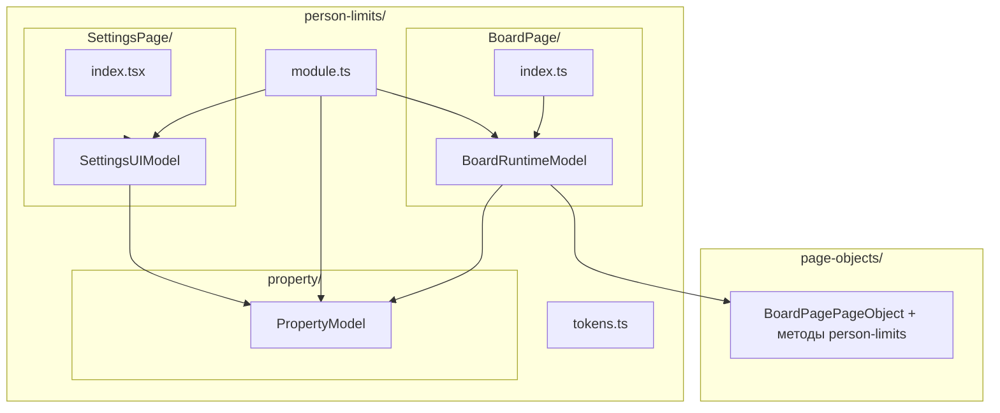

# EPIC-20: Рефакторинг person-limits (zustand → valtio + DI Module)

**Status**: TODO
**Created**: 2026-04-06

---

## Цель

Модуль `src/person-limits` использует три zustand-стора, `createAction` и отдельный `PersonLimitsBoardPageObject`. Это расходится с гайдлайном проекта: valtio Model-классы (`PropertyModel`, `BoardRuntimeModel`, `SettingsUIModel`), `module.ts` + `tokens.ts`, DOM через общий `BoardPagePageObject`.

**Решение**: миграция по образцу [EPIC-18 column-limits](../column-limits-refactor/EPIC-18-column-limits-refactor.md): расширение `IBoardPagePageObject` / `BoardPagePageObject`, ленивая регистрация в `PersonLimitsModule`, удаление legacy stores/actions/pageObject и zustand в property-слое. UX и формат Jira Board Property `PERSON_LIMITS` не меняются.

## Target Design

См. [target-design.md](./target-design.md) (тот же каталог, что и EPIC).

## Архитектура

## Задачи

### Phase 1: Infrastructure + PropertyModel

| # | Task | Описание | Status |
|---|------|----------|--------|
| 194 | [TASK-194](./TASK-194-property-model.md) | `PropertyModel` + `PropertyModel.test.ts`; обновление `property/index.ts` | TODO |
| 193 | [TASK-193](./TASK-193-infrastructure-tokens-module.md) | `tokens.ts` + `module.ts` (регистрация PropertyModel); `boardRuntimeModelToken` / `settingsUIModelToken` — в TASK-197 / TASK-202 | TODO |
| 195 | [TASK-195](./TASK-195-content-register-module.md) | `personLimitsModule.ensure(container)` в `content.ts` | TODO |

> **Порядок Phase 1**: сначала [TASK-194](./TASK-194-property-model.md), затем [TASK-193](./TASK-193-infrastructure-tokens-module.md), затем [TASK-195](./TASK-195-content-register-module.md) — как в column-limits: класс `PropertyModel` нужен до регистрации в `module.ts`. К концу EPIC `tokens.ts` должен совпасть с [target-design.md](./target-design.md) (три токена).

### Phase 2: Расширение BoardPagePageObject

| # | Task | Описание | Status |
|---|------|----------|--------|
| 196 | [TASK-196](./TASK-196-board-page-page-object-person-limits.md) | Перенос методов из `PersonLimitsBoardPageObject` в `IBoardPagePageObject` / `BoardPagePageObject` | TODO |

### Phase 3: BoardRuntimeModel + миграция Board page

| # | Task | Описание | Status |
|---|------|----------|--------|
| 197 | [TASK-197](./TASK-197-board-runtime-model.md) | `BoardRuntimeModel` + тесты; обновление `tokens.ts` / `module.ts` | TODO |
| 198 | [TASK-198](./TASK-198-board-page-index-migration.md) | `BoardPage/index.ts` — модели вместо stores/actions | TODO |
| 199 | [TASK-199](./TASK-199-avatars-container-use-model.md) | `AvatarsContainer` — `useModel()` вместо `useStore()` | TODO |
| 200 | [TASK-200](./TASK-200-board-page-bdd-tests.md) | Адаптация BoardPage BDD (features / helpers / steps) | TODO |
| 201 | [TASK-201](./TASK-201-board-page-delete-legacy.md) | Удаление `BoardPage/stores/`, `actions/`, `pageObject/` | TODO |

### Phase 4: SettingsUIModel + миграция Settings page

| # | Task | Описание | Status |
|---|------|----------|--------|
| 202 | [TASK-202](./TASK-202-settings-ui-model.md) | `SettingsUIModel` + `SettingsUIModel.test.ts`; обновление `module.ts` | TODO |
| 203 | [TASK-203](./TASK-203-settings-utils-pure-functions.md) | Перенос pure functions из `actions/` в `SettingsPage/utils/` | TODO |
| 204 | [TASK-204](./TASK-204-settings-containers-use-model.md) | `SettingsButtonContainer`, `SettingsModalContainer`, `PersonalWipLimitContainer` — `useModel()` | TODO |
| 205 | [TASK-205](./TASK-205-settings-page-index-load-property.md) | `SettingsPage/index.tsx` — `propertyModel.load()` и снятие legacy load | TODO |
| 206 | [TASK-206](./TASK-206-settings-page-bdd-tests.md) | Адаптация SettingsPage BDD (features / helpers / steps) | TODO |
| 207 | [TASK-207](./TASK-207-settings-delete-legacy-stores-actions.md) | Удаление `SettingsPage/stores/`, `SettingsPage/actions/` | TODO |

### Phase 5: Final cleanup

| # | Task | Описание | Status |
|---|------|----------|--------|
| 208 | [TASK-208](./TASK-208-final-cleanup-property-exports.md) | Удаление `property/store.ts`, `interface.ts`, `property/actions/`; обновление экспортов | TODO |
| 209 | [TASK-209](./TASK-209-architecture-md-final-check.md) | Обновление `ARCHITECTURE.md` + финальная проверка сборки и тестов | TODO |

## Dependencies

```mermaid
flowchart LR
    T194[TASK-194 PropertyModel]
    T193[TASK-193 tokens + module]
    T195[TASK-195 content.ts]
    T196[TASK-196 BoardPage PO]
    T197[TASK-197 BoardRuntimeModel]
    T198[TASK-198 Board index]
    T199[TASK-199 AvatarsContainer]
    T200[TASK-200 Board BDD]
    T201[TASK-201 Board legacy delete]
    T202[TASK-202 SettingsUIModel]
    T203[TASK-203 utils move]
    T204[TASK-204 Settings containers]
    T205[TASK-205 Settings index]
    T206[TASK-206 Settings BDD]
    T207[TASK-207 Settings legacy delete]
    T208[TASK-208 Final cleanup]
    T209[TASK-209 ARCHITECTURE + QA]

    T194 --> T193
    T193 --> T195
    T194 --> T197
    T193 --> T197
    T196 --> T197
    T197 --> T198
    T198 --> T199
    T198 --> T200
    T199 --> T200
    T200 --> T201
    T201 --> T202
    T194 --> T202
    T193 --> T202
    T202 --> T203
    T203 --> T204
    T204 --> T205
    T205 --> T206
    T206 --> T207
    T207 --> T208
    T208 --> T209
```

**Параллельно можно выполнять:**

- [TASK-196](./TASK-196-board-page-page-object-person-limits.md) — параллельно с Phase 1 (после того как понятны сигнатуры методов из `PersonLimitsBoardPageObject`), до интеграции в [TASK-197](./TASK-197-board-runtime-model.md).

**Последовательно:**

1. TASK-194 → TASK-193 → TASK-195.
2. TASK-197 после TASK-194, TASK-193, TASK-196.
3. TASK-198 → TASK-199 → TASK-200 → TASK-201.
4. TASK-202 после TASK-201 (и при необходимости совместно с уже готовыми PropertyModel + module).
5. TASK-203 → TASK-204 → TASK-205 → TASK-206 → TASK-207.
6. TASK-208 → TASK-209.

## BDD / спецификации

| Документ | Назначение |
|----------|------------|
| [property-model.feature](./property-model.feature) | PropertyModel |
| [board-runtime.feature](./board-runtime.feature) | BoardRuntimeModel |
| [settings-ui.feature](./settings-ui.feature) | SettingsUIModel |
| [di-integration.feature](./di-integration.feature) | DI, tokens, useModel |

## Acceptance Criteria

- [ ] Все три zustand-стора заменены на valtio Model-классы; `createAction` и legacy action-файлы удалены.
- [ ] `PersonLimitsBoardPageObject` удалён; нужные методы — в `BoardPagePageObject` / моделях.
- [ ] `tokens.ts` и `personLimitsModule` соответствуют [target-design.md](./target-design.md) и референсам (`column-limits`, `swimlane-wip-limits`, `field-limits`).
- [ ] Unit-тесты (Vitest) для Model-классов проходят; Cypress BDD — без регрессий после адаптации helpers.
- [ ] Формат `PERSON_LIMITS` не изменён; поведение для пользователя — как до рефакторинга.
- [ ] `npm run build`, `npm test`, `npm run lint` (или эквивалентные скрипты проекта) завершаются успешно.
