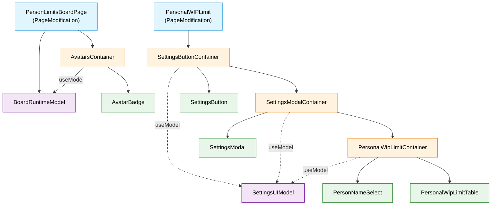
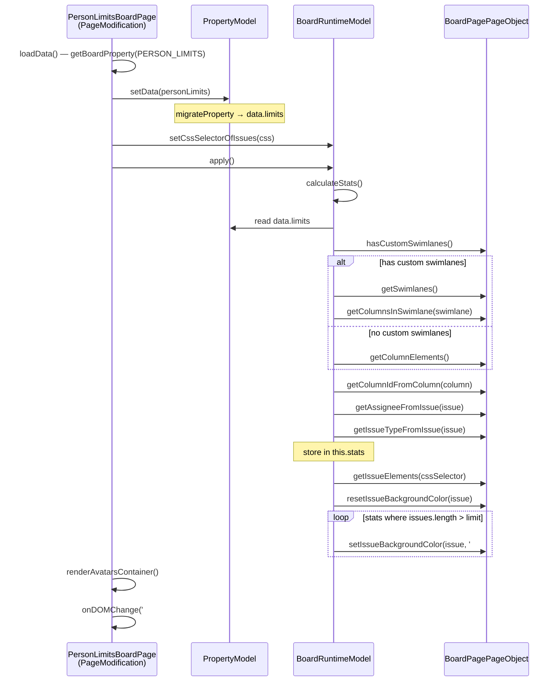
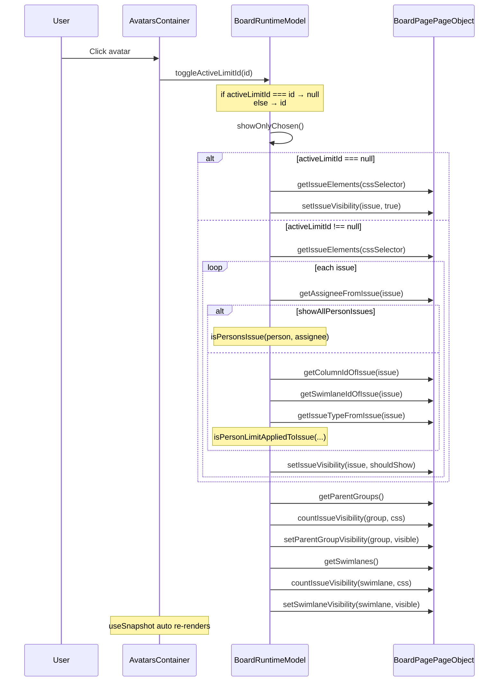
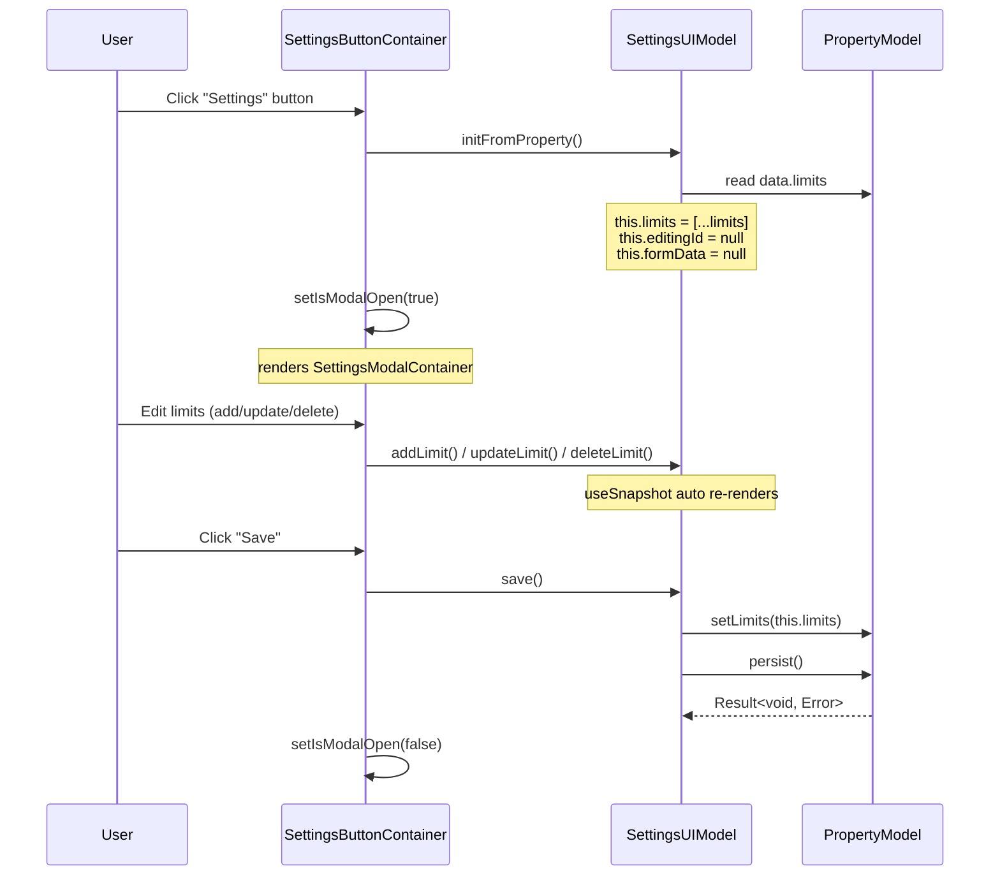

# Target Design: person-limits refactoring (zustand → valtio + DI Module)

Этот документ описывает целевую архитектуру для рефакторинга модуля `src/person-limits`: миграция трёх zustand-сторов на valtio Model-классы, ликвидация `PersonLimitsBoardPageObject` с переносом DOM-методов в общий `BoardPagePageObject`, удаление action-файлов (`createAction`), создание `module.ts` + `tokens.ts` с DI-регистрацией.

## Ключевые принципы

1. **Valtio Model-классы вместо zustand stores** — три Model-класса (`PropertyModel`, `BoardRuntimeModel`, `SettingsUIModel`) с constructor DI, прямыми мутациями и `reset()`. Zustand stores, `createAction` и standalone action-файлы удаляются полностью.
2. **Монополия PageObject на DOM** — `BoardRuntimeModel` координирует бизнес-логику (что подсветить, какие issue скрыть), но все DOM-операции через `BoardPagePageObject` (DI). Прямых обращений к `document` в Model нет.
3. **Единый BoardPagePageObject** — `PersonLimitsBoardPageObject` удаляется. Его методы (`getAssigneeFromIssue`, `getIssueTypeFromIssue`, `setIssueVisibility`, `setSwimlaneVisibility`, `setParentGroupVisibility`, etc.) добавляются в общий `BoardPagePageObject`.
4. **Чистые функции — прямой import** — `createPersonLimit`, `updatePersonLimit`, `transformFormData`, `isPersonLimitAppliedToIssue`, `isPersonsIssue`, `computeLimitId`, `migrateProperty`, `getNameFromTooltip` остаются pure functions с прямым import. Только сущности с side effects / state идут через DI.
5. **Формат property не меняется** — `PersonWipLimitsProperty`, `PersonLimit`, `PersonLimit_2_29` и остальные типы из `property/types.ts` сохраняются без изменений. Обратная совместимость полная.

> Общие архитектурные принципы — см. `docs/architecture_guideline.md`

## Architecture Diagram

### BEFORE (текущее состояние)

```mermaid
flowchart TB
    subgraph property ["property/ (zustand)"]
        PropStore["usePersonWipLimitsPropertyStore"]
        style PropStore fill:#D3D3D3,color:#666
        LoadAction["loadProperty (createAction)"]
        style LoadAction fill:#D3D3D3,color:#666
        SaveAction["saveProperty (createAction)"]
        style SaveAction fill:#D3D3D3,color:#666
    end

    subgraph boardPage ["BoardPage/ (zustand + createAction)"]
        BoardEntry["index.ts (PageModification)"]
        style BoardEntry fill:#FFA500,color:black
        RuntimeStore["useRuntimeStore"]
        style RuntimeStore fill:#D3D3D3,color:#666
        CalcAction["calculateStats (createAction)"]
        style CalcAction fill:#D3D3D3,color:#666
        ApplyAction["applyLimits (createAction)"]
        style ApplyAction fill:#D3D3D3,color:#666
        ShowAction["showOnlyChosen (createAction)"]
        style ShowAction fill:#D3D3D3,color:#666
        PersonPO["PersonLimitsBoardPageObject"]
        style PersonPO fill:#FFA500,color:black
        AvatarsC["AvatarsContainer"]
        style AvatarsC fill:#4169E1,color:white
    end

    subgraph settingsPage ["SettingsPage/ (zustand + actions)"]
        SettingsEntry["index.tsx (PageModification)"]
        style SettingsEntry fill:#FFA500,color:black
        UIStore["useSettingsUIStore"]
        style UIStore fill:#D3D3D3,color:#666
        InitAction["initFromProperty"]
        style InitAction fill:#D3D3D3,color:#666
        SaveToAction["saveToProperty"]
        style SaveToAction fill:#D3D3D3,color:#666
        BtnContainer["SettingsButtonContainer"]
        style BtnContainer fill:#4169E1,color:white
        ModalContainer["SettingsModalContainer"]
        style ModalContainer fill:#4169E1,color:white
        FormContainer["PersonalWipLimitContainer"]
        style FormContainer fill:#4169E1,color:white
    end

    CalcAction -->|getState| PropStore
    CalcAction -->|inject| PersonPO
    ApplyAction -->|inject| PersonPO
    ApplyAction --> CalcAction
    ShowAction -->|inject| PersonPO
    ShowAction -->|getState| RuntimeStore
    AvatarsC -->|useStore| RuntimeStore
    AvatarsC --> ShowAction

    InitAction -->|getState| PropStore
    InitAction -->|getState| UIStore
    SaveToAction -->|getState| UIStore
    SaveToAction -->|getState| PropStore
    SaveToAction --> SaveAction

    BtnContainer --> InitAction
    BtnContainer --> SaveToAction
    ModalContainer -->|getState| UIStore
    FormContainer -->|useStore| UIStore
```



### AFTER (целевое состояние)

```mermaid
flowchart TB
    subgraph pageObjects ["page-objects/ (✦ расширяется)"]
        BoardPagePO["BoardPagePageObject<br/><small>+ getAssigneeFromIssue<br/>+ getIssueTypeFromIssue<br/>+ getColumnIdOfIssue<br/>+ getSwimlaneIdOfIssue<br/>+ hasCustomSwimlanes<br/>+ getColumnElements<br/>+ getColumnsInSwimlane<br/>+ getParentGroups<br/>+ getIssueElements<br/>+ setIssueBackgroundColor<br/>+ resetIssueBackgroundColor<br/>+ setIssueVisibility<br/>+ setSwimlaneVisibility<br/>+ setParentGroupVisibility<br/>+ countIssueVisibility</small>"]
        style BoardPagePO fill:#FFA500,color:black
    end

    subgraph personLimits ["person-limits/"]
        Types["property/types.ts"]

        subgraph plTokens ["(★ NEW)"]
            Tokens["tokens.ts"]
            PLModule["module.ts"]
        end

        subgraph property ["property/ (★ rewrite)"]
            PropModel["PropertyModel"]
            style PropModel fill:#9370DB,color:white
        end

        subgraph boardPage ["BoardPage/ (★ rewrite)"]
            BoardEntry["index.ts<br/>(PageModification)"]
            style BoardEntry fill:#FFA500,color:black
            RuntimeModel["BoardRuntimeModel"]
            style RuntimeModel fill:#9370DB,color:white
            AvatarsC["AvatarsContainer"]
            style AvatarsC fill:#4169E1,color:white
            AvatarBadge["AvatarBadge"]
            style AvatarBadge fill:#20B2AA,color:white
        end

        subgraph settingsPage ["SettingsPage/ (★ rewrite)"]
            SettingsEntry["index.tsx<br/>(PageModification)"]
            style SettingsEntry fill:#FFA500,color:black
            UIModel["SettingsUIModel"]
            style UIModel fill:#9370DB,color:white
            BtnContainer["SettingsButtonContainer"]
            style BtnContainer fill:#4169E1,color:white
            ModalContainer["SettingsModalContainer"]
            style ModalContainer fill:#4169E1,color:white
            FormContainer["PersonalWipLimitContainer"]
            style FormContainer fill:#4169E1,color:white
        end

        subgraph utils ["utils/ (✦ перемещённые pure functions)"]
            CreateLimit["createPersonLimit"]
            UpdateLimit["updatePersonLimit"]
            TransformForm["transformFormData"]
        end

        subgraph boardUtils ["BoardPage/utils/ (без изменений)"]
            IsApplied["isPersonLimitAppliedToIssue"]
            IsPersons["isPersonsIssue"]
            ComputeId["computeLimitId"]
        end
    end

    PLModule -->|lazy + modelEntry| PropModel
    PLModule -->|lazy + modelEntry| RuntimeModel
    PLModule -->|lazy + modelEntry| UIModel

    RuntimeModel -->|constructor DI| PropModel
    RuntimeModel -->|constructor DI| BoardPagePO
    UIModel -->|constructor DI| PropModel

    BoardEntry -->|inject| RuntimeModel
    BoardEntry -->|inject| PropModel
    AvatarsC -->|useModel| RuntimeModel

    BtnContainer -->|useModel| UIModel
    ModalContainer -->|useModel| UIModel
    FormContainer -->|useModel| UIModel

    RuntimeModel -->|direct import| IsApplied
    RuntimeModel -->|direct import| IsPersons
    RuntimeModel -->|direct import| ComputeId
```



## Component Hierarchy



**Легенда**: голубой — PageModification (не React), оранжевый — Container, зелёный — View, фиолетовый — Model.

## Target File Structure

```
src/person-limits/
├── tokens.ts                                   # ★ NEW: DI-токены для 3 Model-ов
├── module.ts                                   # ★ NEW: class PersonLimitsModule extends Module
│
├── property/
│   ├── types.ts                                # без изменений
│   ├── migrateProperty.ts                      # без изменений (pure function)
│   ├── migrateProperty.test.ts                 # без изменений
│   ├── PropertyModel.ts                        # ★ NEW: valtio Model (замена store.ts + actions)
│   ├── PropertyModel.test.ts                   # ★ NEW: unit tests
│   ├── index.ts                                # ✦ обновить экспорты
│   ├── store.ts                                # ❌ DELETE (заменён PropertyModel)
│   ├── store.test.ts                           # ❌ DELETE (→ PropertyModel.test.ts)
│   ├── interface.ts                            # ❌ DELETE (интерфейс в PropertyModel)
│   └── actions/
│       ├── loadProperty.ts                     # ❌ DELETE (→ PropertyModel.load)
│       └── saveProperty.ts                     # ❌ DELETE (→ PropertyModel.persist)
│
├── BoardPage/
│   ├── index.ts                                # ✦ обновить: использовать Model вместо stores/actions
│   ├── models/
│   │   ├── BoardRuntimeModel.ts                # ★ NEW: valtio Model
│   │   └── BoardRuntimeModel.test.ts           # ★ NEW: unit tests
│   ├── components/
│   │   ├── AvatarsContainer.tsx                # ✦ обновить: useModel() вместо useStore()
│   │   ├── AvatarBadge.tsx                     # без изменений (View)
│   │   ├── AvatarBadge.module.css              # без изменений
│   │   └── AvatarBadge.stories.tsx             # без изменений
│   ├── utils/
│   │   ├── isPersonLimitAppliedToIssue.ts      # без изменений (pure function)
│   │   ├── isPersonLimitAppliedToIssue.test.ts # без изменений
│   │   ├── isPersonsIssue.ts                   # без изменений (pure function)
│   │   ├── isPersonsIssue.test.ts              # без изменений
│   │   ├── computeLimitId.ts                   # без изменений (pure function)
│   │   ├── computeLimitId.test.ts              # без изменений
│   │   └── index.ts                            # без изменений
│   ├── features/
│   │   ├── helpers.tsx                         # ✦ адаптировать тестовый setup
│   │   ├── *.feature                           # без изменений
│   │   ├── *.feature.cy.tsx                    # ✦ адаптировать step definitions
│   │   └── steps/common.steps.ts               # ✦ адаптировать
│   ├── stores/                                 # ❌ DELETE entire folder
│   │   ├── runtimeStore.ts                     # ❌ DELETE (→ BoardRuntimeModel)
│   │   ├── runtimeStore.types.ts               # ❌ DELETE (типы → BoardRuntimeModel / types)
│   │   └── index.ts                            # ❌ DELETE
│   ├── actions/                                # ❌ DELETE entire folder
│   │   ├── applyLimits.ts                      # ❌ DELETE (→ BoardRuntimeModel.apply)
│   │   ├── calculateStats.ts                   # ❌ DELETE (→ BoardRuntimeModel.calculateStats)
│   │   ├── calculateStats.test.ts              # ❌ DELETE (→ BoardRuntimeModel.test.ts)
│   │   ├── showOnlyChosen.ts                   # ❌ DELETE (→ BoardRuntimeModel.showOnlyChosen)
│   │   └── index.ts                            # ❌ DELETE
│   └── pageObject/                             # ❌ DELETE entire folder
│       ├── PersonLimitsBoardPageObject.ts      # ❌ DELETE (методы → BoardPagePageObject)
│       ├── IPersonLimitsBoardPageObject.ts     # ❌ DELETE
│       ├── personLimitsBoardPageObjectToken.ts # ❌ DELETE
│       ├── getNameFromTooltip.test.ts           # ✦ перенести в BoardPage/utils/ или page-objects/
│       └── index.ts                            # ❌ DELETE
│
├── SettingsPage/
│   ├── index.tsx                               # ✦ обновить: убрать loadPersonWipLimitsProperty
│   ├── texts.ts                                # без изменений
│   ├── constants.ts                            # без изменений
│   ├── models/
│   │   ├── SettingsUIModel.ts                  # ★ NEW: valtio Model
│   │   └── SettingsUIModel.test.ts             # ★ NEW: unit tests
│   ├── components/
│   │   ├── PersonalWipLimitContainer.tsx        # ✦ обновить: useModel() вместо useStore()
│   │   ├── PersonalWipLimitContainer.cy.tsx     # ✦ адаптировать helpers
│   │   ├── PersonalWipLimitContainer.stories.tsx # без изменений
│   │   ├── PersonalWipLimitTable.tsx            # без изменений (View)
│   │   ├── PersonalWipLimitTable.stories.tsx    # без изменений
│   │   ├── PersonNameSelect.tsx                 # без изменений (View)
│   │   ├── PersonNameSelect.stories.tsx         # без изменений
│   │   ├── SettingsButton/
│   │   │   ├── SettingsButtonContainer.tsx      # ✦ обновить: useModel() вместо initFromProperty/saveToProperty
│   │   │   ├── SettingsButton.tsx               # без изменений (View)
│   │   │   ├── SettingsButton.cy.tsx            # ✦ адаптировать helpers
│   │   │   └── SettingsButton.stories.tsx       # без изменений
│   │   └── SettingsModal/
│   │       ├── SettingsModalContainer.tsx       # ✦ обновить: useModel() вместо useStore()
│   │       ├── SettingsModalContainer.cy.tsx    # ✦ адаптировать helpers
│   │       ├── SettingsModal.tsx                # без изменений (View)
│   │       └── SettingsModal.stories.tsx        # без изменений
│   ├── utils/
│   │   ├── createPersonLimit.ts                # ✦ перенести из actions/
│   │   ├── createPersonLimit.test.ts           # ✦ перенести из actions/
│   │   ├── updatePersonLimit.ts                # ✦ перенести из actions/
│   │   ├── updatePersonLimit.test.ts           # ✦ перенести из actions/
│   │   ├── transformFormData.ts                # ✦ перенести из actions/
│   │   └── transformFormData.test.ts           # ✦ перенести из actions/
│   ├── state/
│   │   └── types.ts                            # без изменений (Column, Swimlane, FormData)
│   ├── features/
│   │   ├── helpers.tsx                         # ✦ адаптировать тестовый setup
│   │   ├── *.feature                           # без изменений
│   │   ├── *.feature.cy.tsx                    # ✦ адаптировать step definitions
│   │   └── steps/common.steps.ts               # ✦ адаптировать
│   ├── stores/                                 # ❌ DELETE entire folder
│   │   ├── settingsUIStore.ts                  # ❌ DELETE (→ SettingsUIModel)
│   │   ├── settingsUIStore.types.ts            # ❌ DELETE (типы → SettingsUIModel)
│   │   ├── personalWipLimitsStore.test.ts      # ❌ DELETE (→ SettingsUIModel.test.ts)
│   │   └── index.ts                            # ❌ DELETE (если есть)
│   └── actions/                                # ❌ DELETE entire folder
│       ├── initFromProperty.ts                 # ❌ DELETE (→ SettingsUIModel.initFromProperty)
│       ├── initFromProperty.test.ts            # ❌ DELETE (→ SettingsUIModel.test.ts)
│       ├── saveToProperty.ts                   # ❌ DELETE (→ SettingsUIModel.save)
│       ├── saveToProperty.test.ts              # ❌ DELETE (→ SettingsUIModel.test.ts)
│       ├── createPersonLimit.ts                # ✦ MOVE → SettingsPage/utils/
│       ├── createPersonLimit.test.ts           # ✦ MOVE → SettingsPage/utils/
│       ├── updatePersonLimit.ts                # ✦ MOVE → SettingsPage/utils/
│       ├── updatePersonLimit.test.ts           # ✦ MOVE → SettingsPage/utils/
│       ├── transformFormData.ts                # ✦ MOVE → SettingsPage/utils/
│       ├── transformFormData.test.ts           # ✦ MOVE → SettingsPage/utils/
│       └── index.ts                            # ❌ DELETE
│
├── PersonLimitsSettings.stories.tsx            # без изменений
├── feature.md                                  # без изменений
├── feature.ru.md                               # без изменений
├── README.md                                   # без изменений
├── USER-GUIDE.md                               # без изменений
├── REQUIREMENTS.md                             # без изменений
└── ARCHITECTURE.md                             # ✦ обновить после рефакторинга

src/page-objects/
└── BoardPage.tsx                               # ✦ расширить: новые методы в IBoardPagePageObject

src/content.ts                                  # ✦ добавить personLimitsModule.ensure(container)
```

## Component Specifications

### tokens.ts (★ NEW)

**Responsibility**: DI-токены для трёх Model-ов модуля person-limits.

```typescript
import { createModelToken } from 'src/shared/di/Module';
import type { PropertyModel } from './property/PropertyModel';
import type { BoardRuntimeModel } from './BoardPage/models/BoardRuntimeModel';
import type { SettingsUIModel } from './SettingsPage/models/SettingsUIModel';

export const propertyModelToken = createModelToken<PropertyModel>('person-limits/propertyModel');
export const boardRuntimeModelToken = createModelToken<BoardRuntimeModel>('person-limits/boardRuntimeModel');
export const settingsUIModelToken = createModelToken<SettingsUIModel>('person-limits/settingsUIModel');
```

### module.ts (★ NEW)

**Responsibility**: Ленивая DI-регистрация всех Model-ов person-limits через `class extends Module`.

```typescript
import type { Container } from 'dioma';
import { Module, modelEntry } from 'src/shared/di/Module';
import { propertyModelToken, boardRuntimeModelToken, settingsUIModelToken } from './tokens';
import { PropertyModel } from './property/PropertyModel';
import { BoardRuntimeModel } from './BoardPage/models/BoardRuntimeModel';
import { SettingsUIModel } from './SettingsPage/models/SettingsUIModel';
import { BoardPropertyServiceToken } from 'src/shared/boardPropertyService';
import { loggerToken } from 'src/shared/Logger';
import { boardPagePageObjectToken } from 'src/page-objects/BoardPage';

class PersonLimitsModule extends Module {
  register(container: Container): void {
    this.lazy(container, propertyModelToken, c =>
      modelEntry(new PropertyModel(c.inject(BoardPropertyServiceToken), c.inject(loggerToken)))
    );

    this.lazy(container, boardRuntimeModelToken, c => {
      const { model: propertyModel } = c.inject(propertyModelToken);
      return modelEntry(
        new BoardRuntimeModel(propertyModel, c.inject(boardPagePageObjectToken), c.inject(loggerToken))
      );
    });

    this.lazy(container, settingsUIModelToken, c => {
      const { model: propertyModel } = c.inject(propertyModelToken);
      return modelEntry(new SettingsUIModel(propertyModel, c.inject(loggerToken)));
    });
  }
}

export const personLimitsModule = new PersonLimitsModule();
```

### PropertyModel (★ NEW)

**Responsibility**: Загрузка и сохранение `PersonWipLimitsProperty` из/в Jira Board Property `PERSON_LIMITS`. Применяет миграцию при загрузке.

```typescript
import { Result, Ok, Err } from 'ts-results';
import type { PersonLimit, PersonWipLimitsProperty, PersonWipLimitsProperty_2_29 } from './types';
import type { BoardPropertyServiceI } from 'src/shared/boardPropertyService';
import type { Logger } from 'src/shared/Logger';
import { BOARD_PROPERTIES } from 'src/shared/constants';
import { migrateProperty } from './migrateProperty';

/**
 * @module PropertyModel
 *
 * Загрузка/сохранение PersonWipLimitsProperty из Jira Board Property.
 * Применяет миграцию v2.29 → v2.30 при загрузке.
 *
 * ## Использование
 *
 * ```ts
 * const { useModel } = useDi().inject(propertyModelToken);
 * const model = useModel();
 * await model.load();
 * const limits = model.data.limits;
 * ```
 */
export class PropertyModel {
  // === State ===

  /** Данные property (источник истины для limits) */
  data: PersonWipLimitsProperty = { limits: [] };

  /** Состояние загрузки */
  state: 'initial' | 'loading' | 'loaded' = 'initial';

  /** Последняя ошибка */
  error: string | null = null;

  constructor(
    private boardPropertyService: BoardPropertyServiceI,
    private logger: Logger
  ) {}

  // === Commands ===

  /**
   * Загрузить property из Jira Board Property.
   * Применяет миграцию v2.29 → v2.30.
   * Идемпотентна (пропускает если state !== 'initial').
   */
  async load(): Promise<Result<PersonWipLimitsProperty, Error>>;

  /**
   * Сохранить текущие data в Jira Board Property.
   */
  async persist(): Promise<Result<void, Error>>;

  /**
   * Установить data напрямую (для случая, когда данные уже загружены PageModification).
   * Применяет миграцию.
   */
  setData(data: PersonWipLimitsProperty_2_29 | PersonWipLimitsProperty): void;

  /** Установить массив лимитов */
  setLimits(limits: PersonLimit[]): void;

  /** Сброс к начальному состоянию */
  reset(): void;
}
```

### BoardRuntimeModel (★ NEW)

**Responsibility**: Подсчёт issue stats по лимитам, подсветка превышений (красный фон), фильтрация по выбранному человеку (скрытие/показ issue через PageObject).

```typescript
import type { PersonLimitStats } from './types';
import type { PropertyModel } from '../../property/PropertyModel';
import type { IBoardPagePageObject } from 'src/page-objects/BoardPage';
import type { Logger } from 'src/shared/Logger';

/**
 * Runtime statistics for a single person's WIP limit.
 * Calculated from board DOM state.
 */
export type PersonLimitStats = {
  /** Stable hash-based ID */
  id: number;
  person: {
    name: string;
    displayName?: string;
  };
  limit: number;
  /** DOM elements of matching issues */
  issues: Element[];
  columns: Array<{ id: string; name: string }>;
  swimlanes: Array<{ id: string; name: string }>;
  includedIssueTypes?: string[];
  showAllPersonIssues: boolean;
};

/**
 * @module BoardRuntimeModel
 *
 * Runtime-модель для person-limits на доске.
 * Подсчитывает statistics, подсвечивает превышения, фильтрует issue по клику на аватар.
 *
 * ## Использование
 *
 * ```ts
 * const { useModel } = useDi().inject(boardRuntimeModelToken);
 * const model = useModel();
 * model.stats; // PersonLimitStats[]
 * model.activeLimitId; // number | null
 * ```
 */
export class BoardRuntimeModel {
  // === State ===

  /** Вычисленные stats для каждого person limit */
  stats: PersonLimitStats[] = [];

  /** ID активного лимита для фильтрации (null = показывать все) */
  activeLimitId: number | null = null;

  /** CSS-селектор для issue-карточек */
  cssSelectorOfIssues: string = '.ghx-issue';

  constructor(
    private propertyModel: PropertyModel,
    private pageObject: IBoardPagePageObject,
    private logger: Logger
  ) {}

  // === Commands ===

  /**
   * Оркестрация: calculateStats → подсветка превышений.
   * Вызывается при инициализации и на каждый DOM change (#ghx-pool mutation).
   */
  apply(): void;

  /**
   * Подсчёт issues для каждого person limit.
   * Читает limits из PropertyModel, обходит DOM через PageObject.
   * Учитывает swimlanes, columns, issue types.
   * @returns PersonLimitStats[] (также сохраняется в this.stats)
   */
  calculateStats(): PersonLimitStats[];

  /**
   * Показать только задачи выбранного человека (скрыть остальные).
   * Если activeLimitId === null — показать все.
   * Учитывает showAllPersonIssues: true = все задачи человека, false = только matching.
   * Скрывает пустые swimlanes и parent groups.
   */
  showOnlyChosen(): void;

  /**
   * Toggle фильтра по person: если id === activeLimitId, сбрасывает; иначе устанавливает.
   * Автоматически вызывает showOnlyChosen().
   */
  toggleActiveLimitId(id: number): void;

  /** Установить CSS-селектор для issue-карточек */
  setCssSelectorOfIssues(selector: string): void;

  /** Сброс к начальному состоянию */
  reset(): void;
}
```

### SettingsUIModel (★ NEW)

**Responsibility**: Состояние модалки настроек person-limits: CRUD лимитов, форма, редактирование, проверка дубликатов, сохранение.

```typescript
import type { PersonLimit } from '../../property/types';
import type { FormData, SelectedPerson } from './types';
import type { PropertyModel } from '../../property/PropertyModel';
import type { Logger } from 'src/shared/Logger';

/**
 * UI state types (re-exported from existing types, сохраняются без изменений)
 */
export type { FormData, SelectedPerson } from '../stores/settingsUIStore.types';

/**
 * @module SettingsUIModel
 *
 * Модель состояния модалки настроек PersonLimits.
 * Управляет CRUD лимитов, формой, редактированием и дубликатами.
 *
 * ## Использование
 *
 * ```ts
 * const { useModel } = useDi().inject(settingsUIModelToken);
 * const model = useModel();
 * model.limits; // PersonLimit[]
 * model.editingId; // number | null
 * model.addLimit(personLimit);
 * ```
 */
export class SettingsUIModel {
  // === State ===

  /** Список лимитов (копия из PropertyModel, редактируется в UI) */
  limits: PersonLimit[] = [];

  /** ID лимита в режиме редактирования (null = режим создания) */
  editingId: number | null = null;

  /** Данные формы (null = форма не заполнена) */
  formData: FormData | null = null;

  /** Состояние UI */
  state: 'initial' | 'loaded' = 'initial';

  constructor(
    private propertyModel: PropertyModel,
    private logger: Logger
  ) {}

  // === Commands ===

  /**
   * Инициализировать UI из PropertyModel.
   * Копирует limits, сбрасывает editingId и formData.
   * Вызывается при открытии модалки.
   */
  initFromProperty(): void;

  /**
   * Сохранить limits в PropertyModel и persist в Jira.
   * Копирует this.limits → propertyModel.setLimits(), вызывает propertyModel.persist().
   */
  async save(): Promise<Result<void, Error>>;

  /** Добавить новый лимит и сбросить formData */
  addLimit(limit: PersonLimit): void;

  /**
   * Обновить существующий лимит по id.
   * Сбрасывает editingId и formData.
   */
  updateLimit(id: number, updatedLimit: PersonLimit): void;

  /**
   * Удалить лимит по id.
   * Если удаляемый лимит редактируется — сбрасывает editingId и formData.
   */
  deleteLimit(id: number): void;

  /**
   * Установить id лимита для редактирования.
   * Если id !== null — заполняет formData из найденного лимита.
   * Если id === null — сбрасывает formData.
   */
  setEditingId(id: number | null): void;

  /** Установить данные формы */
  setFormData(formData: FormData | null): void;

  /** Установить массив лимитов */
  setLimits(limits: PersonLimit[]): void;

  // === Queries ===

  /**
   * Проверить, существует ли дубликат лимита с указанными параметрами.
   * Сравнивает person.name + columns + swimlanes + issueTypes.
   */
  isDuplicate(personName: string, columns: string[], swimlanes: string[], issueTypes?: string[]): boolean;

  /** Сброс к начальному состоянию */
  reset(): void;
}
```

### IBoardPagePageObject — расширение (✦)

**Responsibility**: Добавить методы для работы с person-limits: получение assignee/issueType из карточки, управление видимостью issue/swimlane/parentGroup, получение column/swimlane ID из issue.

```typescript
export interface IBoardPagePageObject {
  // ... existing methods ...

  // === Person-limits: Queries ===

  /**
   * Get all issue card elements matching CSS selector.
   */
  getIssueElements(cssSelector: string): Element[];

  /**
   * Parse assignee name from issue card's avatar tooltip.
   * Format: "Assignee: John Doe" → "John Doe"
   * Handles inactive user markers: "Name [x]" → "Name"
   */
  getAssigneeFromIssue(issue: Element): string | null;

  /**
   * Get issue type from issue card (from .ghx-type title attribute).
   */
  getIssueTypeFromIssue(issue: Element): string | null;

  /**
   * Get column ID for an issue (finds closest parent .ghx-column).
   */
  getColumnIdOfIssue(issue: Element): string | null;

  /**
   * Get column ID directly from a column element (data-column-id).
   */
  getColumnIdFromColumn(column: Element): string | null;

  /**
   * Get swimlane ID for an issue (finds closest parent .ghx-swimlane).
   */
  getSwimlaneIdOfIssue(issue: Element): string | null;

  /**
   * Check if board has custom swimlanes (aria-label includes 'custom').
   */
  hasCustomSwimlanes(): boolean;

  /**
   * Get all column elements on the board (not headers, actual .ghx-column elements).
   */
  getColumnElements(): Element[];

  /**
   * Get column elements within a specific swimlane.
   */
  getColumnsInSwimlane(swimlane: Element): Element[];

  /**
   * Get all parent group elements (for subtasks grouping).
   */
  getParentGroups(): Element[];

  /**
   * Count visible and hidden issues in a DOM element.
   * Hidden = has 'no-visibility' class.
   */
  countIssueVisibility(
    element: Element,
    cssSelector: string
  ): { total: number; hidden: number };

  // === Person-limits: Commands ===

  /**
   * Set inline background color on an issue card.
   */
  setIssueBackgroundColor(issue: Element, color: string): void;

  /**
   * Clear inline background color on an issue card.
   */
  resetIssueBackgroundColor(issue: Element): void;

  /**
   * Toggle 'no-visibility' class on an issue card.
   */
  setIssueVisibility(issue: Element, visible: boolean): void;

  /**
   * Toggle 'no-visibility' class on a swimlane.
   */
  setSwimlaneVisibility(swimlane: Element, visible: boolean): void;

  /**
   * Toggle 'no-visibility' class on a parent group.
   */
  setParentGroupVisibility(group: Element, visible: boolean): void;
}
```

## State Changes

### PropertyModel — полная спецификация

```typescript
export class PropertyModel {
  // === State (public, reactive через proxy) ===
  data: PersonWipLimitsProperty = { limits: [] };
  state: 'initial' | 'loading' | 'loaded' = 'initial';
  error: string | null = null;

  // === Constructor DI ===
  constructor(
    private boardPropertyService: BoardPropertyServiceI,
    private logger: Logger
  ) {}

  // === Commands ===
  async load(): Promise<Result<PersonWipLimitsProperty, Error>>;
  async persist(): Promise<Result<void, Error>>;
  setData(data: PersonWipLimitsProperty_2_29 | PersonWipLimitsProperty): void;
  setLimits(limits: PersonLimit[]): void;
  reset(): void;
}
```

**Маппинг zustand → valtio:**

| Zustand (old) | Valtio (new) |
|---|---|
| `usePersonWipLimitsPropertyStore.getState().data` | `propertyModel.data` |
| `usePersonWipLimitsPropertyStore.getState().state` | `propertyModel.state` |
| `store.actions.setData(d)` | `propertyModel.setData(d)` |
| `store.actions.setLimits(l)` | `propertyModel.setLimits(l)` |
| `store.actions.setState(s)` | внутри `propertyModel.load()` |
| `store.actions.reset()` | `propertyModel.reset()` |
| `loadPersonWipLimitsProperty()` createAction | `propertyModel.load()` |
| `savePersonWipLimitsProperty()` createAction | `propertyModel.persist()` |

### BoardRuntimeModel — полная спецификация

```typescript
export class BoardRuntimeModel {
  // === State ===
  stats: PersonLimitStats[] = [];
  activeLimitId: number | null = null;
  cssSelectorOfIssues: string = '.ghx-issue';

  // === Constructor DI ===
  constructor(
    private propertyModel: PropertyModel,
    private pageObject: IBoardPagePageObject,
    private logger: Logger
  ) {}

  // === Commands ===
  apply(): void;
  calculateStats(): PersonLimitStats[];
  showOnlyChosen(): void;
  toggleActiveLimitId(id: number): void;
  setCssSelectorOfIssues(selector: string): void;
  reset(): void;
}
```

**Маппинг zustand + actions → valtio:**

| Zustand / Action (old) | Valtio (new) |
|---|---|
| `useRuntimeStore(s => s.data.stats)` | `model.stats` |
| `useRuntimeStore(s => s.data.activeLimitId)` | `model.activeLimitId` |
| `useRuntimeStore(s => s.data.cssSelectorOfIssues)` | `model.cssSelectorOfIssues` |
| `runtimeStore.actions.setStats(s)` | внутри `model.calculateStats()` |
| `runtimeStore.actions.setActiveLimitId(id)` | внутри `model.toggleActiveLimitId()` |
| `runtimeStore.actions.setCssSelectorOfIssues(s)` | `model.setCssSelectorOfIssues(s)` |
| `runtimeStore.actions.toggleActiveLimitId(id)` | `model.toggleActiveLimitId(id)` |
| `runtimeStore.actions.reset()` | `model.reset()` |
| `calculateStats()` createAction | `model.calculateStats()` |
| `applyLimits()` createAction | `model.apply()` |
| `showOnlyChosen()` createAction | `model.showOnlyChosen()` |

### SettingsUIModel — полная спецификация

```typescript
export class SettingsUIModel {
  // === State ===
  limits: PersonLimit[] = [];
  editingId: number | null = null;
  formData: FormData | null = null;
  state: 'initial' | 'loaded' = 'initial';

  // === Constructor DI ===
  constructor(
    private propertyModel: PropertyModel,
    private logger: Logger
  ) {}

  // === Commands ===
  initFromProperty(): void;
  async save(): Promise<Result<void, Error>>;
  addLimit(limit: PersonLimit): void;
  updateLimit(id: number, updatedLimit: PersonLimit): void;
  deleteLimit(id: number): void;
  setEditingId(id: number | null): void;
  setFormData(formData: FormData | null): void;
  setLimits(limits: PersonLimit[]): void;
  isDuplicate(personName: string, columns: string[], swimlanes: string[], issueTypes?: string[]): boolean;
  reset(): void;
}
```

**Маппинг zustand + actions → valtio:**

| Zustand / Action (old) | Valtio (new) |
|---|---|
| `useSettingsUIStore().data.limits` | `model.limits` |
| `useSettingsUIStore().data.editingId` | `model.editingId` |
| `useSettingsUIStore().data.formData` | `model.formData` |
| `useSettingsUIStore().state` | `model.state` |
| `store.actions.setData(limits)` | `model.setLimits(limits); model.state = 'loaded'` |
| `store.actions.setLimits(limits)` | `model.setLimits(limits)` |
| `store.actions.addLimit(limit)` | `model.addLimit(limit)` |
| `store.actions.updateLimit(id, limit)` | `model.updateLimit(id, limit)` |
| `store.actions.deleteLimit(id)` | `model.deleteLimit(id)` |
| `store.actions.setEditingId(id)` | `model.setEditingId(id)` |
| `store.actions.setFormData(formData)` | `model.setFormData(formData)` |
| `store.actions.isDuplicate(name, cols, swims, types)` | `model.isDuplicate(name, cols, swims, types)` |
| `store.actions.reset()` | `model.reset()` |
| `initFromProperty()` action | `model.initFromProperty()` |
| `saveToProperty()` action | `model.save()` |

## Data Flow Diagrams

### Board Page: инициализация и применение лимитов



### Board Page: фильтрация по клику на аватар



### Settings Page: открытие и сохранение



## Migration Mapping

### Файлы → куда переносятся

| Исходный файл | Действие | Целевое расположение |
|---|---|---|
| `property/store.ts` | ❌ DELETE | → `property/PropertyModel.ts` |
| `property/store.test.ts` | ❌ DELETE | → `property/PropertyModel.test.ts` |
| `property/interface.ts` | ❌ DELETE | интерфейс встроен в PropertyModel |
| `property/actions/loadProperty.ts` | ❌ DELETE | → `PropertyModel.load()` |
| `property/actions/saveProperty.ts` | ❌ DELETE | → `PropertyModel.persist()` |
| `property/types.ts` | сохраняется | — |
| `property/migrateProperty.ts` | сохраняется | — |
| `BoardPage/stores/runtimeStore.ts` | ❌ DELETE | → `BoardPage/models/BoardRuntimeModel.ts` |
| `BoardPage/stores/runtimeStore.types.ts` | ❌ DELETE | типы → `BoardPage/models/BoardRuntimeModel.ts` |
| `BoardPage/stores/index.ts` | ❌ DELETE | — |
| `BoardPage/actions/calculateStats.ts` | ❌ DELETE | → `BoardRuntimeModel.calculateStats()` |
| `BoardPage/actions/calculateStats.test.ts` | ❌ DELETE | → `BoardRuntimeModel.test.ts` |
| `BoardPage/actions/applyLimits.ts` | ❌ DELETE | → `BoardRuntimeModel.apply()` |
| `BoardPage/actions/showOnlyChosen.ts` | ❌ DELETE | → `BoardRuntimeModel.showOnlyChosen()` |
| `BoardPage/actions/index.ts` | ❌ DELETE | — |
| `BoardPage/pageObject/PersonLimitsBoardPageObject.ts` | ❌ DELETE | методы → `BoardPagePageObject` |
| `BoardPage/pageObject/IPersonLimitsBoardPageObject.ts` | ❌ DELETE | интерфейс → `IBoardPagePageObject` |
| `BoardPage/pageObject/personLimitsBoardPageObjectToken.ts` | ❌ DELETE | — |
| `BoardPage/pageObject/getNameFromTooltip.test.ts` | ✦ MOVE | → `src/page-objects/getNameFromTooltip.test.ts` или оставить в BoardPage/utils |
| `BoardPage/pageObject/index.ts` | ❌ DELETE | — |
| `SettingsPage/stores/settingsUIStore.ts` | ❌ DELETE | → `SettingsPage/models/SettingsUIModel.ts` |
| `SettingsPage/stores/settingsUIStore.types.ts` | ❌ DELETE | типы → `SettingsUIModel` + `state/types.ts` |
| `SettingsPage/stores/personalWipLimitsStore.test.ts` | ❌ DELETE | → `SettingsUIModel.test.ts` |
| `SettingsPage/actions/initFromProperty.ts` | ❌ DELETE | → `SettingsUIModel.initFromProperty()` |
| `SettingsPage/actions/initFromProperty.test.ts` | ❌ DELETE | → `SettingsUIModel.test.ts` |
| `SettingsPage/actions/saveToProperty.ts` | ❌ DELETE | → `SettingsUIModel.save()` |
| `SettingsPage/actions/saveToProperty.test.ts` | ❌ DELETE | → `SettingsUIModel.test.ts` |
| `SettingsPage/actions/createPersonLimit.ts` | ✦ MOVE | → `SettingsPage/utils/createPersonLimit.ts` |
| `SettingsPage/actions/createPersonLimit.test.ts` | ✦ MOVE | → `SettingsPage/utils/createPersonLimit.test.ts` |
| `SettingsPage/actions/updatePersonLimit.ts` | ✦ MOVE | → `SettingsPage/utils/updatePersonLimit.ts` |
| `SettingsPage/actions/updatePersonLimit.test.ts` | ✦ MOVE | → `SettingsPage/utils/updatePersonLimit.test.ts` |
| `SettingsPage/actions/transformFormData.ts` | ✦ MOVE | → `SettingsPage/utils/transformFormData.ts` |
| `SettingsPage/actions/transformFormData.test.ts` | ✦ MOVE | → `SettingsPage/utils/transformFormData.test.ts` |
| `SettingsPage/actions/index.ts` | ❌ DELETE | — |

## BoardPagePageObject — перенос методов из PersonLimitsBoardPageObject

### Методы для переноса

| PersonLimitsBoardPageObject метод | IBoardPagePageObject метод | Изменения |
|---|---|---|
| `getIssues(cssSelector)` | `getIssueElements(cssSelector)` | Переименование для ясности |
| `getAssigneeFromIssue(issue)` | `getAssigneeFromIssue(issue)` | Без изменений. `getNameFromTooltip` — прямой import |
| `getIssueType(issue)` | `getIssueTypeFromIssue(issue)` | Переименование для консистентности |
| `getColumnId(issue)` | `getColumnIdOfIssue(issue)` | Переименование: уточнение что от issue |
| `getColumnIdFromColumn(column)` | `getColumnIdFromColumn(column)` | Без изменений |
| `getSwimlaneId(issue)` | `getSwimlaneIdOfIssue(issue)` | Переименование: уточнение что от issue |
| `hasCustomSwimlanes()` | `hasCustomSwimlanes()` | Без изменений |
| `getSwimlanes()` | `getSwimlanes()` | Уже существует (возвращает `SwimlaneElement[]`). Использовать через `.map(s => s.element)` |
| `getColumnsInSwimlane(swimlane)` | `getColumnsInSwimlane(swimlane)` | Новый метод |
| `getColumns()` | `getColumnElements()` | Переименование: не путать с `getColumns()` (возвращает string[]) |
| `getParentGroups()` | `getParentGroups()` | Новый метод |
| `countIssueVisibility(el, css)` | `countIssueVisibility(el, css)` | Новый метод |
| `setIssueBackgroundColor(issue, color)` | `setIssueBackgroundColor(issue, color)` | Новый метод |
| `resetIssueBackgroundColor(issue)` | `resetIssueBackgroundColor(issue)` | Новый метод |
| `setIssueVisibility(issue, visible)` | `setIssueVisibility(issue, visible)` | Новый метод |
| `setSwimlaneVisibility(swimlane, visible)` | `setSwimlaneVisibility(swimlane, visible)` | Новый метод |
| `setParentGroupVisibility(group, visible)` | `setParentGroupVisibility(group, visible)` | Новый метод |

### getNameFromTooltip

Pure function `getNameFromTooltip` из `PersonLimitsBoardPageObject.ts` переносится как утилита в `src/page-objects/utils/getNameFromTooltip.ts` (или остаётся inline в `BoardPagePageObject`). Тест `getNameFromTooltip.test.ts` адаптируется.

## Container Adaptation

### AvatarsContainer (BoardPage)

**До:**
```typescript
const stats = useRuntimeStore(s => s.data.stats);
const activeLimitId = useRuntimeStore(s => s.data.activeLimitId);
const { toggleActiveLimitId } = useRuntimeStore(s => s.actions);

const handleClick = (limitId: number) => {
  toggleActiveLimitId(limitId);
  setTimeout(() => showOnlyChosen(), 0);
};
```

**После:**
```typescript
const { model, useModel } = useDi().inject(boardRuntimeModelToken);
const snapshot = useModel();

const handleClick = (limitId: number) => {
  model.toggleActiveLimitId(limitId);
};
```

Ключевое изменение: `toggleActiveLimitId` теперь автоматически вызывает `showOnlyChosen()` внутри модели. Не нужен `setTimeout`. `useModel()` обеспечивает реактивность через `useSnapshot`.

### PersonalWipLimitContainer (SettingsPage)

**До:**
```typescript
const { data, actions } = useSettingsUIStore();
const { limits, editingId, formData } = data;

// ...
actions.setFormData({ ...formDataForUpdate, [field]: value });
actions.isDuplicate(name, cols, swims, types);
actions.deleteLimit(id);
actions.setEditingId(id);
```

**После:**
```typescript
const { model, useModel } = useDi().inject(settingsUIModelToken);
const snapshot = useModel();
const { limits, editingId, formData } = snapshot;

// Commands через model (не snapshot!)
model.setFormData({ ...formDataForUpdate, [field]: value });
model.isDuplicate(name, cols, swims, types);
model.deleteLimit(id);
model.setEditingId(id);
```

### SettingsButtonContainer (SettingsPage)

**До:**
```typescript
import { initFromProperty, saveToProperty } from '../../actions';

const handleOpen = () => {
  initFromProperty();
  setIsModalOpen(true);
};

const handleSave = async () => {
  await saveToProperty();
  setIsModalOpen(false);
};
```

**После:**
```typescript
const { model } = useDi().inject(settingsUIModelToken);

const handleOpen = () => {
  model.initFromProperty();
  setIsModalOpen(true);
};

const handleSave = async () => {
  await model.save();
  setIsModalOpen(false);
};
```

### SettingsModalContainer (SettingsPage)

**До:**
```typescript
import { useSettingsUIStore } from '../../stores/settingsUIStore';
import { createPersonLimit, updatePersonLimit } from '../../actions';

const handleAddLimit = (formData: FormData): void => {
  const store = useSettingsUIStore.getState();
  if (store.data.editingId !== null) {
    const existingLimit = store.data.limits.find(l => l.id === store.data.editingId);
    const updatedLimit = updatePersonLimit({ existingLimit, formData, columns, swimlanes });
    store.actions.updateLimit(store.data.editingId, updatedLimit);
  } else {
    const personLimit = createPersonLimit({ formData, person, columns, swimlanes, id: Date.now() });
    store.actions.addLimit(personLimit);
  }
};
```

**После:**
```typescript
import { createPersonLimit } from '../utils/createPersonLimit';
import { updatePersonLimit } from '../utils/updatePersonLimit';

const { model, useModel } = useDi().inject(settingsUIModelToken);
const snapshot = useModel();

const handleAddLimit = (formData: FormData): void => {
  if (snapshot.editingId !== null) {
    const existingLimit = snapshot.limits.find(l => l.id === snapshot.editingId);
    if (!existingLimit) return;
    const updatedLimit = updatePersonLimit({ existingLimit, formData, columns, swimlanes });
    model.updateLimit(snapshot.editingId, updatedLimit);
  } else {
    if (!formData.person) return;
    const personLimit = createPersonLimit({ formData, person: formData.person, columns, swimlanes, id: Date.now() });
    model.addLimit(personLimit);
  }
};
```

### PersonLimitsBoardPage (BoardPage/index.ts)

**До:**
```typescript
import { registerPersonLimitsBoardPageObjectInDI, personLimitsBoardPageObjectToken } from './pageObject';
import { useRuntimeStore } from './stores';
import { usePersonWipLimitsPropertyStore, migrateProperty } from '../property';
import { applyLimits, showOnlyChosen } from './actions';

apply(data) {
  try {
    this.container.inject(personLimitsBoardPageObjectToken);
  } catch {
    registerPersonLimitsBoardPageObjectInDI(this.container);
  }
  const propertyStore = usePersonWipLimitsPropertyStore.getState();
  propertyStore.actions.setData(migrateProperty(personLimits));
  const { actions } = useRuntimeStore.getState();
  actions.setCssSelectorOfIssues(cssSelector);
  applyLimits();
  this.onDOMChange('#ghx-pool', () => { applyLimits(); showOnlyChosen(); });
}
```

**После:**
```typescript
import { propertyModelToken, boardRuntimeModelToken } from '../tokens';

apply(data) {
  const { model: propertyModel } = this.container.inject(propertyModelToken);
  propertyModel.setData(personLimits);

  const { model: boardRuntimeModel } = this.container.inject(boardRuntimeModelToken);
  boardRuntimeModel.setCssSelectorOfIssues(cssSelector);
  boardRuntimeModel.apply();

  this.onDOMChange('#ghx-pool', () => {
    boardRuntimeModel.apply();
    boardRuntimeModel.showOnlyChosen();
  });
}
```

### PersonalWIPLimit (SettingsPage/index.tsx)

**До:**
```typescript
import { loadPersonWipLimitsProperty } from '../property';

async loadData() {
  await loadPersonWipLimitsProperty();
  const boardData = await this.getBoardEditData();
  return [boardData];
}
```

**После:**
```typescript
import { propertyModelToken } from '../tokens';

async loadData() {
  const { model: propertyModel } = this.container.inject(propertyModelToken);
  await propertyModel.load();
  const boardData = await this.getBoardEditData();
  return [boardData];
}
```

### content.ts

**До:**
```typescript
// Нет personLimitsModule
```

**После:**
```typescript
import { personLimitsModule } from './person-limits/module';

function initDiContainer() {
  // ...existing modules...
  columnLimitsModule.ensure(container);
  swimlaneWipLimitsModule.ensure(container);
  fieldLimitsModule.ensure(container);
  swimlaneHistogramModule.ensure(container);
  personLimitsModule.ensure(container);  // ★ NEW
}
```

## Testing Strategy

### Unit-тесты Model-классов (Vitest)

Каждый Model тестируется изолированно через constructor DI с mock-зависимостями.

**PropertyModel.test.ts:**
```typescript
describe('PropertyModel', () => {
  let model: PropertyModel;
  let mockBoardPropertyService: any;
  let mockLogger: any;

  beforeEach(() => {
    mockBoardPropertyService = {
      getBoardProperty: vi.fn(),
      updateBoardProperty: vi.fn(),
    };
    mockLogger = { getPrefixedLog: () => vi.fn() };
    model = proxy(new PropertyModel(mockBoardPropertyService, mockLogger));
  });

  it('should load and migrate property');
  it('should handle load when no board id');
  it('should handle load error with Result.Err');
  it('should persist data');
  it('should handle persist error with Result.Err');
  it('should setData with migration');
  it('should setLimits');
  it('should reset to initial state');
  it('should skip load if already loading');
});
```

**BoardRuntimeModel.test.ts:**
```typescript
describe('BoardRuntimeModel', () => {
  let model: BoardRuntimeModel;
  let mockPropertyModel: any;
  let mockPageObject: any;
  let mockLogger: any;

  beforeEach(() => {
    mockPropertyModel = { data: { limits: [] } };
    mockPageObject = {
      getIssueElements: vi.fn(() => []),
      getAssigneeFromIssue: vi.fn(),
      getIssueTypeFromIssue: vi.fn(),
      getColumnIdOfIssue: vi.fn(),
      getColumnIdFromColumn: vi.fn(),
      getSwimlaneIdOfIssue: vi.fn(),
      hasCustomSwimlanes: vi.fn(() => false),
      getColumnElements: vi.fn(() => []),
      getColumnsInSwimlane: vi.fn(() => []),
      getSwimlanes: vi.fn(() => []),
      getParentGroups: vi.fn(() => []),
      countIssueVisibility: vi.fn(() => ({ total: 0, hidden: 0 })),
      setIssueBackgroundColor: vi.fn(),
      resetIssueBackgroundColor: vi.fn(),
      setIssueVisibility: vi.fn(),
      setSwimlaneVisibility: vi.fn(),
      setParentGroupVisibility: vi.fn(),
    };
    mockLogger = { getPrefixedLog: () => vi.fn() };
    model = proxy(new BoardRuntimeModel(mockPropertyModel, mockPageObject, mockLogger));
  });

  it('should calculateStats from property limits');
  it('should calculateStats with custom swimlanes');
  it('should apply() — calculateStats + highlight exceeded');
  it('should showOnlyChosen when activeLimitId is null');
  it('should showOnlyChosen when activeLimitId is set (showAllPersonIssues=true)');
  it('should showOnlyChosen when activeLimitId is set (showAllPersonIssues=false)');
  it('should toggleActiveLimitId — set and unset');
  it('should hide empty swimlanes and parent groups');
  it('should reset to initial state');
});
```

**SettingsUIModel.test.ts:**
```typescript
describe('SettingsUIModel', () => {
  let model: SettingsUIModel;
  let mockPropertyModel: any;
  let mockLogger: any;

  beforeEach(() => {
    mockPropertyModel = {
      data: { limits: [] },
      setLimits: vi.fn(),
      persist: vi.fn(() => Ok(undefined)),
    };
    mockLogger = { getPrefixedLog: () => vi.fn() };
    model = proxy(new SettingsUIModel(mockPropertyModel, mockLogger));
  });

  it('should initFromProperty — copy limits, reset editing');
  it('should save — setLimits + persist');
  it('should handle save error');
  it('should addLimit and reset formData');
  it('should updateLimit by id');
  it('should deleteLimit by id');
  it('should deleteLimit — reset editing if editing deleted item');
  it('should setEditingId — populate formData from limit');
  it('should setEditingId(null) — clear formData');
  it('should setFormData');
  it('should isDuplicate — exact match');
  it('should isDuplicate — no match');
  it('should reset to initial state');
});
```

### Существующие тесты — адаптация

| Существующий тест | Адаптация |
|---|---|
| `property/store.test.ts` | Переписать как `PropertyModel.test.ts` (mock BoardPropertyService) |
| `property/migrateProperty.test.ts` | Без изменений (pure function) |
| `SettingsPage/actions/initFromProperty.test.ts` | → `SettingsUIModel.test.ts` (тестируем `model.initFromProperty()`) |
| `SettingsPage/actions/saveToProperty.test.ts` | → `SettingsUIModel.test.ts` (тестируем `model.save()`) |
| `SettingsPage/actions/createPersonLimit.test.ts` | Без изменений, обновить import path → `utils/` |
| `SettingsPage/actions/updatePersonLimit.test.ts` | Без изменений, обновить import path → `utils/` |
| `SettingsPage/actions/transformFormData.test.ts` | Без изменений, обновить import path → `utils/` |
| `SettingsPage/stores/personalWipLimitsStore.test.ts` | → `SettingsUIModel.test.ts` |
| `BoardPage/actions/calculateStats.test.ts` | → `BoardRuntimeModel.test.ts` (mock pageObject + propertyModel) |
| `BoardPage/utils/isPersonLimitAppliedToIssue.test.ts` | Без изменений |
| `BoardPage/utils/isPersonsIssue.test.ts` | Без изменений |
| `BoardPage/utils/computeLimitId.test.ts` | Без изменений |
| `BoardPage/pageObject/getNameFromTooltip.test.ts` | Обновить import path |

### Cypress BDD тесты — адаптация helpers

Файлы `.feature` не меняются. Адаптируются только `helpers.tsx` и step definitions:

**BoardPage/features/helpers.tsx:**
- Было: `registerPersonLimitsBoardPageObjectInDI(container)`, `useRuntimeStore.setState(...)`, `usePersonWipLimitsPropertyStore.getState().actions.setData(...)`
- Стало: `personLimitsModule.ensure(container)`, `const { model } = container.inject(propertyModelToken); model.setData(...)`, `const { model: runtimeModel } = container.inject(boardRuntimeModelToken); runtimeModel.setCssSelectorOfIssues(...)`

**SettingsPage/features/helpers.tsx:**
- Было: `useSettingsUIStore.getState().actions.*`, `usePersonWipLimitsPropertyStore.getState().actions.*`
- Стало: `const { model } = container.inject(settingsUIModelToken); model.*`, `const { model: propModel } = container.inject(propertyModelToken); propModel.*`

## Migration Plan

### Phase 1: Infrastructure + PropertyModel

**Scope**: Создать `tokens.ts`, `module.ts`, `PropertyModel`. Зарегистрировать модуль в `content.ts`.

**Задачи**:
- Создать `src/person-limits/tokens.ts` с тремя DI-токенами
- Создать `src/person-limits/property/PropertyModel.ts` (valtio Model)
- Создать `src/person-limits/property/PropertyModel.test.ts`
- Создать `src/person-limits/module.ts` (пока регистрирует только PropertyModel)
- Обновить `src/content.ts` — `personLimitsModule.ensure(container)`

**Проверка**: unit tests PropertyModel проходят. Существующий код работает без изменений (zustand stores ещё на месте).

### Phase 2: Расширение BoardPagePageObject

**Scope**: Добавить 15 новых методов в `IBoardPagePageObject` / `BoardPagePageObject`.

**Задачи**:
- Добавить методы в интерфейс `IBoardPagePageObject` (`src/page-objects/BoardPage.tsx`):
  `getIssueElements`, `getAssigneeFromIssue`, `getIssueTypeFromIssue`, `getColumnIdOfIssue`, `getColumnIdFromColumn`, `getSwimlaneIdOfIssue`, `hasCustomSwimlanes`, `getColumnElements`, `getColumnsInSwimlane`, `getParentGroups`, `countIssueVisibility`, `setIssueBackgroundColor`, `resetIssueBackgroundColor`, `setIssueVisibility`, `setSwimlaneVisibility`, `setParentGroupVisibility`
- Реализовать методы в объекте `BoardPagePageObject` (перенести логику из `PersonLimitsBoardPageObject`)
- Перенести `getNameFromTooltip` как утилиту
- Обновить mock в `BoardPage.mock.ts`

**Проверка**: Все существующие тесты проходят. Новые методы доступны через `boardPagePageObjectToken`.

### Phase 3: BoardRuntimeModel + удаление Board stores/actions/pageObject

**Scope**: Создать `BoardRuntimeModel`, обновить `BoardPage/index.ts` и `AvatarsContainer`, удалить old code.

**Задачи**:
- Создать `src/person-limits/BoardPage/models/BoardRuntimeModel.ts`
- Создать `src/person-limits/BoardPage/models/BoardRuntimeModel.test.ts`
- Обновить `module.ts`: регистрация BoardRuntimeModel
- Обновить `BoardPage/index.ts`: использовать `boardRuntimeModelToken` вместо stores/actions/pageObject
- Обновить `BoardPage/components/AvatarsContainer.tsx`: `useModel()` вместо `useStore()`
- Адаптировать `BoardPage/features/helpers.tsx`
- Удалить: `BoardPage/stores/`, `BoardPage/actions/`, `BoardPage/pageObject/`

**Проверка**: Board page работает через Model. Unit tests BoardRuntimeModel проходят. Cypress BDD тесты проходят.

### Phase 4: SettingsUIModel + удаление Settings stores/actions

**Scope**: Создать `SettingsUIModel`, обновить Containers, перенести pure functions в utils, удалить old code.

**Задачи**:
- Создать `src/person-limits/SettingsPage/models/SettingsUIModel.ts`
- Создать `src/person-limits/SettingsPage/models/SettingsUIModel.test.ts`
- Создать `src/person-limits/SettingsPage/utils/` — перенести `createPersonLimit`, `updatePersonLimit`, `transformFormData` (+ тесты)
- Обновить `module.ts`: регистрация SettingsUIModel
- Обновить `SettingsButtonContainer.tsx`: `useDi().inject(settingsUIModelToken)` вместо actions
- Обновить `SettingsModalContainer.tsx`: `useDi().inject(settingsUIModelToken)` вместо zustand store
- Обновить `PersonalWipLimitContainer.tsx`: `useDi().inject(settingsUIModelToken)` вместо zustand store
- Обновить `SettingsPage/index.tsx`: `propertyModel.load()` вместо `loadPersonWipLimitsProperty()`
- Адаптировать `SettingsPage/features/helpers.tsx`
- Удалить: `SettingsPage/stores/`, `SettingsPage/actions/`

**Проверка**: Settings page работает через Model. Unit tests SettingsUIModel проходят. Cypress BDD тесты проходят.

### Phase 5: Final cleanup

**Scope**: Удалить оставшиеся legacy-файлы, обновить экспорты.

**Задачи**:
- Удалить `src/person-limits/property/store.ts`, `store.test.ts`, `interface.ts`, `actions/`
- Обновить `src/person-limits/property/index.ts` — убрать re-exports старых сущностей, экспортировать PropertyModel
- Обновить `SettingsPage/state/types.ts` — убрать deprecated `PersonalWipLimitsState`
- Проверить нет ли внешних импортов удалённых модулей (`grep` по codebase)
- Обновить `ARCHITECTURE.md`
- Запустить полную сборку, lint, тесты

**Проверка**: `npm run build` — OK, `npm run test` — OK, `npm run lint` — OK.

## Benefits

1. **Единая архитектура** — person-limits приведён к тому же паттерну, что `column-limits`, `swimlane-wip-limits` и `field-limits` (valtio Models, DI tokens, module.ts). Снижается cognitive load при переключении между фичами.
2. **Ликвидация PersonLimitsBoardPageObject** — устранена дублирующая абстракция. Общие DOM-методы доступны любой фиче через единый `BoardPagePageObject`.
3. **Удаление createAction и standalone actions** — вся координация через методы Model. Нет промежуточного слоя action-файлов и `this.di.inject()`. Проще трассировка data flow.
4. **Тестируемость** — Model-классы тестируются изолированно через constructor DI (mock deps). Не нужны global zustand stores в тестах. Каждый `beforeEach` — `proxy(new Model(mocks))`.
5. **Реактивность** — `useSnapshot(model)` подписывает React-компоненты только на используемые поля. Нет selector boilerplate как в zustand.
6. **Result вместо throw** — `PropertyModel.load()` и `PropertyModel.persist()` возвращают `Result<T, Error>`, делая ошибки явными. `SettingsUIModel.save()` также возвращает `Result`.
7. **Расширяемость BoardPagePageObject** — 15 новых методов (`getAssigneeFromIssue`, `setIssueVisibility`, `getParentGroups`, etc.) доступны другим фичам, работающим с карточками и видимостью.
