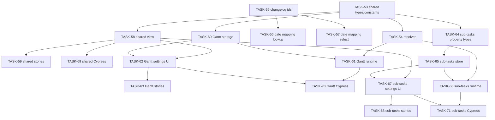
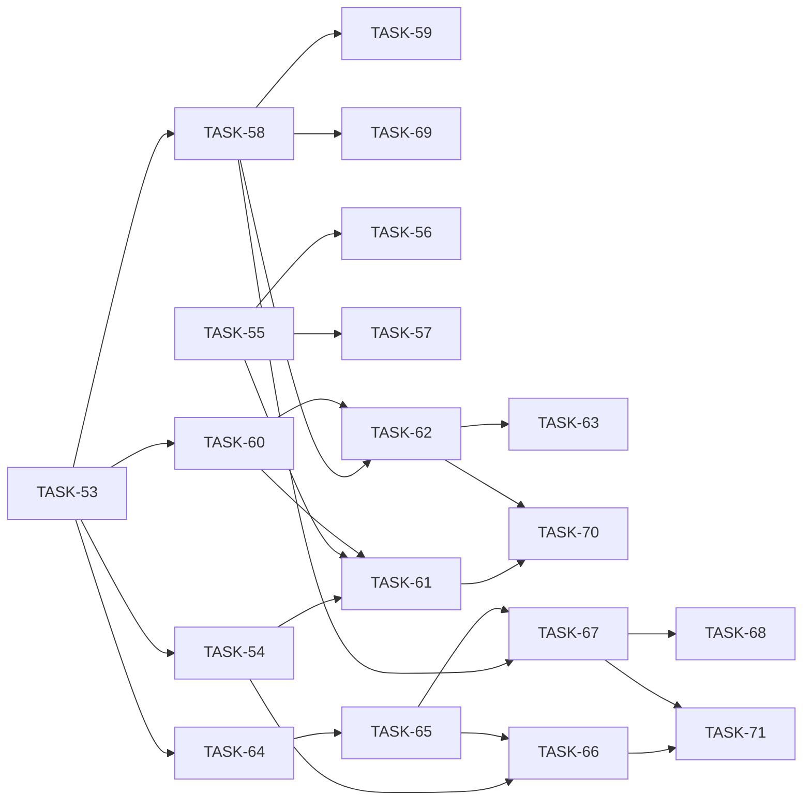

# EPIC-3: Progress Status Mapping

**Status**: DONE
**Created**: 2026-04-28

Change Control markers: none.

---

## Цель

Добавить настройку сопоставления Jira status id с progress buckets `To Do` / `In Progress` / `Done` для Gantt и sub-tasks progress. Решение сохраняет раздельные источники настроек, использует status id как единственный ключ matching и оставляет status name только fallback/debug metadata.

## Target Design

См. [target-design.md](./target-design.md).

## BDD Features

- [status-mapping-autocomplete.feature](./status-mapping-autocomplete.feature)
- [status-mapping-defaults-and-buckets.feature](./status-mapping-defaults-and-buckets.feature)
- [gantt-status-mapping.feature](./gantt-status-mapping.feature)
- [sub-tasks-progress-status-mapping.feature](./sub-tasks-progress-status-mapping.feature)

## Архитектура

## Задачи

### Phase 1: Shared Domain

| # | Task | Описание | Status |
|---|------|----------|--------|
| 53 | [TASK-53](./TASK-53-status-progress-types.md) | Shared types and bucket constants for status progress mapping. | DONE |
| 54 | [TASK-54](./TASK-54-resolve-progress-bucket.md) | Pure resolver with Jira statusCategory fallback and id-only custom matching. | DONE |

### Phase 2: Gantt Status Transition Id Fix

| # | Task | Описание | Status |
|---|------|----------|--------|
| 55 | [TASK-55](./TASK-55-gantt-changelog-status-ids.md) | Parse changelog status transition ids separately from display labels. | DONE |
| 56 | [TASK-56](./TASK-56-gantt-date-mapping-id-lookup.md) | Resolve statusTransition date mappings by changelog status id, not name. | DONE |
| 57 | [TASK-57](./TASK-57-gantt-date-mapping-status-select.md) | Update existing Gantt date-mapping status select to save status id. | DONE |

### Phase 3: Shared Editor UI

| # | Task | Описание | Status |
|---|------|----------|--------|
| 58 | [TASK-58](./TASK-58-status-progress-mapping-section-view.md) | Shared presentation component for editable mapping rows. | DONE |
| 59 | [TASK-59](./TASK-59-status-progress-mapping-section-stories.md) | Storybook stories for shared mapping editor states. | DONE |

### Phase 4: Gantt Progress Mapping

| # | Task | Описание | Status |
|---|------|----------|--------|
| 60 | [TASK-60](./TASK-60-gantt-progress-mapping-storage.md) | Gantt settings type/model persistence for optional progress mapping block. | DONE |
| 61 | [TASK-61](./TASK-61-gantt-progress-mapping-runtime.md) | Gantt runtime progress calculation uses custom status id mapping. | DONE |
| 62 | [TASK-62](./TASK-62-gantt-progress-mapping-settings-ui.md) | Place mapping editor on Gantt Bars tab and patch draft settings. | DONE |
| 63 | [TASK-63](./TASK-63-gantt-progress-mapping-stories.md) | Storybook coverage for final Gantt settings placement. | DONE |

### Phase 5: Sub-Tasks Progress Mapping

| # | Task | Описание | Status |
|---|------|----------|--------|
| 64 | [TASK-64](./TASK-64-subtasks-board-property-types.md) | Extend sub-tasks board property contract with optional mapping block. | DONE |
| 65 | [TASK-65](./TASK-65-subtasks-board-property-store.md) | Store defaults/actions for board property status progress mapping. | DONE |
| 66 | [TASK-66](./TASK-66-subtasks-runtime-progress-mapping.md) | Runtime sub-task progress calculation uses custom id mapping before blocked overrides. | DONE |
| 67 | [TASK-67](./TASK-67-subtasks-settings-container.md) | Container placement after CountSettings and before GroupingSettings. | DONE |
| 68 | [TASK-68](./TASK-68-subtasks-settings-stories.md) | Storybook coverage for final sub-tasks settings placement. | DONE |

### Phase 6: BDD Acceptance Coverage

| # | Task | Описание | Status |
|---|------|----------|--------|
| 69 | [TASK-69](./TASK-69-shared-status-mapping-cypress.md) | Cypress component coverage for shared editor autocomplete and bucket behavior. | DONE |
| 70 | [TASK-70](./TASK-70-gantt-status-mapping-cypress.md) | Cypress BDD happy paths for Gantt progress mapping and statusTransition id semantics. | DONE |
| 71 | [TASK-71](./TASK-71-subtasks-status-mapping-cypress.md) | Cypress BDD happy paths for sub-tasks progress mapping. | DONE |

## Dependencies

**Параллельно можно выполнять первыми:**

- [TASK-53](./TASK-53-status-progress-types.md) — shared mapping contract.
- [TASK-55](./TASK-55-gantt-changelog-status-ids.md) — Gantt changelog id parsing fix.

**Последовательно:**

- TASK-53 → TASK-54 → TASK-61 / TASK-66.
- TASK-53 → TASK-58 → TASK-59 / TASK-62 / TASK-67 / TASK-69.
- TASK-55 → TASK-56 → TASK-57.
- TASK-60 + TASK-61 + TASK-62 → TASK-70.
- TASK-64 → TASK-65 → TASK-66 / TASK-67 → TASK-71.

## Acceptance Criteria

- [ ] Gantt and sub-tasks progress support optional `statusProgressMapping` persisted in their existing storage mechanisms.
- [ ] Status matching uses Jira status id only; saved names are fallback/debug metadata only.
- [ ] Existing Gantt `statusTransition` date mappings compare changelog `from` / `to` ids, not `fromString` / `toString`.
- [ ] Mapping UI allows only statuses selected from Jira autocomplete and only `To Do`, `In Progress`, `Done` buckets.
- [ ] Missing mapping block keeps default Jira statusCategory behavior.
- [ ] Storybook covers shared editor and final settings placement.
- [ ] Cypress component BDD coverage maps the scenarios from all four `.feature` files.
- [ ] Focused Vitest, Cypress component tests, ESLint and TypeScript checks pass for changed files.
