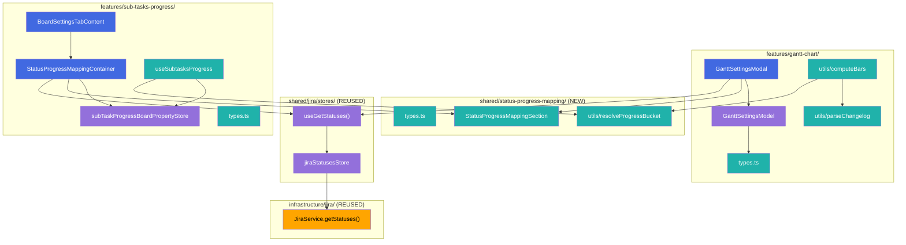
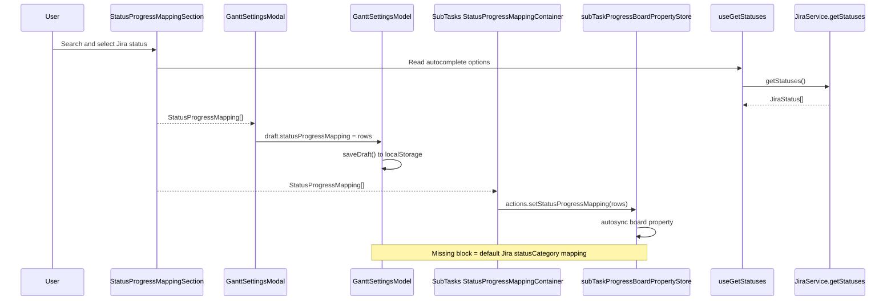
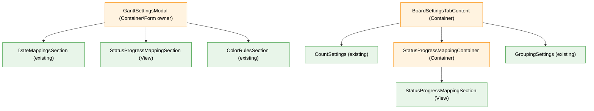

# Target Design: Progress Status Mapping

Этот документ описывает целевую архитектуру для настройки маппинга Jira status id в buckets прогресса `todo` / `inProgress` / `done` в `src/features/sub-tasks-progress` и `src/features/gantt-chart`.

Change Control markers: none.

## Ключевые принципы

1. **Matching только по status id** — актуальные display labels берутся из `JiraService.getStatuses()`, а сохранённые `statusName`, `fromString`, `toString` используются только как fallback/debug/compatibility metadata.
2. **Три настраиваемых progress buckets** — пользовательский маппинг сохраняет только `todo`, `inProgress`, `done`; `blocked` остаётся runtime-override для sub-tasks progress, но не появляется в UI маппинга.
3. **Раздельное хранение** — sub-tasks progress расширяет Jira board property, Gantt расширяет существующий `jh-gantt-settings` localStorage payload.
4. **Optional settings block** — отсутствие нового блока означает default Jira `statusCategory` mapping, без обязательной миграции существующих данных.
5. **Общий UI без общего хранилища** — один shared View-компонент редактирует строки маппинга, а feature-specific store/model сохраняют их в свои источники.

> Общие архитектурные принципы — см. `docs/architecture_guideline.md`, `docs/state-valtio.md`, `docs/component-containers.md`.

## Architecture Diagram




## Data Flow




## Component Hierarchy




## Target File Structure

```text
src/
├── shared/
│   └── status-progress-mapping/
│       ├── types.ts                                # Shared domain types: ProgressBucket, StatusProgressMappingEntry
│       ├── constants.ts                            # Bucket labels/options: To Do, In Progress, Done
│       ├── utils/
│       │   ├── resolveProgressBucket.ts            # Pure resolver: custom id mapping -> Jira statusCategory fallback
│       │   └── resolveProgressBucket.test.ts       # Vitest for matching/fallback/name-ignored behavior
│       └── components/
│           ├── StatusProgressMappingSection.tsx    # View: editable rows with Jira status select + bucket select
│           ├── StatusProgressMappingSection.stories.tsx
│           └── StatusProgressMappingSection.cy.tsx # Cypress component happy path for add/change/remove
│
├── features/
│   ├── gantt-chart/
│   │   ├── types.ts                                # Extend DateMapping, StatusTransition, GanttScopeSettings
│   │   ├── models/
│   │   │   ├── GanttSettingsModel.ts               # Normalize optional statusProgressMapping in defaults/load/save
│   │   │   └── GanttSettingsModel.test.ts          # Persistence/default compatibility tests
│   │   ├── IssuePage/components/
│   │   │   ├── GanttSettingsModal.tsx              # Add section on Bars tab after start/end mappings
│   │   │   └── GanttSettingsModal.test.tsx         # Status id save for date mapping and progress mapping
│   │   └── utils/
│   │       ├── parseChangelog.ts                   # Preserve from/to ids plus display labels
│   │       ├── parseChangelog.test.ts
│   │       ├── computeBars.ts                      # Resolve date mappings and progress sections by status id
│   │       └── computeBars.test.ts
│   │
│   └── sub-tasks-progress/
│       ├── types.ts                                # Extend BoardProperty with statusProgressMapping
│       ├── SubTaskProgressSettings/stores/
│       │   ├── subTaskProgressBoardProperty.ts     # Add initialData + action setStatusProgressMapping
│       │   └── subTaskProgressBoardProperty.types.ts
│       ├── BoardSettings/
│       │   ├── BoardSettingsTabContent.tsx         # Place mapping after CountSettings before GroupingSettings
│       │   ├── BoardSettingsTabContent.test.tsx
│       │   └── StatusProgressMapping/
│       │       ├── StatusProgressMappingContainer.tsx
│       │       └── StatusProgressMappingContainer.cy.tsx
│       └── IssueCardSubTasksProgress/hooks/
│           ├── useSubtasksProgress.tsx             # Use status id mapping before blocked overrides
│           └── useSubtasksProgress.test.tsx
```

## Types

### Shared Status Mapping Types

```typescript
/**
 * Progress bucket configurable by users.
 *
 * This intentionally excludes `blocked`: blocked remains a runtime override
 * derived from flags/link rules in sub-tasks progress, not a persisted status mapping bucket.
 */
export type ProgressBucket = 'todo' | 'inProgress' | 'done';

/**
 * One persisted status mapping row.
 *
 * `statusId` is the only stable matching key. `statusName` is captured only as
 * fallback/debug metadata and must not be used by runtime matching.
 *
 * The source of truth for the current UI label is JiraService.getStatuses().
 * Use `statusName` only when Jira statuses are not loaded yet or the status id
 * is no longer present in the returned JiraStatus[].
 */
export type StatusProgressMappingEntry = {
  /** Jira status id from JiraStatus.id or changelog item `from`/`to`. */
  statusId: string;
  /** Fallback/debug label captured at save time; can become stale after Jira rename. */
  statusName: string;
  /** Normalized progress bucket used by calculations. */
  bucket: ProgressBucket;
};

/**
 * Persisted status id -> progress bucket mapping.
 *
 * Keys duplicate `entry.statusId` for cheap lookup and JSON readability.
 */
export type StatusProgressMapping = Record<string, StatusProgressMappingEntry>;

/**
 * Jira status category shape needed for default fallback.
 */
export type JiraStatusCategoryKey = 'new' | 'indeterminate' | 'done';
```

### Gantt Type Changes

```typescript
/**
 * Mapping configuration for one bar endpoint.
 *
 * For `statusTransition`, `statusId` is the canonical value matched against Jira changelog
 * `item.from` / `item.to`. `statusName` remains optional fallback/debug/compatibility metadata.
 */
export type DateMapping =
  | {
      source: 'dateField';
      /** Jira field id when source is dateField. */
      fieldId: string;
    }
  | {
      source: 'statusTransition';
      /** Stable Jira status id from changelog `from` / `to`. */
      statusId: string;
      /** @deprecated Display/legacy compatibility only. Do not match by this field. */
      statusName?: string;
    };

/**
 * One changelog-derived status transition.
 *
 * `fromStatusId` / `toStatusId` come from Jira changelog `from` / `to`;
 * `fromStatusName` / `toStatusName` come from `fromString` / `toString` and are display-only.
 */
export type StatusTransition = {
  timestamp: Date;
  fromStatusId: string;
  toStatusId: string;
  fromStatusName: string;
  toStatusName: string;
  fromCategory: string;
  toCategory: string;
};

export type BarStatusSection = {
  /** Display label for tooltip/bar section. */
  statusName: string;
  /** Canonical Jira status id when known. */
  statusId?: string;
  category: BarStatusCategory;
  startDate: Date;
  endDate: Date;
};

export type GanttScopeSettings = {
  startMappings: DateMapping[];
  endMappings: DateMapping[];
  /** Optional status id -> progress bucket overrides for Gantt progress/status sections. */
  statusProgressMapping?: StatusProgressMapping;
  // existing fields stay unchanged
};
```

### Sub-Tasks Progress Type Changes

```typescript
export type BoardProperty = {
  enabled?: boolean;
  columnsToTrack?: string[];
  /**
   * Optional status id -> progress bucket overrides for sub-tasks progress.
   *
   * Absence means default Jira statusCategory mapping:
   * - new -> todo
   * - indeterminate -> inProgress
   * - done -> done
   */
  statusProgressMapping?: StatusProgressMapping;
  /**
   * Legacy/in-progress field. Do not extend for the new UI because it allows `blocked`
   * via `Status` and has unclear runtime ownership.
   */
  newStatusMapping?: Record<number, { progressStatus: Status; name: string }>;
  // existing fields stay unchanged
};
```

## Models / Stores

### `GanttSettingsModel`

```typescript
export class GanttSettingsModel {
  storage: GanttSettingsStorage;
  draftSettings: GanttScopeSettings | null;

  /** Loads localStorage and normalizes every scope to current optional blocks. */
  load(): void;

  /** Opens a draft from direct scope settings or defaults; default mapping block is omitted. */
  openDraft(): void;

  /** Persists current draft to `jh-gantt-settings` without showing a dedicated save error UI. */
  saveDraft(): void;

  /** Resets runtime model state for tests and page lifecycle. */
  reset(): void;
}
```

Required extensions:

- `createDefaultScopeSettings()` returns no `statusProgressMapping` field, or an empty object only if existing settings pattern requires fully populated arrays.
- `migrateScope()` accepts missing `statusProgressMapping` and validates any present value by dropping rows without a `statusId` or with bucket outside `todo` / `inProgress` / `done`.
- Draft patch from `GanttSettingsModal` includes `statusProgressMapping?: StatusProgressMapping`.

### `subTaskProgressBoardPropertyStore`

```typescript
export type State = {
  data: Required<BoardProperty>;
  state: 'initial' | 'loading' | 'loaded';
  actions: {
    setData: (data: BoardProperty) => void;
    setStatusProgressMapping: (mapping: StatusProgressMapping) => void;
    removeStatusProgressMapping: (statusId: string) => void;
    clearStatusProgressMapping: () => void;
    // existing actions stay unchanged
  };
};
```

Required extensions:

- `initialData.statusProgressMapping = {}` for runtime convenience.
- `setData()` merges optional persisted block over `initialData`, preserving absence semantics externally.
- Autosync remains unchanged: board property saves the full store data through the existing sync path.
- No separate save-error UI is added; current logging/error behavior remains the only feedback.

## Component Specifications


| Component                                         | Type                          | Responsibility                                                                     | Props interface                                                                        |
| ------------------------------------------------- | ----------------------------- | ---------------------------------------------------------------------------------- | -------------------------------------------------------------------------------------- |
| `StatusProgressMappingSection`                    | View                          | Renders editable mapping rows using Jira status options and three bucket options.  | `StatusProgressMappingSectionProps`                                                    |
| `StatusProgressMappingContainer`                  | Container                     | Connects sub-tasks board property store and `useGetStatuses()` to the shared View. | none                                                                                   |
| `GanttSettingsModal` / `GanttSettingsFormContent` | Existing Container/Form owner | Adds Gantt mapping section to Bars tab and patches `draft.statusProgressMapping`.  | existing `GanttSettingsModalProps` plus internal `FormShape.statusProgressMappingRows` |


```typescript
export type StatusProgressMappingRow = {
  statusId: string;
  /** Fallback/debug label from persisted mapping; current UI label is resolved from `statuses` by `statusId`. */
  statusName: string;
  bucket: ProgressBucket;
};

export type StatusProgressMappingSectionProps = {
  title: string;
  description?: string;
  addButtonLabel: string;
  rows: StatusProgressMappingRow[];
  statuses: JiraStatus[];
  isLoadingStatuses: boolean;
  disabled?: boolean;
  onChange: (rows: StatusProgressMappingRow[]) => void;
  texts: {
    statusLabel: string;
    bucketLabel: string;
    selectStatusPlaceholder: string;
    selectBucketPlaceholder: string;
    removeRow: string;
    noStatusFound: string;
  };
};
```

`StatusProgressMappingSection` must use `status.id` as select `value`. The visible label is resolved from the current `statuses: JiraStatus[]` by `statusId`; `row.statusName` is shown only as fallback/debug text when statuses are not loaded yet or Jira no longer returns that id. It must not support arbitrary free text. Duplicate status ids should be prevented in the View by disabling already selected options or in a pure utility used before calling `onChange`.

## Logic Ownership

- `shared/status-progress-mapping/utils/resolveProgressBucket.ts` owns matching by id and Jira `statusCategory` fallback.
- `parseChangelog.ts` owns extraction of `fromStatusId` / `toStatusId` from Jira changelog `from` / `to`.
- `computeBars.ts` owns Gantt date mapping lookup by `statusId`, progress bucket resolution for current issue status, and status section category resolution.
- `useSubtasksProgress.tsx` owns sub-tasks runtime progress calculation; it calls the shared resolver, then applies existing `blocked` overrides for flags / blocked-by-links.
- `GanttSettingsModel` owns localStorage compatibility and draft lifecycle.
- `subTaskProgressBoardPropertyStore` owns board property state mutations.
- Containers may load statuses, pass props, and call model/store commands. They must not match statuses by name or derive progress buckets inline.
- `StatusProgressMappingSection` owns only presentation and row editing mechanics.

## Migration And Compatibility Plan

1. **Add shared optional types and resolver**
  Introduce `StatusProgressMapping` without changing persisted data. Unit tests cover default mapping when the block is absent.
2. **Fix Gantt statusTransition id semantics**
  Extend `DateMapping` with `statusId`, extend `StatusTransition` with ids, and update `parseChangelog` / `computeBars` to compare changelog `to` with `mapping.statusId`. Keep `statusName` optional only as fallback/debug/compatibility metadata to avoid breaking existing localStorage/test payloads.
3. **Normalize existing Gantt localStorage gently**
  `migrateScope()` accepts legacy `{ source: 'statusTransition', statusName }`. Because legacy rows lack status id, they cannot be reliably matched. They can show the saved name as fallback/debug text in UI, but runtime matching requires user reselect/save from autocomplete to populate `statusId`. No destructive migration is required.
4. **Add Gantt progress mapping block**
  Add `statusProgressMapping?: StatusProgressMapping` to each `GanttScopeSettings`. Missing or empty block means Jira `statusCategory` fallback.
5. **Add sub-tasks progress mapping block**
  Add `BoardProperty.statusProgressMapping?: StatusProgressMapping`, store actions, and settings UI placement after `CountSettings` before `GroupingSettings`. Existing board properties without the block continue to use default category mapping.
6. **Keep legacy sub-tasks fields readable but not extended**
  Existing `statusMapping` / `newStatusMapping` stay in type for compatibility. New UI writes only `statusProgressMapping` because requirements limit buckets to `todo` / `inProgress` / `done`.
7. **No dedicated save-error UI**
  Board property autosync and Gantt localStorage save failures continue through existing behavior/logging. The new UI should not add Alert/notification surfaces for save errors.

## Testing Strategy

- **Vitest**:
  - `resolveProgressBucket`: custom id wins, name ignored, missing block falls back to Jira category.
  - `parseChangelog`: captures `from` / `to` ids and display labels separately.
  - `computeBars`: `statusTransition` mappings resolve by `statusId`, not `statusName`; legacy `statusName` alone does not create a false id match.
  - `useSubtasksProgress`: custom mapping affects counters; blocked overrides still win.
  - `GanttSettingsModel` / board property store: optional block compatibility and persistence shape.
- **Storybook**:
  - `StatusProgressMappingSection`: empty state, populated rows, loading statuses, duplicate prevention, disabled state.
  - Existing Gantt and Board settings stories include final placement, replacing temporary mockup stories.
- **Cypress component**:
  - Happy path: add row, choose Jira status from autocomplete, choose bucket, save/observe model or store update for both Gantt and sub-tasks progress.

## Task Split Boundaries

1. **TASK-1: Shared domain contract and resolver**
  Add shared types/constants/resolver and Vitest coverage.
2. **TASK-2: Gantt changelog/date-mapping status id fix**
  Update `DateMapping`, `StatusTransition`, `parseChangelog`, `computeBars`, modal date mapping select, and related tests.
3. **TASK-3: Shared mapping editor UI**
  Build `StatusProgressMappingSection` with Storybook and Cypress happy path at component level.
4. **TASK-4: Gantt progress mapping integration**
  Add `statusProgressMapping` to `GanttScopeSettings`, localStorage normalization, Bars tab placement after Start/End of bar, and calculation usage.
5. **TASK-5: Sub-tasks progress integration**
  Add board property field/actions, container placement after `CountSettings`, runtime progress usage by `issue.statusId`, and tests.
6. **TASK-6: Cleanup and acceptance coverage**
  Remove temporary mockup stories, align BDD/Cypress coverage, and run focused lint/type/test checks.

## Risks And Unknowns

- **Legacy Gantt `statusTransition` rows have only names**: Jira status id cannot be inferred reliably without reselecting from autocomplete. The design keeps them display-compatible but runtime id matching requires user update.
- **Sub-tasks progress has existing `newStatusMapping`**: It appears to be an earlier/incomplete field and permits `blocked`; reusing it would violate the new bucket constraint. The new block should be explicit.
- **External issues may not expose stable status ids**: Current external progress uses status color. Unless external issue payload gains status id, custom status mapping should apply only to Jira issues with `statusId`; external issues keep current color/category fallback.
- **Gantt status sections fallback by status name exists today**: Moving to id-based fallback may require a `categoryByStatusId` map where available. Name fallback should remain display-only or compatibility-only and must not override explicit id mapping.
- **Current `GanttSettingsModal` is a large mixed form component**: The implementation should keep changes scoped, but any deeper container/view refactor is out of this task split unless tests reveal it is necessary.

