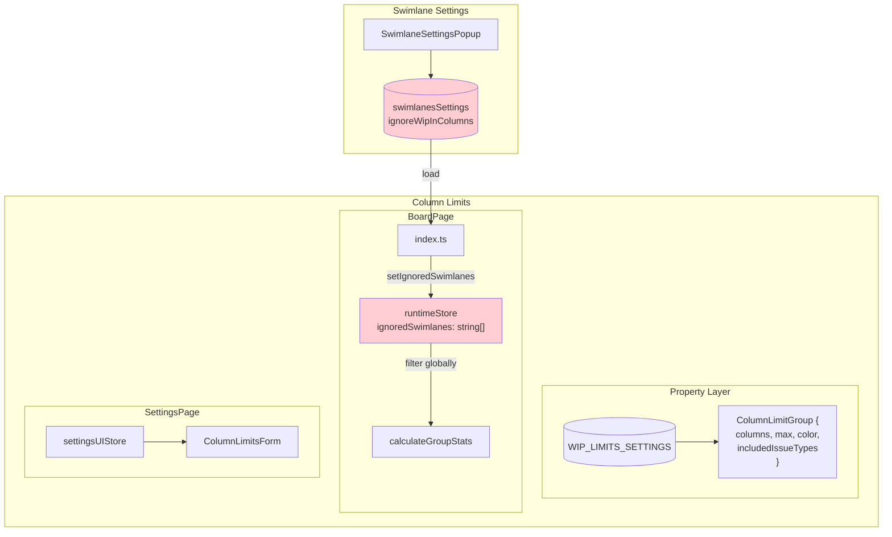
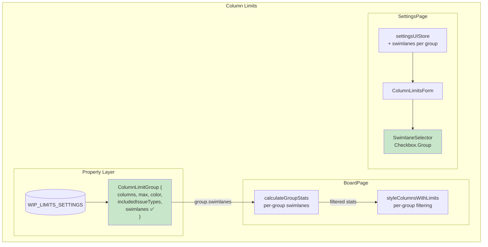
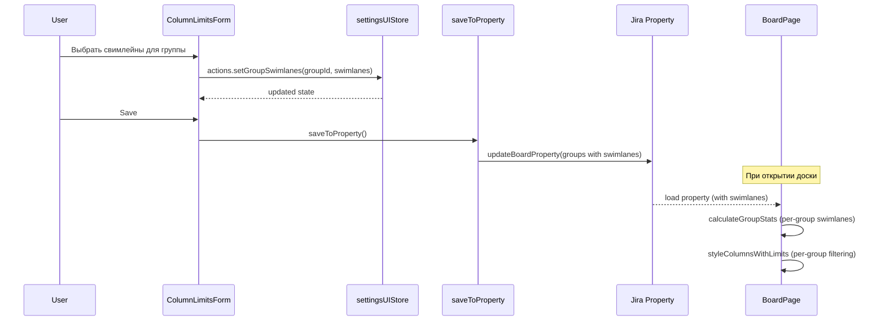

# Target Design: Добавление выбора свимлейнов в Column Limits

Этот документ описывает целевую архитектуру для добавления явного выбора свимлейнов в настройки групп колонок (Column Limits), по аналогии с Person Limits.

## Проблема

**Текущее состояние:**
- Column Limits использует глобальную настройку `ignoredSwimlanes` из Swimlane Settings
- Нет возможности указать свимлейны для конкретной группы колонок
- Связь неочевидна для пользователя (настройка в одном месте, эффект в другом)

**Целевое состояние:**
- Каждая группа колонок имеет свой список свимлейнов для учёта
- Пустой массив = все свимлейны (как в Person Limits)
- UI с чекбоксами для выбора свимлейнов

## Ключевые принципы

1. **Консистентность с Person Limits** — аналогичная логика и UI
2. **Backward Compatibility** — старые данные без `swimlanes` работают как "все свимлейны"
3. **Per-Group Configuration** — каждая группа имеет свои настройки
4. **Отказ от глобального ignoredSwimlanes** — удалить связь с Swimlane Settings

## Architecture Diagram

### Текущая архитектура (Before)



**Проблемы:**
- `ignoredSwimlanes` глобальный, применяется ко всем группам
- Настройка в Swimlane Settings, эффект в Column Limits
- Нет UI для свимлейнов в Column Limits Settings

### Целевая архитектура (After)



**Изменения:**
- `swimlanes` в каждой группе (per-group)
- Удалён глобальный `ignoredSwimlanes`
- UI selector в ColumnLimitsForm

## Data Flow



## Type Changes

### types.ts

```typescript
// BEFORE
export type ColumnLimitGroup = {
  columns: string[];
  max?: number;
  customHexColor?: string;
  includedIssueTypes?: string[];
};

// AFTER
export type ColumnLimitGroup = {
  columns: string[];
  max?: number;
  customHexColor?: string;
  includedIssueTypes?: string[];
  swimlanes?: Array<{ id: string; name: string }>; // NEW: empty = all
};

// BEFORE
export type UIGroup = {
  id: string;
  columns: Column[];
  max?: number;
  customHexColor?: string;
  includedIssueTypes?: string[];
};

// AFTER
export type UIGroup = {
  id: string;
  columns: Column[];
  max?: number;
  customHexColor?: string;
  includedIssueTypes?: string[];
  swimlanes?: Array<{ id: string; name: string }>; // NEW
};
```

### Swimlane Type (новый или shared)

```typescript
export type Swimlane = {
  id: string;
  name: string;
};
```

## Component Changes

### 1. SwimlaneSelector (SHARED компонент)

**Расположение:** `src/shared/components/SwimlaneSelector/`

Этот компонент будет использоваться в:
- `person-limits/SettingsPage/PersonalWipLimitContainer.tsx` (рефакторинг)
- `column-limits/SettingsPage/ColumnLimitsForm.tsx` (новое)

**Текущая реализация в PersonalWipLimitContainer (inline):**
- "All swimlanes" checkbox
- Expandable Checkbox.Group список
- Логика show/hide списка

**Целевая реализация (shared component):**

```tsx
// src/shared/components/SwimlaneSelector/SwimlaneSelector.tsx

export type Swimlane = {
  id: string;
  name: string;
};

export interface SwimlaneSelectorProps {
  /** Available swimlanes to choose from */
  swimlanes: Swimlane[];
  /** Currently selected swimlane IDs (empty = all) */
  value: string[];
  /** Callback when selection changes */
  onChange: (selectedIds: string[]) => void;
  /** Label text (default: "Swimlanes") */
  label?: string;
  /** "All" checkbox text (default: "All swimlanes") */
  allLabel?: string;
}

export const SwimlaneSelector: React.FC<SwimlaneSelectorProps> = ({
  swimlanes,
  value,
  onChange,
  label = 'Swimlanes',
  allLabel = 'All swimlanes',
}) => {
  const allIds = swimlanes.map(s => String(s.id));
  
  // Empty value = all selected (convention)
  const isAllSelected = value.length === 0 || value.length === swimlanes.length;
  const [showList, setShowList] = useState(!isAllSelected);
  const currentValue = isAllSelected ? allIds : value.map(String);

  const handleAllChange = (e: CheckboxChangeEvent) => {
    if (e.target.checked) {
      // All selected -> emit empty array (convention)
      onChange([]);
      setShowList(false);
    } else {
      // Uncheck "All" -> show list with all selected
      setShowList(true);
    }
  };

  const handleGroupChange = (checkedIds: string[]) => {
    // If all are selected -> emit empty array
    if (checkedIds.length === swimlanes.length) {
      onChange([]);
      setShowList(false);
    } else {
      onChange(checkedIds);
    }
  };

  return (
    <div>
      {label && <div style={{ marginBottom: 4 }}>{label}</div>}
      <Checkbox
        style={{ marginBottom: 8 }}
        checked={isAllSelected && !showList}
        onChange={handleAllChange}
      >
        {allLabel}
      </Checkbox>
      {showList && (
        <div style={{
          maxHeight: '200px',
          overflowY: 'auto',
          border: '1px solid #d9d9d9',
          borderRadius: '4px',
          padding: '8px',
        }}>
          <Checkbox.Group
            style={{ width: '100%', display: 'flex', flexDirection: 'column', gap: 8 }}
            value={currentValue}
            options={swimlanes.map(s => ({ label: s.name, value: String(s.id) }))}
            onChange={handleGroupChange}
          />
        </div>
      )}
    </div>
  );
};
```

### 2. ColumnLimitsForm.tsx

**Добавить:** SwimlaneSelector внутри ColumnGroup

```tsx
import { SwimlaneSelector } from 'src/shared/components/SwimlaneSelector';

const ColumnGroup: React.FC<{ group: UIGroup }> = ({ group }) => {
  // Derive selected IDs from group.swimlanes
  const selectedSwimlaneIds = group.swimlanes?.map(s => s.id) || [];

  return (
    <Card className={styles.columnGroupJH}>
      <Space direction="vertical" style={{ width: '100%' }} size="small">
        {/* Existing: Limit input + Color picker */}
        <div style={{ display: 'flex', alignItems: 'center', gap: 8 }}>
          <span>Limit for group:</span>
          <InputNumber ... />
          <ColorPickerButton ... />
        </div>

        {/* Existing: Column dropzone */}
        <div className={`${styles.columnListJH} dropzone-jh`}>
          {group.columns.map(column => (
            <DraggableColumn key={column.id} column={column} groupId={group.id} />
          ))}
        </div>

        {/* NEW: Swimlane selector */}
        <SwimlaneSelector
          swimlanes={availableSwimlanes}
          value={selectedSwimlaneIds}
          onChange={(ids) => onSwimlanesChange(group.id, ids)}
        />

        {/* Existing: Issue type selector */}
        <IssueTypeSelector ... />
      </Space>
    </Card>
  );
};
```

### 3. PersonalWipLimitContainer.tsx (рефакторинг)

**Заменить inline код на shared компонент:**

```tsx
// BEFORE: ~50 строк inline Checkbox + Checkbox.Group

// AFTER:
import { SwimlaneSelector } from 'src/shared/components/SwimlaneSelector';

<Form.Item label="Swimlanes" name="swimlanes">
  <SwimlaneSelector
    swimlanes={swimlanes}
    value={swimlanesValue}
    onChange={(ids) => {
      form.setFieldValue('swimlanes', ids);
      setSwimlanesValue(ids);
      handleFormChange('swimlanes', ids);
    }}
    label={null}  // Form.Item уже имеет label
  />
</Form.Item>
```

### 3. settingsUIStore.ts

**Добавить action:**

```typescript
setGroupSwimlanes: (groupId: string, swimlanes: Array<{ id: string; name: string }>) =>
  set(
    produce(state => {
      const group = state.data.groups.find(g => g.id === groupId);
      if (group) group.swimlanes = swimlanes;
    })
  ),
```

### 4. calculateGroupStats.ts

**Изменить:** Использовать swimlanes из группы вместо глобального

```typescript
// BEFORE
export function calculateGroupStats(): void {
  const { ignoredSwimlanes, cssNotIssueSubTask } = useColumnLimitsRuntimeStore.getState().data;
  // ...
  const issueCount = group.columns.reduce(
    (acc, columnId) =>
      acc + pageObject.getIssuesInColumn(columnId, ignoredSwimlanes, includedIssueTypes, cssNotIssueSubTask),
    0
  );
}

// AFTER
export function calculateGroupStats(): void {
  const { cssNotIssueSubTask } = useColumnLimitsRuntimeStore.getState().data;
  // ...
  // Derive ignored swimlanes from group.swimlanes
  // If swimlanes is empty or undefined -> no filtering (all swimlanes counted)
  // If swimlanes has specific IDs -> only those are counted, others ignored
  const groupSwimlaneIds = group.swimlanes?.map(s => s.id) || [];
  const allSwimlaneIds = pageObject.getSwimlaneIds();
  
  // If group.swimlanes is empty -> count all -> ignoredSwimlanes = []
  // If group.swimlanes has items -> ignore swimlanes NOT in the list
  const ignoredSwimlanes = groupSwimlaneIds.length === 0
    ? []
    : allSwimlaneIds.filter(id => !groupSwimlaneIds.includes(id));

  const issueCount = group.columns.reduce(
    (acc, columnId) =>
      acc + pageObject.getIssuesInColumn(columnId, ignoredSwimlanes, includedIssueTypes, cssNotIssueSubTask),
    0
  );
}
```

### 5. BoardPage/index.ts

**Удалить:** Загрузку и использование `swimlanesSettings`

```typescript
// BEFORE
apply(data: [EditData?, BoardGroup?, SwimlanesSettings?]): void {
  const [editData, boardGroups, swimlanesSettings] = data;
  // ...
  const ignoredSwimlanes = Object.keys(swimlanesSettings)
    .filter(id => swimlanesSettings[id].ignoreWipInColumns);
  actions.setIgnoredSwimlanes(ignoredSwimlanes);
}

// AFTER
apply(data: [EditData?, BoardGroup?]): void {
  const [editData, boardGroups] = data;
  // swimlanesSettings больше не нужен
  // swimlanes теперь в каждой группе boardGroups[groupId].swimlanes
}
```

### 6. runtimeStore.ts

**Удалить:** `ignoredSwimlanes` и `setIgnoredSwimlanes`

```typescript
// BEFORE
export interface ColumnLimitsRuntimeData {
  groupStats: Record<string, GroupStats>;
  ignoredSwimlanes: string[];  // REMOVE
  cssNotIssueSubTask: string;
}

// AFTER
export interface ColumnLimitsRuntimeData {
  groupStats: Record<string, GroupStats>;
  cssNotIssueSubTask: string;
}
```

## Target File Structure

```
src/shared/components/
├── SwimlaneSelector/
│   ├── index.ts                                # NEW: export SwimlaneSelector
│   ├── SwimlaneSelector.tsx                    # NEW: shared component
│   └── SwimlaneSelector.stories.tsx            # NEW: Storybook stories

src/column-limits/
├── types.ts                                    # CHANGED: + swimlanes in ColumnLimitGroup, UIGroup
│
├── property/
│   └── store.ts                                # CHANGED: handle swimlanes in transformations
│
├── BoardPage/
│   ├── index.ts                                # CHANGED: remove swimlanesSettings loading
│   ├── actions/
│   │   ├── calculateGroupStats.ts              # CHANGED: use group.swimlanes
│   │   └── styleColumnsWithLimits.ts           # CHANGED: use group.swimlanes
│   └── stores/
│       ├── runtimeStore.ts                     # CHANGED: remove ignoredSwimlanes
│       └── runtimeStore.types.ts               # CHANGED: remove ignoredSwimlanes
│
├── SettingsPage/
│   ├── ColumnLimitsForm.tsx                    # CHANGED: + swimlanes prop, use SwimlaneSelector
│   ├── stores/
│   │   ├── settingsUIStore.ts                  # CHANGED: + setGroupSwimlanes action
│   │   └── settingsUIStore.types.ts            # CHANGED: + swimlanes in UIGroup (already in types.ts)
│   └── actions/
│       ├── initFromProperty.ts                 # CHANGED: map swimlanes from property
│       └── saveToProperty.ts                   # CHANGED: map swimlanes to property
│
└── features/                                   # CHANGED: update BDD tests
    └── filters.feature                         # CHANGED: SC-SWIM-1 now uses per-group swimlanes

src/person-limits/SettingsPage/
└── components/
    └── PersonalWipLimitContainer.tsx           # CHANGED: replace inline code with SwimlaneSelector
```

## Migration Plan

### Phase 1: Types & Property (TASK-92, TASK-93)

1. **TASK-92: Обновить types.ts**
   - Добавить `swimlanes?: Array<{ id: string; name: string }>` в `ColumnLimitGroup` и `UIGroup`

2. **TASK-93: Обновить property store**
   - `initFromProperty.ts`: маппить swimlanes из property в UI state
   - `saveToProperty.ts`: маппить swimlanes из UI state в property
   - Backward compat: отсутствующий swimlanes → undefined (= все)

### Phase 2: Shared UI Component (TASK-94)

3. **TASK-94: Создать shared SwimlaneSelector компонент**
   - Расположение: `src/shared/components/SwimlaneSelector/`
   - Props: `swimlanes`, `value`, `onChange`, `label?`, `allLabel?`
   - "All swimlanes" checkbox + expandable Checkbox.Group
   - Логика "все выбраны = пустой массив"
   - Storybook stories

### Phase 3: Integration (TASK-95, TASK-96)

4. **TASK-95: Рефакторинг PersonalWipLimitContainer**
   - Заменить inline Checkbox + Checkbox.Group (~50 строк) на shared SwimlaneSelector
   - Проверить что существующие тесты проходят

5. **TASK-96: Интегрировать SwimlaneSelector в ColumnLimitsForm**
   - Добавить проп `swimlanes: Swimlane[]`
   - Добавить `onSwimlanesChange` callback
   - Рендерить SwimlaneSelector внутри каждой группы

### Phase 4: Store & Actions (TASK-97, TASK-98)

6. **TASK-97: Обновить settingsUIStore**
   - Добавить action `setGroupSwimlanes`

7. **TASK-98: Обновить BoardPage actions**
   - `calculateGroupStats.ts`: использовать `group.swimlanes`
   - `styleColumnsWithLimits.ts`: использовать `group.swimlanes`

### Phase 5: Cleanup (TASK-99, TASK-100)

8. **TASK-99: Удалить глобальный ignoredSwimlanes**
   - `runtimeStore.ts`: удалить `ignoredSwimlanes` и `setIgnoredSwimlanes`
   - `BoardPage/index.ts`: удалить загрузку `swimlanesSettings`
   - Удалить зависимость от Swimlane Settings

9. **TASK-100: Обновить BDD тесты**
   - `filters.feature`: SC-SWIM-1 теперь использует per-group swimlanes через DataTable
   - Добавить тесты для нового UI

### Phase 6: Verification (TASK-101)

10. **TASK-101: Верификация**
    - `npm run build:dev`
    - `npm run lint:eslint`
    - `npm run test`
    - Cypress BDD tests
    - Manual testing

```
TASK-92 (types) ────────────────────────────────────────────────────────┐
                                                                        │
TASK-93 (property) ─────────────────────────────────────────────────────┤
                                                                        │
TASK-94 (SwimlaneSelector shared) ──┬──> TASK-95 (PersonalWipLimit) ────┼──> TASK-97 (store) ──> TASK-98 (BoardPage actions) ──> TASK-99 (cleanup)
                                    │                                   │                                                              │
                                    └──> TASK-96 (ColumnLimitsForm) ────┘                                                              │
                                                                                                                                       │
                                                                                                        TASK-100 (BDD tests) ──────────┤
                                                                                                                                       │
                                                                                                        TASK-101 (verify) ─────────────┘
```

## UI Mockup

**Default state (all swimlanes selected):**
```
┌─────────────────────────────────────────────────────────────┐
│ Limits for groups                                       [X] │
├─────────────────────────────────────────────────────────────┤
│                                                             │
│  ┌─────────────────────┐  ┌─────────────────────────────┐   │
│  │ Without Group       │  │ ┌─────────────────────────┐ │   │
│  │ ┌─────┐ ┌─────┐     │  │ │ Limit for group: [5]    │ │   │
│  │ │To Do│ │Done │     │  │ │ [Change color]          │ │   │
│  │ └─────┘ └─────┘     │  │ ├─────────────────────────┤ │   │
│  │                     │  │ │ ┌───────────┐ ┌────────┐│ │   │
│  └─────────────────────┘  │ │ │In Progress│ │ Review ││ │   │
│                           │ │ └───────────┘ └────────┘│ │   │
│                           │ ├─────────────────────────┤ │   │
│                           │ │ Swimlanes:              │ │ ← NEW
│                           │ │ ☑ All swimlanes         │ │   │
│                           │ ├─────────────────────────┤ │   │
│                           │ │ Issue types: [All]      │ │   │
│                           │ └─────────────────────────┘ │   │
│                           └─────────────────────────────┘   │
│                                                             │
│                                    [Cancel]  [Save]         │
└─────────────────────────────────────────────────────────────┘
```

**Expanded state (user unchecked "All swimlanes"):**
```
┌─────────────────────────────────────────────────────────────┐
│  ...                                                        │
│                           │ ├─────────────────────────┤ │   │
│                           │ │ Swimlanes:              │ │   │
│                           │ │ ☐ All swimlanes         │ │   │
│                           │ │ ┌─────────────────────┐ │ │   │
│                           │ │ │ ☑ Frontend          │ │ │   │
│                           │ │ │ ☑ Backend           │ │ │   │
│                           │ │ │ ☐ Expedite          │ │ │   │
│                           │ │ └─────────────────────┘ │ │   │
│                           │ ├─────────────────────────┤ │   │
│  ...                                                        │
└─────────────────────────────────────────────────────────────┘
```

> **UX Note:** Этот паттерн идентичен Person Limits — "All swimlanes" checkbox,
> при снятии показывает список для выбора конкретных свимлейнов.

## Convention: Empty Array = All

По аналогии с Person Limits:

| `swimlanes` value | Meaning |
|-------------------|---------|
| `undefined` | All swimlanes (backward compat) |
| `[]` (empty array) | All swimlanes |
| `[{id: "sw1", name: "Frontend"}]` | Only Frontend swimlane |

В UI:
- Если все чекбоксы выбраны → сохраняем `[]`
- Если некоторые выбраны → сохраняем выбранные
- Если ни один не выбран → невалидное состояние (disabled Save или показать warning)

## Benefits

1. **Explicit Configuration** — Настройка свимлейнов явно видна в Column Limits
2. **Per-Group Flexibility** — Разные группы могут иметь разные свимлейны
3. **Consistency** — Аналогичный подход как в Person Limits
4. **Independence** — Column Limits больше не зависит от Swimlane Settings
5. **Discoverability** — Пользователь видит все настройки группы в одном месте

## Risks & Mitigations

| Risk | Mitigation |
|------|------------|
| Breaking existing configs | Backward compat: `undefined` = all swimlanes |
| UI clutter | Collapsible section или "Advanced" toggle |
| Empty swimlanes selection | Validation: require at least one or show warning |
