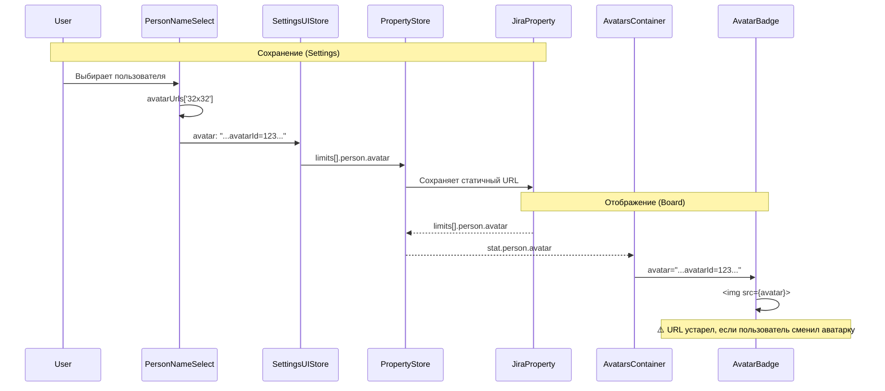
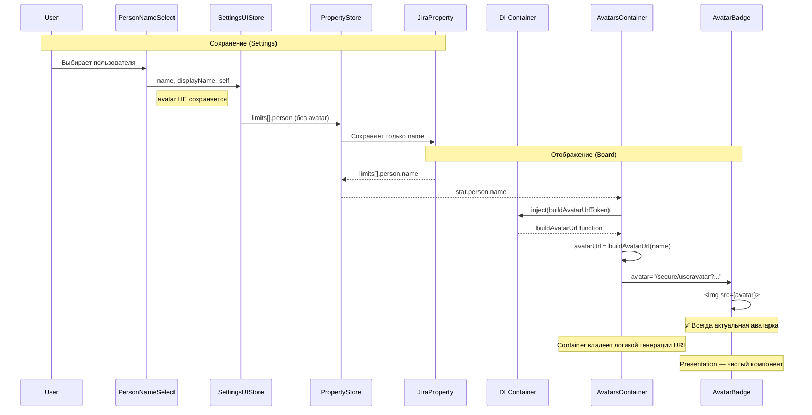
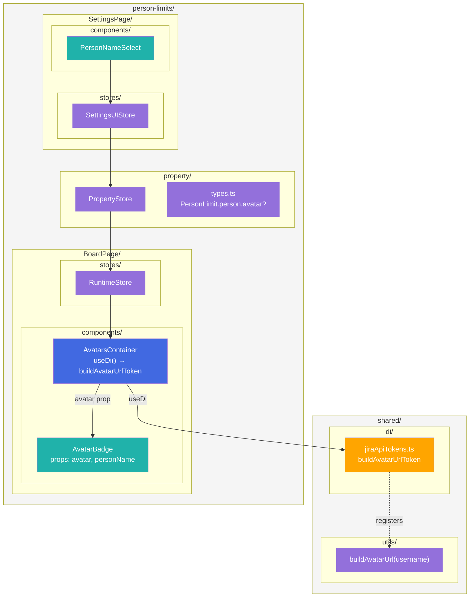

# Target Design: Динамические аватарки в Person Limits

## Обзор

Замена статичных URL аватарок на динамическую генерацию через стабильный endpoint `/secure/useravatar?username={name}`. Это устранит проблему устаревших аватарок, когда пользователь меняет свою картинку в Jira.

**Проблема:**
- При создании PersonLimit сохраняется URL аватарки с `avatarId`
- Когда пользователь меняет аватарку, `avatarId` меняется
- Сохранённый URL продолжает показывать старую картинку

**Решение:**
- Использовать стабильный URL `/secure/useravatar?username={name}`
- Этот URL всегда возвращает текущую аватарку пользователя
- Убрать сохранение `avatar` URL в Jira Board Property
- Функция `buildAvatarUrl` как DI токен для тестируемости

---

## Диаграммы

### До: Текущий Data Flow



### После: Целевой Data Flow



### Архитектура компонентов (После)



**Легенда цветов:**

| Цвет | Тип | Описание |
|------|-----|----------|
| 🟣 Фиолетовый | Model/Types | Типы, stores, утилиты |
| 🔵 Синий | Container | Контейнеры с DI |
| 🟢 Бирюзовый | Component | Презентационные компоненты |
| 🟠 Оранжевый | Service/Token | DI токены и сервисы |

---

## Изменения в типах

### `property/types.ts` — PersonLimit

```typescript
export type PersonLimit = {
  id: number;
  person: {
    name: string;
    /** @deprecated Use `name` instead. */
    displayName?: string;
    self: string;
    /** 
     * @deprecated Avatar URL is now generated dynamically from `name`.
     * Kept optional for backward compatibility with existing saved data.
     * New records should NOT include this field.
     */
    avatar?: string;
  };
  limit: number;
  columns: Array<{ id: string; name: string }>;
  swimlanes: Array<{ id: string; name: string }>;
  includedIssueTypes?: string[];
};
```

### `BoardPage/stores/runtimeStore.types.ts` — PersonLimitStats

```typescript
export type PersonLimitStats = {
  id: number;
  person: {
    name: string;
    /** @deprecated Use `name` instead. */
    displayName?: string;
    // avatar: string; ← УДАЛИТЬ
  };
  limit: number;
  issues: Element[];
  columns: Array<{ id: string; name: string }>;
  swimlanes: Array<{ id: string; name: string }>;
  includedIssueTypes?: string[];
};
```

### `SettingsPage/stores/settingsUIStore.types.ts` — SelectedPerson

```typescript
export type SelectedPerson = {
  name: string;
  displayName: string;
  // avatar: string; ← УДАЛИТЬ (не нужен для сохранения)
  self: string;
};
```

---

## DI Token: `buildAvatarUrlToken`

### `shared/di/jiraApiTokens.ts` — Добавить токен

```typescript
import { Token, Container } from 'dioma';
import { updateBoardProperty, getBoardProperty, searchUsers, getProjectIssueTypes } from 'src/shared/jiraApi';
import { buildAvatarUrl } from 'src/shared/utils/avatarUrl';
import type { JiraUser, ProjectIssueType } from 'src/shared/jiraApi';
import type { Result } from 'ts-results';

// ... existing tokens ...

/**
 * Builds a stable Jira avatar URL for a user.
 * 
 * @param username - Jira username (login name)
 * @returns Stable avatar URL that always shows current avatar
 * 
 * @example
 * ```ts
 * const buildAvatarUrl = container.inject(buildAvatarUrlToken);
 * const url = buildAvatarUrl('jsmith');
 * // Returns: "/secure/useravatar?username=jsmith"
 * ```
 */
export type BuildAvatarUrl = (username: string) => string;
export const buildAvatarUrlToken = new Token<BuildAvatarUrl>('buildAvatarUrl');

export const registerJiraApiInDI = (container: Container) => {
  container.register({ token: updateBoardPropertyToken, value: updateBoardProperty });
  container.register({ token: getBoardPropertyToken, value: getBoardProperty });
  container.register({ token: searchUsersToken, value: searchUsers });
  container.register({ token: getProjectIssueTypesToken, value: getProjectIssueTypes });
  container.register({ token: buildAvatarUrlToken, value: buildAvatarUrl }); // NEW
};
```

**Почему DI токен, а не просто импорт?**

1. **Тестируемость** — в тестах можно заменить на мок
2. **Консистентность** — все Jira-зависимые функции идут через DI
3. **Гибкость** — легко адаптировать для Jira Cloud с другим URL форматом

---

## Утилита: `buildAvatarUrl`

### `shared/utils/avatarUrl.ts`

```typescript
/**
 * Builds a stable Jira avatar URL for a user.
 * 
 * This URL always returns the current avatar, even if the user changes it.
 * Works for Jira Server/Data Center.
 * 
 * NOTE: This function is registered as DI token `buildAvatarUrlToken`.
 * Use DI injection in containers, not direct import.
 * 
 * @param username - Jira username (login name)
 * @returns Stable avatar URL
 * 
 * @example
 * ```ts
 * // In container component:
 * const buildAvatarUrl = useDi().inject(buildAvatarUrlToken);
 * const url = buildAvatarUrl('jsmith');
 * // Returns: "/secure/useravatar?username=jsmith"
 * ```
 */
export const buildAvatarUrl = (username: string): string => {
  return `/secure/useravatar?username=${encodeURIComponent(username)}`;
};
```

### Тест `shared/utils/avatarUrl.test.ts`

```typescript
import { buildAvatarUrl } from './avatarUrl';

describe('buildAvatarUrl', () => {
  it('should build URL with username', () => {
    expect(buildAvatarUrl('jsmith')).toBe('/secure/useravatar?username=jsmith');
  });

  it('should encode special characters', () => {
    expect(buildAvatarUrl('john.doe')).toBe('/secure/useravatar?username=john.doe');
    expect(buildAvatarUrl('user@domain')).toBe('/secure/useravatar?username=user%40domain');
  });

  it('should handle empty username', () => {
    expect(buildAvatarUrl('')).toBe('/secure/useravatar?username=');
  });
});
```

---

## Список затронутых файлов

| Файл | Изменение |
|------|-----------|
| `src/shared/utils/avatarUrl.ts` | **Создать** — утилита `buildAvatarUrl()` |
| `src/shared/utils/avatarUrl.test.ts` | **Создать** — тесты |
| `src/shared/utils/index.ts` | **Изменить** — добавить экспорт |
| `src/shared/di/jiraApiTokens.ts` | **Изменить** — добавить `buildAvatarUrlToken` + регистрацию |
| `src/person-limits/property/types.ts` | **Изменить** — `avatar?: string` с @deprecated |
| `src/person-limits/BoardPage/stores/runtimeStore.types.ts` | **Изменить** — удалить `avatar` из PersonLimitStats |
| `src/person-limits/BoardPage/components/AvatarsContainer.tsx` | **Изменить** — использовать DI для генерации avatar URL |
| `src/person-limits/BoardPage/components/AvatarBadge.tsx` | **Без изменений** — уже принимает `avatar` prop |
| `src/person-limits/SettingsPage/stores/settingsUIStore.types.ts` | **Изменить** — удалить `avatar` из SelectedPerson |
| `src/person-limits/SettingsPage/components/PersonNameSelect.tsx` | **Изменить** — не сохранять `avatar` в onChange |
| `src/person-limits/BoardPage/components/AvatarBadge.stories.tsx` | **Без изменений** — props не меняются |
| `src/person-limits/SettingsPage/components/PersonNameSelect.stories.tsx` | **Изменить** — обновить моки |
| `src/person-limits/SettingsPage/features/helpers.tsx` | **Изменить** — обновить моки |
| Тесты | **Изменить** — обновить моки без avatar в store |

---

## Детали реализации

### AvatarsContainer.tsx (После) — Главное изменение

```typescript
import React from 'react';
import { useDi } from 'src/shared/di';
import { buildAvatarUrlToken } from 'src/shared/di/jiraApiTokens';
import { useRuntimeStore } from '../stores';
import { showOnlyChosen } from '../actions';
import { AvatarBadge } from './AvatarBadge';

/**
 * Container component for person limit avatars.
 *
 * Subscribes to runtime store and renders avatar badges for each person.
 * Handles click events to toggle person filter.
 * 
 * Uses DI to get buildAvatarUrl function for generating avatar URLs.
 */
export const AvatarsContainer: React.FC = () => {
  const container = useDi();
  const buildAvatarUrl = container.inject(buildAvatarUrlToken);
  
  const stats = useRuntimeStore(s => s.data.stats);
  const activeLimitId = useRuntimeStore(s => s.data.activeLimitId);
  const { toggleActiveLimitId } = useRuntimeStore(s => s.actions);

  const handleClick = (limitId: number) => {
    toggleActiveLimitId(limitId);
    setTimeout(() => {
      showOnlyChosen();
    }, 0);
  };

  if (stats.length === 0) {
    return null;
  }

  return (
    <div id="avatars-limits" style={{ display: 'inline-flex', marginLeft: 30 }}>
      {stats.map(stat => (
        <AvatarBadge
          key={stat.id}
          avatar={buildAvatarUrl(stat.person.name)}  // ← URL генерируется в контейнере
          personName={stat.person.name}
          limitId={stat.id}
          currentCount={stat.issues.length}
          limit={stat.limit}
          isActive={activeLimitId === stat.id}
          onClick={handleClick}
        />
      ))}
    </div>
  );
};
```

**Ключевые изменения:**
1. Импорт `useDi` и `buildAvatarUrlToken`
2. Получение функции через DI: `container.inject(buildAvatarUrlToken)`
3. Генерация URL в контейнере: `avatar={buildAvatarUrl(stat.person.name)}`
4. `stat.person.avatar` больше не используется

### AvatarBadge.tsx — БЕЗ ИЗМЕНЕНИЙ

`AvatarBadge` остаётся презентационным компонентом. Он уже принимает `avatar` prop:

```typescript
export type AvatarBadgeProps = {
  /** URL of the avatar image */
  avatar: string;  // ← Уже есть, не меняем
  /** Person's login name (used for identification) */
  personName: string;
  // ... остальные props
};
```

Компонент не знает откуда пришёл URL — это ответственность контейнера.

### PersonNameSelect.tsx — handleSelect (После)

```typescript
const handleSelect = useCallback(
  (_: unknown, option: any) => {
    const user = options.find(u => u.name === option.key);
    if (user && onChange) {
      onChange({
        name: user.name,
        displayName: user.displayName,
        // avatar НЕ сохраняем — он будет генерироваться динамически
        self: user.self,
      });
    }
  },
  [options, onChange]
);
```

---

## Тестирование AvatarsContainer с DI

### `AvatarsContainer.test.tsx`

```typescript
import { render, screen } from '@testing-library/react';
import { Container } from 'dioma';
import { DiProvider } from 'src/shared/di';
import { buildAvatarUrlToken } from 'src/shared/di/jiraApiTokens';
import { useRuntimeStore } from '../stores';
import { AvatarsContainer } from './AvatarsContainer';

describe('AvatarsContainer', () => {
  let container: Container;
  const mockBuildAvatarUrl = vi.fn((name: string) => `/mock-avatar/${name}`);

  beforeEach(() => {
    container = new Container();
    container.register({ token: buildAvatarUrlToken, value: mockBuildAvatarUrl });
    
    useRuntimeStore.setState({
      data: {
        stats: [
          { id: 1, person: { name: 'jsmith' }, limit: 5, issues: [] },
        ],
        activeLimitId: null,
      },
    });
  });

  it('should generate avatar URL via DI', () => {
    render(
      <DiProvider container={container}>
        <AvatarsContainer />
      </DiProvider>
    );

    // Проверяем что buildAvatarUrl вызван с правильным username
    expect(mockBuildAvatarUrl).toHaveBeenCalledWith('jsmith');
    
    // Проверяем что сгенерированный URL передан в img
    const img = screen.getByRole('img');
    expect(img).toHaveAttribute('src', '/mock-avatar/jsmith');
  });
});
```

**Преимущества DI подхода в тестах:**
1. Не нужно мокать модули — просто регистрируем mock функцию
2. Легко проверить что функция вызвана с правильными параметрами
3. Можно тестировать разные сценарии (Jira Cloud URL, ошибки)

---

## Backward Compatibility

**Миграция данных НЕ требуется:**

- Старые записи с полем `avatar` продолжат работать — поле просто игнорируется
- Новые записи не будут содержать `avatar`
- При следующем редактировании лимита, `avatar` не будет сохранён

**Риски:**

| Риск | Митигация |
|------|-----------|
| Jira Cloud использует другой URL формат | DI позволяет легко заменить реализацию (см. ниже) |
| Пользователь удалён из Jira | Jira вернёт default avatar — это OK |
| Пользователь переименован | URL по username не сработает — но это edge case |

### Расширение для Jira Cloud (будущее)

DI архитектура позволяет легко добавить поддержку Jira Cloud:

```typescript
// shared/utils/avatarUrl.ts
export const buildAvatarUrlServer = (username: string): string => {
  return `/secure/useravatar?username=${encodeURIComponent(username)}`;
};

export const buildAvatarUrlCloud = (accountId: string): string => {
  // Jira Cloud использует accountId вместо username
  return `/rest/api/3/universal_avatar/view/type/issuetype/avatar/${accountId}`;
};

// В registerJiraApiInDI можно выбирать реализацию на основе окружения
export const registerJiraApiInDI = (container: Container, isCloud = false) => {
  // ... existing registrations ...
  
  container.register({ 
    token: buildAvatarUrlToken, 
    value: isCloud ? buildAvatarUrlCloud : buildAvatarUrlServer 
  });
};
```

---

## Чек-лист реализации

### Phase 1: Создать утилиту и DI токен

- [ ] Создать `src/shared/utils/avatarUrl.ts`
- [ ] Создать `src/shared/utils/avatarUrl.test.ts`
- [ ] Добавить экспорт в `src/shared/utils/index.ts`
- [ ] Добавить `BuildAvatarUrl` тип в `src/shared/di/jiraApiTokens.ts`
- [ ] Добавить `buildAvatarUrlToken` в `src/shared/di/jiraApiTokens.ts`
- [ ] Зарегистрировать токен в `registerJiraApiInDI()`

### Phase 2: Обновить типы

- [ ] `property/types.ts` — `avatar?: string` + JSDoc @deprecated
- [ ] `runtimeStore.types.ts` — удалить `avatar` из PersonLimitStats.person
- [ ] `settingsUIStore.types.ts` — удалить `avatar` из SelectedPerson

### Phase 3: Обновить компоненты

- [ ] `AvatarsContainer.tsx` — использовать `useDi()` и `buildAvatarUrlToken`
- [ ] `AvatarsContainer.tsx` — генерировать avatar URL через DI
- [ ] `PersonNameSelect.tsx` — не сохранять `avatar` в onChange
- [ ] `AvatarBadge.tsx` — **без изменений** (уже принимает `avatar` prop)

### Phase 4: Обновить тесты и stories

- [ ] `AvatarsContainer.test.tsx` — мокать `buildAvatarUrlToken` через DI
- [ ] `PersonNameSelect.stories.tsx` — обновить моки
- [ ] `features/helpers.tsx` — обновить моки
- [ ] Обновить unit тесты где используется avatar в store

### Phase 5: Проверка

- [ ] Проверить backward compatibility — загрузить данные со старым форматом
- [ ] Убедиться, что аватарки отображаются корректно на борде
- [ ] Проверить, что при создании нового лимита avatar не сохраняется

---

## Оценка

- **Сложность**: Низкая
- **Изменённых файлов**: ~10-12
- **Новый код**: ~20 строк
- **Удалённый код**: ~30 строк (avatar props/fields)
- **Breaking changes**: Нет (backward compatible)
- **Риски**: Минимальные
