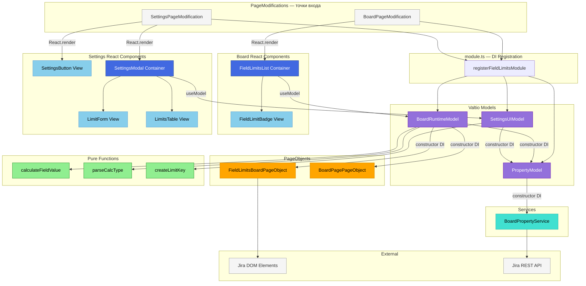
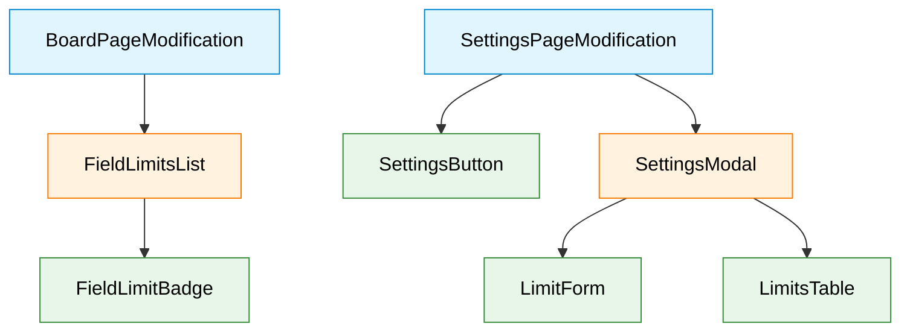

# Target Design: Field WIP Limits

Этот документ описывает целевую архитектуру для `src/features/field-limits/`.
Миграция с legacy PageModification + HTML templates (`src/field-limits/`) на текущую архитектуру: Valtio Models, DI, React + antd.

**Стратегия миграции:** Новый код создаётся в `src/features/field-limits/` рядом со старым `src/field-limits/`. Старый код не трогается до финального переключения в `content.ts`. После верификации — старый код удаляется.

## Ключевые принципы

1. **Три модели по жизненному циклу** — PropertyModel (персистентные данные), SettingsUIModel (форма настроек), BoardRuntimeModel (подсчёт и отображение на доске)
2. **PageObject для DOM-монополии** — вся работа с extra-fields карточек, подсчёт значений и coloring через `FieldLimitsBoardPageObject`
3. **Обратная совместимость данных** — формат board property `fieldLimitsJH` не меняется, старые настройки продолжают работать
4. **Расчётная логика в чистых функциях** — TYPE_CALC (BY_CARD, BY_SUM_VALUE, BY_SUM_NUMBERS, BY_MULTIPLE_VALUES) выносится в `utils/`

> Общие архитектурные принципы — см. docs/architecture_guideline.md

## Architecture Diagram



## Component Hierarchy



**Легенда:**
- Голубой — PageModification (не React)
- Оранжевый — Container (useModel, DI)
- Зелёный — View (pure presentation, antd)

## Target File Structure

```
src/features/field-limits/               # НОВАЯ папка (рядом со старой src/field-limits/)
├── module.ts                              # DI registration — registerFieldLimitsModule
├── tokens.ts                              # DI Tokens для PropertyModel, SettingsUIModel, BoardRuntimeModel
├── types.ts                               # Доменные типы: FieldLimit, FieldLimitsSettings, CalcType, LimitStats
│
├── property/
│   ├── PropertyModel.ts                   # Model: load/save field limits from board property
│   └── PropertyModel.test.ts              # Unit tests
│
├── SettingsPage/
│   ├── SettingsPageModification.ts        # PageModification: рендерит React на tab cardLayout
│   ├── models/
│   │   ├── SettingsUIModel.ts             # Model: draft limits, form state, CRUD операции
│   │   └── SettingsUIModel.test.ts        # Unit tests
│   └── components/
│       ├── SettingsButton.tsx             # View: antd Button "Edit WIP limits by field"
│       ├── SettingsModal.tsx              # Container: antd Modal, useModel(SettingsUIModel)
│       ├── LimitForm.tsx                  # View: форма добавления/редактирования лимита
│       ├── LimitsTable.tsx                # View: antd Table с лимитами, edit/delete/color picker
│       ├── LimitForm.stories.tsx          # Storybook
│       └── LimitsTable.stories.tsx        # Storybook
│
├── BoardPage/
│   ├── BoardPageModification.ts           # PageModification: инициализирует runtime, рендерит badges
│   ├── models/
│   │   ├── BoardRuntimeModel.ts           # Model: вычисление stats, card coloring
│   │   └── BoardRuntimeModel.test.ts      # Unit tests
│   ├── page-objects/
│   │   ├── FieldLimitsBoardPageObject.ts  # PageObject: DOM запросы к extra-fields карточек
│   │   └── FieldLimitsBoardPageObject.test.ts
│   └── components/
│       ├── FieldLimitsList.tsx            # Container: список badges, useModel(BoardRuntimeModel)
│       ├── FieldLimitBadge.tsx            # View: один badge с цветовой индикацией
│       ├── FieldLimitBadge.module.css     # Стили badge
│       └── FieldLimitBadge.stories.tsx    # Storybook
│
└── utils/
    ├── calculateFieldValue.ts             # Pure: парсинг и подсчёт field values (TYPE_CALC логика)
    ├── calculateFieldValue.test.ts        # Unit tests
    ├── parseCalcType.ts                   # Pure: определение CalcType по fieldValue строке
    ├── parseCalcType.test.ts              # Unit tests
    ├── createLimitKey.ts                  # Pure: генерация limitKey
    └── createLimitKey.test.ts             # Unit tests

src/field-limits/                          # СТАРАЯ папка — НЕ ТРОГАТЬ до Phase 5
├── BoardPage/
├── SettingsPage/
└── shared.ts
```

## Component Specifications

### PropertyModel

**Responsibility:** Загрузка и сохранение field limits из Jira Board Property.

```typescript
export class PropertyModel {
  settings: FieldLimitsSettings = { limits: {} };
  state: LoadingState = 'initial';
  error: string | null = null;

  constructor(
    private boardPropertyService: BoardPropertyServiceI,
    private logger: Logger
  ) {}

  async load(): Promise<Result<FieldLimitsSettings, Error>>;
  async save(settings: FieldLimitsSettings): Promise<Result<void, Error>>;
  reset(): void;
}
```

### SettingsUIModel

**Responsibility:** Управление состоянием модалки настроек — draft, CRUD лимитов, массовые операции.

```typescript
export class SettingsUIModel {
  isOpen: boolean = false;
  draft: FieldLimitsSettings = { limits: {} };
  isLoading: boolean = false;
  isSaving: boolean = false;
  error: string | null = null;

  /** Текущие поля card layout */
  cardLayoutFields: CardLayoutField[] = [];
  /** Колонки доски */
  columns: BoardColumn[] = [];
  /** Swimlanes доски */
  swimlanes: BoardSwimlane[] = [];

  /** Ключ лимита в режиме редактирования */
  editingLimitKey: string | null = null;

  constructor(
    private propertyModel: PropertyModel,
    private getBoardEditData: () => Promise<BoardEditData>,
    private logger: Logger
  ) {}

  async open(): Promise<Result<void, Error>>;
  async save(): Promise<Result<void, Error>>;
  close(): void;

  addLimit(input: LimitFormInput): void;
  updateLimit(limitKey: string, input: LimitFormInput): void;
  deleteLimit(limitKey: string): void;
  setEditingLimitKey(key: string | null): void;
  setLimitColor(limitKey: string, color: string): void;
  applyColumnsToSelected(selectedKeys: string[], columnIds: string[]): void;
  applySwimlanesToSelected(selectedKeys: string[], swimlaneIds: string[]): void;
  reset(): void;

  get hasUnsavedChanges(): boolean;
}
```

### BoardRuntimeModel

**Responsibility:** Подсчёт статистики field limits в реальном времени, управление card coloring.

```typescript
export class BoardRuntimeModel {
  settings: FieldLimitsSettings = { limits: {} };
  stats: Record<string, FieldLimitStats> = {};
  isInitialized: boolean = false;

  constructor(
    private propertyModel: PropertyModel,
    private fieldLimitsPageObject: IFieldLimitsBoardPageObject,
    private boardPageObject: IBoardPagePageObject,
    private logger: Logger
  ) {}

  async initialize(boardEditData: BoardEditData): Promise<Result<void, Error>>;
  recalculate(): void;
  colorCards(): void;
  destroy(): void;
  reset(): void;

  getLimitStats(limitKey: string): FieldLimitStats | undefined;
  isOverLimit(limitKey: string): boolean;
  getBadgeColor(limitKey: string): string;
  getBadgeText(limitKey: string): string;
}
```

### FieldLimitsBoardPageObject

**Responsibility:** DOM-запросы к extra-fields карточек на доске.

```typescript
export interface IFieldLimitsBoardPageObject {
  selectors: {
    extraField: string;
    subnavTitle: string;
  };

  /** Получить значения extra-field для карточки */
  getExtraFieldValues(issue: Element, fieldName: string): string[];

  /** Получить имя поля из extra-field элемента */
  getFieldNameFromExtraField(extraField: Element): string | null;

  /** Подсчитать issues в колонке, соответствующие field value */
  getMatchingIssuesInColumn(
    column: Element,
    fieldName: string,
    fieldValue: string,
    issueSelector: string
  ): Array<{ issue: Element; countValues: number }>;

  /** Покрасить карточку */
  colorCard(issue: Element, color: string): void;

  /** Сбросить цвет карточки */
  resetCardColor(issue: Element): void;

  /** Вставить React-компонент в subnav */
  insertSubnavComponent(component: React.ReactNode, key: string): void;

  /** Удалить React-компонент из subnav */
  removeSubnavComponent(key: string): void;
}
```

### FieldLimitsList (Container)

**Responsibility:** Рендер списка badges с лимитами, подписка на BoardRuntimeModel.

```tsx
export interface FieldLimitsListProps {}

export const FieldLimitsList: React.FC<FieldLimitsListProps> = () => {
  // useModel(boardRuntimeModel) — реактивная подписка на stats
  // Рендер FieldLimitBadge для каждого лимита
};
```

### FieldLimitBadge (View)

**Responsibility:** Один badge с визуальным именем, счётчиком и цветовой индикацией.

```tsx
export interface FieldLimitBadgeProps {
  visualValue: string;
  current: number;
  limit: number;
  badgeColor: string;
  bkgColor?: string;
  tooltip: string;
}

export const FieldLimitBadge: React.FC<FieldLimitBadgeProps>;
```

### SettingsButton (View)

**Responsibility:** Кнопка "Edit WIP limits by field" в настройках card layout.

```tsx
export interface SettingsButtonProps {
  onClick: () => void;
}

export const SettingsButton: React.FC<SettingsButtonProps>;
```

### SettingsModal (Container)

**Responsibility:** Модалка настроек, подписка на SettingsUIModel.

```tsx
export const SettingsModal: React.FC = () => {
  // useModel(settingsUIModel)
  // antd Modal + LimitForm + LimitsTable
};
```

### LimitForm (View)

**Responsibility:** Форма добавления/редактирования лимита.

```tsx
export interface LimitFormProps {
  fields: CardLayoutField[];
  columns: BoardColumn[];
  swimlanes: BoardSwimlane[];
  editingLimit: FieldLimit | null;
  onAdd: (input: LimitFormInput) => void;
  onEdit: (input: LimitFormInput) => void;
  onApplyColumns: (selectedKeys: string[], columnIds: string[]) => void;
  onApplySwimlanes: (selectedKeys: string[], swimlaneIds: string[]) => void;
}

export const LimitForm: React.FC<LimitFormProps>;
```

Antd компоненты: `Select`, `Input`, `InputNumber`, `Button`, `Checkbox.Group`.

### LimitsTable (View)

**Responsibility:** Таблица лимитов с операциями редактирования.

```tsx
export interface LimitsTableProps {
  limits: Record<string, FieldLimit>;
  columns: BoardColumn[];
  swimlanes: BoardSwimlane[];
  fields: CardLayoutField[];
  selectedKeys: string[];
  onSelect: (keys: string[]) => void;
  onEdit: (limitKey: string) => void;
  onDelete: (limitKey: string) => void;
  onColorChange: (limitKey: string, color: string) => void;
}

export const LimitsTable: React.FC<LimitsTableProps>;
```

Antd компоненты: `Table`, `Button`, `Checkbox`, `ColorPicker` (или `Popover` + custom).

## State Changes

### types.ts

```typescript
/**
 * @module FieldLimitsTypes
 *
 * Типы для фичи Field WIP Limits.
 * Хранится в Jira Board Property `fieldLimitsJH`.
 *
 * ## Типы подсчёта (определяются по формату fieldValue):
 * - "value" → BY_CARD (считаем карточки с этим значением)
 * - "∑value" → BY_SUM_VALUE (Team^2 → 2, Team → 1)
 * - "∑(numbers)" → BY_SUM_NUMBERS (суммируем числовые значения)
 * - "val1 || val2" → BY_MULTIPLE_VALUES (считаем если любое совпадает)
 */

/** Типы подсчёта задач */
export const CalcType = {
  BY_CARD: 0,
  BY_SUM_VALUE: 1,
  BY_SUM_NUMBERS: 2,
  BY_MULTIPLE_VALUES: 3,
} as const;
export type CalcType = (typeof CalcType)[keyof typeof CalcType];

/** Один лимит для конкретного field value */
export interface FieldLimit {
  fieldValue: string;
  fieldId: string;
  limit: number;
  /** ID колонок, где применяется лимит */
  columns: string[];
  /** ID swimlanes, где применяется лимит */
  swimlanes: string[];
  /** Кастомный цвет фона для badge */
  bkgColor?: string;
  /** Отображаемое имя на badge */
  visualValue: string;
}

/** Все настройки field limits для доски */
export interface FieldLimitsSettings {
  limits: Record<string, FieldLimit>;
}

/** Статистика одного лимита на доске (runtime) */
export interface FieldLimitStats {
  current: number;
  limit: number;
  isOverLimit: boolean;
  isOnLimit: boolean;
  calcType: CalcType;
  issues: Array<{ issue: Element; countValues: number }>;
}

/** Поле из card layout настроек Jira */
export interface CardLayoutField {
  fieldId: string;
  name: string;
}

/** Колонка доски */
export interface BoardColumn {
  id: string;
  name: string;
}

/** Swimlane доски */
export interface BoardSwimlane {
  id: string;
  name: string;
}

/** Входные данные формы создания/редактирования лимита */
export interface LimitFormInput {
  fieldId: string;
  fieldValue: string;
  visualValue: string;
  limit: number;
  columns: string[];
  swimlanes: string[];
}

/** Данные доски из Jira API */
export interface BoardEditData {
  canEdit: boolean;
  rapidListConfig: {
    mappedColumns: Array<BoardColumn & { isKanPlanColumn: boolean }>;
    currentStatisticsField?: { typeId: string };
  };
  swimlanesConfig: {
    swimlanes: BoardSwimlane[];
  };
  cardLayoutConfig: {
    currentFields: CardLayoutField[];
  };
}

/** Состояние загрузки */
export type LoadingState = 'initial' | 'loading' | 'loaded' | 'error';
```

### tokens.ts

```typescript
import { Token } from 'dioma';
import type { PropertyModel } from './property/PropertyModel';
import type { SettingsUIModel } from './SettingsPage/models/SettingsUIModel';
import type { BoardRuntimeModel } from './BoardPage/models/BoardRuntimeModel';
import type { IFieldLimitsBoardPageObject } from './BoardPage/page-objects/FieldLimitsBoardPageObject';

export const propertyModelToken = new Token<{
  model: Readonly<PropertyModel>;
  useModel: () => Readonly<PropertyModel>;
}>('field-limits/propertyModel');

export const settingsUIModelToken = new Token<{
  model: Readonly<SettingsUIModel>;
  useModel: () => Readonly<SettingsUIModel>;
}>('field-limits/settingsUIModel');

export const boardRuntimeModelToken = new Token<{
  model: Readonly<BoardRuntimeModel>;
  useModel: () => Readonly<BoardRuntimeModel>;
}>('field-limits/boardRuntimeModel');

export const fieldLimitsBoardPageObjectToken = new Token<IFieldLimitsBoardPageObject>(
  'field-limits/boardPageObject'
);
```

### module.ts

```typescript
import type { Container } from 'dioma';
import { globalContainer } from 'dioma';
import { proxy } from 'valtio';
import { useSnapshot } from 'valtio';
import { propertyModelToken, settingsUIModelToken, boardRuntimeModelToken, fieldLimitsBoardPageObjectToken } from './tokens';
import { PropertyModel } from './property/PropertyModel';
import { SettingsUIModel } from './SettingsPage/models/SettingsUIModel';
import { BoardRuntimeModel } from './BoardPage/models/BoardRuntimeModel';
import { FieldLimitsBoardPageObject } from './BoardPage/page-objects/FieldLimitsBoardPageObject';
import { BoardPropertyServiceToken } from 'src/shared/boardPropertyService';
import { boardPagePageObjectToken } from 'src/page-objects/BoardPage';
import { loggerToken } from 'src/shared/Logger';
import { getBoardIdFromURL } from 'src/routing';
import { getBoardEditData } from 'src/shared/jiraApi';

export function registerFieldLimitsModule(container: Container = globalContainer): void {
  const boardPropertyService = container.inject(BoardPropertyServiceToken);
  const boardPageObject = container.inject(boardPagePageObjectToken);
  const logger = container.inject(loggerToken);

  // PageObject
  const fieldLimitsPageObject = new FieldLimitsBoardPageObject();
  container.register({
    token: fieldLimitsBoardPageObjectToken,
    value: fieldLimitsPageObject,
  });

  // PropertyModel
  const propertyModel = proxy(new PropertyModel(boardPropertyService, logger));
  container.register({
    token: propertyModelToken,
    value: {
      model: propertyModel,
      useModel: () => useSnapshot(propertyModel) as PropertyModel,
    },
  });

  // SettingsUIModel
  const getBoardData = async () => {
    const boardId = getBoardIdFromURL();
    if (!boardId) throw new Error('No board ID');
    return getBoardEditData(boardId);
  };

  const settingsUIModel = proxy(new SettingsUIModel(propertyModel, getBoardData, logger));
  container.register({
    token: settingsUIModelToken,
    value: {
      model: settingsUIModel,
      useModel: () => useSnapshot(settingsUIModel) as SettingsUIModel,
    },
  });

  // BoardRuntimeModel
  const boardRuntimeModel = proxy(
    new BoardRuntimeModel(propertyModel, fieldLimitsPageObject, boardPageObject, logger)
  );
  container.register({
    token: boardRuntimeModelToken,
    value: {
      model: boardRuntimeModel,
      useModel: () => useSnapshot(boardRuntimeModel) as BoardRuntimeModel,
    },
  });
}
```

## Migration Plan

**Стратегия:** Весь новый код создаётся в `src/features/field-limits/`. Старый `src/field-limits/` не трогается. Переключение происходит атомарно в `content.ts` (Phase 5). После верификации — старый код удаляется.

### Phase 1: Инфраструктура

| # | Задача | Файлы |
|---|--------|-------|
| TASK-148 | Types + Tokens | `types.ts`, `tokens.ts` |
| TASK-149 | Pure Functions + тесты | `utils/parseCalcType.ts`, `utils/calculateFieldValue.ts`, `utils/createLimitKey.ts` |
| TASK-150 | Module registration | `module.ts` (заглушка, подключает модели по мере создания) |

### Phase 2: Property Model

| # | Задача | Файлы |
|---|--------|-------|
| TASK-151 | PropertyModel + тесты | `property/PropertyModel.ts`, `property/PropertyModel.test.ts` |

### Phase 3: Settings Page

| # | Задача | Файлы |
|---|--------|-------|
| TASK-152 | SettingsUIModel + тесты | `SettingsPage/models/SettingsUIModel.ts` |
| TASK-153 | SettingsButton (View) | `SettingsPage/components/SettingsButton.tsx` |
| TASK-154 | LimitForm (View) + stories | `SettingsPage/components/LimitForm.tsx` |
| TASK-155 | LimitsTable (View) + stories | `SettingsPage/components/LimitsTable.tsx` |
| TASK-156 | SettingsModal (Container) | `SettingsPage/components/SettingsModal.tsx` |
| TASK-157 | SettingsPageModification | `SettingsPage/SettingsPageModification.ts` |

### Phase 4: Board Page

| # | Задача | Файлы |
|---|--------|-------|
| TASK-158 | FieldLimitsBoardPageObject + тесты | `BoardPage/page-objects/FieldLimitsBoardPageObject.ts` |
| TASK-159 | BoardRuntimeModel + тесты | `BoardPage/models/BoardRuntimeModel.ts` |
| TASK-160 | FieldLimitBadge (View) + stories | `BoardPage/components/FieldLimitBadge.tsx` |
| TASK-161 | FieldLimitsList (Container) | `BoardPage/components/FieldLimitsList.tsx` |
| TASK-162 | BoardPageModification | `BoardPage/BoardPageModification.ts` |

### Phase 5: Переключение + Cleanup

| # | Задача | Файлы |
|---|--------|-------|
| TASK-163 | Переключить content.ts на новую реализацию | `src/content.ts` |
| TASK-164 | Удалить legacy код | `src/field-limits/` (вся папка) |

## Benefits

1. **Тестируемость** — Models и чистые функции покрыты unit-тестами (сейчас 0 тестов)
2. **Переиспользуемость** — antd компоненты вместо HTML templates, shared SwimlaneSelector/ColumnSelector
3. **Поддерживаемость** — чёткое разделение на Models/PageObjects/Components вместо монолитного PageModification
4. **Консистентность** — единый паттерн с другими фичами (swimlane-wip-limits, swimlane-histogram)
5. **Расширяемость** — легко добавлять новые типы подсчёта (CalcType) или визуализации
6. **DX** — Storybook stories для визуальной разработки компонентов
