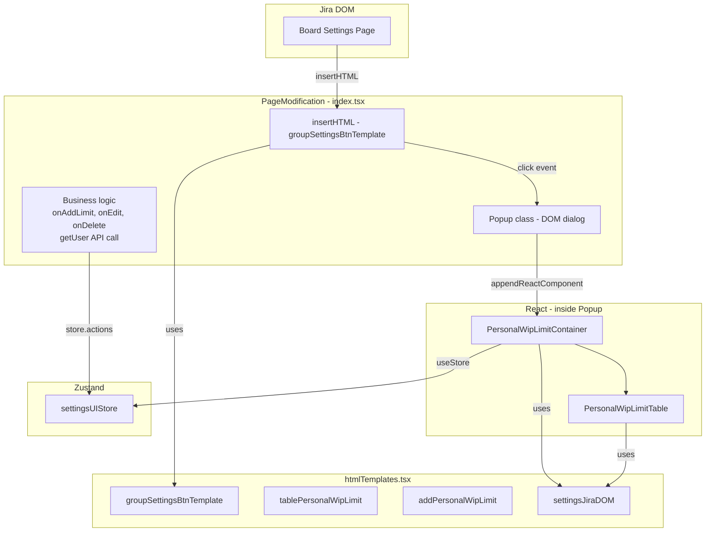
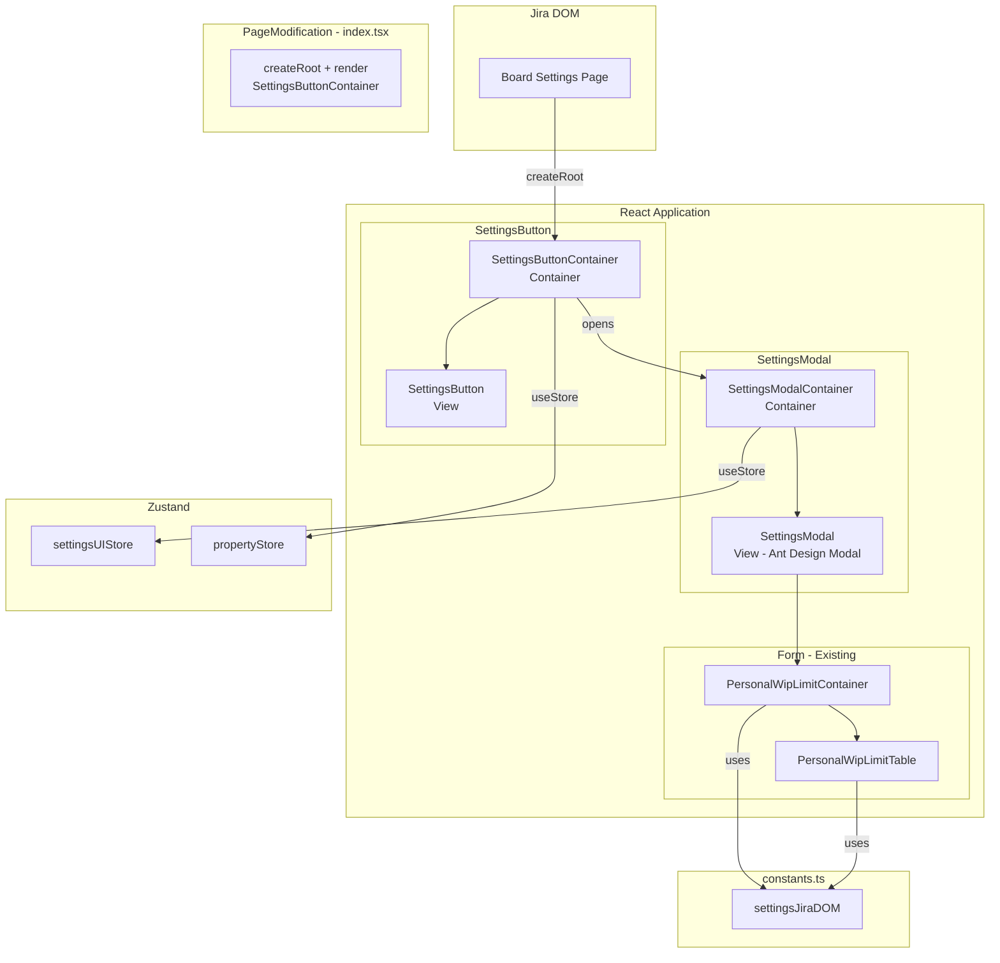
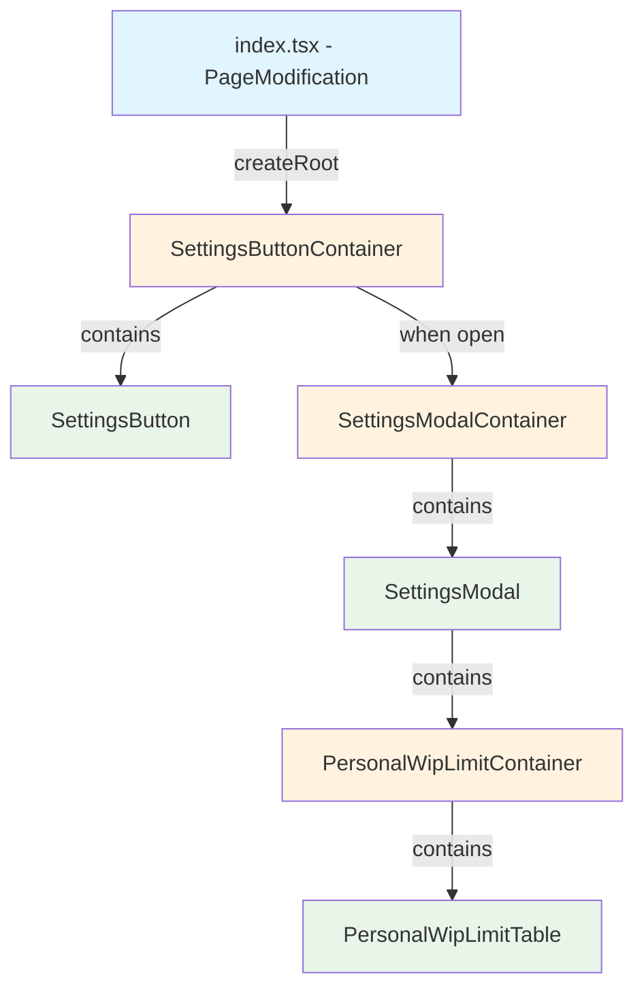

# Target Design: Миграция person-limits SettingsPage с htmlTemplates на React-компоненты

Этот документ описывает целевую архитектуру для `src/person-limits/SettingsPage` после отказа от `htmlTemplates.tsx` в пользу React-компонентов.

## Ключевые принципы

1. **index.tsx** — минимальный код: только `createRoot` + рендер `SettingsButtonContainer` в DOM
2. **Popup → Ant Design Modal** — отказ от `Popup` класса с DOM-манипуляциями в пользу React `Modal`
3. **Container/View** — SettingsButton и SettingsModal разделены на Container (логика, store) и View (presentation)
4. **settingsJiraDOM → constants.ts** — DOM-идентификаторы переносятся в файл констант
5. **Переиспользование SettingsModal View** — View-компонент модалки аналогичен `column-limits`, можно использовать общий или аналогичный

## Architecture Diagram

### Текущая архитектура (Before)



### Целевая архитектура (After)



## Component Hierarchy



**Легенда:**
- Голубой (`#e1f5fe`) — PageModification (не React)
- Оранжевый (`#fff3e0`) — Container (useStore, logic)
- Зеленый (`#e8f5e9`) — View (pure presentation)

## Target File Structure

```
src/person-limits/SettingsPage/
├── index.tsx                                  # PageModification: ONLY createRoot + render SettingsButtonContainer
├── constants.ts                               # NEW: settingsJiraDOM (из htmlTemplates.tsx)
│
├── components/
│   ├── SettingsButton/
│   │   ├── index.ts                           # NEW: exports Container + View
│   │   ├── SettingsButton.tsx                 # NEW: View - кнопка "Manage per-person WIP-limits"
│   │   ├── SettingsButton.stories.tsx         # NEW: Storybook stories
│   │   └── SettingsButtonContainer.tsx        # NEW: Container - open/close modal, init store
│   │
│   ├── SettingsModal/
│   │   ├── index.ts                           # NEW: exports Container + View
│   │   ├── SettingsModal.tsx                  # NEW: View - Ant Design Modal wrapper
│   │   ├── SettingsModal.stories.tsx          # NEW: Storybook stories
│   │   └── SettingsModalContainer.tsx         # NEW: Container - save, cancel, onAddLimit logic
│   │
│   ├── PersonalWipLimitContainer.tsx          # CHANGED: import settingsJiraDOM from constants
│   ├── PersonalWipLimitContainer.test.tsx     # EXISTING: no changes needed
│   ├── PersonalWipLimitContainer.stories.tsx  # EXISTING
│   └── PersonalWipLimitTable.tsx              # CHANGED: import settingsJiraDOM from constants
│       └── PersonalWipLimitTable.stories.tsx  # EXISTING
│
├── stores/                                    # EXISTING: no changes
│   ├── settingsUIStore.ts
│   ├── settingsUIStore.types.ts
│   ├── settingsUIStore.bdd.test.ts
│   └── personalWipLimitsStore.test.ts
│
├── actions/                                   # EXISTING: no changes
│   ├── index.ts
│   ├── createPersonLimit.ts
│   ├── updatePersonLimit.ts
│   ├── transformFormData.ts
│   ├── initFromProperty.ts
│   └── saveToProperty.ts
│
├── state/
│   └── types.ts                               # EXISTING: no changes
│
├── PersonLimitsSettings.stories.tsx           # CHANGED: rewrite with React components
├── SettingsPage.cy.tsx                        # EXISTING: no changes (tests use store + component)
├── settings-page.feature                      # EXISTING: no changes
├── styles.module.css                          # EXISTING: no changes
│
├── htmlTemplates.tsx                          # DELETED
└── htmlTemplates.test.tsx                     # DELETED
```

## Component Specifications

### 1. SettingsButton (View)

**Responsibility:** Рендерит кнопку "Manage per-person WIP-limits" в стиле AUI.

```typescript
export type SettingsButtonProps = {
  onClick: () => void;
  disabled?: boolean;
};

export const SettingsButton: React.FC<SettingsButtonProps> = ({
  onClick,
  disabled = false,
}) => (
  <button
    id={settingsJiraDOM.openEditorBtn}
    className="aui-button"
    onClick={onClick}
    disabled={disabled}
    type="button"
  >
    Manage per-person WIP-limits
  </button>
);
```

### 2. SettingsButtonContainer (Container)

**Responsibility:** Управляет открытием/закрытием модалки, инициализирует store данными из property, передаёт boardData.

```typescript
export type SettingsButtonContainerProps = {
  boardDataColumns: Column[];
  boardDataSwimlanes: Swimlane[];
};

export const SettingsButtonContainer: React.FC<SettingsButtonContainerProps> = ({
  boardDataColumns,
  boardDataSwimlanes,
}) => {
  const [isModalOpen, setIsModalOpen] = useState(false);

  const handleOpen = () => {
    initFromProperty();
    setIsModalOpen(true);
  };

  const handleClose = () => {
    initFromProperty(); // restore state on cancel
    setIsModalOpen(false);
  };

  const handleSave = async () => {
    await saveToProperty();
    setIsModalOpen(false);
  };

  return (
    <>
      <SettingsButton onClick={handleOpen} />
      {isModalOpen && (
        <SettingsModalContainer
          columns={boardDataColumns}
          swimlanes={boardDataSwimlanes}
          onClose={handleClose}
          onSave={handleSave}
        />
      )}
    </>
  );
};
```

### 3. SettingsModal (View)

**Responsibility:** Ant Design Modal обёртка с кнопками Save/Cancel. Аналогична `column-limits/SettingsModal`.

```typescript
export type SettingsModalProps = {
  title: string;
  children: React.ReactNode;
  onClose: () => void;
  onSave: () => void;
  isSaving?: boolean;
  okButtonText?: string;
};

export const SettingsModal: React.FC<SettingsModalProps> = ({
  title,
  children,
  onClose,
  onSave,
  isSaving = false,
  okButtonText = 'Save',
}) => (
  <Modal
    open
    title={title}
    onCancel={onClose}
    width={800}
    maskClosable={false}
    footer={[
      <Button key="cancel" onClick={onClose} disabled={isSaving}>Cancel</Button>,
      <Button key="save" type="primary" onClick={onSave} loading={isSaving}>{okButtonText}</Button>,
    ]}
  >
    {children}
  </Modal>
);
```

### 4. SettingsModalContainer (Container)

**Responsibility:** Оборачивает `PersonalWipLimitContainer` в `SettingsModal`. Содержит бизнес-логику `onAddLimit` (вызов API `getUser`, создание/обновление лимита).

```typescript
export type SettingsModalContainerProps = {
  columns: Column[];
  swimlanes: Swimlane[];
  onClose: () => void;
  onSave: () => Promise<void>;
};

export const SettingsModalContainer: React.FC<SettingsModalContainerProps> = ({
  columns,
  swimlanes,
  onClose,
  onSave,
}) => {
  const [isSaving, setIsSaving] = useState(false);

  const handleSave = async () => {
    setIsSaving(true);
    try {
      await onSave();
    } finally {
      setIsSaving(false);
    }
  };

  const handleAddLimit = async (formData: FormData) => {
    const store = useSettingsUIStore.getState();

    if (store.data.editingId !== null) {
      // Edit mode
      const existingLimit = store.data.limits.find(l => l.id === store.data.editingId);
      if (!existingLimit) return;
      const updatedLimit = updatePersonLimit({ existingLimit, formData, columns, swimlanes });
      store.actions.updateLimit(store.data.editingId, updatedLimit);
    } else {
      // Add mode
      const fullPerson = await getUser(formData.personName);
      const personLimit = createPersonLimit({
        formData,
        person: { name: fullPerson.name ?? fullPerson.displayName, ... },
        columns, swimlanes,
        id: Date.now(),
      });
      store.actions.addLimit(personLimit);
    }
  };

  return (
    <SettingsModal
      title="Personal WIP Limit"
      onClose={onClose}
      onSave={handleSave}
      isSaving={isSaving}
    >
      <PersonalWipLimitContainer
        columns={columns}
        swimlanes={swimlanes}
        onAddLimit={handleAddLimit}
      />
    </SettingsModal>
  );
};
```

### 5. PersonalWipLimitContainer (existing, minor change)

**Responsibility:** Форма управления WIP-лимитами (без изменений кроме импортов).

**Изменение:** заменить `import { settingsJiraDOM } from '../htmlTemplates'` на `import { settingsJiraDOM } from '../constants'`.

### 6. PersonalWipLimitTable (existing, minor change)

**Responsibility:** Таблица лимитов (без изменений кроме импортов).

**Изменение:** заменить `import { settingsJiraDOM } from '../htmlTemplates'` на `import { settingsJiraDOM } from '../constants'`.

## Store Changes

Изменений в store не требуется. `settingsUIStore` и `propertyStore` остаются без изменений.

## Migration Plan

### Phase 1: Foundation (TASK-1, TASK-2, TASK-3) — параллельно

1. **TASK-1: Извлечь `settingsJiraDOM` в `constants.ts`**
   - Создать `constants.ts`, перенести `settingsJiraDOM`
   - Обновить импорты в `PersonalWipLimitContainer.tsx` и `PersonalWipLimitTable.tsx`

2. **TASK-2: Создать `SettingsButton` View**
   - Создать компонент + stories + index.ts

3. **TASK-3: Создать `SettingsModal` View**
   - Создать компонент + stories + index.ts (аналог column-limits)

### Phase 2: Containers (TASK-4, TASK-5) — последовательно

4. **TASK-4: Создать `SettingsModalContainer`**
   - Перенести бизнес-логику из `index.tsx` (onAddLimit, onEditLimit)
   - Зависит от: TASK-1, TASK-3

5. **TASK-5: Создать `SettingsButtonContainer`**
   - Управление open/close/save
   - Зависит от: TASK-2, TASK-4

### Phase 3: Integration (TASK-6, TASK-7) — после Phase 2

6. **TASK-6: Рефакторинг `index.tsx`**
   - Заменить `insertHTML` + `Popup` на `createRoot` + `SettingsButtonContainer`
   - Удалить всю бизнес-логику из класса
   - Зависит от: TASK-5

7. **TASK-7: Переписать Stories**
   - Заменить HTML-based stories на React-компоненты
   - Зависит от: TASK-2, TASK-3

### Phase 4: Cleanup (TASK-8, TASK-9) — после Phase 3

8. **TASK-8: Удалить `htmlTemplates.tsx`**
   - Удалить файл и его тесты
   - Зависит от: TASK-1, TASK-6, TASK-7

9. **TASK-9: Верификация**
   - `npm test`, `npm run lint:eslint -- --fix`
   - Зависит от: все

```
TASK-1 (constants) ──────────────┐
                                 ├──> TASK-4 (ModalContainer) ──> TASK-5 (ButtonContainer) ──> TASK-6 (index.tsx) ──┐
TASK-3 (SettingsModal View) ─────┘                                                                                  ├──> TASK-8 (delete) ──> TASK-9 (verify)
TASK-2 (SettingsButton View) ────────────────────────────────────> TASK-5 (ButtonContainer) ──> TASK-7 (stories) ───┘
```

## Benefits

1. **No DOM manipulation** — Отказ от `insertHTML`, `innerHTML`, `Popup` в пользу React lifecycle
2. **Testability** — View-компоненты тестируются в изоляции через Storybook
3. **Consistency** — Единый паттерн Container/View как в `column-limits`
4. **Maintainability** — Бизнес-логика в React-контейнерах, не в PageModification классе
5. **Reusability** — `SettingsModal` View можно переиспользовать или вынести в shared
6. **React DevTools** — Полноценная отладка через React DevTools
