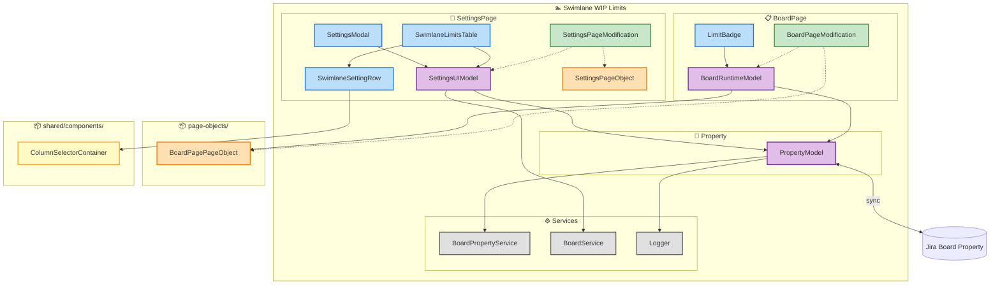
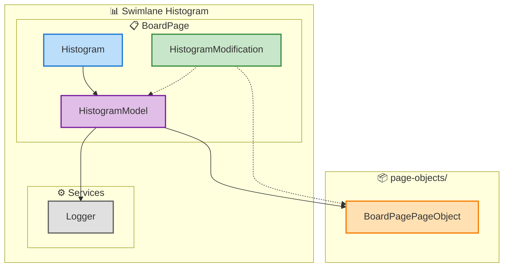
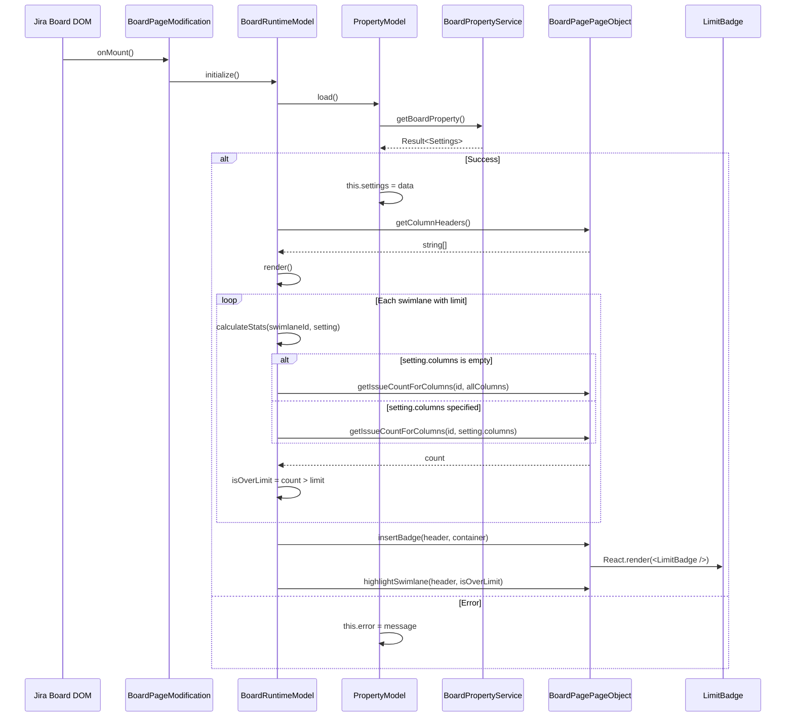
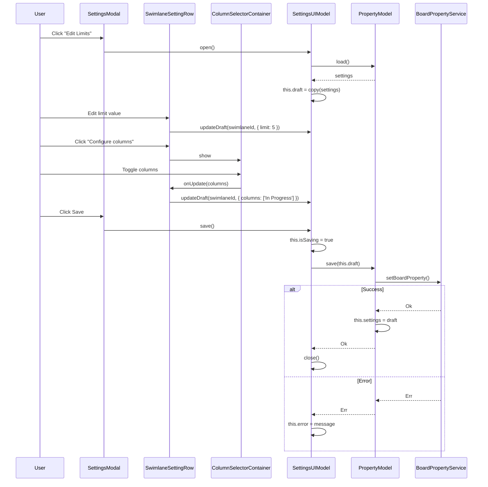

# Target Design: Swimlane Features v2

## Обзор

Рефакторинг функционала swimlane на **две независимые фичи** с использованием **Valtio class-based models** и архитектурных принципов проекта.

**Фичи:**
1. **swimlane-wip-limits** — WIP-лимиты для swimlane (настройки + badge на борде)
2. **swimlane-histogram** — гистограмма распределения задач по колонкам

**Ключевые изменения от v1:**
- **Две фичи**: независимые модули вместо одного
- **Store → Model**: переименование для ясности (это не Zustand store, а Valtio-обёрнутый класс)
- **Без readonly в классах**: readonly обеспечивается через DI-токен
- **Actions внутри моделей**: вся бизнес-логика — методы модели, не отдельные функции
- **React-компоненты**: вместо raw HTML для badge и гистограммы
- **Новый паттерн токенов**: `{ model, useModel }` для лучшей интеграции с React

---

## Структура папок

```
src/
├── page-objects/                  # Существующие PageObjects (расширяем)
│   ├── BoardPage.tsx              # + swimlane методы
│   ├── BoardPage.test.ts          # + тесты swimlane методов
│   └── SettingsPage.ts            # + swimlane методы
│
├── shared/
│   └── components/
│       ├── ColumnSelector.tsx     # Существующий компонент (TODO: вынести в папку)
│       └── SwimlaneSelector/
│           ├── SwimlaneSelector.tsx
│           ├── SwimlaneSelector.stories.tsx
│           └── index.ts
│
├── swimlane-wip-limits/           # Фича 1: WIP-лимиты
│   ├── index.ts                   # Entry point
│   ├── tokens.ts                  # DI-токены + { model, useModel }
│   ├── types.ts
│   ├── module.ts                  # Регистрация в DI
│   ├── constants.ts               # CSS-классы
│   │
│   ├── property/
│   │   ├── PropertyModel.ts       # Синхронизация с Jira
│   │   ├── PropertyModel.test.ts
│   │   └── index.ts
│   │
│   ├── utils/
│   │   ├── mergeSwimlaneSettings.ts
│   │   └── mergeSwimlaneSettings.test.ts
│   │
│   ├── SettingsPage/
│   │   ├── index.ts
│   │   ├── SettingsPageModification.ts    # Entry point
│   │   ├── models/
│   │   │   ├── SettingsUIModel.ts
│   │   │   └── SettingsUIModel.test.ts
│   │   ├── pageObject/
│   │   │   ├── ISettingsPageObject.ts
│   │   │   ├── SettingsPageObject.ts
│   │   │   └── index.ts
│   │   └── components/
│   │       ├── SettingsModal.tsx
│   │       ├── SettingsModal.test.tsx
│   │       ├── SwimlaneLimitsTable.tsx      # Таблица swimlanes
│   │       ├── SwimlaneLimitsTable.stories.tsx
│   │       ├── SwimlaneSettingRow.tsx       # Строка с настройками одного swimlane
│   │       └── SwimlaneSettingRow.stories.tsx
│   │
│   └── BoardPage/
│       ├── index.ts
│       ├── BoardPageModification.ts       # Entry point
│       ├── models/
│       │   ├── BoardRuntimeModel.ts
│       │   └── BoardRuntimeModel.test.ts
│       └── components/
│           ├── LimitBadge/
│           │   ├── LimitBadge.tsx
│           │   ├── LimitBadge.module.css
│           │   └── LimitBadge.stories.tsx
│           └── index.ts
│
├── swimlane-histogram/            # Фича 2: Гистограмма
│   ├── index.ts
│   ├── tokens.ts
│   ├── types.ts
│   ├── module.ts
│   │
│   ├── models/
│   │   ├── HistogramModel.ts
│   │   └── HistogramModel.test.ts
│   │
│   ├── components/
│   │   ├── Histogram/
│   │   │   ├── Histogram.tsx
│   │   │   ├── Histogram.module.css
│   │   │   └── Histogram.stories.tsx
│   │   └── index.ts
│   │
│   └── HistogramModification.ts   # Entry point
```

> **Примечание**: Используем существующий `BoardPagePageObject` из `src/page-objects/BoardPage.tsx`, расширяя его swimlane-методами. Обе фичи используют один и тот же PageObject через DI-токен `boardPagePageObjectToken`.

> **TODO**: Вынести `ColumnSelector.tsx` в папку `ColumnSelector/` по аналогии с `SwimlaneSelector/`:
> ```
> src/shared/components/
> ├── ColumnSelector/             # TODO: рефакторинг
> │   ├── ColumnSelector.tsx
> │   ├── ColumnSelector.stories.tsx
> │   ├── ColumnSelector.cy.tsx
> │   └── index.ts
> ├── SwimlaneSelector/
> │   └── ...
> ```

---

## Диаграммы

### Фича 1: swimlane-wip-limits



### Фича 2: swimlane-histogram



> **Примечание**: `BoardPagePageObject` — существующий PageObject из `src/page-objects/BoardPage.tsx`, расширенный swimlane-методами. Обе фичи используют один токен `boardPagePageObjectToken`.

**Легенда цветов:**

| Цвет | Тип | Описание |
|------|-----|----------|
| 🟣 Фиолетовый | Model | Valtio-модели с состоянием и бизнес-логикой |
| 🔵 Голубой | Component | React-компоненты (presentation) |
| 🟢 Зелёный | Modification | Entry points (PageModification классы) |
| 🟠 Оранжевый | PageObject | DOM-абстракции (queries + commands) |
| ⚪ Серый | Service | Инфраструктурные сервисы (DI) |
| 🟡 Жёлтый | Shared | Переиспользуемые компоненты из `shared/` |

### Data Flow: Загрузка настроек на доске (WIP Limits)



### Data Flow: Редактирование в Settings (WIP Limits)



---

## Типы

### swimlane-wip-limits/types.ts

```typescript
/**
 * @module SwimlaneWipLimitsTypes
 * 
 * Типы для фичи Swimlane WIP Limits.
 * 
 * ## Конвенции
 * - `includedIssueTypes: undefined` — все типы задач
 * - `includedIssueTypes: []` — никакие типы (лимит отключен)
 * - `limit: undefined` — лимит не установлен
 */

// ============================================================
// Domain Types
// ============================================================

/**
 * Настройки одного swimlane.
 * Хранится в Jira Board Property.
 * 
 * @example
 * ```ts
 * const setting: SwimlaneSetting = {
 *   limit: 5,
 *   columns: ['In Progress', 'Review'],
 *   includedIssueTypes: ['Bug', 'Task'],
 * };
 * ```
 */
export interface SwimlaneSetting {
  /** WIP лимит. undefined = лимит не установлен */
  limit?: number;
  
  /**
   * Колонки для подсчёта задач в лимите.
   * - []: все колонки (по умолчанию)
   * - ['In Progress', 'Review']: только указанные колонки
   */
  columns: string[];
  
  /**
   * Типы задач, которые считаются в лимите.
   * - undefined: все типы
   * - []: никакие (лимит отключен)
   * - ['Bug', 'Task']: только указанные
   */
  includedIssueTypes?: string[];
}

/**
 * Все настройки swimlanes для доски.
 * Ключ — swimlaneId из Jira DOM.
 * 
 * @example
 * ```ts
 * const settings: SwimlaneSettings = {
 *   'swimlane-123': { limit: 5, columns: [] },                    // все колонки
 *   'swimlane-456': { limit: 10, columns: ['In Progress'] },     // только In Progress
 * };
 * ```
 */
export type SwimlaneSettings = {
  [swimlaneId: string]: SwimlaneSetting;
};

/**
 * Информация о swimlane из Jira DOM/API.
 * Используется для отображения в UI настроек.
 */
export interface Swimlane {
  id: string;
  name: string;
}

/**
 * Статистика swimlane на доске (runtime).
 */
export interface SwimlaneIssueStats {
  /** Общее количество задач (с учетом фильтра типов) */
  count: number;
  
  /** Распределение по колонкам [колонка1, колонка2, ...] */
  columnCounts: number[];
  
  /** Превышен ли лимит */
  isOverLimit: boolean;
}

/**
 * Состояние загрузки для всех моделей.
 */
export type LoadingState = 'initial' | 'loading' | 'loaded' | 'error';

/**
 * Данные доски из Jira API (getBoardEditData).
 */
export interface BoardData {
  canEdit: boolean;
  swimlanesConfig: {
    swimlanes: Swimlane[];
  };
}

/**
 * Props для компонента LimitBadge.
 */
export interface LimitBadgeProps {
  /** Текущее количество задач */
  count: number;
  /** Установленный лимит */
  limit: number;
  /** Превышен ли лимит */
  isExceeded: boolean;
}
```

### swimlane-histogram/types.ts

```typescript
/**
 * @module SwimlaneHistogramTypes
 * 
 * Типы для фичи Swimlane Histogram.
 */

/**
 * Данные для одного столбца гистограммы.
 */
export interface HistogramColumn {
  /** Название колонки */
  name: string;
  /** Количество задач */
  count: number;
  /** Процент от общего количества */
  percentage: number;
}

/**
 * Данные гистограммы для swimlane.
 */
export interface HistogramData {
  /** Список колонок с данными */
  columns: HistogramColumn[];
  /** Общее количество задач */
  total: number;
}

/**
 * Props для компонента Histogram.
 */
export interface HistogramProps {
  /** Данные для отображения */
  data: HistogramData;
  /** Ширина гистограммы */
  width?: number;
  /** Высота гистограммы */
  height?: number;
}

/**
 * Состояние загрузки.
 */
export type LoadingState = 'initial' | 'loading' | 'loaded' | 'error';
```

---

## Models (Class-based Valtio)

### PropertyModel (swimlane-wip-limits)

```typescript
/**
 * @module PropertyModel
 * 
 * Модель для синхронизации настроек WIP-лимитов с Jira Board Property.
 * 
 * ## Жизненный цикл
 * Создаётся при загрузке доски, живёт пока доска открыта.
 * 
 * ## Паттерн: Class + Valtio proxy + DI
 * - Поля без readonly (мутация через `this.field = value`)
 * - Readonly обеспечивается через DI-токен
 * - Методы инкапсулируют бизнес-логику
 * - Зависимости через конструктор
 */
import { proxy } from 'valtio';
import { Result, Ok, Err } from 'ts-results';
import type { SwimlaneSettings, LoadingState } from './types';
import type { IBoardPropertyService } from '@/shared/services/BoardPropertyService';
import type { ILogger } from '@/shared/Logger';
import { BOARD_PROPERTIES } from '@/shared/constants';
import { mergeSwimlaneSettings } from './utils/mergeSwimlaneSettings';

/**
 * Примечание: mergeSwimlaneSettings должен обрабатывать миграцию
 * старых настроек без поля `columns`, добавляя `columns: []` по умолчанию.
 */

export class PropertyModel {
  // === State ===
  
  /** Настройки swimlanes из Jira Board Property */
  settings: SwimlaneSettings = {};
  
  /** Состояние загрузки */
  state: LoadingState = 'initial';
  
  /** Сообщение об ошибке (если state === 'error') */
  error: string | null = null;

  // === Dependencies ===
  
  constructor(
    private boardPropertyService: IBoardPropertyService,
    private logger: ILogger,
  ) {}

  // === Commands ===
  
  /**
   * Загрузить настройки из Jira Board Property.
   * Мерджит legacy и новые настройки.
   */
  async load(): Promise<Result<SwimlaneSettings, Error>> {
    const log = this.logger.getPrefixedLog('PropertyModel.load');
    
    if (this.state === 'loading') {
      log('Already loading, skip');
      return Ok(this.settings);
    }
    
    this.state = 'loading';
    
    const [newResult, oldResult] = await Promise.all([
      this.boardPropertyService.getBoardProperty<SwimlaneSettings>(
        BOARD_PROPERTIES.SWIMLANE_SETTINGS
      ),
      this.boardPropertyService.getBoardProperty<SwimlaneSettings>(
        BOARD_PROPERTIES.OLD_SWIMLANE_SETTINGS
      ),
    ]);
    
    if (newResult.err) {
      this.state = 'error';
      this.error = newResult.val.message;
      log(`Failed to load: ${newResult.val.message}`, 'error');
      return Err(newResult.val);
    }
    
    const merged = mergeSwimlaneSettings(
      newResult.val, 
      oldResult.ok ? oldResult.val : undefined
    );
    
    this.settings = merged;
    this.state = 'loaded';
    this.error = null;
    
    log('Loaded settings', merged);
    return Ok(merged);
  }
  
  /**
   * Сохранить настройки в Jira Board Property.
   */
  async save(settings: SwimlaneSettings): Promise<Result<void, Error>> {
    const log = this.logger.getPrefixedLog('PropertyModel.save');
    
    const result = await this.boardPropertyService.setBoardProperty(
      BOARD_PROPERTIES.SWIMLANE_SETTINGS,
      settings
    );
    
    if (result.err) {
      log(`Failed to save: ${result.val.message}`, 'error');
      return Err(result.val);
    }
    
    this.settings = settings;
    
    log('Saved settings');
    return Ok(undefined);
  }
  
  /**
   * Обновить настройки одного swimlane.
   * Инициализирует columns пустым массивом если не указан.
   */
  updateSwimlane(id: string, setting: Partial<SwimlaneSetting>): void {
    const existing = this.settings[id] || { columns: [] };
    this.settings = {
      ...this.settings,
      [id]: { ...existing, ...setting },
    };
  }
  
  /**
   * Сбросить модель в начальное состояние.
   */
  reset(): void {
    this.settings = {};
    this.state = 'initial';
    this.error = null;
  }
}
```

### SettingsUIModel (swimlane-wip-limits)

```typescript
/**
 * @module SettingsUIModel
 * 
 * Модель для состояния модального окна настроек WIP-лимитов.
 * 
 * ## Жизненный цикл
 * Создаётся при открытии Settings popup, сбрасывается при закрытии.
 */
import { proxy } from 'valtio';
import { Result, Ok, Err } from 'ts-results';
import type { SwimlaneSettings, Swimlane, SwimlaneSetting, BoardData } from '../types';
import type { PropertyModel } from '../property/PropertyModel';
import type { IBoardService } from '@/shared/services/BoardService';
import type { ILogger } from '@/shared/Logger';

export class SettingsUIModel {
  // === State ===
  
  /** Modal открыт */
  isOpen: boolean = false;
  
  /** Черновик настроек (редактируемая копия) */
  draft: SwimlaneSettings = {};
  
  /** Список swimlanes для отображения */
  swimlanes: Swimlane[] = [];
  
  /** ID swimlane в режиме редактирования */
  editingSwimlaneId: string | null = null;
  
  /** Сообщение об ошибке */
  error: string | null = null;
  
  /** Состояние сохранения */
  isSaving: boolean = false;

  // === Dependencies ===
  
  constructor(
    private propertyModel: PropertyModel,
    private boardService: IBoardService,
    private logger: ILogger,
  ) {}

  // === Commands ===
  
  /**
   * Открыть modal настроек.
   * Загружает текущие настройки и данные доски.
   */
  async open(): Promise<Result<void, Error>> {
    const log = this.logger.getPrefixedLog('SettingsUIModel.open');
    
    const [settingsResult, boardDataResult] = await Promise.all([
      this.propertyModel.load(),
      this.boardService.getBoardEditData(),
    ]);
    
    if (settingsResult.err) {
      log(`Failed to load settings: ${settingsResult.val.message}`, 'error');
      return Err(settingsResult.val);
    }
    
    if (boardDataResult.err) {
      log(`Failed to load board data: ${boardDataResult.val.message}`, 'error');
      return Err(boardDataResult.val);
    }
    
    const boardData = boardDataResult.val as BoardData;
    
    this.isOpen = true;
    this.draft = { ...settingsResult.val };
    this.swimlanes = boardData.swimlanesConfig.swimlanes;
    this.editingSwimlaneId = null;
    this.error = null;
    
    log('Opened modal');
    return Ok(undefined);
  }
  
  /**
   * Сохранить изменения и закрыть modal.
   */
  async save(): Promise<Result<void, Error>> {
    const log = this.logger.getPrefixedLog('SettingsUIModel.save');
    
    this.isSaving = true;
    this.error = null;
    
    const result = await this.propertyModel.save(this.draft);
    
    if (result.err) {
      this.error = result.val.message;
      this.isSaving = false;
      log(`Failed to save: ${result.val.message}`, 'error');
      return Err(result.val);
    }
    
    this.close();
    log('Saved and closed');
    return Ok(undefined);
  }
  
  /**
   * Закрыть modal без сохранения.
   */
  close(): void {
    this.isOpen = false;
    this.draft = {};
    this.swimlanes = [];
    this.editingSwimlaneId = null;
    this.error = null;
    this.isSaving = false;
  }
  
  /**
   * Обновить черновик для swimlane.
   */
  updateDraft(swimlaneId: string, update: Partial<SwimlaneSetting>): void {
    this.draft = {
      ...this.draft,
      [swimlaneId]: { ...this.draft[swimlaneId], ...update },
    };
  }
  
  /**
   * Установить ID редактируемого swimlane.
   */
  setEditingSwimlaneId(id: string | null): void {
    this.editingSwimlaneId = id;
  }
  
  /**
   * Сбросить в начальное состояние.
   */
  reset(): void {
    this.close();
  }
}
```

### BoardRuntimeModel (swimlane-wip-limits)

```typescript
/**
 * @module BoardRuntimeModel
 * 
 * Модель для runtime-данных WIP-лимитов на доске.
 * Хранит кеш подсчёта задач и управляет рендерингом badge.
 * 
 * ## Жизненный цикл
 * Создаётся при активации фичи на доске, сбрасывается при уходе со страницы.
 * 
 * ## Зависимости
 * Использует существующий `IBoardPagePageObject` из `src/page-objects/BoardPage.tsx`.
 */
import { proxy } from 'valtio';
import { Result, Ok, Err } from 'ts-results';
import type { SwimlaneSettings, SwimlaneIssueStats, LimitBadgeProps } from '../types';
import type { PropertyModel } from '../property/PropertyModel';
import type { IBoardPagePageObject } from 'src/page-objects/BoardPage';
import type { ILogger } from '@/shared/Logger';
import { LimitBadge } from './components/LimitBadge/LimitBadge';

export class BoardRuntimeModel {
  // === State ===
  
  /** Настройки (копия для быстрого доступа) */
  settings: SwimlaneSettings = {};
  
  /** Статистика по swimlanes */
  stats: { [swimlaneId: string]: SwimlaneIssueStats } = {};
  
  /** Названия колонок */
  columnNames: string[] = [];
  
  /** Флаг инициализации */
  isInitialized: boolean = false;

  // === Dependencies ===
  
  constructor(
    private propertyModel: PropertyModel,
    private pageObject: IBoardPagePageObject,  // Существующий PageObject
    private logger: ILogger,
  ) {}

  // === Commands ===
  
  /**
   * Инициализировать фичу на доске.
   * Загружает настройки и выполняет первичный рендер.
   */
  async initialize(): Promise<Result<void, Error>> {
    const log = this.logger.getPrefixedLog('BoardRuntimeModel.initialize');
    
    const settingsResult = await this.propertyModel.load();
    if (settingsResult.err) {
      return Err(settingsResult.val);
    }
    
    this.columnNames = this.pageObject.getColumnHeaders();
    this.settings = settingsResult.val;
    this.stats = {};
    this.isInitialized = true;
    
    this.render();
    
    log('Initialized');
    return Ok(undefined);
  }
  
  /**
   * Рендер лимитов и статистики на доске.
   * Вызывается при инициализации и изменениях DOM.
   */
  render(): void {
    const log = this.logger.getPrefixedLog('BoardRuntimeModel.render');
    
    const swimlanes = this.pageObject.getSwimlanes();
    const allStats: { [id: string]: SwimlaneIssueStats } = {};
    
    for (const swimlane of swimlanes) {
      const swimlaneId = swimlane.id;
      
      const setting = this.settings[swimlaneId];
      if (!setting?.limit) continue;
      
      // Подсчёт задач с учётом выбранных колонок
      const stats = this.calculateStats(swimlaneId, setting);
      allStats[swimlaneId] = stats;
      
      // Подсветка и badge
      const header = this.pageObject.getSwimlaneHeader(swimlaneId);
      if (header) {
        this.pageObject.highlightSwimlane(header, stats.isOverLimit);
        
        // Вставляем badge через React (паттерн из CardPageObject.attach)
        this.pageObject.insertSwimlaneComponent(
          header,
          <LimitBadge
            count={stats.count}
            limit={setting.limit}
            isExceeded={stats.isOverLimit}
          />,
          'swimlane-limit-badge'
        );
      }
    }
    
    this.stats = allStats;
    
    log('Rendered', { swimlaneCount: swimlanes.length });
  }
  
  /**
   * Подсчёт статистики для swimlane с учётом выбранных колонок.
   * 
   * @param swimlaneId - ID swimlane
   * @param setting - настройки swimlane (лимит + колонки)
   * @returns статистика: количество, распределение по колонкам, превышение
   */
  calculateStats(swimlaneId: string, setting: SwimlaneSetting): SwimlaneIssueStats {
    // Если columns пустой — считаем все колонки
    const columnsToCount = setting.columns.length > 0 
      ? setting.columns 
      : this.pageObject.getColumns();  // Используем существующий метод
    
    const count = this.pageObject.getIssueCountForColumns(swimlaneId, columnsToCount);
    const columnCounts = this.pageObject.getIssueCountByColumn(swimlaneId);
    const isOverLimit = setting.limit ? count > setting.limit : false;
    
    return { count, columnCounts, isOverLimit };
  }
  
  /**
   * Cleanup при destroy.
   * React roots управляются PageObject через insertSwimlaneComponent.
   */
  destroy(): void {
    // Удаляем все badge через PageObject
    const swimlanes = this.pageObject.getSwimlanes();
    for (const swimlane of swimlanes) {
      const header = this.pageObject.getSwimlaneHeader(swimlane.id);
      if (header) {
        this.pageObject.removeSwimlaneComponent(header, 'swimlane-limit-badge');
      }
    }
    this.reset();
  }
  
  /**
   * Сбросить модель.
   */
  reset(): void {
    this.settings = {};
    this.stats = {};
    this.columnNames = [];
    this.isInitialized = false;
  }

  // === Queries (derived data) ===
  
  /**
   * Получить статистику swimlane.
   */
  getSwimlaneStats(swimlaneId: string): SwimlaneIssueStats | undefined {
    return this.stats[swimlaneId];
  }
  
  /**
   * Проверить, превышен ли лимит swimlane.
   */
  isOverLimit(swimlaneId: string): boolean {
    const stats = this.stats[swimlaneId];
    const setting = this.settings[swimlaneId];
    
    if (!stats || !setting?.limit) return false;
    return stats.count > setting.limit;
  }
  
  /**
   * Получить текст badge "X/Y".
   */
  getBadgeText(swimlaneId: string): string | null {
    const stats = this.stats[swimlaneId];
    const setting = this.settings[swimlaneId];
    
    if (!stats || !setting?.limit) return null;
    return `${stats.count}/${setting.limit}`;
  }
}
```

### HistogramModel (swimlane-histogram)

```typescript
/**
 * @module HistogramModel
 * 
 * Модель для гистограммы распределения задач по колонкам.
 * 
 * ## Жизненный цикл
 * Создаётся при активации фичи на доске, сбрасывается при уходе со страницы.
 * 
 * ## Зависимости
 * Использует существующий `IBoardPagePageObject` из `src/page-objects/BoardPage.tsx`.
 */
import { proxy } from 'valtio';
import type { HistogramData } from './types';
import type { IBoardPagePageObject } from 'src/page-objects/BoardPage';
import type { ILogger } from '@/shared/Logger';
import { Histogram } from './components/Histogram/Histogram';

export class HistogramModel {
  // === State ===
  
  /** Данные гистограмм по swimlanes */
  data: { [swimlaneId: string]: HistogramData } = {};
  
  /** Флаг инициализации */
  isInitialized: boolean = false;

  // === Dependencies ===
  
  constructor(
    private pageObject: IBoardPagePageObject,  // Существующий PageObject
    private logger: ILogger,
  ) {}

  // === Commands ===
  
  /**
   * Инициализировать фичу на доске.
   */
  initialize(): void {
    const log = this.logger.getPrefixedLog('HistogramModel.initialize');
    
    this.isInitialized = true;
    this.render();
    
    log('Initialized');
  }
  
  /**
   * Рендер гистограмм на доске.
   */
  render(): void {
    const log = this.logger.getPrefixedLog('HistogramModel.render');
    
    const swimlanes = this.pageObject.getSwimlanes();
    const columnNames = this.pageObject.getColumnHeaders();
    
    for (const swimlane of swimlanes) {
      const swimlaneId = swimlane.id;
      
      const columnCounts = this.pageObject.getIssueCountByColumn(swimlaneId);
      const total = columnCounts.reduce((sum, count) => sum + count, 0);
      
      const histogramData: HistogramData = {
        columns: columnNames.map((name, index) => ({
          name,
          count: columnCounts[index] || 0,
          percentage: total > 0 ? (columnCounts[index] || 0) / total * 100 : 0,
        })),
        total,
      };
      
      this.data[swimlaneId] = histogramData;
      
      // Вставляем гистограмму через React (паттерн из CardPageObject.attach)
      const header = this.pageObject.getSwimlaneHeader(swimlaneId);
      if (header) {
        this.pageObject.insertSwimlaneComponent(
          header,
          <Histogram data={histogramData} />,
          'swimlane-histogram'
        );
      }
    }
    
    log('Rendered', { swimlaneCount: swimlanes.length });
  }
  
  /**
   * Cleanup при destroy.
   * React roots управляются PageObject через insertSwimlaneComponent.
   */
  destroy(): void {
    // Удаляем все гистограммы через PageObject
    const swimlanes = this.pageObject.getSwimlanes();
    for (const swimlane of swimlanes) {
      const header = this.pageObject.getSwimlaneHeader(swimlane.id);
      if (header) {
        this.pageObject.removeSwimlaneComponent(header, 'swimlane-histogram');
      }
    }
    this.reset();
  }
  
  /**
   * Сбросить модель.
   */
  reset(): void {
    this.data = {};
    this.isInitialized = false;
  }

  // === Queries ===
  
  /**
   * Получить данные гистограммы для swimlane.
   */
  getHistogramData(swimlaneId: string): HistogramData | undefined {
    return this.data[swimlaneId];
  }
}
```

---

## DI Registration: Новый паттерн токенов

### tokens.ts (swimlane-wip-limits)

```typescript
/**
 * @module SwimlaneWipLimitsTokens
 * 
 * DI-токены для моделей swimlane WIP limits.
 * 
 * ## Паттерн: { model, useModel }
 * 
 * Каждый токен предоставляет объект с двумя свойствами:
 * - `model` — readonly ссылка на Valtio proxy для использования вне React
 * - `useModel()` — хук для использования в React-компонентах (с useSnapshot)
 * 
 * ## Использование
 * 
 * ```ts
 * // В React-компоненте
 * const { useModel } = useDi(propertyModelToken);
 * const model = useModel();
 * model.settings;          // ✅ чтение
 * model.settings = {};     // ❌ TS Error — readonly
 * await model.load();      // ✅ методы работают
 * 
 * // Вне React (в других моделях, actions)
 * const { model } = container.inject(propertyModelToken);
 * await model.load();
 * ```
 */
import { Token } from 'dioma';
import { useSnapshot } from 'valtio';
import type { PropertyModel } from './property/PropertyModel';
import type { SettingsUIModel } from './SettingsPage/models/SettingsUIModel';
import type { BoardRuntimeModel } from './BoardPage/models/BoardRuntimeModel';

// ============================================================
// Property Model Token
// ============================================================

export interface PropertyModelDI {
  model: Readonly<PropertyModel>;
  useModel: () => Readonly<PropertyModel>;
}

export const propertyModelToken = new Token<PropertyModelDI>(
  'swimlaneWipLimits.propertyModel'
);

// ============================================================
// Settings UI Model Token
// ============================================================

export interface SettingsUIModelDI {
  model: Readonly<SettingsUIModel>;
  useModel: () => Readonly<SettingsUIModel>;
}

export const settingsUIModelToken = new Token<SettingsUIModelDI>(
  'swimlaneWipLimits.settingsUIModel'
);

// ============================================================
// Board Runtime Model Token
// ============================================================

export interface BoardRuntimeModelDI {
  model: Readonly<BoardRuntimeModel>;
  useModel: () => Readonly<BoardRuntimeModel>;
}

export const boardRuntimeModelToken = new Token<BoardRuntimeModelDI>(
  'swimlaneWipLimits.boardRuntimeModel'
);
```

### module.ts (swimlane-wip-limits)

```typescript
/**
 * @module SwimlaneWipLimitsModule
 * 
 * Регистрация моделей swimlane WIP limits в DI-контейнере.
 */
import { proxy, useSnapshot } from 'valtio';
import { container } from '@/shared/di';
import { boardPropertyServiceToken } from '@/shared/services/BoardPropertyService';
import { boardServiceToken } from '@/shared/services/BoardService';
import { loggerToken } from '@/shared/Logger';
import { boardPagePageObjectToken } from 'src/page-objects/BoardPage';  // Существующий токен

import { PropertyModel } from './property/PropertyModel';
import { SettingsUIModel } from './SettingsPage/models/SettingsUIModel';
import { BoardRuntimeModel } from './BoardPage/models/BoardRuntimeModel';

import {
  propertyModelToken,
  settingsUIModelToken,
  boardRuntimeModelToken,
} from './tokens';

/**
 * Регистрирует все модели swimlane WIP limits в контейнере.
 * Вызывается при инициализации фичи.
 */
export function registerSwimlaneWipLimitsModels(): void {
  // Property Model (singleton на время жизни доски)
  container.register({
    token: propertyModelToken,
    factory: () => {
      const boardPropertyService = container.inject(boardPropertyServiceToken);
      const logger = container.inject(loggerToken);
      
      const model = proxy(new PropertyModel(boardPropertyService, logger));
      
      return {
        model,
        useModel: () => {
          useSnapshot(model);
          return model;
        },
      };
    },
    scope: 'singleton',
  });
  
  // Settings UI Model (singleton)
  container.register({
    token: settingsUIModelToken,
    factory: () => {
      const { model: propertyModel } = container.inject(propertyModelToken);
      const boardService = container.inject(boardServiceToken);
      const logger = container.inject(loggerToken);
      
      const model = proxy(new SettingsUIModel(
        propertyModel as PropertyModel,
        boardService,
        logger
      ));
      
      return {
        model,
        useModel: () => {
          useSnapshot(model);
          return model;
        },
      };
    },
    scope: 'singleton',
  });
  
  // Board Runtime Model (singleton на время жизни доски)
  container.register({
    token: boardRuntimeModelToken,
    factory: () => {
      const { model: propertyModel } = container.inject(propertyModelToken);
      const pageObject = container.inject(boardPagePageObjectToken);
      const logger = container.inject(loggerToken);
      
      const model = proxy(new BoardRuntimeModel(
        propertyModel as PropertyModel,
        pageObject,
        logger
      ));
      
      return {
        model,
        useModel: () => {
          useSnapshot(model);
          return model;
        },
      };
    },
    scope: 'singleton',
  });
}
```

### tokens.ts (swimlane-histogram)

```typescript
/**
 * @module SwimlaneHistogramTokens
 * 
 * DI-токены для моделей swimlane histogram.
 */
import { Token } from 'dioma';
import { useSnapshot } from 'valtio';
import type { HistogramModel } from './models/HistogramModel';

export interface HistogramModelDI {
  model: Readonly<HistogramModel>;
  useModel: () => Readonly<HistogramModel>;
}

export const histogramModelToken = new Token<HistogramModelDI>(
  'swimlaneHistogram.histogramModel'
);
```

### module.ts (swimlane-histogram)

```typescript
/**
 * @module SwimlaneHistogramModule
 * 
 * Регистрация моделей swimlane histogram в DI-контейнере.
 */
import { proxy, useSnapshot } from 'valtio';
import { container } from '@/shared/di';
import { loggerToken } from '@/shared/Logger';
import { boardPagePageObjectToken } from 'src/page-objects/BoardPage';  // Существующий токен

import { HistogramModel } from './models/HistogramModel';
import { histogramModelToken } from './tokens';

/**
 * Регистрирует все модели swimlane histogram в контейнере.
 */
export function registerSwimlaneHistogramModels(): void {
  container.register({
    token: histogramModelToken,
    factory: () => {
      // Используем существующий BoardPagePageObject
      const pageObject = container.inject(boardPagePageObjectToken);
      const logger = container.inject(loggerToken);
      
      const model = proxy(new HistogramModel(pageObject, logger));
      
      return {
        model,
        useModel: () => {
          useSnapshot(model);
          return model;
        },
      };
    },
    scope: 'singleton',
  });
}
```

---

## Использование в React

### SettingsModal.tsx

```typescript
// swimlane-wip-limits/SettingsPage/components/SettingsModal.tsx
import React from 'react';
import { Modal, Alert } from 'antd';
import { useDi } from '@/shared/di/react';
import { settingsUIModelToken } from '../../tokens';
import { SwimlaneLimitsTable } from './SwimlaneLimitsTable';

export const SettingsModal: React.FC = () => {
  const { useModel } = useDi(settingsUIModelToken);
  const uiModel = useModel();
  
  return (
    <Modal
      title="Swimlane WIP Limits"
      open={uiModel.isOpen}
      onCancel={() => uiModel.close()}
      onOk={() => uiModel.save()}
      confirmLoading={uiModel.isSaving}
      width={700}
    >
      <SwimlaneLimitsTable
        swimlanes={uiModel.swimlanes}
        settings={uiModel.draft}
        editingSwimlaneId={uiModel.editingSwimlaneId}
        onEdit={(id) => uiModel.setEditingSwimlaneId(id)}
        onChange={(id, update) => uiModel.updateDraft(id, update)}
      />
      {uiModel.error && (
        <Alert type="error" message={uiModel.error} style={{ marginTop: 16 }} />
      )}
    </Modal>
  );
};
```

### SwimlaneSettingRow.tsx

```typescript
// swimlane-wip-limits/SettingsPage/components/SwimlaneSettingRow.tsx
import React, { useState } from 'react';
import { InputNumber, Button, Collapse } from 'antd';
import { SettingOutlined } from '@ant-design/icons';
import { ColumnSelectorContainer } from 'src/shared/components/ColumnSelector';
import type { Swimlane, SwimlaneSetting } from '../../types';

export interface SwimlaneSettingRowProps {
  swimlane: Swimlane;
  setting: SwimlaneSetting;
  onUpdate: (update: Partial<SwimlaneSetting>) => void;
}

export const SwimlaneSettingRow: React.FC<SwimlaneSettingRowProps> = ({
  swimlane,
  setting,
  onUpdate,
}) => {
  const [showColumns, setShowColumns] = useState(false);
  
  const handleColumnsUpdate = (columns: { name: string; enabled: boolean }[]) => {
    const enabledColumns = columns.filter(c => c.enabled).map(c => c.name);
    onUpdate({ columns: enabledColumns });
  };
  
  return (
    <div style={{ marginBottom: 16 }}>
      <div style={{ display: 'flex', alignItems: 'center', gap: 12 }}>
        <span style={{ minWidth: 150 }}>{swimlane.name}</span>
        
        <InputNumber
          min={0}
          value={setting.limit}
          onChange={(value) => onUpdate({ limit: value ?? undefined })}
          placeholder="Limit"
          style={{ width: 100 }}
        />
        
        <Button
          type="text"
          icon={<SettingOutlined />}
          onClick={() => setShowColumns(!showColumns)}
          title="Configure columns"
        />
        
        {setting.columns.length > 0 && (
          <span style={{ color: '#888', fontSize: 12 }}>
            ({setting.columns.length} columns)
          </span>
        )}
      </div>
      
      {showColumns && (
        <div style={{ marginTop: 8, marginLeft: 150 }}>
          <ColumnSelectorContainer
            columnsToTrack={setting.columns}
            onUpdate={handleColumnsUpdate}
            title="Columns for WIP limit"
            description="Select columns to count issues (empty = all columns):"
            showWarning={false}
          />
        </div>
      )}
    </div>
  );
};
```

### LimitBadge.tsx

```typescript
// swimlane-wip-limits/BoardPage/components/LimitBadge/LimitBadge.tsx
import React from 'react';
import { Badge, Tooltip } from 'antd';
import type { LimitBadgeProps } from '../../../types';
import styles from './LimitBadge.module.css';

export const LimitBadge: React.FC<LimitBadgeProps> = ({ 
  count, 
  limit, 
  isExceeded 
}) => {
  return (
    <Tooltip title="Issues / Max. issues">
      <Badge 
        className={styles.badge}
        count={`${count}/${limit}`}
        style={{ 
          backgroundColor: isExceeded ? '#ff4d4f' : '#52c41a',
          fontWeight: 500,
        }}
        overflowCount={999}
      />
    </Tooltip>
  );
};
```

### Histogram.tsx

```typescript
// swimlane-histogram/components/Histogram/Histogram.tsx
import React from 'react';
import { Tooltip } from 'antd';
import type { HistogramProps } from '../../types';
import styles from './Histogram.module.css';

export const Histogram: React.FC<HistogramProps> = ({ 
  data,
  width = 100,
  height = 16,
}) => {
  if (data.total === 0) {
    return null;
  }
  
  return (
    <div className={styles.histogram} style={{ width, height }}>
      {data.columns.map((column, index) => (
        column.count > 0 && (
          <Tooltip 
            key={index}
            title={`${column.name}: ${column.count} (${column.percentage.toFixed(0)}%)`}
          >
            <div
              className={styles.bar}
              style={{
                width: `${column.percentage}%`,
                backgroundColor: getColumnColor(index),
              }}
            />
          </Tooltip>
        )
      ))}
    </div>
  );
};

function getColumnColor(index: number): string {
  const colors = ['#1890ff', '#52c41a', '#faad14', '#f5222d', '#722ed1'];
  return colors[index % colors.length];
}
```

**Почему новый паттерн токенов работает:**

| Операция | Результат | Причина |
|----------|-----------|---------|
| `const { useModel } = useDi(token)` | ✅ OK | Получаем хук из DI |
| `const model = useModel()` | ✅ OK | Хук вызывает useSnapshot внутри |
| `model.isOpen` | ✅ OK | Чтение свойства |
| `model.isOpen = false` | ❌ TS Error | `Readonly<T>` запрещает присваивание |
| `model.close()` | ✅ OK | `Readonly<T>` НЕ блокирует вызов методов |
| `await model.save()` | ✅ OK | Async методы тоже работают |

---

## PageObject Interfaces

### IBoardPagePageObject (расширение существующего)

Расширяем существующий интерфейс `IBoardPagePageObject` из `src/page-objects/BoardPage.tsx`:

```typescript
/**
 * @module IBoardPagePageObject
 * 
 * Расширение существующего интерфейса для DOM-операций на BoardPage.
 * Добавляем swimlane-методы для обеих фич: swimlane-wip-limits и swimlane-histogram.
 * 
 * Расположение: `src/page-objects/BoardPage.tsx`
 * 
 * ## CQS
 * - **Queries**: чтение DOM, не мутируют
 * - **Commands**: мутация DOM (стили, вставка элементов)
 */
export interface IBoardPagePageObject {
  // === Существующие поля ===
  
  selectors: {
    pool: string;
    issue: string;
    flagged: string;
    grabber: string;
    grabberTransparent: string;
    sidebar: string;
    column: string;
    columnHeader: string;
    columnTitle: string;
    daysInColumn: string;
    
    // === Новые селекторы для swimlane ===
    swimlaneHeader: string;
    swimlaneRow: string;
  };

  classlist: {
    flagged: string;
  };

  // === Существующие методы ===
  
  getColumns(): string[];
  listenCards(callback: (cards: CardPageObject[]) => void): () => void;
  getColumnOfIssue(issueId: string): string;
  getDaysInColumn(issueId: string): number | null;
  hideDaysInColumn(): void;
  getHtml(): string;

  // === Новые Swimlane Queries ===
  
  /** Получить все swimlane элементы */
  getSwimlanes(): SwimlaneElement[];
  
  /** Получить header swimlane по ID */
  getSwimlaneHeader(swimlaneId: string): Element | null;
  
  /** Получить количество задач в swimlane */
  getIssueCountInSwimlane(swimlaneId: string): number;
  
  /** Получить количество задач по колонкам для swimlane */
  getIssueCountByColumn(swimlaneId: string): number[];
  
  /**
   * Получить количество задач для указанных колонок.
   * Используется для WIP-лимитов с выбором колонок.
   * 
   * @param swimlaneId - ID swimlane
   * @param columns - названия колонок для подсчёта (пустой массив = все колонки)
   * @returns количество задач в указанных колонках
   */
  getIssueCountForColumns(swimlaneId: string, columns: string[]): number;

  // === Новые Swimlane Commands (React) ===
  
  /**
   * Вставить React-компонент в header swimlane.
   * Использует паттерн из CardPageObject.attach().
   * 
   * @param header - элемент header swimlane
   * @param component - React-компонент для вставки
   * @param key - уникальный ключ для идентификации (data-jh-attached-key)
   */
  insertSwimlaneComponent(
    header: Element, 
    component: React.ReactNode, 
    key: string
  ): void;
  
  /** Удалить компонент из header swimlane по ключу */
  removeSwimlaneComponent(header: Element, key: string): void;
  
  /** Подсветить swimlane (при превышении лимита) */
  highlightSwimlane(header: Element, exceeded: boolean): void;
}

/**
 * Информация о swimlane из DOM.
 */
export interface SwimlaneElement {
  id: string;
  name: string;
  element: Element;
}
```

### boardPagePageObjectToken (существующий)

```typescript
// src/page-objects/BoardPage.tsx (уже существует)
import { Token } from 'dioma';

/**
 * Существующий DI-токен для BoardPagePageObject.
 * Используется всеми фичами, включая swimlane-wip-limits и swimlane-histogram.
 */
export const boardPagePageObjectToken = new Token<IBoardPagePageObject>('boardPagePageObjectToken');
```

### SettingsPage (расширение существующего)

Расширяем существующий `SettingsPage` из `src/page-objects/SettingsPage.ts`:

```typescript
/**
 * @module SettingsPage
 * 
 * Расширение существующего PageObject для DOM-операций на SettingsPage.
 * Добавляем методы для swimlane-wip-limits.
 * 
 * Расположение: `src/page-objects/SettingsPage.ts`
 */
class SettingsPage {
  // === Существующие поля ===
  
  public static selectors = {
    settingsContent: '#main',
    
    // === Новые селекторы для swimlane ===
    swimlanesTab: '[data-tab="swimlanes"]',
    swimlaneStrategySelect: '#swimlane-strategy-select',
  };

  // === Существующие методы ===
  
  public static getInstance(): SettingsPage;
  public static async getSettingsTab(): Promise<SettingsTabs>;
  public static getCardColorsSettingsTabPageObject(): CardColorsSettingsTabPageObject;

  // === Новые методы для Swimlane Settings ===
  
  /**
   * Получить PageObject для таба настроек swimlane limits.
   * По аналогии с getCardColorsSettingsTabPageObject().
   */
  public static getSwimlaneLimitsSettingsTabPageObject(): SwimlaneLimitsSettingsTabPageObject;
}

/**
 * PageObject для таба настроек Swimlane Limits.
 * По аналогии с CardColorsSettingsTabPageObject.
 */
class SwimlaneLimitsSettingsTabPageObject {
  public static selectors = {
    swimlaneConfig: '.swimlane-config-container',
    editButton: '[data-jh-swimlane-limits-edit]',
  };

  // === Queries ===
  
  /** Проверить, используется ли custom swimlane strategy */
  isCustomSwimlaneStrategy(): boolean;
  
  /** Получить контейнер для вставки кнопки настроек */
  getConfigContainer(): Element | null;
  
  /** Проверить, есть ли уже кнопка редактирования */
  hasEditButton(): boolean;

  // === Commands ===
  
  /**
   * Вставить React-компонент (кнопку настроек).
   * Использует паттерн из CardPageObject.attach().
   */
  insertSettingsButton(component: React.ReactNode): void;
  
  /** Удалить кнопку настроек */
  removeSettingsButton(): void;
}
```

---

## Паттерн вставки React-компонентов

Используем паттерн из существующего `CardPageObject.attach()`:

```typescript
/**
 * Реализация insertSwimlaneComponent в BoardPagePageObject.
 * Паттерн из CardPageObject.attach().
 */
insertSwimlaneComponent(
  header: Element, 
  component: React.ReactNode, 
  key: string
): void {
  // Проверяем, не вставлен ли уже компонент с таким ключом
  let container = header.querySelector(`[data-jh-attached-key="${key}"]`);
  if (container) {
    return; // Уже вставлен
  }
  
  // Создаём контейнер
  container = document.createElement('span');
  container.setAttribute('data-jh-attached-key', key);
  
  // Вставляем в начало header
  header.insertAdjacentElement('afterbegin', container);
  
  // Рендерим React-компонент
  const root = createRoot(container);
  root.render(component);
  
  // Cleanup при удалении header из DOM
  this.unmountReactRootWhenElementIsRemoved(header, root);
}

removeSwimlaneComponent(header: Element, key: string): void {
  const container = header.querySelector(`[data-jh-attached-key="${key}"]`);
  if (container) {
    container.remove();
  }
}

/**
 * Паттерн из CardPageObject: unmount React root при удалении элемента из DOM.
 */
private unmountReactRootWhenElementIsRemoved(element: Element, root: Root): void {
  const interval = setInterval(() => {
    if (!document.body.contains(element)) {
      root.unmount();
      clearInterval(interval);
    }
  }, 1000);
}
```

> **Примечание**: Этот паттерн уже используется в `CardPageObject.attach()`. Новые методы следуют той же логике.

---

## Паттерн тестирования

### Model Tests (с DI-зависимостями)

```typescript
import { PropertyModel } from './PropertyModel';
import type { IBoardPropertyService } from '@/shared/services/BoardPropertyService';
import type { ILogger } from '@/shared/Logger';
import { Ok, Err } from 'ts-results';

describe('PropertyModel', () => {
  let model: PropertyModel;
  let mockBoardPropertyService: jest.Mocked<IBoardPropertyService>;
  let mockLogger: jest.Mocked<ILogger>;

  beforeEach(() => {
    mockBoardPropertyService = {
      getBoardProperty: jest.fn(),
      setBoardProperty: jest.fn(),
    };
    
    mockLogger = {
      getPrefixedLog: jest.fn(() => jest.fn()),
    };
    
    model = new PropertyModel(mockBoardPropertyService, mockLogger);
  });

  describe('load', () => {
    it('should load and merge settings from Jira', async () => {
      // Arrange
      mockBoardPropertyService.getBoardProperty
        .mockResolvedValueOnce(Ok({ 'swimlane-1': { limit: 5 } }))
        .mockResolvedValueOnce(Ok({ 'swimlane-2': { limit: 10 } }));

      // Act
      const result = await model.load();

      // Assert
      expect(result.ok).toBe(true);
      expect(model.settings).toEqual({
        'swimlane-1': { limit: 5 },
        'swimlane-2': { limit: 10 },
      });
      expect(model.state).toBe('loaded');
    });

    it('should handle error', async () => {
      // Arrange
      mockBoardPropertyService.getBoardProperty
        .mockResolvedValueOnce(Err(new Error('Network error')));

      // Act
      const result = await model.load();

      // Assert
      expect(result.err).toBe(true);
      expect(model.state).toBe('error');
      expect(model.error).toBe('Network error');
    });
    
    it('should skip if already loading', async () => {
      // Arrange
      model.state = 'loading';
      model.settings = { 'existing': { limit: 1 } };

      // Act
      const result = await model.load();

      // Assert
      expect(result.ok).toBe(true);
      expect(result.val).toEqual({ 'existing': { limit: 1 } });
      expect(mockBoardPropertyService.getBoardProperty).not.toHaveBeenCalled();
    });
  });

  describe('save', () => {
    it('should save settings to Jira', async () => {
      // Arrange
      const newSettings = { 'swimlane-1': { limit: 7 } };
      mockBoardPropertyService.setBoardProperty.mockResolvedValue(Ok(undefined));

      // Act
      const result = await model.save(newSettings);

      // Assert
      expect(result.ok).toBe(true);
      expect(model.settings).toEqual(newSettings);
    });
  });

  describe('reset', () => {
    it('should reset to initial state', () => {
      // Arrange
      model.settings = { 'swimlane-1': { limit: 5 } };
      model.state = 'loaded';

      // Act
      model.reset();

      // Assert
      expect(model.settings).toEqual({});
      expect(model.state).toBe('initial');
    });
  });
});
```

### UI Model Tests

```typescript
import { SettingsUIModel } from './SettingsUIModel';
import type { PropertyModel } from '../../property/PropertyModel';
import type { IBoardService } from '@/shared/services/BoardService';
import type { ILogger } from '@/shared/Logger';
import { Ok, Err } from 'ts-results';

describe('SettingsUIModel', () => {
  let model: SettingsUIModel;
  let mockPropertyModel: jest.Mocked<PropertyModel>;
  let mockBoardService: jest.Mocked<IBoardService>;
  let mockLogger: jest.Mocked<ILogger>;

  beforeEach(() => {
    mockPropertyModel = {
      load: jest.fn(),
      save: jest.fn(),
      settings: {},
      state: 'initial',
      error: null,
    } as any;
    
    mockBoardService = {
      getBoardEditData: jest.fn(),
    };
    
    mockLogger = {
      getPrefixedLog: jest.fn(() => jest.fn()),
    };
    
    model = new SettingsUIModel(mockPropertyModel, mockBoardService, mockLogger);
  });

  describe('open', () => {
    it('should load settings and board data', async () => {
      // Arrange
      mockPropertyModel.load.mockResolvedValue(Ok({ 's1': { limit: 5 } }));
      mockBoardService.getBoardEditData.mockResolvedValue(Ok({
        canEdit: true,
        swimlanesConfig: { swimlanes: [{ id: 's1', name: 'Swimlane 1' }] },
      }));

      // Act
      const result = await model.open();

      // Assert
      expect(result.ok).toBe(true);
      expect(model.isOpen).toBe(true);
      expect(model.draft).toEqual({ 's1': { limit: 5 } });
      expect(model.swimlanes).toEqual([{ id: 's1', name: 'Swimlane 1' }]);
    });
  });

  describe('save', () => {
    it('should save draft and close modal', async () => {
      // Arrange
      model.isOpen = true;
      model.draft = { 's1': { limit: 7 } };
      mockPropertyModel.save.mockResolvedValue(Ok(undefined));

      // Act
      const result = await model.save();

      // Assert
      expect(result.ok).toBe(true);
      expect(model.isOpen).toBe(false);
      expect(mockPropertyModel.save).toHaveBeenCalledWith({ 's1': { limit: 7 } });
    });

    it('should set error on failure', async () => {
      // Arrange
      model.isOpen = true;
      model.draft = { 's1': { limit: 7 } };
      mockPropertyModel.save.mockResolvedValue(Err(new Error('Save failed')));

      // Act
      const result = await model.save();

      // Assert
      expect(result.err).toBe(true);
      expect(model.isOpen).toBe(true);
      expect(model.error).toBe('Save failed');
      expect(model.isSaving).toBe(false);
    });
  });
});
```

### PageObject Mock

```typescript
// src/page-objects/__mocks__/createMockBoardPagePageObject.ts

import type { IBoardPagePageObject, SwimlaneElement } from '../BoardPage';

/**
 * Mock BoardPagePageObject для тестов.
 * Расширяет существующий mock swimlane-методами.
 */
export const createMockBoardPagePageObject = (): jest.Mocked<IBoardPagePageObject> => ({
  // === Существующие селекторы ===
  selectors: {
    pool: '#ghx-pool',
    issue: '.ghx-issue',
    flagged: '.ghx-flagged',
    grabber: '.ghx-grabber',
    grabberTransparent: '.ghx-grabber-transparent',
    sidebar: '.aui-sidebar',
    column: '.ghx-column',
    columnHeader: '#ghx-column-headers',
    columnTitle: '.ghx-column-title',
    daysInColumn: '.ghx-days',
    
    // === Новые селекторы для swimlane ===
    swimlaneHeader: '.ghx-swimlane-header',
    swimlaneRow: '.ghx-swimlane',
  },

  classlist: {
    flagged: 'ghx-flagged',
  },

  // === Существующие методы ===
  getColumns: jest.fn(() => []),
  listenCards: jest.fn(() => () => {}),
  getColumnOfIssue: jest.fn(() => ''),
  getDaysInColumn: jest.fn(() => null),
  hideDaysInColumn: jest.fn(),
  getHtml: jest.fn(() => ''),

  // === Новые Swimlane Queries ===
  getSwimlanes: jest.fn(() => [] as SwimlaneElement[]),
  getSwimlaneHeader: jest.fn(() => null),
  getIssueCountInSwimlane: jest.fn(() => 0),
  getIssueCountByColumn: jest.fn(() => []),
  getIssueCountForColumns: jest.fn(() => 0),

  // === Новые Swimlane Commands ===
  insertSwimlaneComponent: jest.fn(),
  removeSwimlaneComponent: jest.fn(),
  highlightSwimlane: jest.fn(),
});
```

### Integration Test с DI Container

```typescript
import { createTestContainer } from '@/test-utils/createTestContainer';
import { registerSwimlaneWipLimitsModels } from './module';
import { propertyModelToken, boardRuntimeModelToken } from './tokens';
import { boardPropertyServiceToken } from '@/shared/services/BoardPropertyService';
import { boardPagePageObjectToken } from 'src/page-objects/BoardPage';
import { createMockBoardPagePageObject } from 'src/page-objects/__mocks__/createMockBoardPagePageObject';
import { Ok } from 'ts-results';

describe('Swimlane WIP Limits Integration', () => {
  let container: TestContainer;

  beforeEach(() => {
    container = createTestContainer();
    
    container.register({
      token: boardPropertyServiceToken,
      factory: () => ({
        getBoardProperty: jest.fn().mockResolvedValue(Ok({})),
        setBoardProperty: jest.fn().mockResolvedValue(Ok(undefined)),
      }),
    });
    
    container.register({
      token: boardPagePageObjectToken,
      factory: () => createMockBoardPagePageObject(),
    });
    
    registerSwimlaneWipLimitsModels();
  });

  it('should initialize runtime model with property settings', async () => {
    // Arrange
    const { model: propertyModel } = container.inject(propertyModelToken);
    const { model: runtimeModel } = container.inject(boardRuntimeModelToken);
    
    (container.inject(boardPropertyServiceToken).getBoardProperty as jest.Mock)
      .mockResolvedValue(Ok({ 's1': { limit: 5 } }));

    // Act
    await runtimeModel.initialize();

    // Assert
    expect(runtimeModel.isInitialized).toBe(true);
    expect(runtimeModel.settings).toEqual({ 's1': { limit: 5 } });
  });
});
```

---

## Чек-лист реализации

### Phase 0: Расширение существующего BoardPagePageObject (обе фичи)

- [ ] Расширить `IBoardPagePageObject` в `src/page-objects/BoardPage.tsx` swimlane-методами
- [ ] Добавить селекторы: `swimlaneHeader`, `swimlaneRow`
- [ ] Реализовать `getSwimlanes()` метод
- [ ] Реализовать `getSwimlaneHeader(swimlaneId)` метод
- [ ] Реализовать `getIssueCountInSwimlane(swimlaneId)` метод
- [ ] Реализовать `getIssueCountByColumn(swimlaneId)` метод
- [ ] Реализовать `getIssueCountForColumns(swimlaneId, columns)` метод
- [ ] Реализовать `insertSwimlaneComponent(header, component, key)` (паттерн из CardPageObject.attach)
- [ ] Реализовать `removeSwimlaneComponent(header, key)` метод
- [ ] Реализовать `highlightSwimlane(header, exceeded)` метод
- [ ] Написать тесты на новые методы в `src/page-objects/BoardPage.test.ts`
- [ ] Обновить mock: `createMockBoardPagePageObject()`

### Фича 1: swimlane-wip-limits

#### Phase 1: Types & Property Model
- [ ] Создать `types.ts` со всеми типами (включая `columns: string[]` в `SwimlaneSetting`)
- [ ] Создать `tokens.ts` с DI-токенами (паттерн `{ model, useModel }`)
- [ ] Создать `PropertyModel` с методами load/save
- [ ] Создать `utils/mergeSwimlaneSettings.ts` (учитывать миграцию старых настроек без `columns`)
- [ ] Написать тесты на модель

#### Phase 2: Расширение SettingsPage
- [ ] Создать `SwimlaneLimitsSettingsTabPageObject` в `src/page-objects/`
- [ ] Добавить `getSwimlaneLimitsSettingsTabPageObject()` в `SettingsPage`
- [ ] Реализовать `isCustomSwimlaneStrategy()`, `getConfigContainer()`
- [ ] Реализовать `insertSettingsButton()`, `removeSettingsButton()`
- [ ] Написать тесты

#### Phase 3: Board Runtime Model
- [ ] Создать `BoardRuntimeModel` с методами initialize/render/calculateStats
- [ ] Реализовать `calculateStats()` с учётом выбранных колонок
- [ ] Использовать `boardPagePageObjectToken` для DI
- [ ] Написать тесты (включая сценарии с пустым и непустым `columns`)

#### Phase 4: Settings UI Model
- [ ] Создать `SettingsUIModel` с методами open/save/close
- [ ] Написать тесты

#### Phase 5: DI Registration
- [ ] Создать `module.ts` с регистрацией всех моделей
- [ ] Написать integration тесты

#### Phase 6: React Components
- [ ] Создать `LimitBadge` + Storybook (Ant Design)
- [ ] Создать `SwimlaneSettingRow` + Storybook (с интеграцией `ColumnSelectorContainer`)
- [ ] Создать `SwimlaneLimitsTable` + Storybook
- [ ] Создать `SettingsModal`
- [ ] Написать component тесты

#### Phase 7: Integration
- [ ] Создать `BoardPageModification.ts`
- [ ] Создать `SettingsPageModification.ts`
- [ ] E2E тесты

### Фича 2: swimlane-histogram

#### Phase 1: Types & Model
- [ ] Создать `types.ts` со всеми типами
- [ ] Создать `tokens.ts` с DI-токенами
- [ ] Создать `HistogramModel` (использует `boardPagePageObjectToken`)
- [ ] Написать тесты

#### Phase 2: DI Registration
- [ ] Создать `module.ts`
- [ ] Написать integration тесты

#### Phase 3: React Components
- [ ] Создать `Histogram` + Storybook (Ant Design)
- [ ] Написать component тесты

#### Phase 4: Integration
- [ ] Создать `HistogramModification.ts`
- [ ] E2E тесты
