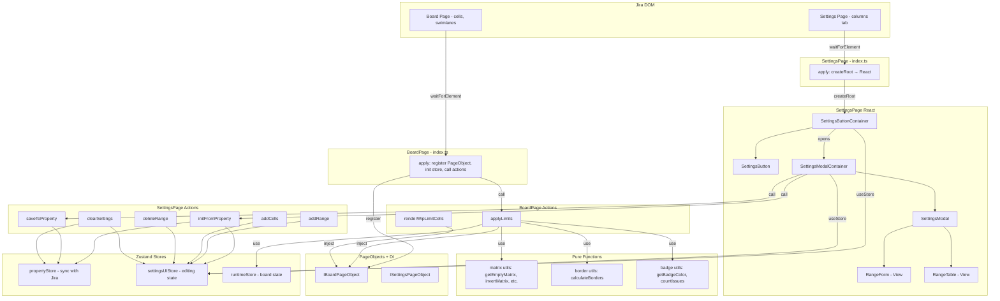
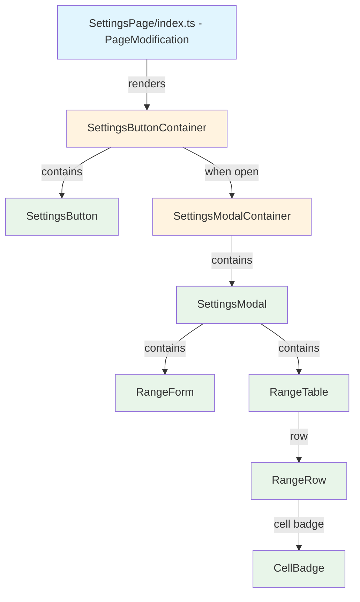

# Target Design: wiplimit-on-cells Refactoring

Этот документ описывает целевую архитектуру для `src/wiplimit-on-cells/` — рефакторинг legacy-кода под best practices проекта.

## Текущее состояние (проблемы)

1. **Нет разделения Model/View** — вся логика в PageModification классах
2. **Прямая работа с DOM** — без PageObject, DOM-селекторы размазаны по коду
3. **Нет Zustand stores** — состояние в полях класса (`this.data`, `this.wip`)
4. **Нет Actions** — бизнес-логика внутри PageModification
5. **HTML-шаблоны как строки** — `constants.ts` и `table.ts` генерируют HTML через строковые шаблоны
6. **Нет тестов** — ни unit, ни integration, ни BDD
7. **Нет DI** — прямые зависимости между классами
8. **Дублирование типов** — `Cell`, `Range` объявлены в нескольких файлах
9. **TableRangeWipLimit** — 300 строк императивного DOM-кода для таблицы настроек

## Ключевые принципы

1. **index.ts — минимальный код**: только lifecycle PageModification + вставка React в DOM (SettingsPage) или вызов actions (BoardPage)
2. **PageObject для DOM**: вся работа с Jira DOM через PageObject + DI token
3. **Zustand stores**: Property Store (синхронизация с Jira), UI Store (редактирование в Settings), Runtime Store (состояние на Board)
4. **React для Settings UI**: таблица настроек, popup, формы — через React Container/View
5. **Pure functions для логики**: матричные вычисления, подсчёт issues, определение borders — чистые утилиты

## Architecture Diagram



## Component Hierarchy



**Легенда:**
- Голубой (`#e1f5fe`) — PageModification (не React)
- Оранжевый (`#fff3e0`) — Container (useStore, logic)
- Зеленый (`#e8f5e9`) — View (pure presentation)

## Target File Structure

```
src/wiplimit-on-cells/
├── types.ts                                    # Общие типы: Cell, Range, WipLimitSettings, BoardData
│
├── property/                                   # Property Store (синхронизация с Jira)
│   ├── store.ts                                # useWipLimitCellsPropertyStore (Zustand)
│   ├── types.ts                                # PropertyStoreState
│   └── actions/
│       ├── loadProperty.ts                     # loadWipLimitCellsProperty()
│       └── saveProperty.ts                     # saveWipLimitCellsProperty()
│
├── BoardPage/                                  # Board — отображение лимитов на доске
│   ├── index.ts                                # PageModification entry point
│   ├── stores/
│   │   ├── runtimeStore.ts                     # useWipLimitCellsRuntimeStore (Zustand)
│   │   └── types.ts                            # RuntimeStoreState
│   ├── actions/
│   │   ├── applyLimits.ts                      # applyLimits() — основная логика
│   │   └── renderWipLimitCells.ts              # renderWipLimitCells() — рендер на доске
│   ├── utils/
│   │   ├── matrix.ts                           # getEmptyMatrix, invertMatrix, arrayClone, excludeCells
│   │   ├── matrix.test.ts                      # Тесты матричных утилит
│   │   ├── borders.ts                          # calculateBorders, setBorderString
│   │   ├── borders.test.ts                     # Тесты border-логики
│   │   ├── badge.ts                            # getBadgeColor, getBadgeHtml, countIssues
│   │   └── badge.test.ts                       # Тесты badge-утилит
│   └── pageObject/
│       ├── IBoardPageObject.ts                 # Интерфейс: getCells, setCellClasses, insertBadge, etc.
│       ├── BoardPageObject.ts                  # Реализация с DOM-селекторами
│       ├── boardPageObjectToken.ts             # DI Token
│       └── index.ts                            # Экспорт + registerInDI()
│
├── SettingsPage/                               # Settings — настройка лимитов
│   ├── index.ts                                # PageModification entry point (createRoot)
│   ├── constants.ts                            # settingsJiraDOM (DOM IDs) — оставляем для PageModification
│   ├── stores/
│   │   ├── settingsUIStore.ts                  # useWipLimitCellsSettingsUIStore (Zustand)
│   │   └── types.ts                            # SettingsUIStoreState
│   ├── actions/
│   │   ├── initFromProperty.ts                 # initFromProperty()
│   │   ├── saveToProperty.ts                   # saveToProperty()
│   │   ├── addRange.ts                         # addRange()
│   │   ├── addCells.ts                         # addCells()
│   │   ├── deleteRange.ts                      # deleteRange()
│   │   ├── deleteCells.ts                      # deleteCells()
│   │   ├── changeField.ts                      # changeField()
│   │   ├── clearSettings.ts                    # clearSettings()
│   │   └── actions.test.ts                     # Тесты actions
│   ├── components/
│   │   ├── SettingsButton/
│   │   │   ├── SettingsButton.tsx              # View: кнопка "Edit Wip limits by cells"
│   │   │   ├── SettingsButtonContainer.tsx     # Container: useStore, open/close
│   │   │   └── SettingsButton.stories.tsx      # Stories
│   │   │
│   │   ├── SettingsModal/
│   │   │   ├── SettingsModal.tsx               # View: Popup wrapper
│   │   │   ├── SettingsModalContainer.tsx      # Container: useStore, save/cancel
│   │   │   └── SettingsModal.stories.tsx       # Stories
│   │   │
│   │   ├── RangeForm/
│   │   │   ├── RangeForm.tsx                   # View: форма добавления range/cell
│   │   │   └── RangeForm.stories.tsx           # Stories
│   │   │
│   │   └── RangeTable/
│   │       ├── RangeTable.tsx                  # View: таблица ranges (замена table.ts)
│   │       ├── RangeRow.tsx                    # View: строка range
│   │       ├── CellBadge.tsx                   # View: badge ячейки
│   │       └── RangeTable.stories.tsx          # Stories
│   │
│   └── WipLimitsOnCellsSettings.stories.tsx    # Обновлённые stories (если нужны общие)
│
└── styles.css                                  # CSS (вынесено из appendStyles)
```

## Component Specifications

### Shared Types (`types.ts`)

```typescript
export interface WipLimitCell {
  swimlane: string;
  column: string;
  showBadge: boolean;
}

export interface WipLimitRange {
  name: string;
  wipLimit: number;
  disable?: boolean;
  cells: WipLimitCell[];
  includedIssueTypes?: string[];
}

export interface BoardData {
  swimlanesConfig: {
    swimlanes: Array<{ id: string; name: string }>;
  };
  rapidListConfig: {
    mappedColumns: Array<{ id: string; name: string; isKanPlanColumn: boolean }>;
  };
  canEdit: boolean;
}
```

### Property Store (`property/store.ts`)

**Responsibility:** Sync WIP limit settings with Jira board property.

```typescript
interface WipLimitCellsPropertyStoreState {
  data: WipLimitRange[];
  state: 'initial' | 'loading' | 'loaded' | 'error';
  actions: {
    setData: (data: WipLimitRange[]) => void;
    setState: (state: WipLimitCellsPropertyStoreState['state']) => void;
    reset: () => void;
  };
}
```

### Runtime Store (`BoardPage/stores/runtimeStore.ts`)

**Responsibility:** Track board runtime state (CSS selector, current ranges with DOM refs).

```typescript
interface WipLimitCellsRuntimeStoreState {
  cssSelectorOfIssues: string;
  actions: {
    setCssSelectorOfIssues: (selector: string) => void;
  };
}
```

### Settings UI Store (`SettingsPage/stores/settingsUIStore.ts`)

**Responsibility:** Manage editing state for settings popup.

```typescript
interface SettingsUIStoreState {
  data: {
    ranges: WipLimitRange[];
    swimlanes: Array<{ id: string; name: string }>;
    columns: Array<{ id: string; name: string }>;
  };
  state: 'initial' | 'loaded';
  actions: {
    setRanges: (ranges: WipLimitRange[]) => void;
    setSwimlanes: (swimlanes: Array<{ id: string; name: string }>) => void;
    setColumns: (columns: Array<{ id: string; name: string }>) => void;
    addRange: (name: string) => boolean;
    deleteRange: (name: string) => void;
    addCells: (rangeName: string, cell: WipLimitCell) => void;
    deleteCells: (rangeName: string, swimlane: string, column: string) => void;
    changeField: (name: string, field: string, value: any) => void;
    reset: () => void;
  };
}
```

### Board PageObject (`BoardPage/pageObject/IBoardPageObject.ts`)

**Responsibility:** Encapsulate all board DOM operations for testability.

```typescript
export interface IWipLimitCellsBoardPageObject {
  selectors: {
    swimlane: string;
    column: string;
    cell: (swimlaneId: string, columnId: string) => string;
  };

  // Queries
  getAllCells(): Element[][];
  getCellElement(swimlaneId: string, columnId: string): Element | null;
  getIssuesInCell(cell: Element, cssSelector: string): Element[];

  // Commands
  addCellClass(cell: Element, className: string): void;
  removeCellClass(cell: Element, className: string): void;
  setCellBackgroundColor(cell: Element, color: string): void;
  insertBadge(cell: Element, html: string): void;
}
```

### SettingsButton (`SettingsPage/components/SettingsButton/SettingsButton.tsx`)

**Responsibility:** Render "Edit Wip limits by cells" button.

```typescript
interface SettingsButtonProps {
  onClick: () => void;
}
```

### SettingsButtonContainer (`SettingsPage/components/SettingsButton/SettingsButtonContainer.tsx`)

**Responsibility:** Manage modal open/close, init/save data.

```typescript
interface SettingsButtonContainerProps {
  swimlanes: Array<{ id: string; name: string }>;
  columns: Array<{ id: string; name: string }>;
}
```

### SettingsModal (`SettingsPage/components/SettingsModal/SettingsModal.tsx`)

**Responsibility:** Modal wrapper with Save/Cancel buttons.

```typescript
interface SettingsModalProps {
  title: string;
  onSave: () => void;
  onCancel: () => void;
  children: React.ReactNode;
}
```

### SettingsModalContainer (`SettingsPage/components/SettingsModal/SettingsModalContainer.tsx`)

**Responsibility:** Connect store to modal, handle save/cancel logic.

```typescript
interface SettingsModalContainerProps {
  swimlanes: Array<{ id: string; name: string }>;
  columns: Array<{ id: string; name: string }>;
  onClose: () => void;
  onSave: () => void;
}
```

### RangeForm (`SettingsPage/components/RangeForm/RangeForm.tsx`)

**Responsibility:** Form for adding range name + selecting swimlane/column.

```typescript
interface RangeFormProps {
  swimlanes: Array<{ id: string; name: string }>;
  columns: Array<{ id: string; name: string }>;
  onAddRange: (name: string) => void;
  onAddCell: (rangeName: string, cell: WipLimitCell) => void;
  existingRangeNames: string[];
}
```

### RangeTable (`SettingsPage/components/RangeTable/RangeTable.tsx`)

**Responsibility:** Render table of configured ranges (replaces `table.ts`).

```typescript
interface RangeTableProps {
  ranges: WipLimitRange[];
  onDeleteRange: (name: string) => void;
  onDeleteCell: (rangeName: string, swimlane: string, column: string) => void;
  onChangeField: (name: string, field: string, value: any) => void;
  onSelectRange: (name: string) => void;
  getNameLabel: (swimlaneId: string, columnId: string) => string;
}
```

### RangeRow (`SettingsPage/components/RangeTable/RangeRow.tsx`)

**Responsibility:** Single range row with inline editing.

```typescript
interface RangeRowProps {
  range: WipLimitRange;
  onDelete: () => void;
  onDeleteCell: (swimlane: string, column: string) => void;
  onChangeField: (field: string, value: any) => void;
  onSelect: () => void;
  getNameLabel: (swimlaneId: string, columnId: string) => string;
}
```

### CellBadge (`SettingsPage/components/RangeTable/CellBadge.tsx`)

**Responsibility:** Badge for a cell within a range row.

```typescript
interface CellBadgeProps {
  swimlane: string;
  column: string;
  showBadge: boolean;
  label: string;
  onDelete: () => void;
}
```

## Pure Utility Functions

### Matrix Utils (`BoardPage/utils/matrix.ts`)

```typescript
/** Create empty matrix filled with zeros */
export function getEmptyMatrix(rows: number, cols: number): number[][];

/** Deep clone a matrix */
export function cloneMatrix<T>(matrix: T[][]): T[][];

/** Mark cell position in matrix, return coordinates */
export function markCellInMatrix(
  cellsGrid: Element[][],
  matrix: number[][],
  targetCell: Element
): { row: number; col: number };

/** Invert matrix - fill with DOM references where marked */
export function invertMatrix(
  cellsGrid: Element[][],
  markedMatrix: number[][],
  emptyMatrix: number[][]
): any[][];
```

### Border Utils (`BoardPage/utils/borders.ts`)

```typescript
/** Calculate border string (T/B/L/R) for a cell in range matrix */
export function calculateBorders(
  row: number,
  col: number,
  matrix: number[][]
): string;
```

### Badge Utils (`BoardPage/utils/badge.ts`)

```typescript
/** Get badge background color based on issue count vs limit */
export function getBadgeColor(issueCount: number, wipLimit: number): string;

/** Generate badge HTML */
export function getBadgeHtml(issueCount: number, wipLimit: number, color: string): string;

/** Count issues in cell, optionally filtering by type */
export function countFilteredIssues(
  issues: Element[],
  includedTypes?: string[],
  shouldCountFn?: (issue: Element, types?: string[]) => boolean
): number;
```

## Migration Plan

### Phase 1: Foundation (TASK-20 — TASK-22)

Создание базовых элементов без изменения существующего кода.

1. **TASK-20: Извлечь общие типы** — создать `types.ts`
2. **TASK-21: Извлечь чистые утилиты** — `matrix.ts`, `borders.ts`, `badge.ts` + тесты
3. **TASK-22: Создать Property Store** — `property/store.ts` + actions

### Phase 2: Board Page (TASK-23 — TASK-25)

Рефакторинг Board Page с PageObject.

4. **TASK-23: Создать Board PageObject** — interface + implementation + DI token
5. **TASK-24: Создать Runtime Store** — `runtimeStore.ts`
6. **TASK-25: Рефакторинг BoardPage index.ts** — использовать stores, actions, PageObject

### Phase 3: Settings React Migration (TASK-26 — TASK-31)

Замена DOM-шаблонов на React-компоненты.

7. **TASK-26: Создать Settings UI Store** — `settingsUIStore.ts`
8. **TASK-27: Создать RangeTable React-компоненты** — замена `table.ts`
9. **TASK-28: Создать RangeForm** — замена HTML-шаблонов форм
10. **TASK-29: Создать SettingsModal** — Container + View
11. **TASK-30: Создать SettingsButton** — Container + View
12. **TASK-31: Рефакторинг SettingsPage index.ts** — createRoot → React

### Phase 4: Cleanup & Testing (TASK-32 — TASK-34)

13. **TASK-32: Удалить legacy-файлы** — `table.ts`, старые `constants.ts` шаблоны
14. **TASK-33: Создать Storybook stories** — обновить stories для React-компонентов
15. **TASK-34: Верификация** — тесты + линтер

## Benefits

1. **Testability**: чистые утилиты тестируются unit-тестами, PageObject мокается в integration
2. **Maintainability**: каждый компонент < 50 строк, чёткое разделение ответственности
3. **Storybook**: визуальное тестирование всех состояний настроек
4. **Consistency**: единые паттерны с `person-limits` и `column-limits`
5. **Debugging**: React DevTools, Zustand devtools, state inspection
6. **Reusability**: PageObject, утилиты и компоненты переиспользуемы
