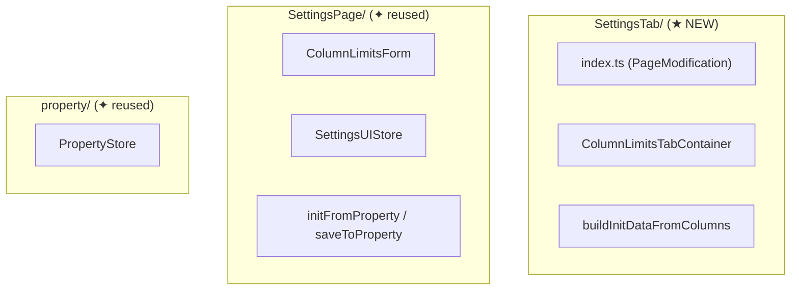

# Solution Design (Target Design)

## Назначение

Target Design — это **архитектурный blueprint**: документ, который показывает **структуру и контракты** будущего кода. Содержит Mermaid-диаграммы, TypeScript-интерфейсы (props, store state, public API), файловую структуру и план миграции.

**НЕ содержит реализацию**: тела функций, хуки, обработчики событий, JSX — всё это пишет coder на этапе реализации. Target Design описывает **что** и **какие контракты**, но не **как** реализовано.

## Обязательный контекст

**Перед созданием дизайна прочитай**: `docs/architecture_guideline.md` — **единый источник истины** по архитектуре, state management, структуре фич.

## Когда использовать

- После проектирования архитектуры (skill `architect`)
- Перед разбиением на задачи (skill `task-template`)
- При рефакторинге — чтобы зафиксировать целевое состояние

## Расположение файла

Target Design клади **в ту же папку фичи**, что и EPIC и TASK (см. `.cursor/skills/task-template/SKILL.md` — `request.md`, `requirements.md`, `EPIC-*`, `TASK-*`).

```
.agents/tasks/<FEATURE-SLUG>/target-design.md          # если один на EPIC
.agents/tasks/<FEATURE-SLUG>/target-design-[name].md   # если несколько
```

**Legacy:** старые `target-design-*.md` в корне `.agents/tasks/` не переносим без запроса; новые — только внутри `<FEATURE-SLUG>/`.

---

## Шаблон

```markdown
# Target Design: [Feature Name]

Этот документ описывает целевую архитектуру для `src/[feature]/[Page]`.

## Ключевые принципы

1. **[Принцип 1]** — [пояснение]
2. **[Принцип 2]** — [пояснение]

> Общие архитектурные принципы — см. docs/architecture_guideline.md

## Architecture Diagram

[Mermaid flowchart — по сущностям (папкам/модулям), не по слоям. Каждый subgraph = папка/модуль фичи.]

## Component Hierarchy

[Mermaid graph — дерево компонентов с легендой Container/View]

## Target File Structure

[Дерево файлов с комментариями — примеры структуры см. в docs/architecture_guideline.md]

## Component Specifications

[Для каждого компонента: Responsibility (одно предложение) + TypeScript интерфейс (props / public API). БЕЗ реализации.]

## State Changes

[Model-классы (Valtio) или Store types (Zustand) — см. docs/state-valtio.md / docs/state-zustand.md]

## Migration Plan

[Фазы миграции от текущего к целевому состоянию]

## Benefits

[Что даёт эта архитектура]
```

---

## Секции подробно

### 1. Ключевые принципы

3-5 принципов, **специфичных для данной фичи**. Не повторяй общие принципы из `docs/architecture_guideline.md` — ссылайся на них.

### 2. Architecture Diagram

Mermaid `flowchart TB` с subgraph-ами **по сущностям (папкам / модулям)**, а не по слоям.

Каждый subgraph = **папка или логический модуль** фичи. Например:



Так человек видит **какие папки затрагиваются и как связаны**, а не абстрактные слои.

Color coding (внутри subgraph-ов по роли элемента):
- Контейнеры — синие (#4169E1)
- View-компоненты — бирюзовые (#20B2AA)
- Models / Stores — фиолетовые (#9370DB)
- PageObject / Services / PageModification — оранжевые (#FFA500)

### 3. Component Hierarchy

Mermaid `graph TD` с цветовой легендой:
- Голубой (`#e1f5fe`) — PageModification (не React)
- Оранжевый (`#fff3e0`) — Container (useStore, logic)
- Зеленый (`#e8f5e9`) — View (pure presentation)

### 4. Target File Structure

Полное дерево с комментариями. Каждый файл с описанием:

```markdown
❌ ├── Button.tsx
✅ ├── Button.tsx                   # View: button UI
```

### 5. Component Specifications

Для **каждого** компонента:
1. **Responsibility** — одно предложение
2. **TypeScript интерфейс** — props, public API, типы аргументов/возврата

**Только интерфейсы и типы. НЕ пиши**:
- Тела функций / методов
- React hooks, useEffect, useState
- Обработчики событий
- JSX / рендер
- Стили

Пример — правильно:

```typescript
export type ColumnLimitsTabContainerProps = {
  getColumns: () => Column[];
  swimlanes?: Array<{ id: string; name: string }>;
};
```

Пример — **неправильно** (реализация):

```typescript
export const ColumnLimitsTabContainer: React.FC<Props> = ({ getColumns }) => {
  const [isSaving, setIsSaving] = useState(false);
  useEffect(() => { ... }, []);
  return <div>...</div>;
};
```

### 6. State Changes

Паттерны создания Model — см. `docs/state-valtio.md` (новые фичи) или `docs/state-zustand.md` (legacy).

### 7. Migration Plan

Каждая фаза:
- Ссылается на конкретные задачи (TASK-N)
- Код работает после завершения фазы
- Нет breaking changes между фазами

---

## Правила написания

1. **Только интерфейсы, не реализация** — TypeScript types/interfaces с конкретными полями; тела функций, JSX, хуки — НЕ включай
2. **Каждый компонент — с Responsibility** — одно предложение
3. **Mermaid обязателен** — минимум Architecture Diagram + Component Hierarchy
4. **Диаграмма по сущностям (папкам)** — subgraph = папка/модуль, не слой
5. **Файловая структура — полная** — каждый файл с комментарием
6. **Migration Plan реалистичен** — самодостаточные фазы

---

## Чек-лист

- [ ] Описаны ключевые принципы (3-5 шт, специфичные для фичи)
- [ ] Architecture Diagram (Mermaid flowchart с subgraphs)
- [ ] Component Hierarchy (Mermaid graph с цветовой легендой)
- [ ] Target File Structure (полное дерево с комментариями)
- [ ] Component Specifications (Responsibility + TypeScript для каждого)
- [ ] State Changes (Model classes или Store types)
- [ ] Migration Plan (фазы со ссылками на TASK-N)
- [ ] Benefits
