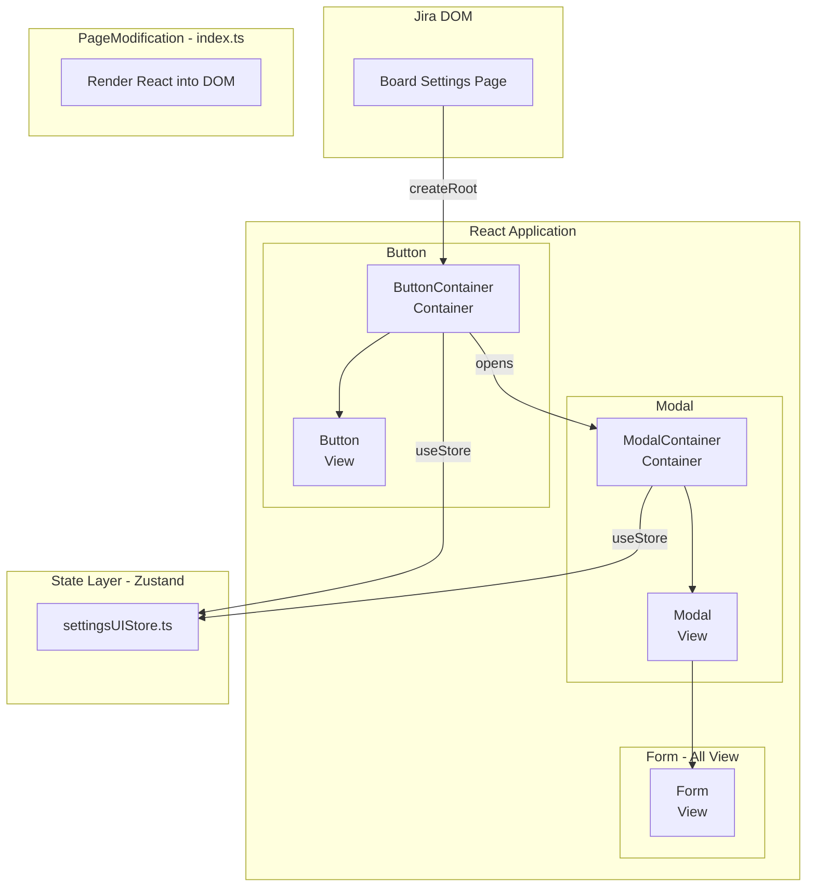
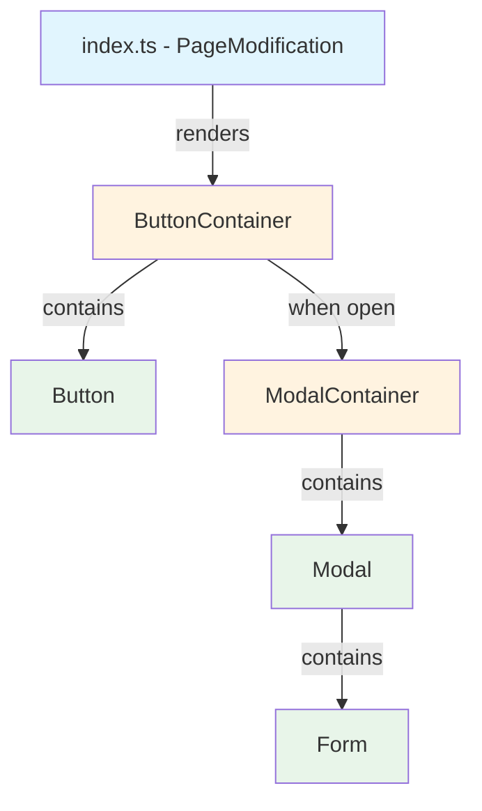

# Solution Design (Target Design)

## Назначение

Target Design — это **имплементационный blueprint**: документ, который показывает как именно будет выглядеть код после реализации. Содержит Mermaid-диаграммы, TypeScript-интерфейсы, code snippets для каждого компонента, файловую структуру и план миграции.

## Когда использовать

- После проектирования архитектуры (skill `architect`)
- Перед разбиением на задачи (skill `task-template`)
- При рефакторинге — чтобы зафиксировать целевое состояние
- Когда нужно согласовать с командой как будет выглядеть код

## Расположение файла

```
tasks/target-design.md          # если один на EPIC
tasks/target-design-[name].md   # если несколько
```

---

## Шаблон

```markdown
# Target Design: [Feature Name]

Этот документ описывает целевую архитектуру для `src/[feature]/[Page]`.

## Ключевые принципы

1. **[Принцип 1]** — [пояснение]
2. **[Принцип 2]** — [пояснение]
3. **[Принцип 3]** — [пояснение]

## Architecture Diagram

[Mermaid flowchart — полная архитектура: DOM → React → Store → Actions]

## Component Hierarchy

[Mermaid graph — дерево компонентов с легендой Container/View]

## Target File Structure

[Дерево файлов с комментариями к каждому файлу]

## Component Specifications

[Для каждого компонента: Responsibility + TypeScript код (props)]

## Store Changes

[Изменения в типах и actions store]

## Migration Plan

[Фазы миграции от текущего к целевому состоянию]

## Benefits

[Что даёт эта архитектура]
```

---

## Секции подробно

### 1. Ключевые принципы

3-5 принципов, специфичных для данной фичи. Не повторяй общие архитектурные принципы из `architect/SKILL.md` — описывай решения для конкретной задачи.

```markdown
## Ключевые принципы

1. **index.ts** — минимальный код: только вставка React-кнопки в DOM
2. **Все остальное живет в React** — модалка, форма, все UI
3. **Кнопка** = Container + View (2 компонента)
4. **Все остальные компоненты** = чистые View (Presentation)
5. **Storybook** — все состояния модалки и кнопки
```

### 2. Architecture Diagram

Mermaid `flowchart TB` с subgraph-ами по слоям. Обязательные слои:

- **Jira DOM** — точка входа (если есть)
- **PageModification** — index.ts (если есть)
- **JS-классы** - есть есть
- **React Application** — компоненты (Container → View)
- **State Layer** — Zustand stores
- **Actions Layer** — бизнес-логика



### 3. Component Hierarchy

Mermaid `graph TD` с цветовой легендой:



**Легенда:**
- Голубой (`#e1f5fe`) — PageModification (не React)
- Оранжевый (`#fff3e0`) — Container (useStore, logic)
- Зеленый (`#e8f5e9`) — View (pure presentation)

### 4. Target File Structure

Полное дерево с комментариями. Группируй по доменным областям:

```markdown
src/[feature]/SettingsPage/
├── index.ts                           # PageModification: ONLY renders React into DOM
│
├── components/
│   ├── Button/
│   │   ├── ButtonContainer.tsx          # Container: useStore, handles open/close
│   │   ├── Button.tsx                   # View: button UI
│   │   ├── Button.module.css
│   │   └── Button.stories.tsx           # Stories: default, hover, disabled
│   │
│   └── Modal/
│       ├── ModalContainer.tsx           # Container: useStore, onSave, onCancel
│       ├── Modal.tsx                    # View: modal wrapper
│       ├── Modal.module.css
│       └── Modal.stories.tsx            # Stories: empty, with data, saving
│
├── stores/
│   ├── settingsUIStore.ts
│   ├── settingsUIStore.types.ts
│   └── settingsUIStore.test.ts
│
├── actions/
│   ├── index.ts
│   ├── saveToProperty.ts
│   └── saveToProperty.test.ts
│
├── settings-page.feature
└── SettingsPage.cy.tsx
```

### 5. Component Specifications

Для **каждого** компонента указывай:
1. **Responsibility** — одно предложение
2. **Props type** — полный TypeScript интерфейс

#### Container-компоненты

```typescript
type ButtonContainerProps = {
  getColumns: () => NodeListOf<Element>;
};
```

#### View-компоненты

```typescript
type ButtonProps = {
  onClick: () => void;
  disabled?: boolean;
};
```

### 7. Store Changes

Покажи изменения в типах store:

```typescript
type SettingsUIData = {
  // Existing
  items: Item[];
  
  // New (если добавляем)
  selectedIds: number[];
};
```

### 8. Migration Plan

Фазы от текущего состояния к целевому. Каждая фаза — самодостаточна (код работает после каждой фазы):

```markdown
## Migration Plan

1. **Phase 1: Quick Fix** (TASK-2, TASK-3)
   - Минимальное исправление без рефакторинга

2. **Phase 2: New Components** (TASK-7)
   - Создать Button (View) + Container
   - Создать Modal (View) + Container
   - Storybook для всех

3. **Phase 3: Refactor entry point** (TASK-8)
   - Заменить DOM-манипуляции на React
   - Удалить htmlTemplates.ts

4. **Phase 4: Tests** (TASK-9)
   - Cypress BDD tests
   - Store tests
```

### 9. Benefits

Краткий список преимуществ целевой архитектуры:

```markdown
## Benefits

1. **Testability**: View-компоненты тестируются в изоляции
2. **Storybook**: Визуальное тестирование всех состояний
3. **Maintainability**: Чёткое разделение ответственности
4. **Reusability**: Компоненты переиспользуемы
5. **Debugging**: React DevTools работают полноценно
```

---

## Правила написания

### 1. Код конкретен, не абстрактен

```markdown
❌ "Компонент получает данные из store"
✅ показать TypeScript код с конкретными props и useStore
```

### 2. Каждый компонент — с Responsibility

```markdown
❌ Просто код без контекста
✅ **Responsibility:** Manage modal open/close state, initialize data
```

### 3. Mermaid обязателен

Минимум две диаграммы:
- Architecture Diagram (flowchart с subgraph по слоям)
- Component Hierarchy (graph с цветовой легендой)

### 4. Файловая структура — полная

Каждый файл с комментарием что это:

```markdown
❌ ├── Button.tsx
✅ ├── Button.tsx                   # View: button UI
```

### 5. Migration Plan реалистичен

Каждая фаза:
- Ссылается на конкретные задачи (TASK-N)
- Код работает после завершения фазы
- Нет breaking changes между фазами

---

## Чек-лист

- [ ] Описаны ключевые принципы (3-5 шт)
- [ ] Architecture Diagram (Mermaid flowchart с subgraphs)
- [ ] Component Hierarchy (Mermaid graph с цветовой легендой)
- [ ] Target File Structure (полное дерево с комментариями)
- [ ] Component Specifications для каждого компонента (Responsibility + TypeScript)
- [ ] Props type для каждого компонента
- [ ] Store changes (если есть)
- [ ] Migration Plan (фазы со ссылками на TASK-N)
- [ ] Benefits

