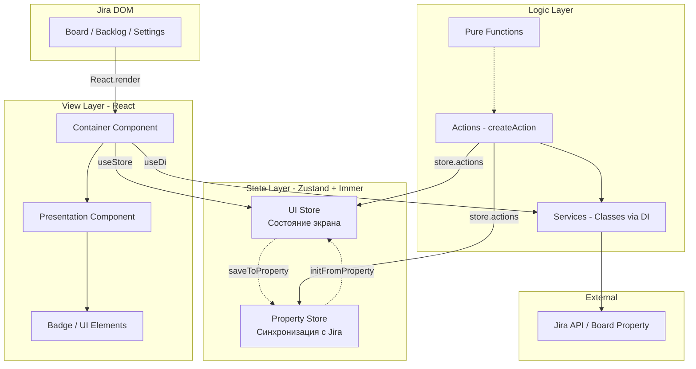

# Архитектура jira-helper

Этот документ описывает архитектурные принципы расширения jira-helper.
Предназначен для разработчиков и AI-ассистентов.

## Обзор



---

## Принцип 1: React — только View

**React отвечает ТОЛЬКО за отображение.** Вся логика — в стейте и экшенах.

### Правила

1. **Container-компоненты**:
   - Подписываются на store через `useStore()`
   - Передают данные в Presentation-компоненты
   - Не содержат бизнес-логики

2. **Presentation-компоненты**:
   - Чистые функции: `(props) => JSX`
   - Не знают о сторе
   - Легко тестируются и показываются в Storybook

3. **Локальный стейт** — только для UI:
   - Показать/скрыть dropdown
   - Hover-состояние
   - НЕ для данных, которые надо сохранять

### Пример структуры

```
Feature/
├── FeatureContainer.tsx      # Подписка на store, DI
├── FeatureComponent.tsx      # Presentation (props only)
├── FeatureItem.tsx           # Маленькие UI-блоки
└── Badge/
    ├── Badge.tsx             # Чистый компонент
    ├── Badge.module.css
    └── Badge.stories.tsx     # Storybook
```

### Плохо vs Хорошо

```tsx
// ❌ ПЛОХО: логика в компоненте
const MyComponent = () => {
  const [data, setData] = useState([]);
  
  const handleSave = async () => {
    await fetch('/api/save', { body: JSON.stringify(data) });
    setData([]);
  };
  
  return <button onClick={handleSave}>Save</button>;
};

// ✅ ХОРОШО: логика в store/actions
const MyComponent = () => {
  const { data, actions } = useMyStore();
  
  const handleSave = () => {
    actions.save(); // Action делает fetch и обновляет store
  };
  
  return <button onClick={handleSave}>Save</button>;
};
```

---

## Принцип 2: Разделение Stores

**Разные stores для разных задач снижают зацепление (coupling).**

### Когда создавать отдельные stores

| Store | Назначение | Пример |
|-------|------------|--------|
| **Property Store** | Синхронизация с Jira Board Property | `usePersonWipLimitsPropertyStore` |
| **UI Store** | Состояние экрана настроек (формы, выбор, редактирование) | `useSettingsUIStore` |
| **Application Store** | Runtime-состояние при работе фичи на доске | `useFeatureRuntimeStore` |

### Пример: Person Limits

```
person-limits/
├── property/
│   ├── store.ts              # Property Store - данные из Jira
│   ├── types.ts              # PersonLimit, PersonWipLimitsProperty
│   └── actions/
│       ├── loadProperty.ts   # Загрузка из Jira
│       └── saveProperty.ts   # Сохранение в Jira
│
└── SettingsPage/
    └── stores/
        └── settingsUIStore.ts  # UI Store - editingId, formData, checkedIds
```

### Property Store (простой, только данные)

```typescript
// property/store.ts
export const usePersonWipLimitsPropertyStore = create<State>()(set => ({
  data: { limits: [] },
  state: 'initial',
  actions: {
    setData: data => set(produce(s => { s.data = data; })),
    setState: state => set({ state }),
    setLimits: limits => set(produce(s => { s.data.limits = limits; })),
    reset: () => set({ data: { limits: [] }, state: 'initial' }),
  },
}));
```

### UI Store (сложный, UI-специфичный)

```typescript
// SettingsPage/stores/settingsUIStore.ts
type SettingsUIData = {
  limits: PersonLimit[];      // Копия для редактирования
  checkedIds: number[];       // Выбранные чекбоксами
  editingId: number | null;   // Какой редактируем
  formData: FormData | null;  // Данные формы
};

export const useSettingsUIStore = create<State>()(set => ({
  data: initialData,
  state: 'initial',
  actions: {
    // UI-специфичные actions
    setEditingId: id => set(produce(s => { /* ... */ })),
    toggleChecked: id => set(produce(s => { /* ... */ })),
    setFormData: formData => set(produce(s => { /* ... */ })),
    applyColumnsToSelected: columns => set(produce(s => { /* ... */ })),
    // ...
  },
}));
```

### Связь между stores (через actions)

```typescript
// actions/initFromProperty.ts
export const initFromProperty = () => {
  const propertyData = usePersonWipLimitsPropertyStore.getState().data;
  useSettingsUIStore.getState().actions.setData(propertyData.limits);
};

// actions/saveToProperty.ts
export const saveToProperty = async () => {
  const uiLimits = useSettingsUIStore.getState().data.limits;
  usePersonWipLimitsPropertyStore.getState().actions.setLimits(uiLimits);
  await savePersonWipLimitsProperty();
};
```

### Правило

> Если данные имеют разный жизненный цикл — это разные stores.
> - Property Store живёт пока открыта доска
> - UI Store живёт пока открыто модальное окно настроек
> - Runtime Store живёт пока фича активна на странице

---

## Принцип 3: Zustand + Immer для State

**Структура store стандартизирована.**

### Структура Store

```typescript
// stores/myFeature.types.ts
export type State = {
  data: MyData;
  state: 'initial' | 'loading' | 'loaded';
  actions: {
    setData: (data: MyData) => void;
    setState: (state: State['state']) => void;
    // ... другие actions
  };
};

// stores/myFeature.ts
import { create } from 'zustand';
import { produce } from 'immer';

const initialData: MyData = { /* defaults */ };

export const useMyStore = create<State>()(set => ({
  data: initialData,
  state: 'initial',
  actions: {
    setData: data => set({ data }),
    setState: state => set({ state }),
    
    updateField: (field, value) => set(
      produce(state => {
        state.data[field] = value;
      })
    ),
  },
}));

// Для тестов
useMyStore.getInitialState = () => ({
  data: initialData,
  state: 'initial',
  actions: useMyStore.getState().actions,
});
```

### Правила

1. **`data`** — бизнес-данные (то, что сохраняется)
2. **`state`** — состояние загрузки
3. **`actions`** — объект с методами (не отдельные функции)
4. **`getInitialState()`** — для сброса в тестах
5. **Immer `produce()`** — для вложенных обновлений

---

## Принцип 4: Интерфейсы как документация

**Типы и интерфейсы — это документация для людей и AI.**

### Правила

1. **Отдельный файл `types.ts`** для доменных типов
2. **Отдельный файл `interface.ts`** (или `*.types.ts`) для store state
3. **JSDoc комментарии** с примерами использования
4. **Конвенции в комментариях** (например, `[] = all`)

### Пример: types.ts

```typescript
/**
 * PersonLimit - один лимит для конкретного человека.
 * Хранится в Jira Board Property.
 *
 * Special convention for "all" columns/swimlanes:
 * - columns: empty array [] means "all columns"
 * - swimlanes: empty array [] means "all swimlanes"
 */
export type PersonLimit = {
  id: number;
  person: {
    name: string;
    displayName: string;
    self: string;
    avatar: string;
  };
  limit: number;
  columns: Array<{ id: string; name: string }>;
  swimlanes: Array<{ id: string; name: string }>;
  includedIssueTypes?: string[];  // undefined = все типы
};
```

### Пример: interface.ts (store docs)

```typescript
/**
 * @module PersonWipLimitsPropertyStore
 *
 * Стор для хранения PersonWipLimits property.
 *
 * ## Использование
 *
 * ### Загрузка данных
 * ```ts
 * await loadPersonWipLimitsProperty();
 * const limits = usePersonWipLimitsPropertyStore.getState().data.limits;
 * ```
 *
 * ### Сохранение данных
 * ```ts
 * const { setLimits } = usePersonWipLimitsPropertyStore.getState().actions;
 * setLimits(newLimits);
 * await savePersonWipLimitsProperty();
 * ```
 */
export interface PersonWipLimitsPropertyStoreState {
  /** Данные property */
  data: PersonWipLimitsProperty;

  /** Состояние загрузки */
  state: 'initial' | 'loading' | 'loaded';

  actions: {
    /** Установить данные (обычно после загрузки) */
    setData: (data: PersonWipLimitsProperty) => void;
    // ...
  };
}
```

---

## Принцип 5: Pure Functions и Classes

**Всё, что не React и не State — это либо чистые функции, либо классы через DI.**

### Чистые функции

Используй для:
- Трансформации данных
- Валидации
- Вычислений
- Утилит

```typescript
// utils/transformFormData.ts
export function transformFormData({
  selectedColumnIds,
  columns,
}: {
  selectedColumnIds: string[];
  columns: Column[];
}): Array<{ id: string; name: string }> {
  return selectedColumnIds
    .map(id => {
      const column = columns.find(col => String(col.id) === String(id));
      return column ? { id: String(column.id), name: column.name } : null;
    })
    .filter((col): col is { id: string; name: string } => col !== null);
}
```

### Тесты для чистых функций

```typescript
// utils/transformFormData.test.ts
describe('transformFormData', () => {
  it('should transform column IDs to column objects', () => {
    const result = transformFormData({
      selectedColumnIds: ['col1', 'col3'],
      columns: mockColumns,
    });

    expect(result).toEqual([
      { id: 'col1', name: 'To Do' },
      { id: 'col3', name: 'Done' },
    ]);
  });
});
```

### Классы через DI

Используй для:
- Сервисов с состоянием
- Работы с внешними API
- Сложной логики, требующей инъекции зависимостей

```typescript
// services/BoardPropertyService.ts
import { token, scoped, Scope } from 'dioma';

export class BoardPropertyService {
  constructor(private boardId: string) {}

  async getBoardProperty<T>(key: string): Promise<T | undefined> {
    // ...
  }

  async setBoardProperty<T>(key: string, value: T): Promise<void> {
    // ...
  }
}

export const BoardPropertyServiceToken = token<BoardPropertyService>('BoardPropertyService');
```

### Использование в Actions

```typescript
// actions/loadMyFeature.ts
export const loadMyFeature = createAction({
  name: 'loadMyFeature',
  async handler() {
    // Получаем сервис через DI
    const boardPropertyService = this.di.inject(BoardPropertyServiceToken);
    
    const data = await boardPropertyService.getBoardProperty('my-feature');
    
    // Используем чистую функцию для трансформации
    const transformedData = transformData(data);
    
    useMyStore.getState().actions.setData(transformedData);
  },
});
```

### Использование в компонентах

```typescript
// components/MyContainer.tsx
const MyContainer = () => {
  const container = useDi();
  const boardPage = container.inject(boardPagePageObjectToken);
  
  const issueColumn = boardPage.getColumnOfIssue(issueId);
  // ...
};
```

---

## Принцип 6: Result вместо исключений (ts-results)

**Используем `Result<T, Error>` вместо throw/catch.** Это делает поток ошибок явным и типобезопасным.

### Библиотека

```typescript
import { Ok, Err, Result } from 'ts-results';
```

### Почему Result лучше throw

| throw/catch | Result |
|-------------|--------|
| Ошибка неявная — не видно в типе | Ошибка явная — `Result<T, Error>` |
| Легко забыть обработать | Компилятор заставляет проверить `.err` |
| try/catch размазывает логику | Линейный код с проверками |
| Не понятно, какие функции бросают | Всегда понятно по сигнатуре |

### Базовый паттерн

```typescript
// Функция, которая может упасть
async function fetchData(id: string): Promise<Result<Data, Error>> {
  const response = await fetch(`/api/data/${id}`).then(
    r => Ok(r),
    e => Err(e)
  );

  if (response.err) {
    return Err(response.val);  // Прокидываем ошибку дальше
  }

  if (!response.val.ok) {
    return Err(new Error(`HTTP ${response.val.status}`));
  }

  const json = await response.val.json().then(
    r => Ok(r),
    e => Err(e)
  );

  if (json.err) {
    return Err(json.val);
  }

  return Ok(json.val);  // Успех
}
```

### Использование Result

```typescript
// Вызывающий код
const result = await fetchData('123');

if (result.err) {
  // Обработка ошибки
  console.error('Failed:', result.val.message);
  return;
}

// Здесь TypeScript знает, что result.val — это Data
const data = result.val;
```

### Паттерн в сервисах

```typescript
// shared/jira/jiraService.ts
export interface IJiraService {
  fetchJiraIssue: (issueId: string, signal: AbortSignal) => Promise<Result<JiraIssueMapped, Error>>;
  fetchSubtasks: (issueId: string, signal: AbortSignal) => Promise<Result<Subtasks, Error>>;
  getProjectFields: (signal: AbortSignal) => Promise<Result<JiraField[], Error>>;
}

export class JiraService implements IJiraService {
  async fetchJiraIssue(issueId: string, signal: AbortSignal): Promise<Result<JiraIssueMapped, Error>> {
    // Проверяем кеш
    const cached = this.cache.get(issueId);
    if (cached) {
      return Ok(cached);
    }

    // Запрос к API
    const apiResult = await getJiraIssue(issueId, { signal });
    if (apiResult.err) {
      return Err(apiResult.val);
    }

    // Маппинг и кеширование
    const mapped = this.mapJiraIssue(apiResult.val);
    this.cache.set(issueId, mapped);
    
    return Ok(mapped);
  }
}
```

### Паттерн в API-функциях

```typescript
// shared/jiraApi.ts
export const getJiraIssue = async (
  issueId: string, 
  options: RequestInit = {}
): Promise<Result<JiraIssue, Error>> => {
  const result = await requestJiraViaFetch(`api/2/issue/${issueId}`, options);
  
  if (result.err) {
    return Err(result.val);
  }

  const jsonResult = await result.val.json().then(
    r => Ok(r),
    e => Err(e)
  );

  if (jsonResult.err) {
    return Err(jsonResult.val);
  }

  return Ok(jsonResult.val);
};
```

### Правила

1. **Все async функции, работающие с внешним миром** — возвращают `Result<T, Error>`
2. **Проверка `if (result.err)`** — перед использованием `.val`
3. **Прокидывание ошибок** — `return Err(result.val)` вместо throw
4. **Конвертация Promise** — `.then(r => Ok(r), e => Err(e))`
5. **Не смешивать** — либо Result, либо throw, не оба

### Плохо vs Хорошо

```typescript
// ❌ ПЛОХО: throw теряется в типах
async function loadData(): Promise<Data> {
  const response = await fetch('/api');
  if (!response.ok) {
    throw new Error('Failed');  // Не видно в типе!
  }
  return response.json();
}

// ✅ ХОРОШО: Result явный
async function loadData(): Promise<Result<Data, Error>> {
  const response = await fetch('/api').then(
    r => Ok(r),
    e => Err(e)
  );
  
  if (response.err) {
    return Err(response.val);
  }
  
  if (!response.val.ok) {
    return Err(new Error('Failed'));  // Явно в типе!
  }
  
  return response.val.json().then(
    r => Ok(r),
    e => Err(e)
  );
}
```

---

## Принцип 7: Actions для бизнес-логики

**Вся логика, которая не view — в actions.**

### Структура Action

```typescript
import { createAction } from 'src/shared/action';
import { loggerToken } from 'src/shared/Logger';

export const loadMyFeature = createAction({
  name: 'loadMyFeature',
  async handler() {
    const log = this.di.inject(loggerToken).getPrefixedLog('loadMyFeature');
    const store = useMyStore.getState();
    
    if (store.state === 'loaded') return;
    
    store.actions.setState('loading');
    
    const result = await this.di.inject(JiraServiceToken)
      .fetchData('my-feature');
    
    if (result.err) {
      log(`Failed to load: ${result.val.message}`, 'error');
      store.actions.setState('initial');
      return;
    }
    
    store.actions.setData(result.val);
    store.actions.setState('loaded');
  },
});
```

### Что идёт в Actions

- Загрузка данных из Jira API
- Сохранение данных в Jira
- Координация между stores
- Вызов чистых функций и сервисов
- Обработка Result-ов

---

## Принцип 8: Тестирование

### Три уровня тестов

| Уровень | Файл | Что тестируем |
|---------|------|---------------|
| Store | `*.test.ts` | Actions, state transitions |
| Pure Functions | `*.test.ts` | Input → Output |
| Component | `*.test.tsx` | User interactions, rendering |
| Visual | `*.stories.tsx` | UI states, edge cases |

### Store тесты

```typescript
describe('MyStore', () => {
  beforeEach(() => {
    useMyStore.setState(useMyStore.getInitialState());
  });

  it('should update field', () => {
    const { actions } = useMyStore.getState();
    
    actions.updateField('name', 'test');
    
    expect(useMyStore.getState().data.name).toBe('test');
  });
});
```

### Component тесты

```typescript
describe('MyComponent', () => {
  beforeEach(() => {
    useMyStore.setState(useMyStore.getInitialState());
  });

  it('should call action on button click', async () => {
    const user = userEvent.setup();
    render(<MyComponent />);
    
    await user.click(screen.getByText('Save'));
    
    expect(useMyStore.getState().data.saved).toBe(true);
  });
});
```

### Storybook

```typescript
export const Default: Story = {
  render: () => <Badge color="blue">5</Badge>,
};

export const WithWarning: Story = {
  render: () => <Badge color="yellow">10</Badge>,
};

export const Critical: Story = {
  render: () => <Badge color="red">15</Badge>,
};
```

---

## Структура фичи

```
src/features/my-feature/
├── index.ts                    # Экспорты
├── types.ts                    # Доменные типы с JSDoc
├── README.md                   # Документация
│
├── property/                   # Property Store (если нужен)
│   ├── store.ts
│   ├── types.ts
│   └── actions/
│       ├── loadProperty.ts
│       └── saveProperty.ts
│
├── stores/                     # UI / Runtime Stores
│   ├── myFeature.types.ts
│   ├── myFeature.ts
│   └── myFeature.test.ts
│
├── actions/                    # Actions
│   ├── index.ts
│   ├── initFromProperty.ts
│   └── saveToProperty.ts
│
├── utils/                      # Pure Functions
│   ├── transformData.ts
│   └── transformData.test.ts
│
├── components/
│   ├── MyFeatureContainer.tsx
│   ├── MyFeatureSettings.tsx
│   ├── MyFeatureSettings.test.tsx
│   └── MyFeatureSettings.stories.tsx
│
├── Badge/
│   ├── Badge.tsx
│   ├── Badge.module.css
│   └── Badge.stories.tsx
│
├── BoardPage.ts
└── SettingsPage.tsx
```

---

## Чеклист для новой фичи

- [ ] Создать `types.ts` с JSDoc для всех типов
- [ ] Определить, нужны ли отдельные stores (property / UI / runtime)
- [ ] Создать stores с `data`, `state`, `actions`, `getInitialState()`
- [ ] Написать тесты на stores (`*.test.ts`)
- [ ] Вынести логику в чистые функции (`utils/`)
- [ ] Написать тесты на чистые функции
- [ ] Создать Container + Presentation компоненты
- [ ] Написать тесты на компоненты (`*.test.tsx`)
- [ ] Создать Storybook stories (`*.stories.tsx`)
- [ ] Создать actions для загрузки/сохранения и координации
- [ ] Интегрировать с BoardPage/SettingsPage
