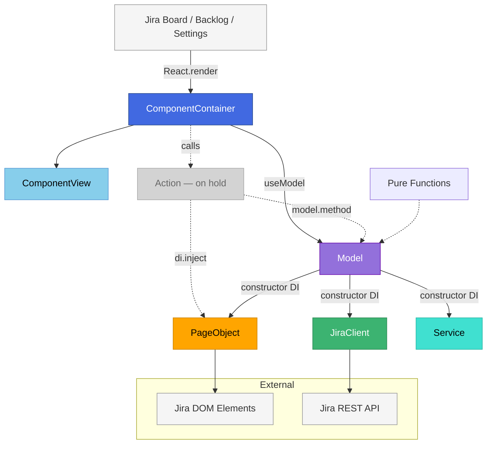
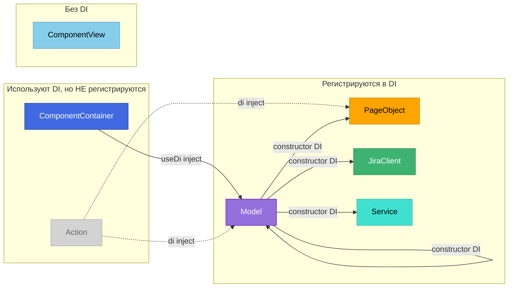
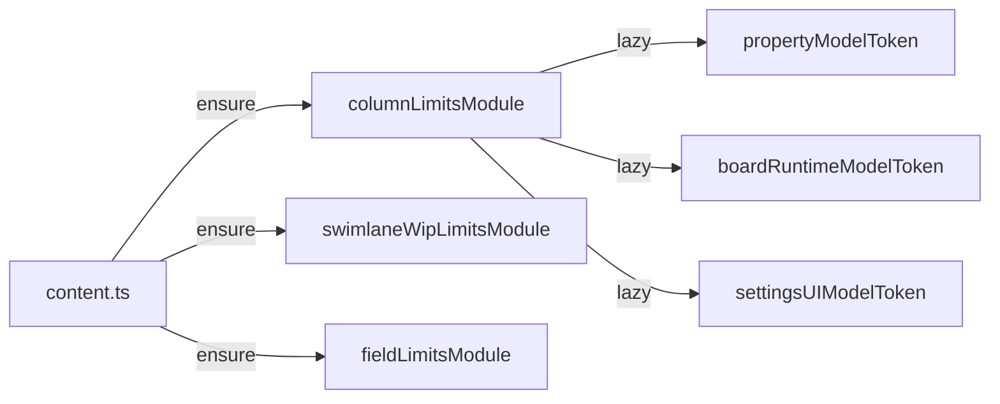

# Архитектура jira-helper

Этот документ описывает архитектурные принципы расширения jira-helper.
Предназначен для разработчиков и AI-ассистентов.

## Обзор



---

## Сущности

| # | Сущность | Цвет | Ответственность | Тестирование | DI |
|---|----------|------|-----------------|--------------|-----|
| 1 | **ComponentView** | 🔵 голубой | `(props) => JSX`. Не знает о state | Storybook | Нет |
| 2 | **ComponentContainer** | 🔷 синий | Подписка на Model, вызов методов. Без логики | Component tests (`.cy.tsx`) | Использует |
| 3 | **Action** | ⬜ на холде | Координация Models и сервисов | — | Использует |
| 4 | **Model** | 🟣 фиолетовый | State + логика. Единственный владелец данных | Unit tests (`.test.ts`) | Регистрируется |
| 5 | **PageObject** | 🟠 оранжевый | Работа с DOM. **Монополия на DOM** | Unit tests (`.test.ts`) | Регистрируется |
| 6 | **JiraClient** | 🟢 зелёный | Работа с Jira API. **Монополия на Jira** | Unit tests (`.test.ts`) | Регистрируется |
| 7 | **Service** | 🩵 бирюзовый | Прочие DI-сущности с side effects или состоянием (Logger, BoardPropertyService и т.д.) | Unit tests (`.test.ts`) | Регистрируется |

> **Монополия** — только эта сущность имеет право работать с указанным ресурсом. Никакой другой код не может обращаться к DOM напрямую (только через PageObject) или к Jira API (только через JiraClient).
>
> **Action на холде** — новые Action не создаём. Существующие работают, но для новых фич координация идёт через методы Model.

### Связи с DI



---

## Структура проекта

```
src/
├── features/              # Все фичи (модули и legacy)
│   ├── column-limits/    # Модуль (module.ts + tokens.ts)
│   ├── person-limits/   # Модуль
│   ├── field-limits/    # Модуль
│   ├── swimlane-wip-limits/
│   ├── swimlane-histogram/
│   ├── card-colors/      # Legacy (PageModification, без module.ts)
│   ├── board-settings/
│   └── ...
│
├── shared/               # Общий код без DI — прямой import
│   ├── di/              # DI tokens, Module base
│   ├── jira/            # JiraClient
│   ├── components/      # Общие React-компоненты
│   ├── utils/           # Чистые функции
│   └── types/           # Общие типы
│
├── page-objects/         # Общие PageObjects (DI)
├── routing/             # Роутинг
├── background/           # Service worker
├── content.ts           # Entry point, DI bootstrap
└── docs/
```

### Правила расположения

| Папка | Тип | Правило |
|-------|-----|---------|
| `features/*` | Модули и legacy | Всё что относится к фиче |
| `shared/*` | Немодули | Чистые функции, типы, общие компоненты — без DI, import напрямую |
| `page-objects/*` | Модули | PageObjects используются несколькими фичами |

### Модуль vs Не модуль

**Модуль** — фича с `module.ts` + `tokens.ts`, регистрируется через `Module.ensure(container)`:
- column-limits, person-limits, field-limits, swimlane-wip-limits, swimlane-histogram

**Не модуль** — legacy фичи, регистрируются напрямую через `container.register()`:
- card-colors, board-settings, wiplimit-on-cells, charts, bug-template, issue, blur-for-sensitive, related-tasks

**Правило:** новые фичи = модули. Legacy могут жить как есть.

---

## Модули (Module)

Каждая фича собирается в **Module** — класс, наследующий `Module` из `src/shared/di/Module.ts`. Модуль группирует DI-регистрации фичи и регистрируется централизованно в `content.ts`.



### Структура модуля

```typescript
// tokens.ts — токены фичи
import { createModelToken } from 'src/shared/di/Module';
export const myModelToken = createModelToken<MyModel>('feature/myModel');

// module.ts — класс Module
import { Module, modelEntry } from 'src/shared/di/Module';

class MyFeatureModule extends Module {
  register(container: Container): void {
    this.lazy(container, myModelToken, c =>
      modelEntry(new MyModel(c.inject(loggerToken))),
    );
  }
}
export const myFeatureModule = new MyFeatureModule();

// content.ts — централизованная регистрация
myFeatureModule.ensure(container);
```

### Ключевые свойства

| Свойство | Описание |
|---|---|
| **Ленивость** | `lazy()` — factory вызывается при первом `inject()`, не при регистрации |
| **Идемпотентность** | `ensure()` — безопасно вызывать повторно, повторные вызовы игнорируются |
| **Централизация** | Модули регистрируются в `content.ts`, PageModification просто делают `inject()` |
| **Универсальность** | `lazy()` работает для любого `Token<T>`, не только для моделей |

### Хелперы

- `modelEntry(instance)` — оборачивает в `proxy()` + создаёт `{ model, useModel: () => useSnapshot(model) }`
- `createModelToken<T>(name)` — создаёт `Token<ModelEntry<T>>`
- `Module.lazy(container, token, factory)` — ленивая singleton-регистрация для любого токена

---

## State Management: Valtio vs Zustand

| | **Valtio (новые фичи)** | **Zustand (legacy, на холде)** |
|---|---|---|
| **Статус** | Рекомендуется | На холде |
| **Паттерн** | Model-классы | Stores с actions |
| **Мутации** | Прямые (`this.field = x`) | Через `set()` + `produce()` |
| **React** | `useSnapshot(model)` | `useStore(selector)` |
| **DI** | Constructor injection | `this.di.inject()` в actions |

**Правило**: Все новые Models делать через **Valtio**. Существующий Zustand код работает, но не расширяется.

**Best practices:**
- Valtio — `docs/state-valtio.md`
- Zustand — `docs/state-zustand.md`

---

## Принцип 1: React — только View

**React отвечает ТОЛЬКО за отображение.** Вся логика — в Models и Actions.

### ComponentView

Чистые функции: `(props) => JSX`. Не знают о state. Легко тестируются в Storybook.

### ComponentContainer

- Получает Models из DI через `useDi().inject(token)`
- Подписывается на state через `useModel()` (Valtio) или `useStore()` (Zustand)
- Передаёт данные в ComponentView
- Вызывает Actions или методы Models
- НЕ содержит бизнес-логики

### Локальный стейт — только для UI

- Показать/скрыть dropdown
- Hover-состояние
- НЕ для данных, которые надо сохранять

### Плохо vs Хорошо

```tsx
// ❌ ПЛОХО: логика в компоненте
const MyComponent = () => {
  const [data, setData] = useState([]);
  
  const handleSave = async () => {
    await fetch('/api/save', { body: JSON.stringify(data) });
    setData([]);
  };
  
  return <button onClick={handleSave}>Save</button>;
};

// ✅ ХОРОШО: логика в model
const MyContainer = () => {
  const { useModel } = useDi().inject(myModelToken);
  const model = useModel();
  
  return <button onClick={() => model.save()}>Save</button>;
};
```

---

## Принцип 2: Декомпозиция моделей

**Model — это сущность, хранящая данные и логику.** Модели можно и нужно декомпозировать по жизненному циклу данных.

### Популярные паттерны декомпозиции

| Model | Назначение | Жизненный цикл |
|-------|------------|----------------|
| **Property Model** | Синхронизация с Jira Board Property | Пока открыта доска |
| **Settings/UI Model** | Состояние экрана настроек (формы, выбор, редактирование) | Пока открыто модальное окно |
| **Runtime Model** | Состояние фичи на доске (подсчёты, подсветка) | Пока фича активна на странице |

### Правило

> **Разный жизненный цикл данных = разные модели.**

### Координация моделей через DI

Модели могут использовать друг друга — в идеале через constructor DI:

```typescript
export class SettingsUIModel {
  items: Item[] = [];

  constructor(
    private propertyModel: PropertyModel,  // DI
    private logger: Logger                 // DI
  ) {}

  initFromProperty(): void {
    this.items = [...this.propertyModel.data.items];
  }

  async save(): Promise<Result<void, Error>> {
    this.propertyModel.setItems(this.items);
    return this.propertyModel.persist();
  }
}
```

```
PropertyModel ←─constructor─→ SettingsUIModel ←─constructor─→ RuntimeModel
```

### Container получает модели из DI

Container-компоненты достают модели из DI через хуки. Модели обеспечивают реактивность данных:

```typescript
// Valtio — useModel() внутри оборачивает useSnapshot()
const { useModel } = useDi().inject(settingsModelToken);
const model = useModel();  // реактивная подписка

// Zustand — useStore()
const data = useSettingsStore(s => s.data);  // реактивная подписка
```

### Пример декомпозиции: Person Limits

```
person-limits/
├── property/
│   └── PropertyModel.ts         # Данные из Jira Board Property
│
├── SettingsPage/
│   └── models/
│       └── SettingsUIModel.ts   # Состояние модалки настроек
│
└── BoardPage/
    └── models/
        └── RuntimeModel.ts      # Подсчёт лимитов в реальном времени
```

---

## Принцип 3: Интерфейсы как документация

**Типы и интерфейсы — это документация для людей и AI.**

### Правила

1. **Отдельный файл `types.ts`** для доменных типов
2. **JSDoc комментарии** с примерами использования
3. **Конвенции в комментариях** (например, `[] = all`)

### Пример: types.ts

```typescript
/**
 * PersonLimit - один лимит для конкретного человека.
 * Хранится в Jira Board Property.
 *
 * Special convention for "all" columns/swimlanes:
 * - columns: empty array [] means "all columns"
 * - swimlanes: empty array [] means "all swimlanes"
 */
export type PersonLimit = {
  id: number;
  person: {
    name: string;
    displayName: string;
    self: string;
  };
  limit: number;
  columns: Array<{ id: string; name: string }>;
  swimlanes: Array<{ id: string; name: string }>;
  includedIssueTypes?: string[];  // undefined = все типы
};
```

### Пример: JSDoc для Model

```typescript
/**
 * @module SettingsUIModel
 *
 * Модель для состояния страницы настроек PersonLimits.
 *
 * ## Использование
 *
 * ```ts
 * const { useModel } = useDi().inject(settingsUIModelToken);
 * const model = useModel();
 * model.setEditingId(123);
 * ```
 */
```

---

## Принцип 4: Прямой импорт vs DI

**Чистые функции без side effects — прямой import. Всё остальное — через DI-токен.**

### Прямой import — чистые функции

Функции без side effects можно импортировать и использовать напрямую. Это нормально — они детерминированы, легко тестируются, не требуют подмены.

```typescript
// utils/transformFormData.ts — чистая функция, прямой import
import { transformFormData } from '../utils/transformFormData';

const result = transformFormData({
  selectedColumnIds: ['col1', 'col3'],
  columns: mockColumns,
});
```

Подходит для: трансформации данных, валидации, вычислений, форматирования.

### DI-токен — всё с side effects или состоянием

Любая сущность, которая имеет side effects, состояние, или зависит от внешнего мира — регистрируется как DI-токен. Это обеспечивает подменяемость в тестах и слабое зацепление.

```typescript
import { token } from 'dioma';

export class BoardPropertyService {
  constructor(private boardId: string) {}

  async getBoardProperty<T>(key: string): Promise<T | undefined> { /* ... */ }
  async setBoardProperty<T>(key: string, value: T): Promise<void> { /* ... */ }
}

export const BoardPropertyServiceToken = token<BoardPropertyService>('BoardPropertyService');
```

Подходит для: Model, PageObject, JiraClient, Service — всё, что делает I/O, работает с DOM, или хранит state.

### Как отличить

| Признак | Прямой import | DI-токен |
|---------|--------------|----------|
| Side effects (I/O, DOM, fetch) | Нет | Да |
| Состояние | Нет | Да |
| Нужно мокировать в тестах | Нет | Да |
| Зависит от внешнего мира | Нет | Да |

```typescript
// ✅ Прямой import — чистая функция
import { transformData } from '../utils/transformData';

// ✅ DI-токен — side effects (API)
const service = this.di.inject(BoardPropertyServiceToken);

// ✅ DI-токен — side effects (DOM)
const pageObject = container.inject(boardPagePageObjectToken);

// ❌ ПЛОХО — сервис с side effects через прямой import
import { boardPropertyService } from '../services/boardPropertyService';
```

---

## Принцип 5: Result вместо исключений (ts-results)

**Используем `Result<T, Error>` вместо throw/catch.** Это делает поток ошибок явным и типобезопасным.

### Библиотека

```typescript
import { Ok, Err, Result } from 'ts-results';
```

### Почему Result лучше throw

| throw/catch | Result |
|-------------|--------|
| Ошибка неявная — не видно в типе | Ошибка явная — `Result<T, Error>` |
| Легко забыть обработать | Компилятор заставляет проверить `.err` |
| try/catch размазывает логику | Линейный код с проверками |
| Не понятно, какие функции бросают | Всегда понятно по сигнатуре |

### Базовый паттерн

```typescript
async function fetchData(id: string): Promise<Result<Data, Error>> {
  const response = await fetch(`/api/data/${id}`).then(
    r => Ok(r),
    e => Err(e)
  );

  if (response.err) {
    return Err(response.val);
  }

  if (!response.val.ok) {
    return Err(new Error(`HTTP ${response.val.status}`));
  }

  const json = await response.val.json().then(
    r => Ok(r),
    e => Err(e)
  );

  if (json.err) {
    return Err(json.val);
  }

  return Ok(json.val);
}
```

### Использование Result

```typescript
const result = await fetchData('123');

if (result.err) {
  console.error('Failed:', result.val.message);
  return;
}

const data = result.val;
```

### Паттерн в сервисах

```typescript
export interface IJiraService {
  fetchJiraIssue: (issueId: string, signal: AbortSignal) => Promise<Result<JiraIssueMapped, Error>>;
  fetchSubtasks: (issueId: string, signal: AbortSignal) => Promise<Result<Subtasks, Error>>;
}

export class JiraService implements IJiraService {
  async fetchJiraIssue(issueId: string, signal: AbortSignal): Promise<Result<JiraIssueMapped, Error>> {
    const cached = this.cache.get(issueId);
    if (cached) return Ok(cached);

    const apiResult = await getJiraIssue(issueId, { signal });
    if (apiResult.err) return Err(apiResult.val);

    const mapped = this.mapJiraIssue(apiResult.val);
    this.cache.set(issueId, mapped);
    return Ok(mapped);
  }
}
```

### Правила

1. **Все async функции, работающие с внешним миром** — возвращают `Result<T, Error>`
2. **Проверка `if (result.err)`** — перед использованием `.val`
3. **Прокидывание ошибок** — `return Err(result.val)` вместо throw
4. **Конвертация Promise** — `.then(r => Ok(r), e => Err(e))`
5. **Не смешивать** — либо Result, либо throw, не оба

---

## Принцип 6: Тестирование

### Тестовая стратегия по сущностям

| Сущность | Файл | Что тестируем | Инструмент |
|----------|------|---------------|------------|
| 🟣 **Model** | `*.test.ts` | Methods, state transitions | Vitest |
| 🟠 **PageObject** | `*.test.ts` | DOM queries/commands | Vitest |
| 🟢 **JiraClient** | `*.test.ts` | API calls, mapping, error handling | Vitest |
| 🩵 **Service** | `*.test.ts` | Side effects, state, integrations | Vitest |
| 🔷 **ComponentContainer** | `*.cy.tsx` | User interactions, data flow | Cypress |
| 🔵 **ComponentView** | `*.stories.tsx` | UI states, edge cases | Storybook |
| Pure Functions | `*.test.ts` | Input → Output | Vitest |

> Подробные паттерны тестирования Models и Stores — в `docs/state-valtio.md` и `docs/state-zustand.md`.

### Component тесты

```typescript
describe('MyComponent', () => {
  it('should call action on button click', () => {
    const onClick = cy.stub().as('onClick');
    cy.mount(<MyComponent onClick={onClick} />);
    cy.contains('button', 'Save').click();
    cy.get('@onClick').should('have.been.calledOnce');
  });
});
```

### Storybook

```typescript
export const Default: Story = {
  render: () => <Badge color="blue">5</Badge>,
};

export const WithWarning: Story = {
  render: () => <Badge color="yellow">10</Badge>,
};
```

---

## Структура фичи

```
src/features/my-feature/
├── index.ts                    # Экспорты
├── module.ts                   # class MyFeatureModule extends Module
├── module.test.ts              # Тесты регистрации модуля
├── tokens.ts                   # DI Tokens (createModelToken)
├── types.ts                    # Доменные типы с JSDoc
│
├── property/                   # Property Model
│   ├── PropertyModel.ts
│   └── PropertyModel.test.ts
│
├── SettingsPage/
│   ├── models/
│   │   ├── SettingsUIModel.ts
│   │   └── SettingsUIModel.test.ts
│   └── components/
│       ├── SettingsContainer.tsx    # ComponentContainer
│       ├── SettingsModal.tsx        # ComponentView
│       └── SettingsModal.stories.tsx
│
├── BoardPage/
│   ├── models/
│   │   ├── RuntimeModel.ts
│   │   └── RuntimeModel.test.ts
│   └── components/
│       ├── BoardContainer.tsx       # ComponentContainer
│       └── Badge/
│           ├── Badge.tsx            # ComponentView
│           ├── Badge.module.css
│           └── Badge.stories.tsx
│
├── utils/                      # Pure Functions
│   ├── transformData.ts
│   └── transformData.test.ts
│
├── BoardPage.ts
└── SettingsPage.tsx
```

---

## Чеклист для новой фичи

- [ ] Создать `types.ts` с JSDoc для всех типов
- [ ] Определить, нужны ли отдельные models (property / UI / runtime)
- [ ] Создать Models (см. `docs/state-valtio.md`)
- [ ] Создать `tokens.ts` с DI токенами (`createModelToken`)
- [ ] Создать `module.ts` — `class extends Module` с `lazy()` + `modelEntry()`
- [ ] Зарегистрировать модуль в `content.ts` — `myModule.ensure(container)`
- [ ] Написать тесты на Models (`*.test.ts`)
- [ ] Написать тесты на модуль (`module.test.ts`)
- [ ] Вынести логику в чистые функции (`utils/`)
- [ ] Написать тесты на чистые функции
- [ ] Создать ComponentContainer + ComponentView
- [ ] Написать тесты на компоненты (`*.cy.tsx`)
- [ ] Создать Storybook stories (`*.stories.tsx`)
- [ ] Интегрировать с BoardPage/SettingsPage

---

## Антипаттерны

- ❌ Бизнес-логика в React-компонентах
- ❌ `useState` для данных из Model
- ❌ Одна Model для property И UI (разный жизненный цикл = разные модели)
- ❌ `throw/catch` вместо `Result<T, Error>`
- ❌ Model без `reset()` метода
- ❌ Queries (getters) с side effects
- ❌ Работа с DOM не через PageObject
- ❌ Работа с Jira API не через JiraClient
- ❌ Создание нового Action (на холде)
- ❌ Создание нового Zustand store для **новой фичи** (используй Valtio)
- ❌ `registerXxxModule()` функция — используй `class extends Module`
- ❌ Регистрация модуля в PageModification — регистрируй в `content.ts`
- ❌ Прямой `useSnapshot()` / `proxy()` в `module.ts` — используй `modelEntry()`
- ✅ Расширение существующего Zustand store — OK (legacy)
