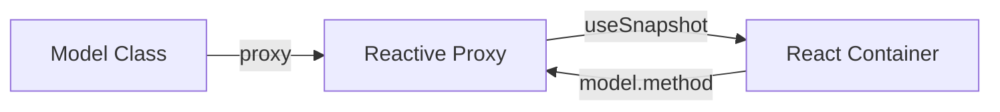

# State Management: Valtio

> Рекомендуемый подход для всех новых фич.

## Концепция

Model-класс хранит state (public поля) и логику (методы). Экземпляр оборачивается в `proxy()` для реактивности. React-компоненты подписываются через `useSnapshot()`.



---

## Структура Model

```typescript
import { Result, Ok, Err } from 'ts-results';
import type { Logger } from 'src/shared/Logger';

/**
 * @module MyFeatureModel
 * 
 * Модель для состояния фичи MyFeature.
 */
export class MyFeatureModel {
  // === State (public fields) ===
  
  data: MyData = initialData;
  state: 'initial' | 'loading' | 'loaded' = 'initial';
  error: string | null = null;

  constructor(
    private propertyModel: PropertyModel,
    private logger: Logger
  ) {}

  // === Commands (методы, меняющие state) ===

  async load(): Promise<Result<void, Error>> {
    const log = this.logger.getPrefixedLog('MyFeatureModel.load');
    
    this.state = 'loading';
    
    const result = await this.propertyModel.load();
    
    if (result.err) {
      this.error = result.val.message;
      this.state = 'initial';
      log(`Failed: ${result.val.message}`, 'error');
      return Err(result.val);
    }
    
    this.data = result.val;
    this.state = 'loaded';
    log('Loaded');
    return Ok(undefined);
  }

  setData(data: MyData): void {
    this.data = data;
  }

  reset(): void {
    this.data = initialData;
    this.state = 'initial';
    this.error = null;
  }

  // === Queries (getters, без side effects) ===

  get isEmpty(): boolean {
    return this.data.items.length === 0;
  }
}
```

### Что идёт в Model

- **State** — public поля класса (данные, статус, ошибки)
- **Commands** — методы, изменяющие state (load, save, set*, reset)
- **Queries** — getters, читающие state без side effects
- **DI** — зависимости через constructor

### Что идёт в Model методы

- Загрузка/сохранение данных (Jira API)
- Координация с другими models (через constructor DI)
- Вызов чистых функций для трансформации
- Обработка Result-ов
- Логирование через Logger

---

## Регистрация в DI (module.ts)

```typescript
import { proxy } from 'valtio';
import { useSnapshot } from 'valtio';
import { Token, Container } from 'dioma';

export const myFeatureModelToken = new Token<{
  model: MyFeatureModel;
  useModel: () => MyFeatureModel;
}>('myFeatureModel');

export function registerMyFeatureModule(container: Container): void {
  const propertyModel = container.inject(propertyModelToken).model;
  const logger = container.inject(loggerToken);

  const model = proxy(new MyFeatureModel(propertyModel, logger));

  container.register({
    token: myFeatureModelToken,
    value: {
      model,
      useModel: () => useSnapshot(model) as MyFeatureModel,
    },
  });
}
```

### Паттерн регистрации

1. `registerMyFeatureModule()` вызывается один раз при инициализации
2. Модель создаётся сразу: `proxy(new Model(deps))`
3. Регистрируется как **value** — dioma возвращает один и тот же объект при каждом `inject()`
4. Token экспортирует `{ model, useModel }` — для прямого доступа и для React

---

## Использование в React

```typescript
import { useDi } from 'src/shared/diContext';
import { myFeatureModelToken } from '../tokens';

export const MyFeatureContainer: React.FC = () => {
  const { useModel } = useDi().inject(myFeatureModelToken);
  const model = useModel();
  
  const handleClick = () => {
    model.load();
  };
  
  return (
    <MyFeatureComponent 
      data={model.data}
      isLoading={model.state === 'loading'}
      onClick={handleClick}
    />
  );
};
```

Container получает модель из DI через хук → `useModel()` обеспечивает реактивность.

---

## Координация между моделями

Модели используют друг друга через constructor DI:

```typescript
export class SettingsUIModel {
  items: Item[] = [];
  editingId: number | null = null;

  constructor(
    private propertyModel: PropertyModel,
    private logger: Logger
  ) {}

  async save(): Promise<Result<void, Error>> {
    this.propertyModel.setItems(this.items);
    return this.propertyModel.persist();
  }

  initFromProperty(): void {
    this.items = [...this.propertyModel.data.items];
  }
}
```

```
PropertyModel ←─constructor─→ SettingsUIModel ←─constructor─→ RuntimeModel
```

---

## Тестирование

```typescript
import { proxy } from 'valtio';

describe('MyFeatureModel', () => {
  let model: MyFeatureModel;
  let mockPropertyModel: any;
  let mockLogger: any;

  beforeEach(() => {
    mockPropertyModel = { load: vi.fn(), save: vi.fn() };
    mockLogger = { getPrefixedLog: () => vi.fn() };
    model = proxy(new MyFeatureModel(mockPropertyModel, mockLogger));
  });

  it('should update state on load', async () => {
    mockPropertyModel.load.mockResolvedValue(Ok({ items: [1, 2, 3] }));
    
    await model.load();
    
    expect(model.state).toBe('loaded');
    expect(model.data.items).toEqual([1, 2, 3]);
  });

  it('should handle error', async () => {
    mockPropertyModel.load.mockResolvedValue(Err(new Error('Failed')));
    
    await model.load();
    
    expect(model.state).toBe('initial');
    expect(model.error).toBe('Failed');
  });

  it('should reset to initial state', () => {
    model.data = { items: [1] };
    model.state = 'loaded';
    
    model.reset();
    
    expect(model.data).toEqual(initialData);
    expect(model.state).toBe('initial');
  });
});
```

### Правила тестирования

- Новый `proxy(new Model(mockDeps))` в каждом `beforeEach`
- Моки зависимостей через constructor
- Тестируй methods и state, не реализацию
- `reset()` — обязательный метод в каждом model

---

## Структура файлов

```
src/features/my-feature/
├── types.ts                    # Доменные типы с JSDoc
├── tokens.ts                   # DI Tokens
├── module.ts                   # Регистрация Models в DI
│
├── property/
│   └── PropertyModel.ts        # Синхронизация с Jira
│
├── SettingsPage/
│   ├── models/
│   │   ├── SettingsUIModel.ts
│   │   └── SettingsUIModel.test.ts
│   └── components/
│       ├── SettingsContainer.tsx
│       └── SettingsModal.tsx
│
├── BoardPage/
│   ├── models/
│   │   ├── RuntimeModel.ts
│   │   └── RuntimeModel.test.ts
│   └── components/
│       └── BoardContainer.tsx
│
└── utils/
    ├── transformData.ts
    └── transformData.test.ts
```

---

## Правила

1. **State** — public поля класса
2. **Commands** — методы класса (async для API)
3. **Queries** — getters (`get isEmpty()`) — без side effects
4. **DI** — через constructor, не через `this.di`
5. **`proxy()`** — оборачивает экземпляр один раз при создании
6. **`useSnapshot()`** — для реактивной подписки в React
7. **`reset()`** — обязательный метод для сброса в тестах
8. **Result** — async методы возвращают `Result<T, Error>`
9. **Logger** — `this.logger.getPrefixedLog('ClassName.method')`

---

## Антипаттерны

- ❌ Бизнес-логика в React-компонентах
- ❌ `useState` для данных модели
- ❌ `this.di.inject()` вместо constructor DI
- ❌ Прямой `useSnapshot(model)` без регистрации в DI
- ❌ State без `reset()`
- ❌ Getters с side effects
