# Module Analysis

Analyzed: `src/column-limits/`

## Summary

| Module | Stores | Actions | DI Tokens | Containers |
|--------|--------|---------|-----------|------------|
| BoardPage | 1 | 4 | 1 | 0 |
| SettingsPage | 1 | 3 | 0 | 3 |
| property | 1 | 2 | 0 | 0 |

## Dependencies

**applyLimits** (action) uses:
  - `useColumnLimitsRuntimeStore` (store)
  - `calculateGroupStats` (action)
  - `styleColumnHeaders` (action)
  - `styleColumnsWithLimits` (action)

**calculateGroupStats** (action) uses:
  - `columnLimitsBoardPageObjectToken` (token)
  - `useColumnLimitsPropertyStore` (store)
  - `useColumnLimitsRuntimeStore` (store)

**styleColumnHeaders** (action) uses:
  - `columnLimitsBoardPageObjectToken` (token)
  - `useColumnLimitsRuntimeStore` (store)

**styleColumnsWithLimits** (action) uses:
  - `columnLimitsBoardPageObjectToken` (token)
  - `useColumnLimitsRuntimeStore` (store)

**initFromProperty** (action) uses:
  - `useColumnLimitsSettingsUIStore` (store)

**moveColumn** (action) uses:
  - `useColumnLimitsSettingsUIStore` (store)

**saveToProperty** (action) uses:
  - `useColumnLimitsSettingsUIStore` (store)
  - `useColumnLimitsPropertyStore` (store)
  - `saveColumnLimitsProperty` (action)

**FORM_IDS** (container) uses:
  - `useColumnLimitsSettingsUIStore` (store)
  - `moveColumn` (action)

**SettingsButtonContainer** (container) uses:
  - `useColumnLimitsPropertyStore` (store)
  - `useColumnLimitsSettingsUIStore` (store)
  - `initFromProperty` (action)
  - `saveToProperty` (action)
  - `SettingsModalContainer` (container)

**SettingsModalContainer** (container) uses:
  - `useColumnLimitsSettingsUIStore` (store)
  - `moveColumn` (action)

**loadColumnLimitsProperty** (action) uses:
  - `useColumnLimitsPropertyStore` (store)

**saveColumnLimitsProperty** (action) uses:
  - `useColumnLimitsPropertyStore` (store)

## Mermaid Diagram

```mermaid
flowchart TB
    classDef store fill:#4CAF50,stroke:#2E7D32,color:#fff
    classDef action fill:#2196F3,stroke:#1565C0,color:#fff
    classDef token fill:#FF9800,stroke:#EF6C00,color:#fff
    classDef container fill:#9C27B0,stroke:#6A1B9A,color:#fff

    subgraph BoardPage["BoardPage"]
        useColumnLimitsRuntimeStore[("useColumnLimitsRuntimeStore")]
        applyLimits["applyLimits()"]
        calculateGroupStats["calculateGroupStats()"]
        styleColumnHeaders["styleColumnHeaders()"]
        styleColumnsWithLimits["styleColumnsWithLimits()"]
        columnLimitsBoardPageObjectToken{{"columnLimitsBoardPageObjectToken"}}
    end
    subgraph SettingsPage["SettingsPage"]
        useColumnLimitsSettingsUIStore[("useColumnLimitsSettingsUIStore")]
        initFromProperty["initFromProperty()"]
        moveColumn["moveColumn()"]
        saveToProperty["saveToProperty()"]
        FORM_IDS["FORM_IDS"]
        SettingsButtonContainer["SettingsButtonContainer"]
        SettingsModalContainer["SettingsModalContainer"]
    end
    subgraph property["property"]
        useColumnLimitsPropertyStore[("useColumnLimitsPropertyStore")]
        loadColumnLimitsProperty["loadColumnLimitsProperty()"]
        saveColumnLimitsProperty["saveColumnLimitsProperty()"]
    end

    applyLimits --> useColumnLimitsRuntimeStore
    applyLimits --> calculateGroupStats
    applyLimits --> styleColumnHeaders
    applyLimits --> styleColumnsWithLimits
    calculateGroupStats --> columnLimitsBoardPageObjectToken
    calculateGroupStats --> useColumnLimitsPropertyStore
    calculateGroupStats --> useColumnLimitsRuntimeStore
    styleColumnHeaders --> columnLimitsBoardPageObjectToken
    styleColumnHeaders --> useColumnLimitsRuntimeStore
    styleColumnsWithLimits --> columnLimitsBoardPageObjectToken
    styleColumnsWithLimits --> useColumnLimitsRuntimeStore
    initFromProperty --> useColumnLimitsSettingsUIStore
    moveColumn --> useColumnLimitsSettingsUIStore
    saveToProperty --> useColumnLimitsSettingsUIStore
    saveToProperty --> useColumnLimitsPropertyStore
    saveToProperty --> saveColumnLimitsProperty
    FORM_IDS --> useColumnLimitsSettingsUIStore
    FORM_IDS --> moveColumn
    SettingsButtonContainer --> useColumnLimitsPropertyStore
    SettingsButtonContainer --> useColumnLimitsSettingsUIStore
    SettingsButtonContainer --> initFromProperty
    SettingsButtonContainer --> saveToProperty
    SettingsButtonContainer --> SettingsModalContainer
    SettingsModalContainer --> useColumnLimitsSettingsUIStore
    SettingsModalContainer --> moveColumn
    loadColumnLimitsProperty --> useColumnLimitsPropertyStore
    saveColumnLimitsProperty --> useColumnLimitsPropertyStore

    class useColumnLimitsRuntimeStore,useColumnLimitsSettingsUIStore,useColumnLimitsPropertyStore store
    class applyLimits,calculateGroupStats,styleColumnHeaders,styleColumnsWithLimits,initFromProperty,moveColumn,saveToProperty,loadColumnLimitsProperty,saveColumnLimitsProperty action
    class columnLimitsBoardPageObjectToken token
    class FORM_IDS,SettingsButtonContainer,SettingsModalContainer container
```

**Legend:**
- 🟢 Store (green)
- 🔵 Action (blue)
- 🟠 DI Token (orange)
- 🟣 Container (purple)