# Module Analysis

Analyzed: `src/person-limits`

## Summary

| Module | Stores | Actions | DI Tokens | Containers |
|--------|--------|---------|-----------|------------|
| BoardPage | 1 | 3 | 1 | 1 |
| SettingsPage | 1 | 2 | 0 | 3 |
| property | 1 | 2 | 0 | 0 |

## Dependencies

**applyLimits** (action) uses:
  - `personLimitsBoardPageObjectToken` (token)
  - `useRuntimeStore` (store)
  - `calculateStats` (action)

**calculateStats** (action) uses:
  - `personLimitsBoardPageObjectToken` (token)
  - `useRuntimeStore` (store)
  - `usePersonWipLimitsPropertyStore` (store)

**showOnlyChosen** (action) uses:
  - `personLimitsBoardPageObjectToken` (token)
  - `useRuntimeStore` (store)

**AvatarsContainer** (container) uses:
  - `useRuntimeStore` (store)
  - `showOnlyChosen` (action)

**initFromProperty** (action) uses:
  - `usePersonWipLimitsPropertyStore` (store)
  - `useSettingsUIStore` (store)

**saveToProperty** (action) uses:
  - `savePersonWipLimitsProperty` (action)
  - `usePersonWipLimitsPropertyStore` (store)
  - `useSettingsUIStore` (store)

**PersonalWipLimitContainer** (container) uses:
  - `useSettingsUIStore` (store)

**SettingsButtonContainer** (container) uses:
  - `SettingsModalContainer` (container)
  - `initFromProperty` (action)
  - `saveToProperty` (action)

**SettingsModalContainer** (container) uses:
  - `PersonalWipLimitContainer` (container)
  - `useSettingsUIStore` (store)

**loadPersonWipLimitsProperty** (action) uses:
  - `usePersonWipLimitsPropertyStore` (store)

**savePersonWipLimitsProperty** (action) uses:
  - `usePersonWipLimitsPropertyStore` (store)

## Mermaid Diagram

```mermaid
flowchart TB
    classDef store fill:#4CAF50,stroke:#2E7D32,color:#fff
    classDef action fill:#2196F3,stroke:#1565C0,color:#fff
    classDef token fill:#FF9800,stroke:#EF6C00,color:#fff
    classDef container fill:#9C27B0,stroke:#6A1B9A,color:#fff

    subgraph BoardPage["BoardPage"]
        useRuntimeStore[("useRuntimeStore")]
        applyLimits["applyLimits()"]
        calculateStats["calculateStats()"]
        showOnlyChosen["showOnlyChosen()"]
        personLimitsBoardPageObjectToken{{"personLimitsBoardPageObjectToken"}}
        AvatarsContainer["AvatarsContainer"]
    end
    subgraph SettingsPage["SettingsPage"]
        useSettingsUIStore[("useSettingsUIStore")]
        initFromProperty["initFromProperty()"]
        saveToProperty["saveToProperty()"]
        PersonalWipLimitContainer["PersonalWipLimitContainer"]
        SettingsButtonContainer["SettingsButtonContainer"]
        SettingsModalContainer["SettingsModalContainer"]
    end
    subgraph property["property"]
        usePersonWipLimitsPropertyStore[("usePersonWipLimitsPropertyStore")]
        loadPersonWipLimitsProperty["loadPersonWipLimitsProperty()"]
        savePersonWipLimitsProperty["savePersonWipLimitsProperty()"]
    end

    applyLimits --> personLimitsBoardPageObjectToken
    applyLimits --> useRuntimeStore
    applyLimits --> calculateStats
    calculateStats --> personLimitsBoardPageObjectToken
    calculateStats --> useRuntimeStore
    calculateStats --> usePersonWipLimitsPropertyStore
    showOnlyChosen --> personLimitsBoardPageObjectToken
    showOnlyChosen --> useRuntimeStore
    AvatarsContainer --> useRuntimeStore
    AvatarsContainer --> showOnlyChosen
    initFromProperty --> usePersonWipLimitsPropertyStore
    initFromProperty --> useSettingsUIStore
    saveToProperty --> savePersonWipLimitsProperty
    saveToProperty --> usePersonWipLimitsPropertyStore
    saveToProperty --> useSettingsUIStore
    PersonalWipLimitContainer --> useSettingsUIStore
    SettingsButtonContainer --> SettingsModalContainer
    SettingsButtonContainer --> initFromProperty
    SettingsButtonContainer --> saveToProperty
    SettingsModalContainer --> PersonalWipLimitContainer
    SettingsModalContainer --> useSettingsUIStore
    loadPersonWipLimitsProperty --> usePersonWipLimitsPropertyStore
    savePersonWipLimitsProperty --> usePersonWipLimitsPropertyStore

    class useRuntimeStore,useSettingsUIStore,usePersonWipLimitsPropertyStore store
    class applyLimits,calculateStats,showOnlyChosen,initFromProperty,saveToProperty,loadPersonWipLimitsProperty,savePersonWipLimitsProperty action
    class personLimitsBoardPageObjectToken token
    class AvatarsContainer,PersonalWipLimitContainer,SettingsButtonContainer,SettingsModalContainer container
```

**Legend:**
- 🟢 Store (green)
- 🔵 Action (blue)
- 🟠 DI Token (orange)
- 🟣 Container (purple)