# EPIC-1: Fix Cancel Button & Refactor Group Limits Settings

> **Target Design:** [target-design.md](./target-design.md) — полное описание целевой архитектуры

## Problem

В модалке "Limits for groups" кнопка Cancel не работает — модалка не закрывается при нажатии.

**Root cause:** В `src/column-limits/SettingsPage/index.ts` строка 112 — пустой обработчик `onCancel: () => {}`.

## Phases

### Phase 1: Quick Fix (TASK-1 — TASK-5)

Быстрое исправление бага без рефакторинга.

### Phase 2: Refactoring (TASK-6 — TASK-15)

Рефакторинг согласно [target-design.md](./target-design.md).

## Tasks

### Phase 1: Quick Fix

| # | Task | Description | Status |
|---|------|-------------|--------|
| 1 | [TASK-1](./TASK-1-bdd-scenario.md) | Создать BDD сценарий | DONE |
| 2 | [TASK-2](./TASK-2-add-handleClose.md) | Добавить метод handleClose | TODO |
| 3 | [TASK-3](./TASK-3-connect-handleClose.md) | Подключить handleClose к onCancel | TODO |
| 4 | [TASK-4](./TASK-4-run-tests.md) | Запустить тесты | TODO |
| 5 | [TASK-5](./TASK-5-run-eslint.md) | Запустить ESLint | TODO |

### Phase 2: Refactoring — SettingsButton

| # | Task | Description | Status |
|---|------|-------------|--------|
| 6 | [TASK-6](./TASK-6-create-settings-button-view.md) | Создать SettingsButton (View) | TODO |
| 7 | [TASK-7](./TASK-7-create-settings-button-stories.md) | Создать Storybook для SettingsButton | TODO |
| 8 | [TASK-8](./TASK-8-create-settings-button-container.md) | Создать SettingsButtonContainer | TODO |

### Phase 2: Refactoring — SettingsModal

| # | Task | Description | Status |
|---|------|-------------|--------|
| 9 | [TASK-9](./TASK-9-create-settings-modal-view.md) | Создать SettingsModal (View) | TODO |
| 10 | [TASK-10](./TASK-10-create-settings-modal-stories.md) | Создать Storybook для SettingsModal | TODO |
| 11 | [TASK-11](./TASK-11-create-settings-modal-container.md) | Создать SettingsModalContainer | TODO |

### Phase 2: Refactoring — Integration

| # | Task | Description | Status |
|---|------|-------------|--------|
| 12 | [TASK-12](./TASK-12-refactor-index-ts.md) | Упростить index.ts | TODO |
| 13 | [TASK-13](./TASK-13-remove-html-templates.md) | Удалить htmlTemplates.ts | TODO |
| 14 | [TASK-14](./TASK-14-create-colorpicker-button.md) | Создать ColorPickerButton (View) | TODO |
| 15 | [TASK-15](./TASK-15-remove-colorpicker-tooltip.md) | Удалить ColorPickerTooltip из index.ts | TODO |

## Architecture Diagram (Target State)

См. полную диаграмму в [target-design.md](./target-design.md).

```mermaid
flowchart TB
    subgraph JiraDom [Jira DOM]
        DOM[Board Settings Page]
    end
    
    subgraph PageMod [PageModification - index.ts]
        Render[Render React button into DOM]
    end
    
    subgraph ReactApp [React Application]
        subgraph ButtonLayer [Settings Button]
            ButtonContainer[SettingsButtonContainer<br/>Container]
            ButtonView[SettingsButton<br/>View]
            ButtonContainer --> ButtonView
        end
        
        subgraph ModalLayer [Modal]
            ModalContainer[SettingsModalContainer<br/>Container]
            ModalView[SettingsModal<br/>View]
            ModalContainer --> ModalView
        end
        
        subgraph FormLayer [Form - All View]
            Form[ColumnLimitsForm]
            GroupCard[GroupCard]
            ColumnChip[ColumnChip]
            ColorPicker[ColorPickerButton]
            Form --> GroupCard --> ColumnChip
            GroupCard --> ColorPicker
        end
        
        ButtonContainer -->|opens| ModalContainer
        ModalView --> Form
    end
    
    subgraph State [State Layer - Zustand]
        PropertyStore[property/store.ts]
        UIStore[settingsUIStore.ts]
    end
    
    DOM -->|React.createRoot| ButtonContainer
    ButtonContainer -->|useStore| UIStore
    ModalContainer -->|useStore| UIStore
```

