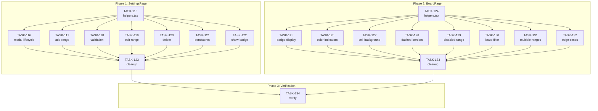

# EPIC-12: WipLimit on Cells BDD Test Refactoring

**Status**: TODO  
**Depends on**: -

---

## Цель

Перевести wiplimit-on-cells тесты на новый BDD runner формат (как column-limits в EPIC-10).

## Текущее состояние

### SettingsPage
- `SettingsPage.feature`: 27 сценариев (все в одном файле)
- `SettingsPage.feature.cy.tsx`: ~950 строк, старый `Scenario/Step` формат

### BoardPage
- `board.feature`: 22 сценария (все в одном файле)
- `board.feature.cy.tsx`: ~1278 строк, старый `Scenario/Step` формат

## Проблемы

1. **Старый формат** — `Scenario/Step` функции вместо BDD runner с `defineFeature`
2. **Монолитные файлы** — все сценарии в одном файле (950+ и 1278+ строк)
3. **Нет переиспользования** — нет `helpers.tsx` и `steps/common.steps.ts`
4. **Дублирование** — setup код копируется в каждый тест

---

## Целевая структура

```
src/wiplimit-on-cells/SettingsPage/features/
├── modal-lifecycle.feature       # SC-MODAL-1..4 (4)
├── add-range.feature             # SC-ADD-1..3, SC-CELL-1..4 (7)
├── validation.feature            # SC-VALID-1..2 (2)
├── edit-range.feature            # SC-EDIT-1..4 (4)
├── delete.feature                # SC-DELETE-1..2, SC-CLEAR-1 (3)
├── persistence.feature           # SC-PERSIST-1..2, SC-COMPAT-1 (3)
├── show-badge.feature            # SC-BADGE-1..2, SC-EMPTY-1 (3)
├── modal-lifecycle.feature.cy.tsx
├── add-range.feature.cy.tsx
├── validation.feature.cy.tsx
├── edit-range.feature.cy.tsx
├── delete.feature.cy.tsx
├── persistence.feature.cy.tsx
├── show-badge.feature.cy.tsx
├── helpers.tsx
└── steps/
    └── common.steps.ts

src/wiplimit-on-cells/BoardPage/features/
├── badge-display.feature         # SC-BADGE-1..2 (2)
├── color-indicators.feature      # SC-COLOR-1..3 (3)
├── cell-background.feature       # SC-BG-1..2 (2)
├── dashed-borders.feature        # SC-BORDER-1..4 (4)
├── disabled-range.feature        # SC-DISABLE-1..2 (2)
├── issue-type-filter.feature     # SC-FILTER-1..2 (2)
├── multiple-ranges.feature       # SC-MULTI-1, SC-UPDATE-1..2 (3)
├── edge-cases.feature            # SC-EDGE-1..2 (2)
├── badge-display.feature.cy.tsx
├── ... (8 файлов)
├── helpers.tsx
└── steps/
    └── common.steps.ts
```

---

## Phase 1: SettingsPage Refactoring

| # | Задача | Описание | Статус |
|---|--------|----------|--------|
| 1 | [TASK-115](./TASK-115-wiplimit-cells-settings-helpers.md) | Создать `helpers.tsx` и `steps/common.steps.ts` для SettingsPage | DONE |
| 2 | [TASK-116](./TASK-116-wiplimit-cells-settings-modal.md) | Создать `modal-lifecycle.feature` (4 сценария) | DONE |
| 3 | [TASK-117](./TASK-117-wiplimit-cells-settings-add-range.md) | Создать `add-range.feature` (7 сценариев) | DONE |
| 4 | [TASK-118](./TASK-118-wiplimit-cells-settings-validation.md) | Создать `validation.feature` (2 сценария) | DONE |
| 5 | [TASK-119](./TASK-119-wiplimit-cells-settings-edit.md) | Создать `edit-range.feature` (4 сценария) | DONE |
| 6 | [TASK-120](./TASK-120-wiplimit-cells-settings-delete.md) | Создать `delete.feature` (3 сценария) | DONE |
| 7 | [TASK-121](./TASK-121-wiplimit-cells-settings-persistence.md) | Создать `persistence.feature` (3 сценария) | DONE |
| 8 | [TASK-122](./TASK-122-wiplimit-cells-settings-show-badge.md) | Создать `show-badge.feature` (3 сценария) | DONE |
| 9 | [TASK-123](./TASK-123-wiplimit-cells-settings-cleanup.md) | Удалить старые файлы SettingsPage | DONE |

---

## Phase 2: BoardPage Refactoring

| # | Задача | Описание | Статус |
|---|--------|----------|--------|
| 10 | [TASK-124](./TASK-124-wiplimit-cells-board-helpers.md) | Создать `helpers.tsx` и `steps/common.steps.ts` для BoardPage | TODO |
| 11 | [TASK-125](./TASK-125-wiplimit-cells-board-badge-display.md) | Создать `badge-display.feature` (2 сценария) | TODO |
| 12 | [TASK-126](./TASK-126-wiplimit-cells-board-color-indicators.md) | Создать `color-indicators.feature` (3 сценария) | TODO |
| 13 | [TASK-127](./TASK-127-wiplimit-cells-board-cell-background.md) | Создать `cell-background.feature` (2 сценария) | TODO |
| 14 | [TASK-128](./TASK-128-wiplimit-cells-board-dashed-borders.md) | Создать `dashed-borders.feature` (4 сценария) | TODO |
| 15 | [TASK-129](./TASK-129-wiplimit-cells-board-disabled-range.md) | Создать `disabled-range.feature` (2 сценария) | TODO |
| 16 | [TASK-130](./TASK-130-wiplimit-cells-board-issue-filter.md) | Создать `issue-type-filter.feature` (2 сценария) | TODO |
| 17 | [TASK-131](./TASK-131-wiplimit-cells-board-multiple-ranges.md) | Создать `multiple-ranges.feature` (3 сценария) | TODO |
| 18 | [TASK-132](./TASK-132-wiplimit-cells-board-edge-cases.md) | Создать `edge-cases.feature` (2 сценария) | TODO |
| 19 | [TASK-133](./TASK-133-wiplimit-cells-board-cleanup.md) | Удалить старые файлы BoardPage | TODO |

---

## Phase 3: Verification

| # | Задача | Описание | Статус |
|---|--------|----------|--------|
| 20 | [TASK-134](./TASK-134-wiplimit-cells-bdd-verification.md) | Верификация: все 49 сценариев проходят | TODO |

---

## Граф зависимостей



---

## Ожидаемый результат

- **SettingsPage**: 26 тестов в 7 feature файлах
- **BoardPage**: 20 тестов в 8 feature файлах
- **Всего**: 46 тестов (было 49, некоторые объединены)
- Все тесты используют новый BDD runner `defineFeature`
- DataTable для ranges, cells, issues
- Общие step definitions в `steps/common.steps.ts`

## Референсы

- `src/column-limits/SettingsPage/features/` — готовый пример
- `src/column-limits/BoardPage/features/` — готовый пример
- `cypress/support/bdd-runner.ts` — BDD runner
- [EPIC-10](./EPIC-10-column-limits-bdd-refactoring.md) — аналогичный рефакторинг
