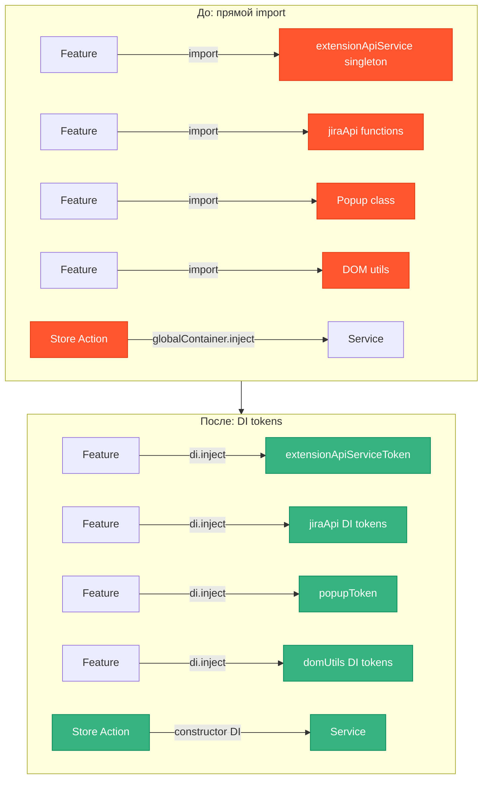
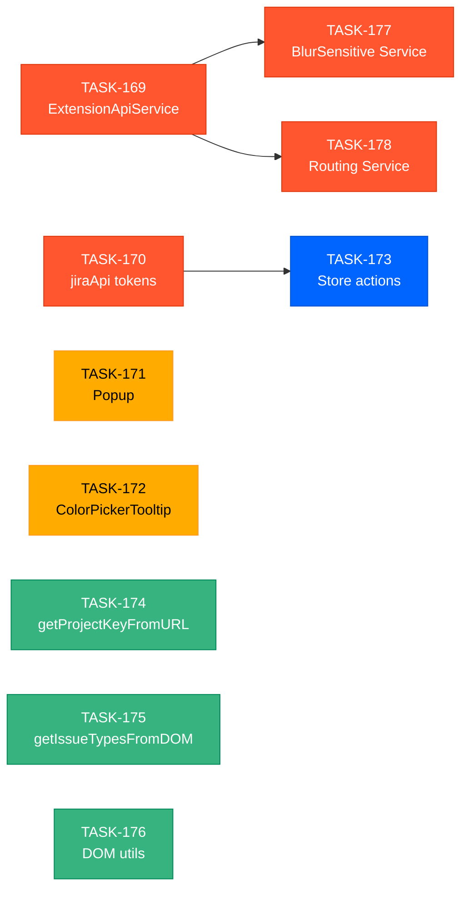

# EPIC-17: Рефакторинг shared/ — вынос сущностей с side effects в DI

**Status**: IN PROGRESS
**Created**: 2026-03-22

---

## Цель

**Проблема**: В `src/shared/` множество сущностей с side effects (I/O, DOM, state) используются через прямой import вместо DI-токенов. Это нарушает принцип архитектуры: «чистые функции — прямой import, всё остальное — через DI-токен». Результат — жёсткое зацепление, невозможность мокировать в тестах без `vi.mock`, service locator антипаттерн через `globalContainer.inject()`.

**Решение**: Создать DI-токены и регистрацию для каждой проблемной сущности. Перевести потребителей на использование DI вместо прямого импорта.

## Архитектура

## Задачи

### Phase 1: Высокий приоритет — Services & API

| # | Task | Описание | Status |
|---|------|----------|--------|
| 169 | [TASK-169](./TASK-169-extension-api-service-di.md) | ExtensionApiService → DI token | DONE |
| 177 | [TASK-177](./TASK-177-blur-sensitive-service.md) | BlurSensitive → Service с DI | DONE |
| 178 | [TASK-178](./TASK-178-routing-service.md) | Routing → RoutingService с DI | DONE |
| 170 | [TASK-170](./TASK-170-jira-api-migrate-to-di-tokens.md) | jiraApi — перевод на DI tokens | DONE |

### Phase 2: Средний приоритет — Dead code / DOM-классы

| # | Task | Описание | Status |
|---|------|----------|--------|
| 171 | [TASK-171](./TASK-171-popup-di.md) | Popup — dead code, удалить или вынести в DI | DONE |
| 172 | [TASK-172](./TASK-172-color-picker-tooltip-di.md) | ColorPickerTooltip — dead code, удалить или вынести в DI | DONE |

### Phase 3: Средний приоритет — Store actions

| # | Task | Описание | Status |
|---|------|----------|--------|
| 173 | [TASK-173](./TASK-173-store-actions-eliminate-global-container.md) | Zustand store actions — убрать globalContainer.inject | TODO |

### Phase 4: Низкий приоритет — DOM-утилиты

| # | Task | Описание | Status |
|---|------|----------|--------|
| 174 | [TASK-174](./TASK-174-get-project-key-from-url-di.md) | getProjectKeyFromURL → DI token | DONE |
| 175 | [TASK-175](./TASK-175-get-issue-types-from-dom-di.md) | getIssueTypesFromDOM → удалено как dead code + IssueTypeService DI | DONE |
| 176 | [TASK-176](./TASK-176-dom-utils-di.md) | DOM utils — убрать прямые импорты из бизнес-кода | DONE |

## Dependencies

**Параллельно можно выполнять:**
- TASK-169, TASK-170 (Phase 1 — независимы друг от друга)
- TASK-177, TASK-178 (после TASK-169 — независимы друг от друга)
- TASK-171, TASK-172 (Phase 2 — независимы)
- TASK-174, TASK-175, TASK-176 (Phase 4 — независимы)

**Последовательно:**
- TASK-169 → TASK-177, TASK-178 (нужен `extensionApiServiceToken`)
- TASK-170 → TASK-173 (store actions используют jiraApi tokens)

## Acceptance Criteria

- [ ] Все сущности с side effects из `src/shared/` имеют DI-токены
- [ ] Нет прямых импортов сервисов с side effects (кроме DI инфраструктуры)
- [ ] Нет `globalContainer.inject()` в store action-функциях
- [ ] Все тесты проходят: `npm test`
- [ ] ESLint без ошибок: `npm run lint:eslint -- --fix`
