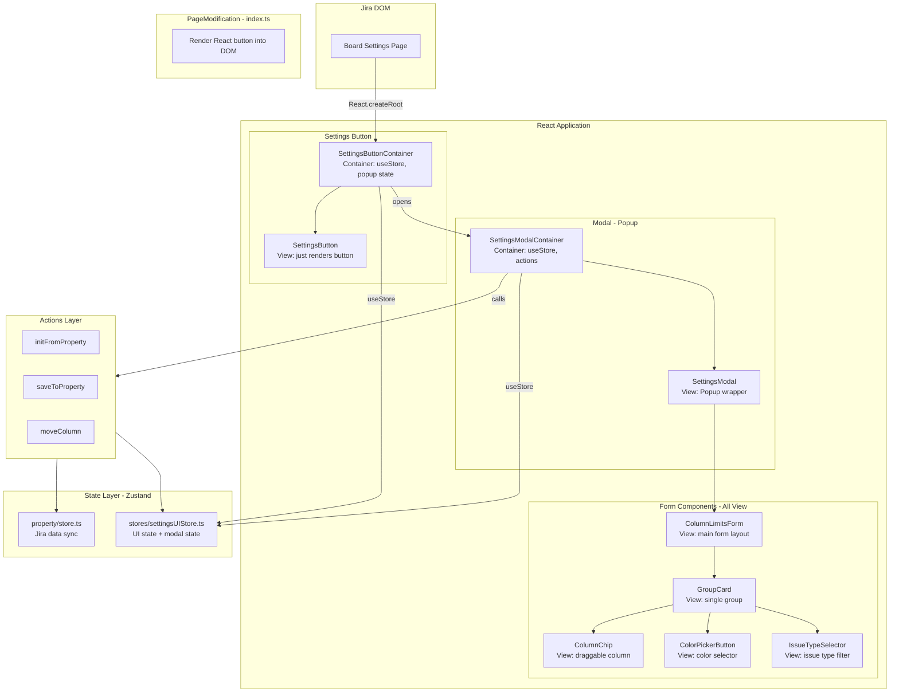
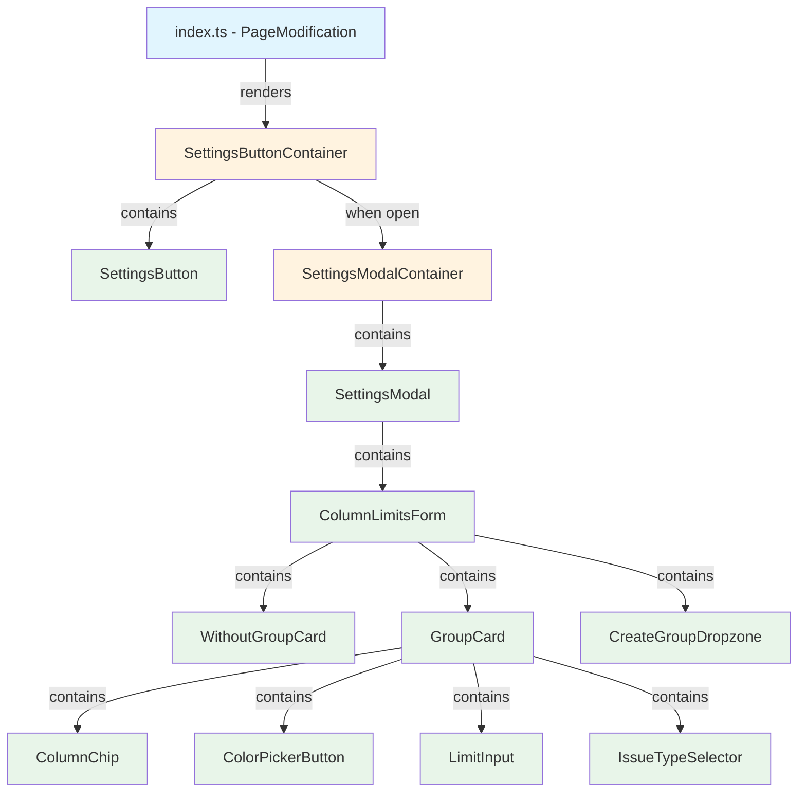

# Target Design: Column Limits Settings Page

Этот документ описывает целевую архитектуру для `src/column-limits/SettingsPage`.

## Ключевые принципы

1. **index.ts** — минимальный код: только вставка React-кнопки в DOM
2. **Все остальное живет в React** — модалка, форма, все UI
3. **Кнопка** = Container + View (2 компонента)
4. **Все остальные компоненты** = чистые View (Presentation)
5. **Storybook** — все состояния модалки и кнопки

## Architecture Diagram



## Component Hierarchy



**Легенда:**
- Голубой — PageModification (не React)
- Оранжевый — Container (useStore, logic)
- Зеленый — View (pure presentation)

## Target File Structure

```
src/column-limits/SettingsPage/
├── index.ts                           # PageModification: ONLY renders SettingsButtonContainer into DOM
│
├── components/
│   ├── SettingsButton/
│   │   ├── SettingsButtonContainer.tsx    # Container: useStore, isModalOpen state, handles open/close
│   │   ├── SettingsButton.tsx             # View: button UI
│   │   ├── SettingsButton.module.css
│   │   └── SettingsButton.stories.tsx     # Stories: default, hover, disabled
│   │
│   ├── SettingsModal/
│   │   ├── SettingsModalContainer.tsx     # Container: useStore, onSave, onCancel
│   │   ├── SettingsModal.tsx              # View: Popup wrapper with header/footer
│   │   ├── SettingsModal.module.css
│   │   └── SettingsModal.stories.tsx      # Stories: empty, with groups, saving
│   │
│   ├── ColumnLimitsForm/
│   │   ├── ColumnLimitsForm.tsx           # View: main form layout (left/right blocks)
│   │   ├── ColumnLimitsForm.module.css
│   │   └── ColumnLimitsForm.stories.tsx   # Stories: empty, with data, many groups
│   │
│   ├── GroupCard/
│   │   ├── GroupCard.tsx                  # View: single group with columns
│   │   ├── GroupCard.module.css
│   │   └── GroupCard.stories.tsx          # Stories: empty, with columns, custom color
│   │
│   ├── ColumnChip/
│   │   ├── ColumnChip.tsx                 # View: draggable column chip
│   │   ├── ColumnChip.module.css
│   │   └── ColumnChip.stories.tsx         # Stories: default, dragging
│   │
│   ├── ColorPickerButton/
│   │   ├── ColorPickerButton.tsx          # View: color picker trigger + popover
│   │   ├── ColorPickerButton.module.css
│   │   └── ColorPickerButton.stories.tsx  # Stories: closed, open, with color
│   │
│   ├── CreateGroupDropzone/
│   │   ├── CreateGroupDropzone.tsx        # View: dropzone for new group
│   │   ├── CreateGroupDropzone.module.css
│   │   └── CreateGroupDropzone.stories.tsx # Stories: default, dragover
│   │
│   └── WithoutGroupCard/
│       ├── WithoutGroupCard.tsx           # View: "Without Group" section
│       ├── WithoutGroupCard.module.css
│       └── WithoutGroupCard.stories.tsx   # Stories: empty, with columns
│
├── stores/
│   ├── settingsUIStore.ts                 # UI state + modal open/close
│   ├── settingsUIStore.types.ts
│   └── settingsUIStore.test.ts
│
├── actions/
│   ├── index.ts
│   ├── initFromProperty.ts
│   ├── initFromProperty.test.ts
│   ├── saveToProperty.ts
│   ├── saveToProperty.test.ts
│   ├── moveColumn.ts
│   └── moveColumn.test.ts
│
├── utils/
│   ├── buildInitData.ts
│   └── buildInitData.test.ts
│
├── settings-page.feature                   # BDD scenarios
└── htmlTemplates.ts                        # DEPRECATED: remove after refactoring
```

## Component Specifications

### 1. index.ts (PageModification)

**Responsibility:** Only render React into Jira DOM

```typescript
export default class SettingsWIPLimits extends PageModification<[any, any], Element> {
  private root: Root | null = null;

  apply(data: [any, any] | undefined): void {
    if (!data) return;
    const [boardData, wipLimits] = data;
    if (!boardData.canEdit) return;

    // Initialize property store
    useColumnLimitsPropertyStore.getState().actions.setData(wipLimits);
    useColumnLimitsPropertyStore.getState().actions.setState('loaded');

    // Render React button
    this.renderSettingsButton();
  }

  renderSettingsButton(): void {
    const container = document.createElement('div');
    document.querySelector('#ghx-config-columns > *:last-child')!
      .insertAdjacentElement('beforebegin', container);
    
    this.root = createRoot(container);
    this.root.render(
      React.createElement(SettingsButtonContainer, {
        getColumns: () => this.getColumns(),
        getColumnName: (el) => this.getColumnName(el),
      })
    );
  }
}
```

### 2. SettingsButtonContainer (Container)

**Responsibility:** Manage modal open/close state, initialize data

```typescript
type SettingsButtonContainerProps = {
  getColumns: () => NodeListOf<Element>;
  getColumnName: (el: HTMLElement) => string;
};

export const SettingsButtonContainer: React.FC<SettingsButtonContainerProps> = ({
  getColumns,
  getColumnName,
}) => {
  const [isModalOpen, setIsModalOpen] = useState(false);

  const handleOpen = () => {
    // Initialize UI store from property
    const wipLimits = useColumnLimitsPropertyStore.getState().data;
    const groupMap = mapColumnsToGroups({
      columnsHtmlNodes: Array.from(getColumns()) as HTMLElement[],
      wipLimits,
      withoutGroupId: WITHOUT_GROUP_ID,
    });
    const initData = buildInitDataFromGroupMap(groupMap, wipLimits, getColumnName);
    
    useColumnLimitsSettingsUIStore.getState().actions.reset();
    initFromProperty(initData);
    
    setIsModalOpen(true);
  };

  const handleClose = () => {
    setIsModalOpen(false);
  };

  const handleSave = async () => {
    const columnIds = Array.from(getColumns())
      .map(el => el.getAttribute('data-column-id'))
      .filter((id): id is string => id != null);
    
    await saveToProperty(columnIds);
    setIsModalOpen(false);
  };

  return (
    <>
      <SettingsButton onClick={handleOpen} />
      {isModalOpen && (
        <SettingsModalContainer
          onClose={handleClose}
          onSave={handleSave}
        />
      )}
    </>
  );
};
```

### 3. SettingsButton (View)

**Responsibility:** Pure button UI

```typescript
type SettingsButtonProps = {
  onClick: () => void;
  disabled?: boolean;
};

export const SettingsButton: React.FC<SettingsButtonProps> = ({ onClick, disabled }) => (
  <button
    id="jh-add-group-btn"
    className={styles.settingsButton}
    onClick={onClick}
    disabled={disabled}
  >
    Group limits
  </button>
);
```

### 4. SettingsModalContainer (Container)

**Responsibility:** Connect modal to store

```typescript
type SettingsModalContainerProps = {
  onClose: () => void;
  onSave: () => Promise<void>;
};

export const SettingsModalContainer: React.FC<SettingsModalContainerProps> = ({
  onClose,
  onSave,
}) => {
  const [isSaving, setIsSaving] = useState(false);
  const data = useColumnLimitsSettingsUIStore(state => state.data);
  const actions = useColumnLimitsSettingsUIStore(state => state.actions);

  const handleSave = async () => {
    setIsSaving(true);
    await onSave();
    setIsSaving(false);
  };

  return (
    <SettingsModal
      title="Limits for groups"
      onClose={onClose}
      onSave={handleSave}
      isSaving={isSaving}
    >
      <ColumnLimitsForm
        groups={data.groups}
        withoutGroupColumns={data.withoutGroupColumns}
        onMoveColumn={actions.moveColumn}
        onSetGroupLimit={actions.setGroupLimit}
        onSetGroupColor={actions.setGroupColor}
        onSetIssueTypes={actions.setIssueTypeState}
      />
    </SettingsModal>
  );
};
```

### 5. SettingsModal (View)

**Responsibility:** Pure modal UI wrapper

```typescript
type SettingsModalProps = {
  title: string;
  children: React.ReactNode;
  onClose: () => void;
  onSave: () => void;
  isSaving?: boolean;
};

export const SettingsModal: React.FC<SettingsModalProps> = ({
  title,
  children,
  onClose,
  onSave,
  isSaving,
}) => (
  <div className={styles.modalOverlay}>
    <div className={styles.modal}>
      <header className={styles.header}>
        <h2>{title}</h2>
      </header>
      <div className={styles.content}>
        {children}
      </div>
      <footer className={styles.footer}>
        <button onClick={onSave} disabled={isSaving}>
          {isSaving ? 'Saving...' : 'Save'}
        </button>
        <button onClick={onClose} disabled={isSaving}>
          Cancel
        </button>
      </footer>
    </div>
  </div>
);
```

## Storybook Coverage

### SettingsButton.stories.tsx

```typescript
export const Default: Story = { args: { onClick: () => {} } };
export const Disabled: Story = { args: { onClick: () => {}, disabled: true } };
```

### SettingsModal.stories.tsx

```typescript
export const Empty: Story = {
  render: () => (
    <SettingsModal title="Limits for groups" onClose={() => {}} onSave={() => {}}>
      <ColumnLimitsForm groups={[]} withoutGroupColumns={mockColumns} {...handlers} />
    </SettingsModal>
  ),
};

export const WithGroups: Story = {
  render: () => (
    <SettingsModal title="Limits for groups" onClose={() => {}} onSave={() => {}}>
      <ColumnLimitsForm groups={mockGroups} withoutGroupColumns={[]} {...handlers} />
    </SettingsModal>
  ),
};

export const Saving: Story = {
  render: () => (
    <SettingsModal title="Limits for groups" onClose={() => {}} onSave={() => {}} isSaving>
      <ColumnLimitsForm groups={mockGroups} withoutGroupColumns={[]} {...handlers} />
    </SettingsModal>
  ),
};
```

### GroupCard.stories.tsx

```typescript
export const Empty: Story = { args: { group: emptyGroup, columns: [] } };
export const WithColumns: Story = { args: { group: groupWithColumns } };
export const CustomColor: Story = { args: { group: { ...groupWithColumns, customHexColor: '#ff5722' } } };
```

### ColorPickerButton.stories.tsx

```typescript
export const Default: Story = { args: { currentColor: '#ffffff' } };
export const WithColor: Story = { args: { currentColor: '#4caf50' } };
export const Open: Story = { args: { currentColor: '#ffffff', isOpen: true } };
```

## Store Changes

### settingsUIStore.types.ts

Добавить состояние модалки (опционально, если управляем из React state):

```typescript
type SettingsUIData = {
  // Existing
  withoutGroupColumns: Column[];
  groups: UIGroup[];
  issueTypeSelectorStates: Record<string, IssueTypeState>;
  
  // Optional: if we want to manage modal state in store
  // isModalOpen: boolean;
  // isSaving: boolean;
};
```

## Migration Plan

1. **Phase 1: Fix Cancel button** (TASK-2, TASK-3)
   - Quick fix without refactoring

2. **Phase 2: Create new components** (TASK-7 extended)
   - Create SettingsButton (View)
   - Create SettingsButtonContainer (Container)
   - Create SettingsModal (View)
   - Create SettingsModalContainer (Container)
   - Add Storybook for all

3. **Phase 3: Refactor index.ts** (TASK-6 extended)
   - Replace direct DOM manipulation with React
   - Remove htmlTemplates.ts
   - Remove ColorPickerTooltip from index.ts

4. **Phase 4: Refactor ColorPicker** (TASK-8)
   - Create ColorPickerButton as React component
   - Remove legacy ColorPickerTooltip integration

5. **Phase 5: Split ColumnLimitsForm** (new task)
   - Extract GroupCard, ColumnChip, WithoutGroupCard
   - Add Storybook for each

## Benefits

1. **Testability**: All View components testable in isolation
2. **Storybook**: Visual testing of all states
3. **Maintainability**: Clear separation of concerns
4. **Reusability**: Components can be reused
5. **Debugging**: React DevTools work fully
